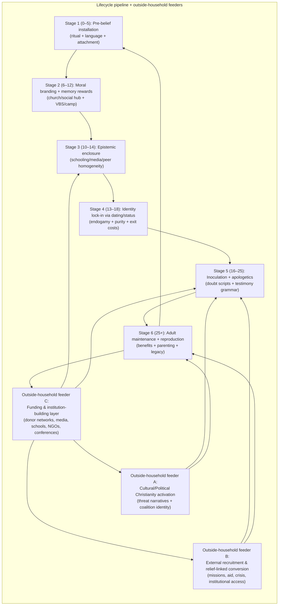
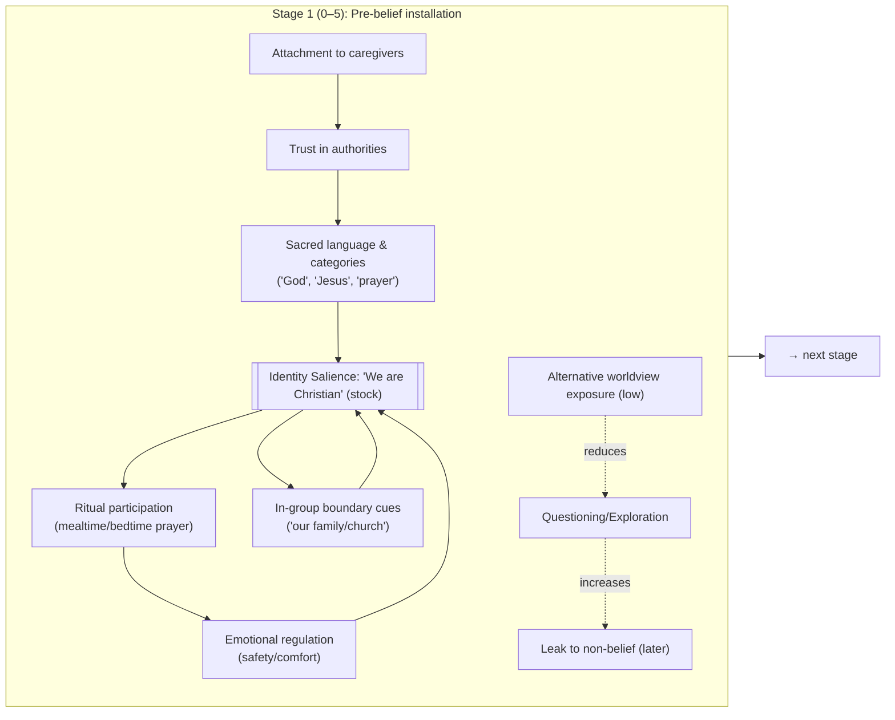
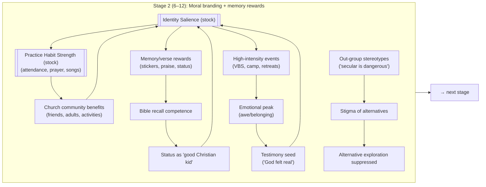
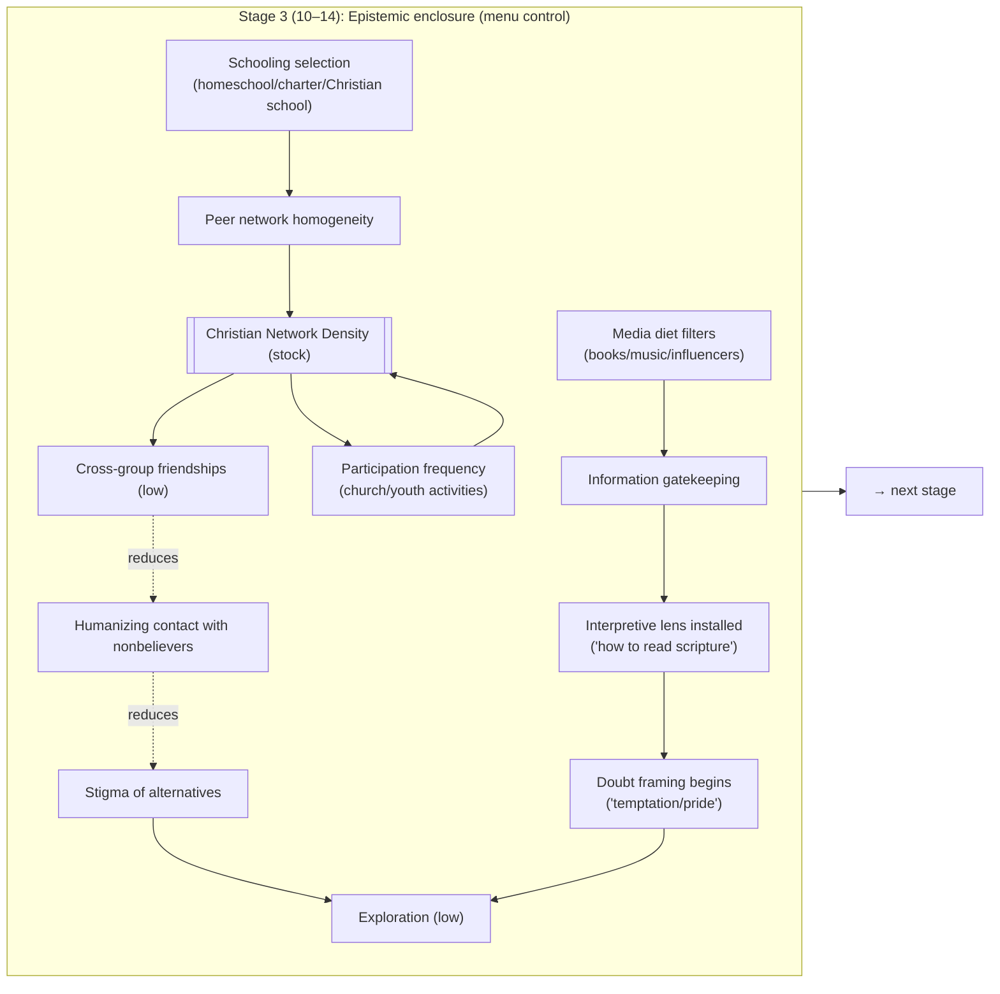
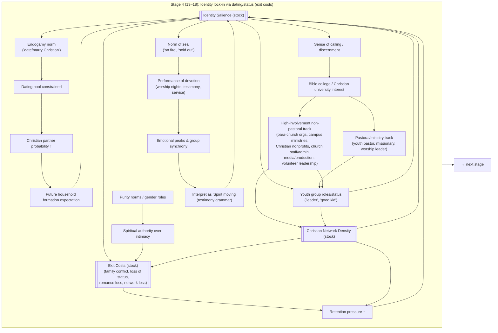
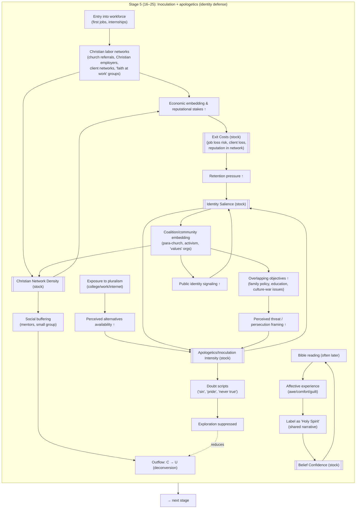
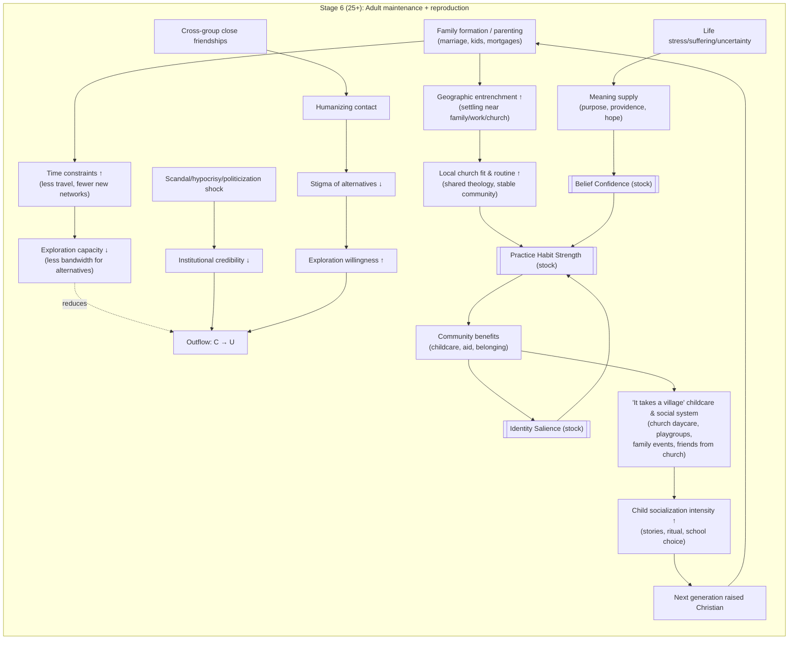
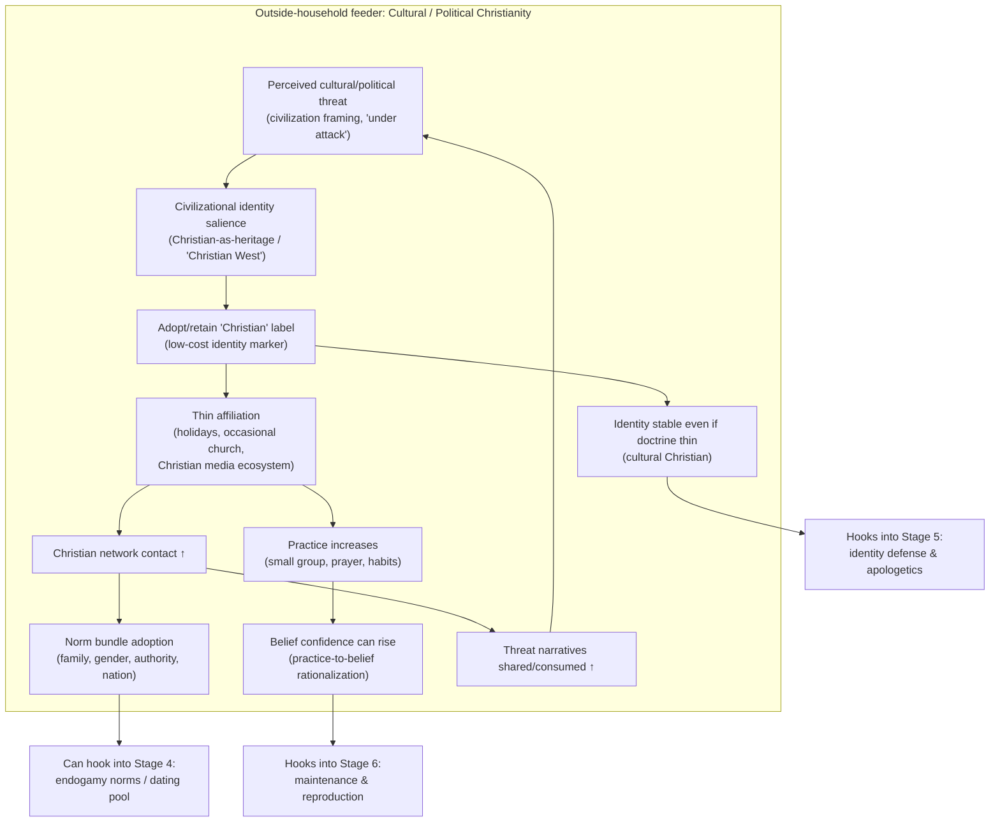
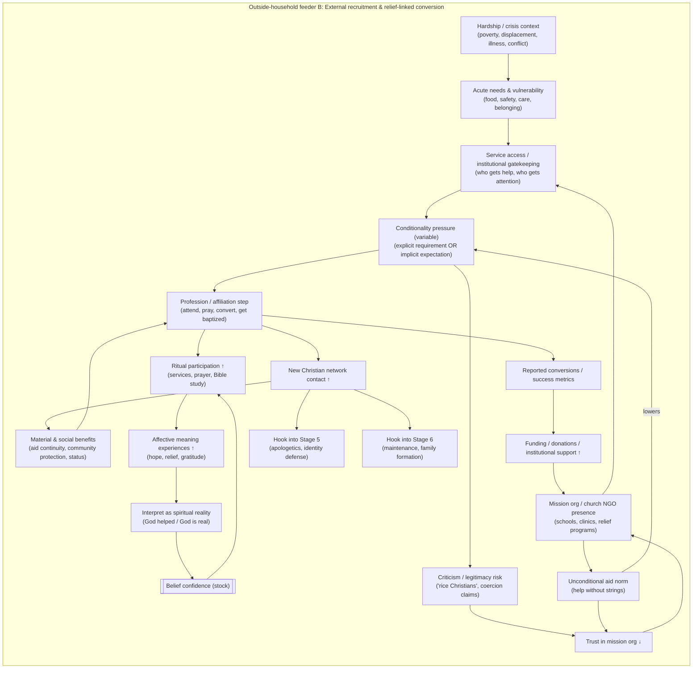
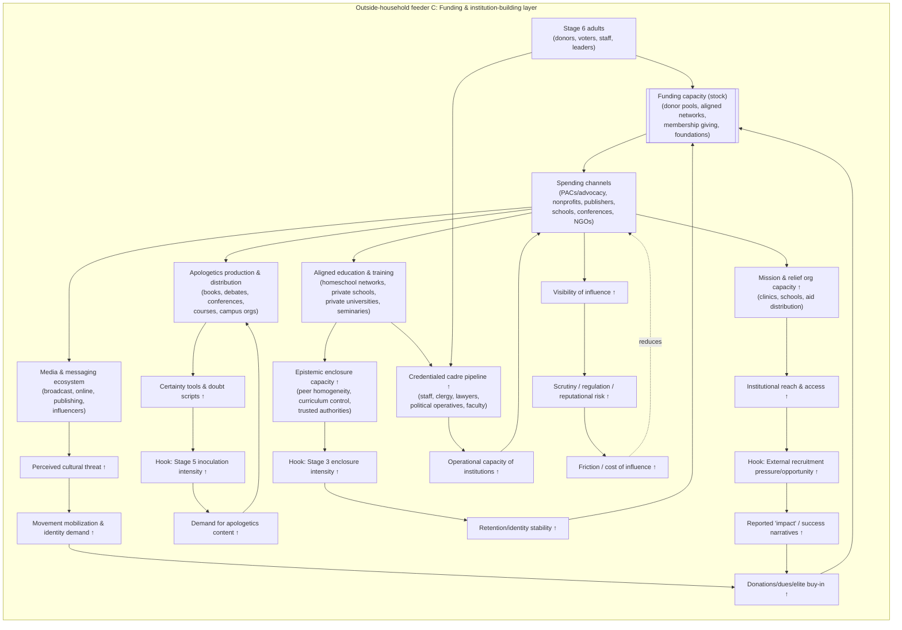

# Creating a Christian

## Overview 

This essay started as a numbers problem that turned into a family story. On paper, the United States does not look like a place where Christianity is constantly “winning converts” in the way Christian testimonials and apologetics often imply. The largest, best-known population surveys describe something closer to churn than conquest: lots of switching overall, but a **lopsided net flow out of Christianity**. Pew’s 2023–24 Religious Landscape Study finds that **35% of U.S. adults have switched** their religious identity since childhood. ([Pew Research Center][1]) And when you look at the balance sheet, the asymmetry is hard to miss: **21.9% of U.S. adults are “former Christians,”** while only **3.6% are Christians who were raised something else**—a roughly six-to-one ratio in the direction of exit. ([Pew Research Center][1]) The same pattern shows up in the broader “religion vs. none” accounting: **20.2%** were raised in a religion and are now unaffiliated, versus **3.5%** raised unaffiliated who now identify with a religion. ([Pew Research Center][1])

Those switching flows sit alongside a second headline: the “revival” story is not a clean match for what the surveys actually show. Pew’s latest Landscape Study puts the U.S. at **62% Christian** and **29% religiously unaffiliated**. ([Pew Research Center][2]) Over the long arc, that’s a clear decline from 2007—but Pew also argues that, **since roughly 2019, the Christian share has been relatively stable** (hovering around the low 60s), and the growth of the “nones” has **plateaued** in recent years. ([Pew Research Center][3]) That matters because it clarifies what kinds of claims can be true at the same time: you can have stabilization without a revival; you can have louder religious politics without more personal religiosity; you can have high-profile conversions that feel culturally important while the population-level inflow into Christianity remains comparatively slim.

Politics is where this gets especially interesting. In contemporary America, religious identity often behaves less like a private metaphysical conclusion and more like a public social coordinate—something that sorts you into coalitions. Pew’s political analysis shows substantial differences in party alignment by religious tradition (e.g., Protestants overall leaning Republican; religiously unaffiliated voters leaning Democratic). ([Pew Research Center][4]) On top of that is a specific bridge concept that helps explain why “Christianity” becomes politically adhesive even when doctrine and practice are thin: **Christian nationalism**, commonly measured as agreement with statements that fuse American identity, government, and Christianity. PRRI’s American Values Atlas reports that in 2024, about **10%** of Americans qualify as Christian nationalism **Adherents** and **20%** as **Sympathizers**. ([PRRI][5]) Whether or not those labels describe a “revival” of faith, they describe something real about identity formation: Christianity can operate as a civilizational badge—“who we are”—rather than solely as a set of claims—“what is true.”

That backdrop shaped my motivation: I kept noticing a mismatch between how many Christians explain *why* they are Christian and the conditions under which Christianity usually reproduces. Apologists and everyday believers often narrate conversion as an encounter with a text (“I read the Bible and felt the Holy Spirit”), as if Christianity is primarily an adult inference—an evidence-based worldview upgrade. But my experience, and what I see in many Christian households, suggests a different order of operations: **people are often Christian before they ever read the Bible for themselves** in any meaningful way. The Bible then functions less like the engine of conversion and more like a **rubber stamp**—a legitimating artifact that confirms the identity, ethics, and social commitments already installed by family and community. The “Holy Spirit speaking through the text” is not just a private event; it’s a learned interpretive category, already supplied by a living culture that teaches you what counts as God, what counts as confirmation, and what kinds of doubt don’t deserve oxygen.

My nephew made this concrete. Before literacy, he had “Jesus” as early vocabulary; prayer as habit; simplified Bible stories as moral scaffolding; church as the social hub; and a peer world with almost no non-Christian intimacy. By the time he can read the Bible, he won’t be deciding between Christianity and its alternatives from a neutral baseline—he’ll be reading as someone who already has (1) a Christian identity, (2) a Christian moral map, and (3) a Christian social world. And not just “Christian” in the abstract: a particular inherited theology, calibrated to a particular local subculture. When one of his older siblings says she wouldn’t date outside a narrow denominational lane “for theological reasons,” despite never seriously exploring alternatives, it looks less like an individually reasoned conclusion and more like a predictable output of a system that constrains the dating pool, the friend network, the information diet, and the emotional rewards.

That’s the methodological stance of this essay: treat Christianity not merely as an argument people adopt, but as a **system that manufactures defaults** across a life course. I’m borrowing the language of system dynamics—**stocks** (populations in identity states) and **flows** (rates of switching, retention, recruitment), plus feedback loops that either amplify or weaken those flows. The macro stocks are familiar: Christian (C), unaffiliated (U), other religions (O). The macro flows are the familiar survey transitions: C→U (disaffiliation), U→C (re-affiliation), O→C, C→O. Pew’s numbers justify the basic shape of the network in the U.S.: gross switching is common, but **Christianity’s biggest measurable “conversion engine” is still retention and childhood socialization**, not adult inflow from nonbelief. ([Pew Research Center][1])

Under that macro picture sits a vector of drivers—what opens or constricts the valves. Some are social: network density, marriage markets, the availability of “secular intimates” who turn an abstract outgroup into real people. Some are cultural: whether Christianity is prestigious or stigmatized in your environment; whether doubt is treated as curiosity or moral failure; whether nonbelief is described as an option or as a threat. Some are economic and logistical: time constraints, mobility, whether the church functions as an all-purpose service and community institution. Some are internal features of the religion as it is practiced locally: exclusivity, moral demands, claims about authority, and what I’ll call an **epistemic lifestyle**—a set of habits about what counts as knowledge, who is trusted, and how competing interpretations are policed.

Finally, this essay takes seriously that there is more than one kind of “becoming Christian.” The stage pipeline I’ll lay out is mostly about household-and-community socialization (the cradle-to-grave path), but it intersects with two outside feeders: (1) **cultural/political Christianity**, where the Christian label functions as coalition membership or civilizational identity; and (2) **external recruitment**, where conversion pressure and opportunity arise through missions, relief networks, or institutional access—often in contexts of hardship. Those outside pathways don’t replace the lifecycle system; they plug into it—especially at the stages where apologetics, identity defense, and adult maintenance are most active.

What follows, then, is not a single accusation but a map: **Stage 1 → Stage 2 → … → Stage N**, with a diagram at each stage and an account of the reinforcing loops that make the system “sticky,” the balancing loops that cause leakage, and the institutional feeders that keep the pipeline supplied. The goal is descriptive precision with a provocative title: to show how, in practice, “Christianity” is often less a conclusion someone arrives at and more a life-world someone grows up inside—long before the Bible is ever opened like a book of evidence.

[1]: https://www.pewresearch.org/religion/2025/02/26/religious-switching/ "How Americans change, keep their religious identities over their lives | Pew Research Center"
[2]: https://www.pewresearch.org/religion/2025/02/26/religious-landscape-study-executive-summary/ "2023-24 Religious Landscape Study: Executive summary | Pew Research Center"
[3]: https://www.pewresearch.org/religion/2025/02/26/decline-of-christianity-in-the-us-has-slowed-may-have-leveled-off/ "US Christian Decline May Be Stabilizing: 2023-24 Religious Landscape Study (RLS) | Pew Research Center"
[4]: https://www.pewresearch.org/politics/2024/04/09/party-identification-among-religious-groups-and-religiously-unaffiliated-voters/ "Party affiliation of US voters by religious group"
[5]: https://prri.org/research/christian-nationalism-across-all-50-states-insights-from-prris-2024-american-values-atlas/ "Christian Nationalism Across All 50 States"

## Stage 1 (0–5): Pre-belief installation

Stage 1 is where Christianity is introduced before it can be weighed. The child does not yet have the cognitive tools to evaluate metaphysical claims, cross-check sources, or compare worldviews; what they *do* have is an intense sensitivity to social cues, emotional tone, and the authority structure of caregivers. In that setting, “belief” is not primarily a proposition you assent to. It’s an atmosphere: a background assumption about what kinds of beings exist, what kinds of explanations make sense, and which voices are safe to trust. The core dynamic of this stage is simple: **attachment precedes argument**, and whatever is fused to attachment acquires the status of reality. God-talk enters the child’s world the same way language does—through trusted repetition, not persuasion.

One mechanism is the early installation of **sacred vocabulary and categories**. Words like “God,” “Jesus,” “prayer,” “blessing,” and “sin” aren’t taught as hypotheses. They’re taught as nouns for things that are already there. When a toddler learns “dog,” no one says, “Here is a debated claim about whether dogs exist.” They point, repeat, and reward recognition until “dog” becomes part of the world. God-words can be taught the same way: not as a contested philosophical position, but as a stable piece of the household’s ontology. This matters because once a category is installed as ordinary, later “belief” feels less like adopting a new idea and more like remembering what you always knew.

A second mechanism is **ritual as emotional conditioning**. Prayer before meals, prayer before bed, and church attendance function as repeated, embodied scripts that tie Christianity to comfort, safety, and belonging. The content of the prayer may not even be understood; what matters is the routine: the sense that this is what “our people” do, and that it’s associated with warmth, food, family togetherness, and adult approval. Over time, the ritual becomes a cue: anxiety, gratitude, uncertainty, or awe can become linked to “pray now,” which becomes linked to “God is near,” which becomes linked to “we are protected.” In system terms, this builds the earliest reinforcing loop: **ritual → emotional regulation → identity salience → more ritual**.

A third mechanism is the **authority transfer** that happens when sacred claims are spoken by caregivers. Small children are not neutral auditors; they are dependent creatures. Caregivers are the source of food, safety, and meaning, and therefore the child’s brain is primed to treat caregiver testimony as high-trust information. When that testimony includes metaphysical claims—“God made you,” “Jesus loves you,” “God wants you to be kind,” “God is watching”—those claims inherit the credibility of the relationship. Importantly, the claim is not experienced as “a statement my parents believe.” It is experienced as “part of how the world is.” That’s not because children are foolish; it’s because trust is the mechanism by which children learn anything at all.

The stage is also where Christianity is installed as a **moral lens** before it is installed as a doctrine. For a preschool child, “God wants you to share” is less about theology than about norm enforcement. It recruits an invisible authority to stabilize behavior when parents aren’t physically present, and it frames moral rules as more than household preferences. That moralization has downstream effects: if “God” is the source of goodness, then disbelieving—or even questioning—can later feel like flirting with badness. In other words, the child learns not only *what is true* but also *what kind of person I am* if I accept or reject it.

Alongside rituals and moral framing, children in Christian households often receive **story-based worldbuilding**—Noah, creation, Daniel, Jonah—long before literacy. These stories do more than transmit content; they transmit a structure: the world is supervised, history is meaningful, obedience is rewarded, disobedience is punished, and the community of believers occupies the moral high ground. By the time the child encounters the Bible as a text, they have already absorbed “Bible stories” as a narrative substrate. This is one reason later Bible reading can feel like confirmation rather than discovery: the stories are already familiar, and familiarity reads as truth.

Stage 1 also begins the first, subtle work of **boundary construction**. It may be explicit (“we’re Christians”) or simply implicit (“church friends” are the real community; outsiders are strangers). Even without overt hostility, children can learn that the Christian in-group is where warmth, trust, and praise live. “Secular” doesn’t have to be demonized to become socially irrelevant; it can simply be absent from the child’s intimate world. In systems language, the pipeline begins with a move that seems benign: reducing cross-group intimacy. Once alternatives are socially distant, they remain abstract—and abstract alternatives are easy to dismiss later.

The key point is that Stage 1 manufactures the *default settings* that make later stages effective. It creates a baseline in which (1) Christianity is normal, (2) Christianity is good, (3) Christianity is bonded to attachment, (4) Christianity is embedded in routine, and (5) alternatives are either absent or stigmatized. From there, later “belief formation” can ride on pre-built tracks. When someone later testifies, “I read the Bible and felt God speaking,” it’s often not the first time God has been introduced into their emotional life—it’s the moment the system gives them a new story about what the emotion means.

## Stage 2 (6–12): Moral branding, community immersion, and “competence” by memorization

Stage 2 is where the pre-belief defaults from early childhood get upgraded into something that looks like *knowledge* and *choice*. The child can now read, can now recite, can now participate in group life with peers—and those new capacities make the system feel less like inheritance and more like personal ownership. But the direction of travel is usually the same: Christianity becomes not merely the air in the room, but the curriculum of the room. The child’s world expands outward from parents to a broader moral community—church elders, youth leaders, Sunday school teachers, camp counselors—who function as an extended authority network. Instead of “my parents believe this,” the message becomes: *responsible adults believe this*, *good families believe this*, and *the people I admire believe this*. The social proof thickens.

A key mechanism in this stage is that **Christianity becomes a social identity with measurable performance**. “Bible competence” is often operationalized as recall: knowing the right stories, the right answers, the right verses. That’s not an incidental teaching method; it’s a kind of credentialing system. Children learn that being a “good Christian kid” is legible—something you can demonstrate and be praised for. If you can quote the verse, remember the story, name the lesson, you receive status: stickers, applause, leadership roles, trust. In a child’s moral economy, those rewards are not trivial. They’re signals of belonging and safety. Over time, memorization becomes more than memory—it becomes a pathway to identity: *I know these things, therefore I am one of us*. Critique, ambiguity, and interpretive independence are rarely rewarded at the same rate, which quietly teaches a meta-lesson: “faithfulness” looks like agreement and fluency, not open-ended inquiry.

At the same time, Stage 2 expands the *causal grammar* of the world. This is where many children are coached—explicitly or implicitly—to adopt what you might call **a theistic attribution style**. Good events are framed as God’s blessings, bad events as tests, and ordinary coincidences as providence. If something goes well, you “thank God”; if someone is sick, you “pray”; if something feels scary, you “trust Jesus.” A child doesn’t need to grasp theology to learn the pattern: **God is the default explanation** and prayer is the default response. This is also where the language of “the Holy Spirit” becomes a kind of interpretive lens for inner experience. Feeling comforted after prayer becomes evidence that prayer “worked.” Feeling guilty becomes evidence that God is “convicting.” Feeling awe becomes evidence that God is “present.” In other words, emotions get trained into a feedback loop: you feel something, you label it spiritually, the label reinforces belief, belief encourages more spiritual practices that produce more labelable feelings.

This is also the stage where **testimony becomes a technology**, not just a story. Children hear conversion narratives and faith stories that teach them what counts as a meaningful religious experience, and—crucially—how to narrate their own experience in the same grammar. “God helped me find my toy.” “God spoke to my heart.” “I felt peace when I prayed.” Even if these claims start as imitation, they can become real to the child because the social system treats them as real. The child learns that the correct posture toward life is to find God in it. The environment is saturated with prompts to interpret the world as enchanted and supervised: God is in the sunrise, God is in the good grade, God is in the family’s safety, God is in the friend who was nice to you, God is in the feeling you had during worship. This is not usually taught as a debatable metaphysical stance; it’s taught as attentiveness and gratitude, which makes it morally attractive.

Stage 2 also hardens boundaries through **culture curation**. Media becomes a religious sorting tool. Children’s content like VeggieTales is not just entertainment; it’s moral pedagogy in a friendly wrapper, reinforcing that “our stories” are the center of the universe and that biblical narratives are the template for understanding character and virtue. Parallel to this is the subtle (or explicit) discouragement of “secular” inputs—music, shows, books, or peers imagined to be spiritually corrosive. Even when the reasons given are framed as protecting innocence, the systemic effect is the same: Christianity remains the default interpretive community while alternative aesthetic worlds—the worlds that often carry alternative moral and existential grammars—are treated as contamination risks. When you combine this with school choice, church activities, and a Christian friend network, “secular culture” can become something the child knows about only as a warning label rather than as a lived experience.

The important system-dynamics point is that Stage 2 is not merely adding content; it’s strengthening the **reinforcing loops** that will matter later. Social density increases: church becomes where your friends are. Identity becomes performable: memorization and participation signal goodness. The emotional loop becomes self-sustaining: spiritual practices generate feelings, feelings are labeled as God, labels reinforce the practices. And epistemic habits begin to form: the child learns what kinds of questions earn praise and what kinds of questions create discomfort. This is the beginning of enclosure—not yet a fortress, but a set of strong defaults about who to trust, what to consume, and how to interpret your own inner life.

This is where that often-quoted idea about shaping a child early—“give me a child at four…”—lands as more than a cynical slogan. The reason early shaping works isn’t that children are gullible in some insulting sense; it’s that **early social learning sets the baseline for what feels normal**. Once Christianity is associated with community, safety, moral status, and meaning—once it becomes the language you use to narrate your own life—later alternatives don’t enter as neutral options. They enter as disruptions: socially costly, emotionally disorienting, and morally suspicious. And that is the stage’s output: not a child who has “considered Christianity and chosen it,” but a child for whom Christianity is increasingly indistinguishable from being good, being safe, and being one of us.

If Stage 1 installs the operating system, Stage 2 starts installing the apps: community roles, narrative templates, spiritual attributions, and cultural filters. By the end of it, “belief” is less a conclusion than a practiced habit—something the child performs, feels, and recognizes in themselves, long before they ever encounter serious alternatives that could compete on equal footing.

## Stage 3 (10–14): Epistemic enclosure

If Stage 1 installs the vocabulary of a sacred world and Stage 2 trains the child to *perform* Christian competence, Stage 3 is where the system starts protecting itself like a maturing organism. Epistemic enclosure has been present from the beginning—because any tight community has boundaries—but here it becomes more explicit, more strategic, and more sophisticated. The child is now old enough to notice contradictions, old enough to encounter competing narratives online, old enough to form loyalties with peers that rival parental authority, and old enough to ask questions that can’t be satisfied by stickers and memory verses. So the project shifts: from “Christianity is normal” to “Christianity is true, alternatives are dangerous, and the people who doubt are broken (or deceived).” The enclosure is not just about filtering information; it’s about standardizing a whole *epistemic lifestyle*: who counts as trustworthy, what kinds of questions are permitted, and what emotional posture you should adopt toward outside ideas.

One way Stage 3 tightens the system is by upgrading earlier supernatural language into a more complete explanatory framework. Demonology doesn’t have to look like medieval superstition to function as epistemic closure. It can be modernized into a kind of spiritual geopolitics: *the world is a battleground for souls; ideas have spiritual authors; temptation has agency*. This is powerful because it doesn’t merely disagree with rival worldviews—it delegitimizes them at the level of motive and origin. If non-Christian beliefs are not merely wrong but spiritually “influenced,” then curiosity itself becomes suspect. The child learns a subtle rule: there are “questions you ask in order to understand” and “questions you ask because you’re drifting.” The latter are framed as moral or spiritual risk, not intellectual exploration. That is a crucial move in enclosure: it turns epistemology into character.

At the same time, this stage often introduces a more formal theology—sometimes not in systematic terms, but as a standardized set of defaults. You can watch this happen in ordinary phrases: “biblical worldview,” “God’s design,” “biblical sexuality,” “submission,” “authority,” “discernment,” “guarding your heart.” These aren’t just beliefs; they’re organizing concepts that extend the scope of Christianity from church-and-family into every domain: school, friendship, media, politics, the body, the future. The child’s identity becomes less “we go to church” and more “this is how reality works.” And because the child’s social world is still heavily church-centered—youth group, small groups, retreats, service projects—there’s a constant social rehearsal of the same categories. The peer group doesn’t merely reflect the worldview; it becomes the mechanism that enforces it.

Culturally, Stage 3 is where “filtering” gets teeth. Media choices stop being mere preferences and start becoming moral diagnostics: what you listen to, what you watch, what you wear, who you follow, what jokes you laugh at. “Secular” becomes not just nonreligious but morally freighted—implying promiscuity, nihilism, rebellion, corruption. The system doesn’t need to ban everything; it only needs to stigmatize enough that the child self-censors. This is also the point where controlled alternatives proliferate: Christian music instead of secular music, Christian influencers instead of mainstream influencers, Christian summer camps instead of “worldly” camps, Christian friend groups instead of mixed ones. The enclosure works best when it doesn’t feel like deprivation. It works best when it feels like a complete, self-sufficient ecosystem.

Institutionally, Stage 3 tends to coincide with decisions that lock in the child’s environment: homeschooling co-ops, Christian schooling, carefully selected charter schools, church-as-community-center scheduling, and adult gatekeepers who curate mentors and role models. The practical effect is the same across different arrangements: fewer “secular intimates.” It’s not that a kid never hears about atheists or other religions; it’s that they rarely have deep, low-stakes friendships with them. Alternatives remain abstract, and abstract alternatives are easy to caricature. When the system talks about “the world,” it means an outgroup the child doesn’t really know. That is epistemic enclosure at the level of social topology: if you control the network, you control what feels normal.

This is also the stage where politics can enter—not always as explicit partisan instruction, but as a moral schema that maps neatly onto ideology. “Family values,” “traditional gender roles,” “authority,” “free speech,” “persecution,” “the decline of the culture,” “the war on Christians,” “what they’re teaching in schools”—these themes can be introduced as religious concerns, even when they’re doing political work. The child begins to learn that Christianity is not only a faith but a side in a broader conflict. That can tighten belonging dramatically: to leave isn’t just to disagree with doctrines; it’s to defect from a tribe and betray a moral order. This is where the pipeline can quietly create *cultural Christians*—kids who learn that “Christian” names a civilization and a coalition—even if their personal belief eventually becomes thin. In other words, Stage 3 doesn’t merely preserve faith; it can convert Christianity into identity armor.

From a system-dynamics perspective, the point of Stage 3 is to reduce “leakage” by controlling the main risk channels. The risk factors for deviation—doubt, disaffiliation, unapproved relationships, heterodox beliefs—tend to cluster around exposure and intimacy. If a child develops a close friendship with a nonbeliever who is kind, smart, and normal, it breaks the stigma mechanism. If a child encounters compelling arguments online without trusted interpretive scaffolding, it increases cognitive autonomy. If a child experiences hypocrisy or scandal in leadership, it breaks institutional credibility. If a child discovers that the community’s moral rules produce shame, fear, or secrecy, it creates emotional pressure to exit. So the system’s “mitigations” tend to target those channels.

And you can describe those mitigation strategies in plain terms without pretending they’re always conscious or coordinated. The system commonly responds to risk by: increasing supervised time in the in-group (more youth activities, more retreats); providing “safe” versions of outside content (Christian substitutes); framing doubt as spiritual warfare rather than sincere inquiry; assigning roles to keep kids invested (leadership, volunteering); discouraging unsupervised mixed-peer environments; and narrating the outside world as both seductive and hostile. These aren’t always enforced with harshness. Often they’re enforced with warmth and concern: *we’re protecting you.* That’s part of what makes enclosure effective: the child experiences it as love and guidance, not control. But structurally, the result is the same—the set of available interpretive communities shrinks, and the cost of exploring them rises.

By the end of Stage 3, a child in a high-salience Christian environment is not simply “a believer.” They are becoming a person whose friendships, routines, media, moral status, and future relationships are increasingly entangled with Christian identity. The enclosure doesn’t have to be perfect; it just has to be sufficient to keep alternatives from becoming vivid, intimate, and safe. Because once alternatives are safe, the system has to compete on equal footing—and Stage 3 is largely designed to prevent that competition from ever becoming fair.

## Stage 4 (13–18): Identity lock-in, exit costs, and the handoff to adult roles

Stage 4 is where the enclosure of Stage 3 becomes self-enforcing. Stage 3 works by controlling the menu of ideas and relationships; Stage 4 works by attaching *stakes* to that menu. You can think of it as a transition from “protected environment” to “binding commitments.” The adolescent is now forming a public self, trying on status roles, feeling the gravitational pull of romance, and imagining a future. And the system—often gently, sometimes explicitly—routes those developmental forces into Christian channels. The overlap with Stage 3 is real: the same institutions, youth activities, and curated networks are still there. The difference is that adolescence produces a new set of levers the system can pull: sexuality, reputation, career direction, and long-term belonging. Where Stage 3 reduces exposure to alternatives, Stage 4 raises the *cost* of choosing them.

The strongest engine in this stage is the **dating and marriage market**, because it turns identity into constraint. In many conservative Protestant environments, “date only Christians” isn’t merely advice—it’s an expectation embedded in the youth-group ecosystem, family approval, and peer status. Often the constraint is narrower than “Christian”: not just a believer, but the “right kind” of believer. That’s where you start seeing teenagers talk about “theological reasons” as if denominational boundaries were self-evident facts of nature, even when the teenager has never seriously studied comparative theology. In system terms, this is how identity becomes a selection mechanism: the community defines the acceptable partner pool, which determines who you can love without conflict, which determines who you can build a life with, which determines which community you will remain in. Once romance is routed through endogamy, retention becomes structurally reinforced, not merely emotionally encouraged.

This is also the stage where **exit costs** become legible. Up to now, leaving Christianity might mean disappointing your parents or skipping church; now it can mean losing your whole social world. Youth groups are often designed as high-density social environments: multiple gatherings per week, retreats, camps, service events, worship nights, small groups. That density produces a powerful reinforcing loop: participation produces friendships; friendships motivate participation; participation produces leadership roles and reputation; reputation increases the cost of departure. Adolescents are intensely status-sensitive, and churches—often unintentionally—turn “faithfulness” into a status ladder: who leads worship, who gives testimony, who is “mature,” who is “on fire.” When a teenager’s sense of self is tied to being the “good Christian kid” or the “spiritually mature leader,” doubt becomes not just an intellectual event but a threat to identity capital.

This is where the system’s emotional grammar also intensifies. The language of being “on fire for the faith,” “sold out,” “all in,” “radical,” or “bold” trains adolescents to equate intensity with authenticity. A teen who is quiet, uncertain, or merely dutiful may be treated as spiritually lukewarm. That creates a subtle pressure: perform zeal to prove you belong. It also creates a second loop: the performance of zeal can generate real experiences that then justify the performance. Worship nights that are engineered for emotional crescendo—music, lights, group synchrony, public vulnerability—can produce powerful affective states. Those states are immediately labeled: “the Spirit moved,” “God was present,” “I felt convicted.” The label reinforces belief confidence, which increases participation, which increases exposure to more engineered emotional peaks. Even when leaders are sincere and caring, the structure can still function like a spiritual treadmill: there is always another level of intensity to reach, always another “deeper” commitment to display.

Familially, Stage 4 is often when religion becomes explicitly linked to “the kind of adult you will be.” Parents may frame the transition to adulthood through Christian milestones: baptism, confirmation, purity pledges, mission trips, leadership roles, preparing for a “godly marriage.” The adolescent’s future is narrated as a calling, which sounds liberating but can function as a form of identity foreclosure. “God has a plan for your life” can operate like a template that narrows perceived options: certain careers are more “kingdom-oriented,” certain friendships are “bad influences,” certain ambitions are “worldly.” And because adolescents are negotiating autonomy, the system offers a controlled autonomy: you can be independent, adventurous, and purposeful—so long as it’s within the Christian frame.

Institutionally, this stage is also where the pipeline starts handing adolescents toward adult infrastructure: **Bible college, Christian universities, internships, and eventually pastoral or ministry-adjacent roles**. This doesn’t happen to every kid, but it functions as an aspirational apex for the system: the “serious” ones are encouraged to consider ministry, worship leadership, missions, youth leadership. The pathway matters even for kids who never take it, because it sets a prestige hierarchy: the closer your future is to church institutions, the more “real” your faith appears. Bible college in particular can operate as a continuation of Stage 3 by other means: it preserves peer homogeneity, provides an interpretive framework for scripture, and normalizes a specific theology as the intellectual default. But now it also professionalizes identity. Your network becomes your career path. Your beliefs become employable. And the cost of deviation rises sharply: doubt threatens not only belonging but livelihood.

Pastoral-track dynamics intensify this further. The pressure to be “on fire” is no longer just a youth-group vibe; it becomes part of role expectation. Leaders are expected to model certainty, moral credibility, and spiritual vitality. That expectation can create a self-reinforcing loop of its own: public certainty discourages private questioning, which encourages deeper reliance on apologetic scripts and managed testimony, which keeps the leader aligned, which reinforces the congregation’s perception that certainty is normal. In other words, as teenagers begin to imagine themselves as future leaders, they are also absorbing a professional culture in which doubt is risky. Stage 4 doesn’t just lock in identity; it starts creating the next generation of gatekeepers.

From a system-dynamics point of view, Stage 4 is dominated by a handful of reinforcing feedbacks. The **endogamy loop** turns romance into retention. The **status loop** turns roles and reputation into exit barriers. The **intensity loop** turns emotional peaks into proof and proof into more participation. And the **pipeline loop** turns Christian institutions into life pathways—education, career, marriage, community. Each of these loops converts the abstract question “Is Christianity true?” into a practical question: “What would it cost me to live as if it isn’t?” That’s a crucial transition from childhood to adulthood. A child can believe because adults believe. A teenager begins to believe because the belief is entangled with who they are becoming.

And this is why Stage 4 is such a hinge point in the overall flow network. Some adolescents begin to leak here—especially when new exposures break the enclosure, or when the social costs become unbearable, or when leadership scandals rupture credibility. But many others become more deeply embedded precisely because adolescence raises the stakes. Stage 4 is the system’s “handoff” phase: it takes the child produced by Stage 1–3 and tries to produce an adult who will reproduce the system in Stage 6—through marriage, parenting, institutional participation, and sometimes through leadership roles that keep the entire pipeline running.

## Stage 5 (16–25): Inoculation, identity defense, and building an adult life inside the network

Stage 5 is the first time the system has to compete in a more open marketplace. High school ends, routines loosen, and the young adult suddenly encounters pluralism at full volume—new peers, new institutions, new media, new moral norms, and often the first sustained contact with smart, decent people who do not share the faith. This stage is not just “more information.” It is a structural shock to the earlier pipeline: Stage 3’s enclosure becomes harder to maintain, and Stage 4’s lock-in mechanisms are tested by new freedoms and new incentives. In switching terms, Stage 5 is where the “valves” become visible: disaffiliation risk rises because alternative communities become available, and because the young adult’s identity is no longer purely inherited—it has to be actively maintained.

The diagram captures the core tension. **Exposure to pluralism** increases the perceived availability of alternatives, which is a direct threat to retention because it enables two things at once: intellectual autonomy (you can evaluate claims) and social feasibility (you can belong elsewhere). The system’s response is an “inoculation” strategy: a stock of apologetic resources and scripts that are designed less to discover truth than to reduce the probability that exposure turns into exit. The scripts tend to work at the meta-level. They don’t just answer objections; they **reclassify doubt**: doubt becomes sin, pride, rebellion, trauma, deception, or spiritual attack. The practical effect is to make exploration emotionally and morally costly. Curiosity is treated not as a neutral activity but as a hazard signal. In systems language, apologetics functions like a governor on the outflow (C \rightarrow U): as the pressure of pluralism rises, the inoculation stock ramps up to suppress exploration and stabilize identity.

But apologetics is only one part of Stage 5. The quieter, often more effective retention mechanism is **social and economic embedding**—the shift from being a Christian kid to being a Christian adult with real stakes. This is where “Christian networks of labor” matter. Many young adults don’t just attend church; they find internships through church, get jobs through referrals, land clients through faith-based networks, or join “faith at work” groups that merge professional identity with religious identity. The system doesn’t need to be conspiratorial for this to work. It only requires that networks exist and people prefer to hire, mentor, or trust people who feel familiar. The result is an increase in reputational and economic stakes: leaving the faith can now threaten not only friendships, but also opportunity, status, and stability. This deepens Stage 4’s exit-cost logic in a new domain. In the diagram, workforce entry → Christian labor networks → economic embedding → exit costs → retention pressure → identity salience. The person stays, in part, because staying is now woven into their adult life.

The network layer is the glue that binds these mechanisms together. Dense Christian ties create a **social buffering effect**: when pluralism hits, the young adult has mentors, small groups, pastors, and peers ready to interpret the new world for them. This interpretation is not only doctrinal; it’s social. New environments can be framed as hostile (“the world hates Christians”), seducing (“college will make you lose your faith”), or broken (“they’re lost and need Jesus”). Each framing increases the felt need for in-group support. Social buffering does two things simultaneously: it reduces exposure to destabilizing relationships, and it provides immediate emotional relief when doubts arise—relief that can be interpreted as spiritual confirmation. In retention terms, network density reduces the likelihood that the “alternatives availability” variable actually results in a viable alternative *life*.

Stage 5 is also where identity begins to spill into broader community objectives, often with political overlap. Many young adults embed into para-church organizations, activism networks, campus ministries, and “values” organizations whose goals overlap with faith: family policy, education, sexuality, speech norms, national identity. This can intensify retention because it converts Christianity from a private creed into a public cause. A cause gives identity additional reinforcing loops: it supplies meaning, urgency, status, and a clear enemy. In the diagram, identity salience drives coalition embedding, coalition embedding raises perceived threat/persecution framing, and that threat feeds back into apologetics intensity. This is a powerful stabilizer because it changes the psychological meaning of doubt. Doubt is no longer only “I’m unsure about God”; it becomes “I’m abandoning my people in a conflict.” That moralization of belonging can keep someone affiliated even when belief thins—producing cultural Christianity as a stable end state.

The Bible-reading loop in this stage is where the “rubber stamp” claim does its work. Stage 5 is often when people begin reading the Bible more seriously—college Bible studies, discipleship groups, devotional plans. But by now, the interpretive lens is already installed, and the social rewards are already attached. The act of reading is rarely solitary in the epistemic sense; it is scaffolded by group study, commentary, sermons, and a shared grammar for what the text “means.” More importantly, the feelings produced by reading—comfort, awe, guilt, conviction, peace—are given a prebuilt label: “the Holy Spirit.” Once feelings are interpreted as an external agent validating the belief system, belief confidence becomes self-reinforcing: belief motivates more reading, which produces more affect, which is labeled spiritually, which strengthens belief. This loop doesn’t need a literal supernatural cause to function as a mechanism; it only needs reliable human psychology and a community that teaches a particular interpretation of inner experience.

All of these factors interact to shape switching probabilities. The two strongest predictors of movement out of a religious identity are usually (1) whether alternatives become socially and emotionally real, and (2) whether the costs of leaving become low enough to make exploration tolerable. Stage 5 is exactly where those conditions can change quickly—through moving away, attending a pluralistic school, entering a diverse workplace, or simply having unrestricted internet access. That’s why Stage 5 tends to be a high-volatility zone in the lifecycle: it’s where the macro “outflow” from Christianity is most likely to materialize, because it’s where the earlier protective structures can fail.

From the system’s point of view, the major **risk factors** at this stage are predictable. Close cross-group friendships can dissolve caricatures and undermine stigma. Romantic relationships outside the faith can create an alternative future path that competes with the endogamy loop from Stage 4. Education can teach epistemic habits that prize open inquiry over authority, weakening the apologetic scripts. Scandals or hypocrisy can rupture institutional credibility, which is lethal because so much of the system depends on trust. And, paradoxically, excessive politicization can fracture retention: it may strengthen identity for some while pushing others toward disaffiliation if they experience the fusion as cynical or morally repellent.

So the system’s mitigation strategies tend to target those risks. They increase small-group participation, encourage immediate involvement in church service, and create tightly knit peer cohorts so that free time is socialized inside the group. They provide “safe” versions of outside institutions—Christian colleges, Christian internships, Christian counseling, Christian influencers—so the young adult can feel independent without leaving the ecosystem. They intensify apologetics content at the exact moment pluralism increases: conferences, debate videos, curated reading lists, campus ministries trained to intercept doubts. And they often raise the narrative temperature by framing the outside world as both a mission field and a threat, which keeps the in-group emotionally central.

In the broader lifecycle, Stage 5 is the gateway to two very different outcomes. If the young adult’s networks remain dense, their career and romance remain embedded in Christian pathways, and doubt is effectively reclassified as spiritual danger, the system smoothly hands them into Stage 6: adult maintenance and reproduction. If those supports fail—if alternative communities become intimate, credible, and safe, and if the costs of leaving drop—then Stage 5 becomes the point where the macro flow (C \rightarrow U) accelerates. Either way, Stage 5 is not primarily a battle of arguments. It is a battle of *structures*: who your people are, what your life depends on, what your emotions are trained to mean, and whether the outside world becomes a place you can actually live.

## Stage 6 (25+): Adult maintenance, entrenchment, and reproduction as system replication

Stage 6 is where Christianity stops being primarily an identity you *have* and becomes an identity you *run*. The young adult phase is volatile because exposure is high and life is still plastic; Stage 6 is comparatively stable because plasticity shrinks. Careers harden, relationships consolidate, geography becomes sticky, and time becomes scarce. If Stage 5 is where the system competes, Stage 6 is where the system cashes in—turning prior investment (networks, habits, identity scripts) into long-term retention. The underlying dynamic is that adult life introduces structural constraints that are not overtly “religious,” but that indirectly reinforce religious continuity: fewer new networks, less exploratory bandwidth, more reliance on local institutions, and higher stakes attached to identity.

One major retention driver is simple **time scarcity**. Parenting, mortgages, commutes, health, and the logistics of adult life reduce discretionary time and energy. In the diagram, family formation raises time constraints, which lowers exploration capacity, which reduces the likelihood of sustained engagement with alternatives. This is not “people stop thinking.” It’s that the practical requirements for worldview switching—reading widely, building new communities, tolerating uncertainty, navigating conflict—are costly. The more a life becomes schedule-bound, the less likely someone is to voluntarily destabilize their identity. In other words, time constraints function like a friction term on the outflow (C \rightarrow U). You may still doubt, but the cost of acting on doubt rises.

Geographic entrenchment is the second stabilizer. Many adults settle near work, family, or a preferred church community. Once you’re geographically embedded, your social network becomes more local and less diverse. A “good church fit”—a congregation that matches your theology, lifestyle, and social class—can become the hub for your entire week: friendships, childcare exchanges, social events, mentorship, and mutual aid. That local fit intensifies the classic loop: practice habit strength produces community benefits, which increases identity salience, which reinforces practice. Importantly, the church becomes not merely a place of worship but a **multi-purpose institution**: the place you can call when you’re sick, the place that can bring meals, the place that can recommend a plumber, the place that knows your kids. When Christianity becomes infrastructural, leaving becomes harder—not because of arguments, but because you’d have to rebuild your life’s scaffolding.

Stage 6 also formalizes what might be called the “it takes a village” advantage. Community benefits are not just emotional; they’re practical. When parents rely on church-based daycare, playgroups, youth programs, and family events, religious participation becomes a rational strategy for surviving adulthood. This is where the system becomes most obviously self-referential: the same institution that provides support also becomes the primary vehicle for socialization and meaning-making. Parents may experience church as both sincere faith and necessary logistics. That dual role matters because it ties retention to life management: even someone who becomes less doctrinally convinced may remain affiliated because the costs of losing the village are immediate, while the benefits of leaving are abstract.

The reproduction loop is the centerpiece of Stage 6, but “reproduction” here is not merely biological. It is **system replication**: restarting Stage 1 and Stage 2 dynamics inside a new household. Parents do not just have children; they create environments. They select schools, curate media, choose neighborhoods, choose churches, choose who becomes “family friends,” choose what rituals structure the day, and choose what emotional vocabulary their children learn. That is why cohort replacement is more than demographic arithmetic. It is the reinstallation of defaults. In the diagram, family formation feeds time constraints and geographic entrenchment, but it also feeds child socialization intensity: stories, rituals, Bible narratives, youth programs, and curated networks that make Christianity normal before it is ever evaluated.

Crucially, this replication is not perfectly faithful. It behaves more like an evolutionary process than a photocopy. Every new generation inherits a package of norms and practices, but with **mutation and drift**. Some parents intensify (more homeschooling, stricter purity culture), others soften (less church attendance, more media openness). Some communities professionalize and modernize (slick worship, therapeutic language), others retrench (culture-war framing, stricter boundaries). This “mutation” can come from larger environmental pressures—technology, labor markets, shifting norms around gender and sexuality, political polarization—and from individual differences within families. But the important system claim is that even when surface forms change, the core mechanics often persist: early identity installation, moral branding, network density, interpretive control, and the conversion of community benefits into retention.

That evolutionary framing also explains why Christianity can appear to adapt even while losing share overall. Communities that retain members successfully often do so by refining their retention loops—tightening peer networks, increasing institutional support, professionalizing youth programming, and offering “complete ecosystems” (schools, camps, counseling, media). Communities that fail to provide those supports leak more. Over time, the population of remaining Christians can become more concentrated in subcultures that are structurally good at retention—an evolutionary selection effect. The system changes not only because individuals change, but because the sub-systems that retain people become disproportionately represented.

Stage 6 also contains a meaning-management loop that is hard to overstate. As adulthood progresses, people face stress, illness, loss, and existential uncertainty. Christianity offers ready-made interpretive tools: providence, prayer, hope, cosmic justice, heaven. These tools can stabilize belief and practice because they attach existential relief to religious participation. In the diagram, stress feeds meaning supply, meaning supply increases belief confidence, belief confidence reinforces practice. This loop is not reducible to manipulation; it can be genuinely experienced as profound support. But structurally, it functions as retention: the more life hurts, the more meaning systems with strong narratives and communal reinforcement become attractive. A person might not remain Christian because they have solved the problem of evil; they might remain Christian because it’s the only language they have for surviving grief without collapsing into nihilism.

The threats to retention in Stage 6 tend to come from two directions: credibility shocks and intimate pluralism. Institutional credibility shocks—scandals, hypocrisy, visible corruption, politicization that feels cynical—can puncture trust. When church is infrastructural, credibility collapse can trigger cascading effects: participation drops, benefits decline, identity salience weakens, and exit becomes thinkable. But the other threat is slower and often more powerful: cross-group close friendships. Adults who develop deep relationships with nonbelievers or with people in other traditions can experience a gradual de-stigmatization of alternatives. Once alternatives are not abstract but human, the old narratives (“they’re lost,” “they’re immoral,” “they hate God”) become harder to maintain. Humanizing contact increases exploration willingness, which opens the outflow valve. In Stage 6, this tends to happen through workplaces, neighbors, school communities, or parenting networks that aren’t church-centered.

The system’s mitigation strategies at Stage 6 mirror the risk channels. To prevent credibility cascades, communities often emphasize loyalty, reinterpret scandal as persecution, or isolate the event as the failure of individuals rather than institutions. To prevent pluralistic intimacy from weakening boundaries, parents may attempt to keep the child’s peer world church-centric—Christian daycare, Christian schooling, church sports leagues, church camps—restarting Stage 2 and Stage 3 before secular alternatives become intimate. And to stabilize adult identity, communities increase participation pathways: small groups, service roles, leadership tracks, parenting ministries, men’s/women’s groups. These roles don’t just fill time; they build stakes and status. In system language, they increase network density and raise exit costs, which reduces switching.

When you place Stage 6 back into the full lifecycle, it becomes the engine of the macro stocks-and-flows story. The reason adult “conversion” inflow can remain modest while Christianity persists at scale is that Stage 6 is not waiting for outsiders to join; it is continually producing insiders—through retention, community infrastructure, and the replication of early socialization conditions. At the same time, Stage 6 explains why outflow can still happen: if credibility collapses or if pluralistic relationships become intimate and safe, the “sticky” loops can unwind. But unwinding is harder now than in Stage 5, because adult lives have more constraints and higher switching costs. The system is designed—often unintentionally—to make leaving psychologically, socially, and logistically expensive.

That’s why this stage is best understood as reproduction in the evolutionary sense: not just making children, but **restarting the pipeline** with new parameters. Each generation repeats the basic algorithm—identity first, belonging reinforced, alternatives held at bay—while updating the interface to match the surrounding world. Christianity, in this model, isn’t simply a set of doctrines traveling through time. It’s a family of self-replicating social systems competing in an environment—and Stage 6 is where the replication happens.

## Outside Influences

### Outside feeder A: Cultural / Political Christianity

This feeder is best understood as an *identity engine* that can operate independently of deep doctrine. It pulls people toward “Christian” not primarily through a new encounter with the Bible or theology, but through a story about **civilization, threat, and belonging**. In the flow diagram, the initiating variable is *perceived cultural/political threat*—the sense that “our way of life” is under attack. That threat framing is then converted into a civilizational identity (“Christian-as-heritage,” “Christian West”), which makes the Christian label attractive as a low-cost marker of coalition membership. The end result is that “becoming Christian” can mean becoming a participant in a political-cultural tribe, where the religious label does a lot of social work even if belief and practice remain thin. There are a variety of causally relevant factors that increase retention and affiliation in this pathway:

1. The first driver is **threat salience**. When people believe they are living through civilizational decline—whether framed as moral decay, demographic replacement, persecution, ideological capture of institutions, or external religious threat—identity hardens. Threat narratives create urgency, urgency increases the need for a clear “us,” and that “us” is often labeled Christian. This is one reason Christian nationalism is such a useful bridge concept: it names the fusion of religious identity with national identity and public power rather than private metaphysics. PRRI’s 2024 typology (Adherents + Sympathizers) indicates that a sizable minority of Americans are at least receptive to that fusion.

2. The second driver is **low-cost affiliation**. The “label” step in the diagram is crucial: adopting the identity is easier than adopting the full practice regime. People can signal “Christian” through rhetoric, media consumption, social signaling, holiday attendance, or alignment on a bundle of norms (family, gender, authority, nation) without immediately undergoing a confessional transformation. In system terms, this pathway creates a new inflow not just from nonbelief to belief, but from nonaffiliation to **identity affiliation**—a move into cultural Christianity that can later deepen, but doesn’t have to.

3. The third driver is **network capture via media and community overlap**. Once someone starts consuming “Christian” political content or participating in adjacent communities (church media ecosystems, para-church organizations, “values” activism), they gain new ties. Those ties increase the probability of thin affiliation (occasional church, small groups, conferences) because participation is socially reinforced. This is where the “Net → Amplify → Threat” feedback matters: as network contact rises, threat narratives circulate more frequently, which increases perceived threat, which strengthens identity salience, which increases label adherence and continued engagement.

4. The fourth driver is **norm bundling**—the conversion of identity into a coherent lifestyle package. The “Norm bundle adoption” node captures how cultural Christianity often arrives as a suite: gender roles, sexual norms, deference to authority, skepticism of certain institutions, and a politics of moral boundary enforcement. In the U.S., that bundling aligns strongly with conservative political identity among some Christian subgroups (especially within evangelical politics), which helps explain why political sorting and religious identification can become mutually reinforcing.

One of the most important downstream effects of this feeder is **social narrowing**. Culture-war framing tends to sort relationships into “safe” and “unsafe”: which media you can trust, which institutions are hostile, which neighbors are “indoctrinated,” which friends are “worldly,” which teachers are threats, which family members are compromised. Even without explicit shunning, the effect is often a reduction in cross-group intimacy—fewer friendships that might humanize the outgroup and normalize alternative worldviews. In systems terms, this acts like a retention mechanism because it attacks the main channel that enables exit: *close, low-stakes relationships with nonbelievers and nonconforming believers.* When those relationships shrink, alternatives remain abstract and stigmatized. That raises the psychological cost of exploration and the social cost of switching—especially when “leaving Christianity” is implicitly equated with defecting to an opposing tribe. The person doesn’t just lose a belief; they risk losing an identity community and moral status.

This feeder also helps explain a modern conversion narrative: the person who “becomes Christian” primarily as a defense of “Western civilization.” Here, conversion is less a doctrinal discovery than a **civilizational repositioning**: adopting “Christian” as a symbolic home base against perceived external threat (Islamism, secular liberalism, “wokeness,” institutional capture, national decline). The order of operations is reversed from classical conversion stories: instead of “I found Christ, therefore my politics changed,” it can become “my politics demanded a sacred canopy, therefore I adopted Christianity.” This is why many such converts emphasize identity, heritage, and social order before they emphasize theology or deep engagement with scripture. The “rubber stamp” claim fits here too: once the label and coalition are adopted, **the Bible can function as post hoc legitimation**—a reservoir of proof-texts and moral narratives that rationalize the identity choice already made. The person doesn’t need to have read widely in theology, history, or biblical criticism for the Bible to become a badge of authority; the surrounding ecosystem supplies interpretive scaffolding and “approved readings.” Stage 5’s inoculation system then becomes the maintenance layer: doubts are managed not just as intellectual problems but as threats to identity and coalition loyalty.

The main *risk* to this feeder is that it can fail to deepen into durable practice and community—remaining a thin label that doesn’t reproduce itself through family and local institutions. Another risk is **backfire**: when the fusion of faith and politics becomes too overt, it can reduce institutional credibility for people who experience it as cynical or coercive, potentially increasing outflow among those who want spirituality without culture-war militancy. (This is one reason that public reactions to Christian nationalism can be polarized and why some surveys find limited favorability overall.) From the system’s retention standpoint, the “mitigations” are predictable and map directly onto the diagram: increase network contact (small groups, conferences, “Christian” social worlds), intensify threat narratives to keep identity salient, bundle norms into a coherent lifestyle, and provide pathways for thin identity to become thick practice (attendance → routines → belief rationalization). The more the person’s relationships, media, and moral status are tied to the identity, the less likely switching becomes—even if the underlying theology remains shallow.

This feeder doesn’t replace the cradle-to-grave pipeline; it **feeds it**.

* It hooks into **Stage 4** by strengthening endogamy norms (“date/marry within the tribe”) and shrinking the socially acceptable pool, which increases future household formation inside the system.
* It hooks into **Stage 5** by raising perceived threat and accelerating identity defense and apologetic consumption—making exploration feel disloyal.
* It hooks into **Stage 6** by providing a ready-made rationale for parenting choices, schooling choices, and church selection (“we need to protect the kids”), which restarts Stage 1 with a new generation.

In net flow terms, cultural/political Christianity can increase inflow to the *Christian label* even when it does not increase inflow to *confessional belief*. It can also reduce outflow by raising social and moral exit costs through network narrowing and threat-based identity reinforcement. The key analytical move is to separate “conversion into belief” from “conversion into identity,” and then show how modern culture-war dynamics are extremely good at producing the latter—and sometimes, through habit and community, converting the latter into the former.

### Outside-household feeder B: External recruitment & relief-linked conversion

This feeder works because hardship makes people *reachable* in a way ordinary life does not. In the diagram, everything begins with **crisis context → acute need**: poverty, displacement, illness, conflict, addiction, incarceration, family breakdown, grief—conditions where people are seeking stability, meaning, and practical help at the same time. In those settings, “conversion” is rarely just a metaphysical conclusion; it is often a **survival-relevance decision**: *Who will help me? Where can I belong? Which institution is present and trustworthy?* That’s why this feeder is best understood as a pathway where **material vulnerability and existential vulnerability** jointly increase receptivity to affiliation.

The next lever is **institutional presence and access**. Missions, churches, and affiliated NGOs don’t only preach; they often provide schools, clinics, food distribution, childcare, shelter, counseling, and community infrastructure. In domestic contexts the equivalents can be prison ministries, recovery ministries, homelessness outreach, crisis pregnancy support, disaster relief, immigrant aid, or simply a local church that functions as a de facto social services hub. The diagram’s “Service access / gatekeeping” node captures a blunt reality: when an institution controls access to scarce goods—help, attention, protection, credibility—people are incentivized to cooperate with the institution’s norms, even if they are not explicitly coerced. This is why the **conditionality continuum** matters. Sometimes conversion pressure is explicit (“attend service to receive X”); more often it’s implicit (“this community helps people like us,” “if you want to be in the circle, participate in the ritual,” “this is what gratitude looks like”). The system doesn’t need overt coercion to function; it can run on social expectation, reciprocity norms, and the human tendency to align with the group that provides safety.

From there the diagram shows the core mechanism: **profession/affiliation → network contact → benefits → profession/affiliation**. The “profession step” (attend, pray, convert, be baptized) is often the low-cost entry ticket into a new network. Once inside, people may receive real benefits: continuity of aid, practical support, protection, friendship, status, and a coherent moral community. Those benefits feed back into continued affiliation because leaving risks losing not only an idea, but a safety net. This is why relief-linked conversion can be unusually “sticky” even when doctrinal belief is still thin: belonging and support can stabilize identity before beliefs harden.

The belief-formation pathway typically runs through **practice and affect**. Once someone is participating—services, prayer, Bible study, small groups—the rituals and group synchrony reliably produce emotional experiences: relief, hope, gratitude, catharsis, fear, guilt, awe. The community then supplies an interpretive label: *God helped; God is real; the Spirit is moving.* Over time, the person can sincerely experience belief emerging from practice—what I've been calling the “rubber stamp” dynamic, but in a different context. Here the stamp isn’t only cultural inheritance; it’s the mind’s tendency to rationalize what it repeatedly does in a supportive environment: *I live like this; I feel changed; therefore it must be true.* This is how an affiliation that began as “I need help” can become “I found God,” without requiring cynical intent from anyone involved.

One of the most important dynamics in this feeder is the **metrics-and-funding loop**. Many mission and outreach organizations operate in a donor ecosystem where success is narrated through stories and counts: baptisms, conversions, attendance, “souls saved,” testimonies. Those metrics and narratives drive donations, which expand organizational capacity, which increases institutional presence and reach, which increases the number of opportunities for affiliation steps. This loop can create perverse incentives: even well-meaning organizations can drift toward practices that maximize reported conversions rather than long-term wellbeing, because the funding environment rewards the former. It’s not that everyone is lying; it’s that the system selects for outputs that are legible to donors.

That is exactly where the balancing loop appears: **conditionality → legitimacy risk → trust erosion**. When outsiders (or insiders) perceive coercion—sometimes summarized in cynical phrases like “rice Christians”—trust drops. When trust drops, institutional presence becomes less effective, local cooperation declines, and the whole recruitment pathway weakens. This is why many organizations explicitly develop ethical standards: separating aid from proselytization, building transparency, partnering with local communities, and emphasizing dignity. In the diagram, the “unconditional aid norm” reduces conditionality pressure and increases trust, even if it may reduce easy conversion counts. Ethically, this is a crucial distinction: unconditional aid treats conversion (if it happens) as voluntary and slow, rather than transactional.

Within the broader lifecycle, this feeder mostly plugs into **Stage 5 and Stage 6**. It plugs into Stage 5 because new affiliates—especially those recruited through crisis—often need a stabilization layer: apologetics, identity framing, and community scripts that explain why the new life is true and why the old life was empty or dangerous. Stage 5 provides the cognitive and narrative infrastructure to keep affiliation from collapsing when immediate crisis recedes. It plugs into Stage 6 when the person becomes embedded enough to form stable routines, relationships, and eventually family life inside the network. Once someone’s childcare, friendships, marriage prospects, and geography are tied to the church community, the conversion becomes structurally reinforced in the same way as the cradle-to-grave path.

This also clarifies what kinds of “switching” we should expect from this feeder. Relief-linked conversions can have high initial uptake because the entry cost is low and the benefits are immediate, but they can also have higher volatility if the benefits disappear, if trust collapses, or if the person later gains access to alternative communities that are equally supportive. In other words, the retention outcome depends on whether the system successfully shifts the person from **benefit-driven belonging** to **practice-driven meaning** and then into **stable networks**. If it fails to do that, switching back out (to nonaffiliation or to a prior tradition) becomes more likely once the acute crisis ends.

Finally, it’s worth stating explicitly—because this essay is provocative and should stay fair—that this feeder contains a wide spectrum of moral realities. Some outreach is deeply exploitative and transactional; some is genuinely compassionate and non-coercive; most sits somewhere in between, shaped by incentives and context more than individual malice. The diagram is useful precisely because it avoids reducing everything to “bad actors” and instead shows how ordinary human needs, institutional power, and social reinforcement can produce conversions that look spiritually authentic from the inside while still being structurally explained from the outside.

### Outside-household feeder C: Funding and institution-building as the “infrastructure layer”

If the household pipeline explains how Christianity is socially reproduced from cradle to grave, the funding-and-institution layer explains how that pipeline is **made durable at scale**. Money and power are not side stories; they are enabling conditions. This feeder is best understood as an infrastructure layer that strengthens multiple retention mechanisms simultaneously: it increases the supply of identity-affirming media, professionalizes apologetics, expands enclosure-capable education systems, scales missions and relief, and builds a cadre of professionals who can operate institutions across law, politics, academia, and civil society. In systems terms, this is a meta-loop: it doesn’t directly produce belief in every individual, but it increases the *capacity* of the system to produce and retain believers across generations.

The first causal channel is **resource concentration**—the stock of funding capacity that can be directed into spending channels. This funding can come from large donors, aligned networks, membership giving, foundations, or institutional fundraising. Once pooled, money becomes leverage: it can purchase attention (media), legitimacy (credentialed institutions), and access (schools, conferences, NGOs). Each spending channel is a mechanism for reducing friction in the core lifecycle. The effect is to make the Christian ecosystem feel complete and self-sufficient: a person can consume Christian interpretations of news, attend Christian schools, rely on Christian aid networks, and access Christian intellectual products, all without needing to trust outside institutions. That completeness is a retention machine because it reduces dependence on pluralistic settings where alternatives might become intimate and credible.

A second channel is **politics-and-identity amplification**. When media and messaging ecosystems are resourced, they can increase the salience of threat narratives and civilizational framing: cultural decline, persecution, institutional capture, external religious threats, or moral chaos. Threat narratives increase mobilization and identity demand, which can increase giving and elite buy-in, feeding the funding stock. This loop is less about doctrine than about identity maintenance. It recruits and retains by making “Christian” feel like the name of a besieged community rather than a set of propositions. When this infrastructure works well, it can produce “political converts” and stabilize cultural Christianity by continually refreshing the perceived urgency of belonging.

A third channel is the **apologetics production loop**, which is effectively a supply chain for Stage 5 inoculation. Apologetics doesn’t only answer questions; it supplies scripts that pre-emptively interpret doubt as moral failure, spiritual attack, or intellectual vanity. Funding expands the volume and polish of these products: books, debate circuits, conferences, podcasts, courses, campus organizations, influencer ecosystems. The causal effect is to lower the cognitive cost of staying Christian in pluralistic environments by providing ready-made interpretive tools. This is a form of epistemic outsourcing: believers do not need to solve hard questions personally if trusted authorities and professionally produced materials can deliver confidence on demand. As a retention mechanism, this reduces the probability that exposure to alternatives produces exploration that becomes exit.

A fourth channel is **education and training infrastructure**, which intensifies Stage 3 epistemic enclosure. Funding supports homeschool networks, private schools, Christian charter ecosystems, private universities, and seminaries. These institutions do two things that matter for switching. First, they preserve peer homogeneity and provide interpretive authority structures that make certain questions feel settled. Second, they stabilize a standardized theology and worldview vocabulary (“biblical worldview,” “discernment,” “God’s design”) across cohorts. The result is not merely that children learn Christian content; the result is that children learn which authorities to trust, which institutions are hostile, and which interpretive moves are legitimate. This is a retention advantage because it shapes not just what people believe, but how they evaluate evidence and how safe it feels to explore alternatives.

A fifth channel is the **missions and relief reach loop**, which strengthens the external recruitment feeder. Funding increases institutional presence—clinics, schools, aid distribution, crisis programs—which increases access and opportunity for affiliation steps. It also increases the production of impact narratives that donors recognize: testimonies, conversion reports, and success metrics. This channel links directly to switching because it creates inflows into Christian identity that are not dependent on the slow household pipeline. However, this also introduces volatility and legitimacy risk: if recruitment is perceived as coercive or transactional, trust can collapse and backlash can restrict access. The infrastructure’s response often involves mitigation tactics: ethical codes, separation of aid and proselytization, reputational management, and narrative framing that emphasizes compassion and voluntariness. These strategies are not purely cynical; they also function systemically as risk controls to keep the recruitment loop from triggering the balancing loop of scrutiny and delegitimation.

A sixth channel is the **cadre pipeline**—professional reproduction of the system’s operators. Education infrastructure and institutional networks produce credentialed cadres: clergy, staff, lawyers, political operatives, faculty, administrators, and media professionals. This matters because modern retention is not only cultural; it is institutional. Organizations require staff, legal expertise, fundraising, communication, compliance, and strategic coordination. The cadre pipeline increases operational capacity, which improves the reliability of the ecosystem: more events, more programming, more schools, more content, more crisis response, more advocacy. Operational capacity then feeds back into spending channels, reinforcing the entire system. This is one reason Stage 6 adults are a direct input: the adults produced by the lifecycle become donors, voters, staff, and leaders who replenish funding capacity and staffing.

Within the broader lifecycle, this infrastructure layer modifies switching propensities by changing the environment in which switching decisions occur. It increases retention by (1) increasing network density and the availability of in-group institutions, (2) raising the perceived costs of leaving through professional and social entanglement, and (3) lowering the perceived need to engage with pluralistic institutions by providing substitutes. It can also increase inflows by creating low-cost identity on-ramps (media-driven cultural Christianity) and scalable recruitment channels (missions and relief). Importantly, it can make “revival” appear to occur even when doctrinal belief is not increasing, because it can produce visible affiliation and political salience without equivalent growth in personal religiosity.

The largest threat to this infrastructure is the balancing force captured in the diagram: **scrutiny, regulation, and reputational risk**. As visibility of influence rises, scrutiny rises: investigative journalism, watchdog organizations, legal regulation, institutional resistance, internal whistleblowing, and donor skepticism. Scrutiny increases friction and cost—legal risk, reputational damage, loss of access—which can reduce the effectiveness of spending channels. The system’s mitigation strategies often include opacity in funding flows, use of intermediaries, legal compliance frameworks, narrative discipline, and reputational insulation through affiliated nonprofits and educational institutions. It also includes “values” framing designed to make political objectives appear as moral necessities rather than partisan choices, which can reduce the perceived legitimacy of criticism by reclassifying it as hostility to faith.

There is also a second threat: **overreach and backfire**. When the money-power layer becomes too overt, it can reduce institutional credibility among moderates and increase exit among those who experience the ecosystem as manipulative or cynically political. This is where the system faces a tradeoff: intensity can mobilize and retain a base while alienating peripheral adherents. The mitigation strategy here is often segmentation: building parallel products for different audiences—some explicitly political, some “neutral” and therapeutic, some focused on community service—so that the ecosystem can retain multiple types of Christians at once and keep cultural Christians from defecting.

Taken together, this feeder clarifies a structural claim: the modern Christian lifecycle is not only a household story. It is a **political economy of retention**. Money funds institutions; institutions shape networks; networks shape identity; identity shapes reproduction; reproduction replenishes money and staffing. Switching becomes less about an individual comparing worldviews and more about whether a person’s daily life is embedded in a well-resourced ecosystem that supplies meaning, community, and interpretive certainty while constraining alternatives. When that ecosystem is strong, outflow is resisted. When credibility collapses, when scrutiny raises friction, or when pluralistic intimacy bypasses the enclosure, the system’s defensive mechanisms weaken—and switching becomes more likely.

## Conclusion: Seeing Christianity as a lifecycle, not a single “decision”

This essay has treated “becoming Christian” as something closer to a **manufacturing process** than a moment of insight. Not because individuals have no agency, or because every believer is insincere, but because the observable macro pattern—high retention pressure, relatively modest inflow from nonbelief, and substantial outflow in modern pluralistic contexts—fits better with a model of **social reproduction** than with a model of isolated rational conversions. The lifecycle approach makes a simple claim: most Christians are not created by one argument, one verse, or one private reading experience. They are created by a sequence of environments that make Christianity feel normal, safe, and morally central long before theological evaluation becomes possible.

The stage model shows how this sequencing works. Stage 1 installs sacred vocabulary and ritual as part of early attachment: God exists in the child’s world the way family does—through trusted authority and routine. Stage 2 upgrades that inheritance into competence and status: memorization, testimony patterns, and a theistic attribution style that teaches children to see God in everything and to label feelings as spiritual evidence. Stage 3 tightens into epistemic enclosure: controlling the menu of ideas, authorities, and peer networks so alternatives remain abstract or suspect, while a standardized worldview expands into every domain of life. Stage 4 converts identity into stakes: romance and endogamy norms, reputation, youth leadership, “on fire” performance expectations, and pipelines into Bible colleges or high-involvement religious networks that transform belief into a life-path. Stage 5 is the first major stress test: pluralism increases, so the system responds with inoculation and identity defense while embedding the young adult into labor networks and coalition communities that often overlap with politics. Stage 6 completes the loop: adulthood turns Christianity into infrastructure—community services, local entrenchment, meaning management—and reproduction becomes the replication of the same socialization dynamics in the next generation, with drift and mutation but stable underlying mechanics.

System dynamics and causal loop diagrams are useful here because they explain *why* the pipeline is durable without reducing everything to motives or ideology. A person can be sincere and the system can still be self-reinforcing. Ritual can genuinely comfort and still serve as emotional conditioning. Church can genuinely provide community and still function as a retention machine. In loops language, network density increases participation; participation increases benefits; benefits increase identity; identity increases network density. Endogamy norms constrain the partner pool; constrained choice increases in-group pairing; pairing increases Christian household formation; households reproduce endogamy norms. Threat narratives increase identity salience; identity salience increases consumption of threat narratives; consumption increases perceived threat. These loops are the mechanism beneath the rhetoric.

That perspective also clarifies why “conversion” can mean different things. Cultural/political Christianity is often a conversion into **label and coalition** before conversion into doctrine. Relief-linked recruitment can be a conversion into **support and belonging** before conversion into belief. Funding and institution-building can amplify the entire ecosystem—media, schools, apologetics, NGOs—so that the pipeline becomes more self-sufficient and less dependent on competing institutions. In each case, the system can generate affiliation without requiring the kind of doctrinal, text-centered transformation that religious platitudes describe.

This is why “just read the Bible” is not a satisfying explanation. It treats Christianity as if it were mainly a product of individual exposure to a text. The lifecycle model shows that, for many people, the Bible is encountered only after the most important variables are already set: identity, peer network, authority structure, interpretive lens, and the emotional grammar that labels certain experiences as “the Spirit.” Reading often functions less like discovery than like legitimation—an artifact that confirms what a person has already been trained to be, within a community that already supplies “how to read” and “what it means.” The platitude isn’t wrong in the sense that many Christians do read and do feel moved; it’s wrong as a causal account because it ignores the upstream conditions that make that reading likely to be interpreted as divine confirmation rather than as literature, history, or contested theology.

Thinking in lifecycle and systems terms matters because it changes what counts as evidence and what kinds of claims can plausibly explain religious continuity. If the dominant engine of Christianity is social reproduction, then arguments alone cannot account for its persistence, and high-profile conversions cannot be mistaken for population-level revival. If religious switching is driven by network structure, exit costs, credibility, and pluralistic intimacy, then the real levers are not only cognitive but social and institutional. The model also helps explain why some people leave: when enclosure breaks, when cross-group intimacy humanizes alternatives, when credibility collapses, or when the costs of exploration fall, the outflow valve opens. Conversely, it explains why others stay despite doubt: because leaving isn’t merely changing a belief; it can mean changing a marriage market, a job network, a childcare system, a moral identity, and a whole community of recognition.

In other words, this framework replaces vague explanations with mechanisms. It does not deny personal experience; it contextualizes it. It does not claim Christianity is “just politics” or “just childhood indoctrination”; it shows how politics, childhood socialization, institutions, and incentives can interact to make Christianity durable and transmissible. And it makes one final thing visible: “How to create a Christian” is not a secret recipe. It is what happens whenever a community successfully turns its worldview into a complete environment—one that supplies meaning, belonging, routines, and a future—before the individual ever learns to treat belief as a choice.
