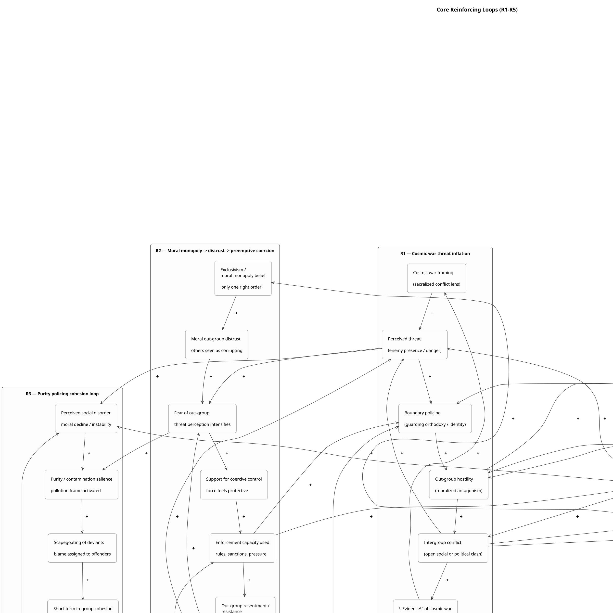
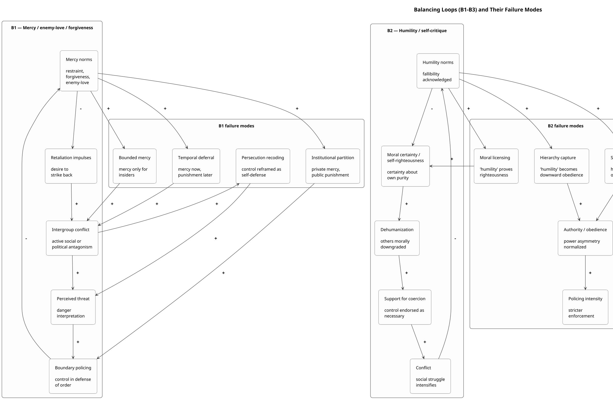
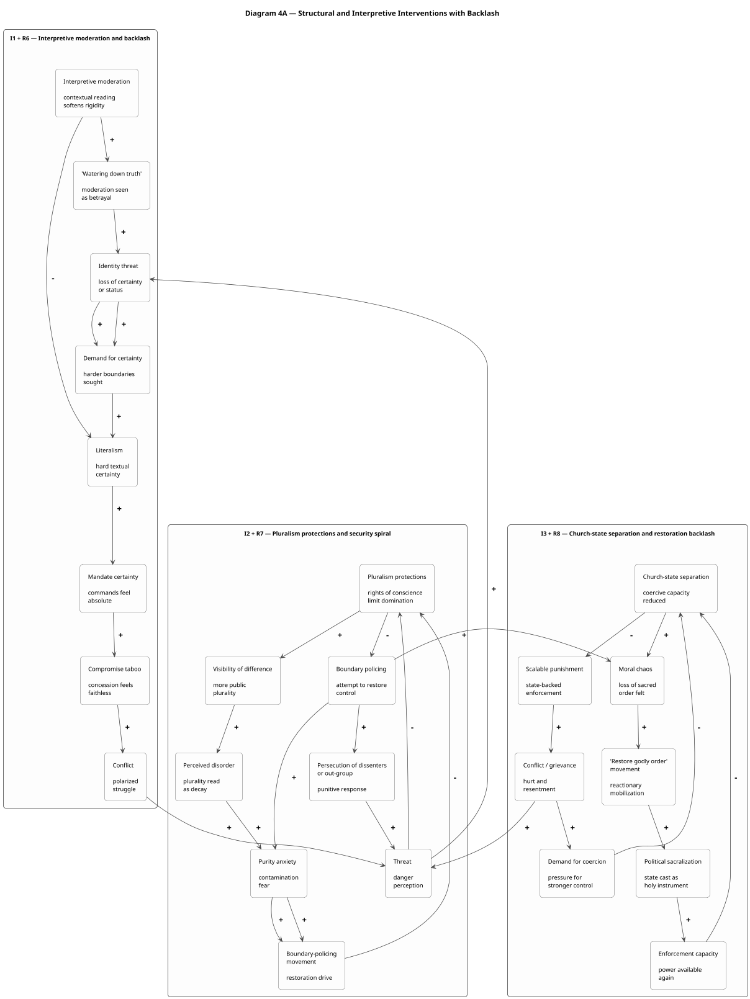
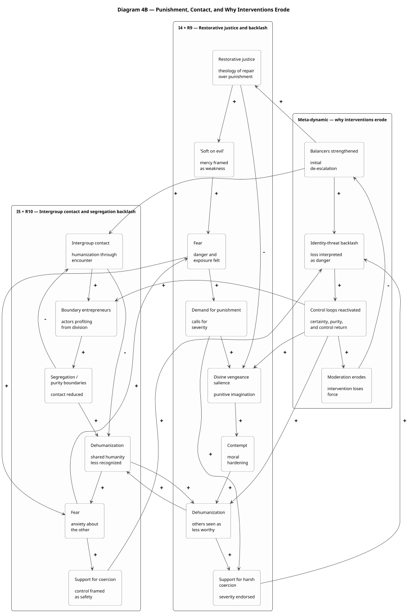

I hesitate to call this a "logic". Rather, its a collection of rules and heuristics that guide their behavior; derived from a peculiar religious subculture and amplified by internal mechanisms. First, I want to describe the worldview with concepts we are familiar with by dealing with these people directly; how they see their role in society and the reactionary backlash when people don't submit. Then I want to tie in their distorted historical views that give justification to their political goals. Then I'd like to talk about how we can think of Christian Nationalism as a particular combination features that leads to degenerate outcomes. Lastly, I think any social movement should be understood through the lens of system dynamics, so we will look at causal-loop diagrams that explain the persistence of the movement.

## Christian Love

The phrase “There’s no hate like Christian love” has become a common critique of a particular kind of religious behavior: the insistence that condemnation, exclusion, and even coercion are actually expressions of care. It points to a recurring pattern in which certain Christians describe other people’s identities, relationships, or ways of life as sinful, then defend their judgment by claiming they are acting out of love. In this framing, to “love” someone is not to respect their dignity or autonomy, but to correct them, restrain them, and pressure them toward what is defined as a godly path. What looks from the outside like hostility is recast from within as compassion. This is why the phrase has such force: it identifies not just hypocrisy, but a deeper ideological move in which love is redefined to mean moral correction and social control.

One of the most common ways this logic is defended is through analogies about obvious danger. A typical response is: if someone is about to walk into traffic, a loving person would warn them, even if the warning is unwelcome. At first glance, this seems persuasive because it presents intervention as a simple moral duty. But the analogy works only by smuggling in assumptions that are far from neutral. A car is a visible, measurable, publicly recognizable danger. By contrast, the claim that a person’s sexuality, gender expression, or way of life is sinful is not an observable fact of the same kind; it is a theological interpretation. The analogy therefore disguises a contested moral judgment as if it were equivalent to preventing an immediate physical injury. In doing so, it treats disagreement not as evidence of pluralism, but as proof that the other person is blind, deceived, or too morally impaired to recognize the danger for themselves.

That rhetorical move matters because it shifts the issue away from the real political and ethical question: who gets to exercise authority over whom? Warning someone about a speeding car does not require an ongoing claim of jurisdiction over their life. But the language of “loving correction” rarely stops at personal advice. It often extends into shame, exclusion, institutional punishment, and legal coercion. The analogy makes this escalation seem natural, as though calling for discriminatory laws or social penalties were merely an enlarged version of shouting “watch out.” What it conceals is that the issue is not simply concern, but power: the presumed right to decide what is good for others and to impose that vision against their will.

A related rhetorical maneuver appears when critics object to being judged or targeted, and the response is that it is somehow authoritarian to expect Christians to “accept sin.” This flips the situation on its head. Requests for equal treatment, dignity, or non-discrimination are recast as oppressive demands for moral approval. But that is a false equivalence. In many cases, people are not demanding praise or endorsement; they are asking not to be treated as inferior, not to be denied equal standing in public life, and not to be subjected to coercive policies grounded in someone else’s theology. The response deliberately collapses a distinction between disagreement and domination. It pretends that the only options are total endorsement or total condemnation, when in fact a pluralistic society depends on the possibility that people can hold moral disagreements without granting one group the authority to rule others by those beliefs.

This is also why the slogan “love the sinner, hate the sin” so often fails in practice. In theory, it sounds like an attempt to preserve a person’s dignity while criticizing behavior. In reality, many of the so-called “sins” at issue are inseparable from identity, intimacy, family life, and personal flourishing. To tell someone that you love them while condemning a central part of how they live and who they are is not experienced as a neat distinction. It often functions instead as a rhetorical shield, allowing the speaker to preserve a self-image of kindness while continuing to cause harm. The slogan does not dissolve the injury; it simply redescribes it in a way that excuses the person inflicting it. It says, in effect, that the wound should not count as a wound because the intention behind it was supposedly loving.

At an ideological level, this framing performs important work. It establishes a moral hierarchy in which some people are cast as guardians of truth and order, while others are marked as fallen, disordered, or in need of supervision. Once this hierarchy is in place, coercion can be justified as benevolence. Restrictions are no longer presented as domination, but as care. This is one of the oldest patterns in paternalistic thought: power becomes easier to defend when it is described as being exercised for the good of the subordinate. The language of love is particularly useful here because it moralizes control. It makes harshness feel righteous and turns the exercise of authority into a sacred duty rather than a political act.

Psychologically, this framework is sustained by several powerful mechanisms. It offers certainty in the face of ambiguity by dividing the world into sharp moral categories: saved and damned, pure and impure, ordered and disordered. For people deeply invested in such a worldview, complexity can feel threatening, and empathy can be reinterpreted as compromise with evil. The framework also protects identity. If a person’s sense of self is bound up with being someone who “stands for God’s truth,” then questioning the doctrine can feel like betrayal — not only of belief, but of family, community, and meaning itself. In that context, insisting that condemnation is love becomes a way to defend both doctrine and identity at once. There is also a dynamic of moral licensing at work: once a person believes they are acting out of love, they may permit themselves forms of cruelty they would otherwise recognize as unjustifiable. Love becomes a moral alibi.

Sociologically, “loving correction” serves as a powerful tool of boundary maintenance. It helps define who belongs and who does not. Public condemnation signals loyalty to the group and demonstrates commitment to its norms. It creates status opportunities for those willing to be the boldest enforcers of orthodoxy, and it discourages dissent within the community by attaching shame to deviation. Just as importantly, it provides an interpretive script for handling conflict with outsiders. If people resist being judged or controlled, that resistance can be coded not as evidence that harm is being done, but as proof that “the world hates the truth.” In this way, the system becomes self-sealing: criticism confirms the righteousness of the stance rather than prompting self-examination.

This helps explain why the framework fits so easily with certain forms of conservative politics. Not every Christian is conservative, and not every conservative is Christian, but the overlap is not accidental. The logic of “love as correction” aligns with a broader political preference for order, hierarchy, and traditional norms. If society is imagined as fragile and always under threat from moral disorder, then deviation appears dangerous and restraint appears necessary. Conservative political cultures often have a greater tolerance for authority and hierarchy, especially when those are presented as natural, moral, or divinely sanctioned. The same logic that justifies paternal authority in the family or church can be extended into public life. It becomes easy to translate theological judgments into political programs, and to present coercive policies as defenses of family, morality, and civilization itself. In that sense, this language is not just personal or pastoral; it is also politically useful. It softens the image of domination and turns culture-war aggression into the performance of virtue.

For all these reasons, the principle itself is fundamentally flawed. To claim that coercion is loving requires an extraordinary degree of certainty — certainty that one’s moral diagnosis is correct, certainty that one’s intervention helps rather than harms, and certainty that one has the right to override another person’s agency. In a pluralistic society, that is an epistemic and moral overreach. Genuine love ordinarily involves humility, respect, and recognition of the other person as an agent rather than a project. Once love is redefined as something that can disregard consent, dismiss lived experience, and override autonomy, it begins to collapse into domination with a halo. The language may remain tender, but the structure is authoritarian.

The principle is also flawed because it makes harm difficult to recognize. If a person says that condemnation, rejection, or exclusion is hurting them, the framework can simply answer that this pain is evidence of sin reacting against truth. In that way, the testimony of the harmed person is disqualified in advance. The framework cannot easily register the possibility that its own actions are the problem. It rewards the speaker for “telling hard truths” while giving them few incentives for self-criticism, restraint, or compassion in any meaningful sense. Often, it becomes fixated on policing the lives of outsiders while remaining notably more forgiving of harms committed within the in-group. That imbalance reveals that what is being defended is not simply holiness, but a social order.

The clearest way to understand this phenomenon, then, is as a fusion of moral paternalism, identity-protective certainty, and boundary policing, all wrapped in the language of love. Its emotional power comes from the fact that many people who use it are sincere: they may genuinely believe they are helping. But sincerity does not make the structure less coercive. When someone says, “I’m hurting you for your own good,” they are not merely making a claim about care. They are making a claim about authority — about their right to define your good and enforce it against your will. That is why the phrase “There’s no hate like Christian love” resonates so strongly. It names the disturbing reality that cruelty can become most dangerous when it is moralized, sanctified, and presented as compassion.

## Connections to Authoritarianism and Dominance

The logic of “loving correction” becomes even clearer when placed alongside broader concepts such as authoritarianism, social dominance, moral psychology, and the production of ignorance. What may appear on the surface as a personal or theological disagreement is often part of a much larger structure of moral power. The issue is not simply that some believers think certain behaviors are sinful. The deeper issue is the way those beliefs are organized into a worldview that authorizes judgment, legitimizes coercion, and insulates itself from criticism. Seen this way, the language of love does more than soften condemnation. It helps convert hierarchy into virtue.

One of the clearest conceptual links is to authoritarianism. The moral reasoning behind “loving correction” often follows a recognizably authoritarian pattern: submission to a perceived legitimate authority, aggression toward those marked as violators of the norm, and conventionalism in which inherited standards are treated as inherently stabilizing and right. Once “God’s order” is taken to be the only legitimate order, disagreement ceases to appear as disagreement. It becomes rebellion. That shift is crucial, because it makes punishment feel not only permissible but morally obligatory. A contested moral claim is transformed into a non-negotiable command, and resistance to that command is then read as further proof of depravity rather than as evidence that the claim itself might be wrong.

This structure also aligns closely with social dominance. The rhetoric of care often masks a hierarchy in which one group imagines itself as the guardian of truth, health, and moral order, while another group is cast as disordered, fallen, or in need of supervision. Even when the tone is gentle, the underlying relation is not egalitarian. One side claims jurisdiction over how others ought to live. That claim is not incidental; it is what gives the framework much of its emotional and political appeal. To be the one who corrects, disciplines, or “speaks truth” is not merely to hold a belief. It is to occupy a morally elevated role. The framework offers status, and because that status is moralized, it can feel righteous rather than domineering.

A moral foundations perspective helps explain why this rhetoric feels so compelling to its adherents. The language of “loving correction” often activates intuitions around authority, purity, and loyalty. Authority appears in the insistence that divine command must be obeyed and that proper order must be respected. Purity emerges in the portrayal of sin as contamination, corruption, or moral filth, often accompanied by disgust-based language and panic about protecting children or defending innocence. Loyalty enters through the defense of the in-group against a supposedly corrupting outside world. This matters because the framework is not sustained by abstract reasoning alone. It is also driven by moral perception, emotional response, and community signaling. For those already embedded in it, the claims can feel self-evident not because they have been carefully justified, but because they resonate with deeply socialized moral intuitions.

Psychologically, the framework is also highly protective of identity. It allows people to see themselves as faithful, loving, and courageous even while they engage in exclusion or cruelty. Criticism from others does not easily destabilize that self-image, because the framework has a ready-made response: what looks like hate is really “hard truth,” and what looks like harm is really love misunderstood. In this way, the worldview becomes self-sealing. If the target accepts correction, that confirms the moralist was right and loving. If the target resists, that too confirms the worldview, since the resistance can be interpreted as sin, rebellion, or worldly hostility to truth. Either outcome reinforces the original belief. The structure is therefore not merely persuasive; it is immunized against disconfirmation.

This helps explain why claims of love so often function as moral licensing. Once a person is convinced that their motive is pure, they may begin to treat the harshness of their methods as morally irrelevant. “I’m doing this because I care” becomes a kind of permission slip. It allows humiliation, exclusion, and even policy-level harm to coexist with a self-conception of benevolence. At the same time, the pattern resembles paternalistic prejudice: the target is spoken to in the language of concern, warmth, and care, but always from within a relation of control. The message is not simply “I want what is best for you.” It is “I know what is best for you, and that gives me standing to direct or restrict your life.” Intention is treated as sufficient, while impact is minimized or dismissed.

At the level of group life, “loving correction” also performs important sociological work. It helps maintain boundaries between the faithful and the fallen, between those who belong and those who threaten the community’s purity. Public condemnation signals loyalty. It reassures the group that its members remain committed to shared norms. It also discourages internal dissent, since questioning the framework risks association with those already marked as deviant. Within this setting, moral entrepreneurs can gain status by being especially uncompromising, especially vocal, especially willing to enforce the line. Conflict with outsiders then becomes useful rather than destabilizing, because opposition can be read as proof that the group is righteous, embattled, and therefore correct. The system feeds on resistance and converts it into confirmation.

Another important dimension is epistemic. This framework does not merely advance arguments; it helps produce and maintain ignorance. It does so by shaping what counts as evidence and whose testimony is considered credible. Attention is often directed toward the “sins” of outsiders while harms within the in-group are minimized, rationalized, or ignored. The accounts of those targeted by condemnation are frequently discounted as oversensitivity, offense, or rebellion against truth. Harm is redescribed as conviction, persecution, or the natural discomfort of being confronted with sin. Even the concept of love itself is captured and redefined so that coercion can appear as care. In this sense, the ideology manages ignorance as much as it expresses belief. It creates conditions under which its own harms become difficult to perceive, name, or validate.

At this point, however, it is important to distinguish the strongest charitable version of the religious moralist’s position from the coercive form being criticized. At its strongest, the moralist can argue something coherent: love seeks another person’s good, not merely their immediate comfort; human beings are capable of wanting things that harm them; and if one genuinely believes that sin alienates people from God and damages their flourishing, then warning them may be an act of care rather than hostility. Within a voluntary religious community, mutual correction can be part of shared accountability. Framed this way, the central claim is not absurd. If someone sincerely believes that a course of action is spiritually catastrophic, it is understandable that they would feel obligated to speak.

The problem begins when that claim expands beyond witness into rule. Speaking, persuading, advising, and bearing witness to one’s convictions are not the same as claiming jurisdiction over another adult’s life. Authoritarianism enters when private moral certainty becomes a license to govern others. Likewise, sincerity does not justify coercion. Even if the intention is genuine, coercive action demands further justification: whether the diagnosis is right, whether the intervention works, who bears the costs, and whether any legitimate consent or public authority exists. Love cannot function as a blank check for power. Nor can disagreement be interpreted as evidence of defectiveness. When moral dissent is treated as proof that the other person is impaired, corrupted, or incapable of understanding their own good, the possibility of mutual accountability disappears. The framework becomes epistemically arrogant as well as politically dangerous.

The contradiction becomes even sharper when the condemned “sin” is not a discrete action but something woven into identity, intimacy, kinship, or family life. In such cases, slogans like “love the sinner, hate the sin” no longer preserve dignity; they destabilize it. What is being rejected is not a detachable mistake but a way of living, loving, or belonging that is central to the person’s life. The result is a relational contradiction: one person demands recognition as loving while repudiating a core part of the other’s existence. The language of care remains, but it is attached to a structure of contempt.

This is why the distinction between moral witness and moral rule is so important. Moral witness is compatible with pluralism. It says: I believe this is wrong; I will not participate in it; within my voluntary community, we hold one another accountable; despite our disagreement, I will still recognize your dignity and equal civic standing. Moral rule is different. It says: because I believe this is sin, you should not be allowed to do it; institutions should punish or exclude you for your own good; your refusal of my authority proves your moral corruption. At that point, the issue is no longer belief. It is governance. And once “love” is invoked to justify restricting another person’s rights, opportunities, family formation, safety, or equal standing, it ceases to function as love in any meaningful sense. It becomes a moral gloss on domination.

This also helps explain the close fit between this rhetoric and conservative politics. The language of “loving correction” easily supports order-maintenance, authority legitimation, purity regulation, in-group solidarity, and paternalistic policy. Deviation is framed as social threat, obedience as virtue, contamination as danger, and coercion as benevolent protection. Politically, this is extraordinarily effective. It allows punitive policies to be presented as humane and portrays opponents not as defenders of autonomy, but as enemies of morality itself. In this sense, the rhetoric is not merely theological language carried into politics by accident. It is politically useful because it disguises domination as virtue.

A concise way of putting the critique, then, is this: people have every right to believe something is sinful, to say so, and to organize voluntary communities around those convictions. What they do not have is the right to turn that conviction into a license to govern others through stigma, exclusion, or law. If love is real, it should be visible in humility, persuasion that respects consent, and a willingness to grant equal civic dignity even across serious moral disagreement. Anything less is not simply a firmer form of care. It is control, sanctified by moral language.

## Americanism 

The logic of “love as correction” does not remain confined to personal morality. It scales upward into a national story about who belongs, who threatens the social order, and who has the authority to define the country’s moral identity. In conservative Christian subcultures especially, this logic often expands into what might be called “Americanism”: the belief that America possesses a divinely intended character, usually imagined as distinctly Christian, and that preserving the nation therefore requires the restoration of that moral order. What begins as paternalism toward individual lives becomes paternalism toward the nation itself. The same structure remains in place: a diagnosis of disorder, a claim to moral authority, and an insistence that intervention is not domination but care. In this form, “love of country” becomes a justification for reasserting a Christian moral regime through culture, law, education, and state power.

This shift is central to the worldview commonly described as Christian nationalism. At its core, Christian nationalism fuses religious identity with national identity and treats that fusion as politically normative. America is no longer understood primarily as a constitutional polity defined by civic membership, legal equality, and pluralism. Instead, it is imagined as a sacred project with a moral essence that must be defended. Once that move is made, debates over religion and politics cease to look like ordinary democratic disagreements. They become struggles over whether the nation will remain faithful to its supposed divine purpose or collapse into decadence and disorder. The moral urgency is intensified because the issue is no longer simply how individuals should live, but what the nation is for.

This transformation also changes the meaning of belonging. Under this framework, “true American” becomes less a legal or civic category than a moral one. The real American is not just the citizen, but the citizen who affirms the sacred narrative of the nation: public reverence for God, attachment to traditional family structures, respect for religious authority, and loyalty to inherited symbols of national identity. By contrast, those associated with secularism, atheism, progressive politics, immigration, LGBTQ visibility, or other perceived threats to the moral order are more easily cast as suspect or only conditionally American. The language may remain focused on values, but the practical effect is boundary enforcement. It sorts the population into those who fully belong and those whose belonging is treated as morally compromised.

Religion is especially useful in nationalist projects because it sacralizes the in-group. National identity always depends on a strong sense of “we,” but religion gives that “we” a transcendent frame. It provides sacred symbols, sacred history, sacred enemies, and a language of existential struggle. The nation can then be narrated not just as a political community, but as something providentially ordained and spiritually embattled. Founding myths become signs of divine favor. Public rituals become quasi-liturgical affirmations of belonging. Political enemies are elevated into agents of godlessness, decadence, or evil. Under those conditions, compromise becomes difficult, because it no longer feels like negotiation over policy. It feels like betrayal of something holy.

This is one reason concepts such as American civil religion and ceremonial deism matter sociologically, even apart from their legal status. Official God-language, patriotic invocations of providence, and religious symbolism in public rituals may be defended as harmless tradition, but they can also function as a soft religious baseline for national belonging. When phrases like “one nation under God” are treated as synonymous with patriotism, dissent from them can easily be interpreted not as a legitimate pluralist position but as evidence of disloyalty. The result is not necessarily a formal religious establishment, but a subtler structure in which believers in the dominant tradition appear naturally at home in the nation while nonbelievers and religious minorities are rendered more culturally suspect. The civic center of the country is quietly marked with a theological accent.

At the national level, this framework also reproduces the same ideological inversion seen in the rhetoric of “loving correction.” Equality and pluralism are recast as oppression. Requests to keep sectarian doctrine from controlling public institutions are described as persecution of Christians. The loss of unchallenged cultural dominance is redescribed as an attack on religious freedom. In this way, the demand that the state remain neutral among competing moral worldviews is reframed as tyranny by secular elites. This inversion is politically potent because it allows privilege to present itself as victimhood. The ability to no longer define the public order unilaterally is experienced as disenfranchisement, and equal civic standing for others becomes evidence that the “real” nation is being stolen away.

The psychological appeal of this worldview is not difficult to understand. In periods of rapid cultural change, demographic transition, or perceived moral instability, “restore God’s order” offers clarity, hierarchy, and reassurance. It transforms ambiguity into certainty and anxiety into mission. Criticism of the worldview can then be processed not as a political argument but as an attack on faith, selfhood, and homeland all at once. This helps explain why the framework is so resilient. It is identity-protective as well as ideological. The culture war becomes emotionally indispensable because it supplies a clear enemy, binds the in-group together, and rewards leaders who present themselves as uncompromising defenders of the nation’s sacred core.

This is also why the framework aligns so readily with conservative politics, even though the two should not be treated as identical. Not all conservatives are Christian nationalists, and not all Christians are politically conservative. Still, there is a strong structural affinity. Conservative political cultures often place greater emphasis on order, authority, tradition, purity, and inherited hierarchy. Those themes fit easily with a worldview that imagines the nation as morally fragile, under siege, and in need of restoration through disciplined control. Once deviation is interpreted as contamination and hierarchy as natural or divinely sanctioned, it becomes easier to draw a line between “real Americans” and internal outsiders. The political usefulness of the framework lies precisely in its ability to convert cultural resentment and theological certainty into a story about protecting the nation.

The deepest problem here is what might be called jurisdiction creep. A theological claim about the good life is transformed into a claim about national identity, and national identity is then turned into a claim about state authority. Finally, resistance to that authority is branded not merely as disagreement but as anti-American and anti-moral. That sequence is crucial because it shows how domination is moralized. A group does not merely say, “We believe this is right.” It says, “This is what America truly is, and therefore institutions must enforce it.” At that point, the issue is no longer private conviction or even public persuasion. It is governance through sacred identity.

A pluralistic democracy can withstand deep moral disagreement. What it cannot sustain is a politics in which one faction treats its sacred worldview as the default definition of citizenship and then uses the language of care, order, and patriotism to justify coercion. That is where the logic of “love as correction” reveals its broader political significance. Scaled up to the level of the nation, it becomes a theory of who counts as a real member of the community and who may be ruled for their own good. In that form, it is no longer merely paternalistic. It becomes a nationalized moral hierarchy, wrapped in the language of love and loyalty, but functioning as exclusion and control.

## Persecution Complex

The logic of “loving correction” connects directly to a broader persecution complex that often animates grievance-based Christian politics. In the contemporary American context, this persecution narrative usually does not center on literal state terror or systematic repression. Instead, it operates as a status story. The underlying claim is that Christians once occupied the moral center of the nation, but are now being displaced by secular elites, progressive institutions, and a culture that no longer recognizes their authority. From there, the story advances one step further: because believers are supposedly under siege, extraordinary forms of resistance become justified. This is what makes persecution rhetoric so politically powerful. It is not merely a complaint about cultural change. It is a moral license. Once a group understands itself as the righteous remnant under attack, actions that would otherwise look like domination can be reframed as self-defense, courage, or fidelity to God.

This is one reason victimhood is so useful within this political-religious style. First, it converts loss of cultural privilege into oppression. In a pluralistic society, a dominant group can lose its taken-for-granted status without losing its civil rights. But persecution narratives collapse that distinction. If Christians can no longer impose their moral framework as the default public standard, that loss of privilege is interpreted as targeted harm. Equal treatment begins to feel like discrimination. Second, victimhood makes compromise appear treacherous. If the conflict is cast as one between God and evil, then negotiation does not look prudent or democratic; it looks like surrender. Third, the narrative offers psychological rewards. It turns uncertainty into clarity, decline into mission, and ordinary political conflict into an epic moral struggle. People are no longer simply losing influence. They become heroic witnesses standing firm in a corrupt age.

From there, the persecution frame feeds directly into grievance politics. Grievance politics thrives when people experience themselves as disrespected, displaced, and endangered, and when leaders can point to enemies supposedly responsible for that injury. The persecution narrative supplies this structure almost perfectly. It identifies villains — secular elites, schools, courts, media institutions, “woke ideology” — and gives followers a script for interpreting themselves as silenced, despised, and under attack. It then offers a corresponding political demand: fight back, take the country back, restore Christian values through law and public power. The genius of this rhetoric is that it translates diffuse cultural change into something much more visceral. Social transformation becomes not merely unsettling, but insulting. It becomes a personal wound and a collective emergency.

Once that interpretive frame is in place, it tends to amplify itself. Small conflicts are elevated into symbols of civilizational struggle: a school policy, a lawsuit, a Pride flag, a workplace training, a children’s book. Each incident is treated not as a discrete dispute, but as proof of a coordinated attack on Christianity. The worldview then develops what might be called interpretive immunity. Disagreement no longer challenges the narrative; it confirms it. Critics are dismissed as blinded by sin, manipulated by evil, or fulfilling biblical prophecy. Counterevidence therefore loses its corrective function. Instead of forcing revision, it is absorbed into the story as further evidence of persecution. The belief system becomes self-sealing.

This dynamic is intensified by political and media incentives. Influencers, advocacy groups, and ambitious politicians all benefit from describing ordinary cultural conflict in apocalyptic terms. Outrage produces attention, donations, votes, and social status. The loudest defenders of the faith often become the most visible and rewarded, especially in media ecosystems built around alarm and confrontation. Once these narratives are circulated repeatedly through ideologically aligned networks, they gain both emotional force and apparent credibility. Repetition creates familiarity; familiarity creates plausibility. Over time, the narrative is no longer experienced as one interpretation among others, but as obvious reality. Even attempts to measure or quantify anti-Christian bias can contribute to this effect by giving the story an aura of objectivity, especially when the definition of persecution is expanded so broadly that ordinary pluralism is folded into the category.

At that point, radicalization becomes easier. The danger is not simply that people feel aggrieved, but that grievance becomes fused with sacred identity, threat perception, and conspiratorial thinking. If believers come to see themselves as a righteous in-group under existential attack, then escalation can begin to feel morally necessary. Aggression is redescribed as defense. Harsh tactics appear justified because the enemy is imagined not merely as mistaken, but as evil. When God’s order, children’s innocence, or the nation’s survival are said to be at stake, limits on means begin to erode. The issue is no longer disagreement over public life; it becomes a battle for civilizational survival. Under those conditions, radical interpretations that would once have seemed extreme can start to feel like common sense.

This also brings the argument back to the phrase “There’s no hate like Christian love.” At the interpersonal level, the logic says: I am correcting your sin because I care about you. At the political level, the same structure expands outward: we are restricting your rights, policing your identity, or subordinating your freedom because we care about the country, about children, about morality, about God’s design. Persecution rhetoric intensifies this transition by making coercion feel even more warranted. The story becomes: we tried to be patient, but now we are being attacked; we do not want conflict, but we are being forced into it; we are not dominating, we are defending ourselves. This is the emotional bridge between paternalism and authoritarianism. Love becomes the language through which control is justified, and grievance becomes the emotional engine that makes that control feel righteous.

There is an important nuance here. Christians are genuinely persecuted in some parts of the world, and that reality should not be denied. But the existence of real persecution abroad can also be used rhetorically in domestic politics. It can become a portable master-frame, one that encourages believers to interpret entirely different circumstances through the same lens of siege and martyrdom. The problem is not acknowledging violence against Christians where it actually exists. The problem is when that category is imported wholesale into ordinary democratic life at home, so that disputes over pluralism, equal citizenship, and institutional neutrality are reimagined as existential attacks on the faith. In that move, democratic disagreement is transformed into sacred warfare.

Inside communities, this framework is often amplified through familiar sociological mechanisms. Persecution sharpens the boundary between “us” and “them,” which strengthens group cohesion. Taking a hard line becomes a costly signal of loyalty and earns recognition within the group. Moderates may begin to self-censor for fear of being labeled weak or compromised. Political stances harden into religious tests, and leaders who speak most forcefully in defense of the embattled group acquire prestige as moral warriors. Over time, the political siege narrative can begin to reshape theology itself. Faith becomes less a source of independent moral reflection and more a vehicle for sustaining the culture-war identity of the group.

Two questions help expose when this dynamic is moving from sincere conviction into grievance-driven radicalization. The first is: what would count as evidence that you are not being persecuted? If the answer is effectively nothing, then the belief system is functioning in a self-sealing way, closed off from correction. The second is: are you asking for freedom to practice your faith, or power to enforce it? That distinction is crucial. The persecution frame often blurs the line between the two, presenting demands for dominance as if they were merely demands for liberty. But once the desire is no longer simply to live according to one’s beliefs, but to impose them through law, stigma, or institutional control, the claim of victimhood becomes something else entirely. It becomes a strategy for moralizing power.

Seen in this light, the persecution complex is not just a mistaken feeling or an exaggerated complaint. It is a political and psychological engine. It converts cultural change into injury, injury into grievance, grievance into mobilization, and mobilization into increasingly extreme forms of certainty and control. That is why it matters so much in the broader structure you are analyzing. It does not sit off to the side of “Christian love” as a separate issue. It is one of the mechanisms through which coercion is justified, sanctified, and intensified. What begins as the claim that correction is loving can, under the pressure of grievance politics, become a far more dangerous claim: that domination itself is an act of faithful defense.

## Micro-Realizations in Practice

The connection between everyday acts of coercive “correction” and the larger politics of national identity becomes clearer once we stop treating them as separate phenomena. What happens at the interpersonal level does not simply remain there. Repeated attempts to “correct sin” train people into a broader way of understanding authority, belonging, and threat. They rehearse a moral logic in which certainty about another person’s good becomes a license to intervene in their life, and resistance is interpreted not as disagreement but as proof of rebellion or deception. In that sense, these seemingly small encounters already contain a political grammar. They normalize the idea that authority is righteous when it enforces moral order.

Over time, this grammar is reinforced by a predictable emotional structure. Sin is framed not merely as error, but as contamination; disagreement becomes threat; nonconformity becomes something dangerous, especially to children, families, or social stability. Disgust, fear, anger, and paternalistic pity are woven together into a package that makes coercion feel not cruel but caring. What matters here is not just doctrine, but moral affect. The person who intervenes can experience themselves not as domineering, but as protective, responsible, even compassionate. That emotional habit is politically significant because it translates so easily into public life. Once moral enforcement is already felt as benevolent in personal settings, it becomes much easier to imagine legal or institutional enforcement in the same terms.

These habits become durable when they are stabilized by institutions. Churches, schools, media ecosystems, and subcultural communities transform isolated acts of “correction” into shared common sense. Public condemnation becomes a signal of faithfulness. Boundary policing becomes a way of distinguishing the pure from the impure, the loyal from the compromised. Those willing to be especially forceful or uncompromising can gain status as defenders of truth. In this way, coercive moral habits are not simply personal quirks; they are socially rewarded practices. They become embedded in ritual, repetition, and identity, which is why they can persist even when they generate obvious harm.

The crucial conceptual shift comes when “sin” is translated into “social disorder,” and then into “national disorder.” Once a behavior is imagined as contagious or corrosive, it no longer appears private. It begins to look like a public danger. If that danger is then linked to the collapse of the family, the corruption of children, or the decline of the culture, the matter starts to seem political rather than merely personal. At that point, intervention can be reframed as civic duty. The same logic that once justified “correcting” an individual now justifies “protecting” society. Slogans such as “protect the kids,” “save the family,” or “take the country back” are not departures from the earlier logic. They are its scaled-up form.

This is where national identity becomes moralized. “American” no longer means simply a civic status defined by citizenship, rights, and equal membership under law. Instead, it begins to mean something like: a real American is someone who affirms Christian moral order. That move is central to the broader worldview often described as Christian nationalism. The nation is no longer just a political community; it becomes a moral and quasi-sacred project whose legitimacy depends on maintaining a particular religious character. Once that happens, questions of belonging are no longer settled civically. They are settled morally. Some people count as authentic members of the nation, while others become suspect, conditional, or treated as internal threats.

Seen this way, the “true American” sorting mechanism is not an additional belief tacked on at the end. It grows directly out of the same boundary-policing habits learned at the micro level. In daily life, coercive correction teaches that some forms of life are illegitimate unless they conform to an approved moral order. That produces habits of classification: who is healthy, who is deviant, who belongs, who must be disciplined. Politics then reuses those same habits on a larger scale. The question shifts from who is living rightly to who counts as a real American. The national project is therefore not separate from the interpersonal one. It is the macro-level expression of the same underlying structure.

Once this nationalized framework is in place, grievance gives it political energy. The story becomes one of loss and dispossession: God is being erased from public life, children are being corrupted, Christians are being persecuted, the nation is being stolen. Under those conditions, coercion can be recast as self-defense. Restrictive laws, institutional punishments, and public campaigns of exclusion no longer appear authoritarian. They appear restorative. The logic becomes: we must act, or we will lose the country. This is one of the most powerful features of the worldview. Domination is reframed as protection, and the attempt to reimpose moral control becomes a heroic defense of the nation’s true identity.

The process does not stop there. Once the macro-level political project is underway, it feeds back into everyday life and intensifies the original coercive habits. Court cases, school board conflicts, election battles, and public controversies are read as proof that “the world hates the truth.” That interpretation makes ordinary acts of correction feel even more necessary and more righteous. Moderates are pressured to take harder lines, because silence begins to look like surrender. What may once have been framed as witness within a pluralist society gradually shifts toward rule — toward the conviction that moral truth must be enforced through institutions. In this way, everyday coercion and national politics reinforce one another in a loop.

A useful way to summarize the whole dynamic is to see it as a chain: micro-level coercion produces habits of boundary enforcement; those habits are reinforced by institutions; private “sin” is translated into public disorder; public disorder is translated into national decline; and the defense of Christian moral order becomes fused with the defense of “real America.” Grievance then mobilizes the project politically, while conflict feeds back into everyday life and hardens the original habits further. What begins as “love means correction” becomes, at the largest scale, a theory of patriotism as enforcement.

The sharpest distinction here is between witness and jurisdiction. Witness is compatible with pluralism: it involves living according to one’s convictions, persuading others, and participating in civic life without claiming authority over everyone else. Jurisdiction is different. It claims the right to define belonging, determine moral legitimacy, and enforce order through institutions. In that sense, the daily practice of coercive correction is not just morally troubling in itself. It is also the training ground for a much larger political move. It habituates people to the idea that moral certainty entitles them to rule. And that is how micro-level “correction” aggregates into the macro-level project of protecting the nation by deciding who truly belongs within it.

## Law and Morality

One recurring argument on the religious right is that law and morality are inseparable, and that this inseparability therefore justifies imposing religious beliefs through the state. At first glance, the claim can sound serious, even philosophically grounded. After all, legal systems do reflect values; laws against murder, theft, and fraud are not morally neutral. But this observation is often used in a misleading way. A basic truth about law — that it inevitably contains normative judgments — is transformed into a much larger and far more dangerous conclusion: that because law has moral content, the state is entitled to enforce one group’s comprehensive religious morality on everyone else. That move is not a neutral insight about jurisprudence. It is a political claim, and in many cases it functions as a justification for authoritarian rule.

The first thing to clarify is that acknowledging overlap between law and morality does not mean law should enforce a full vision of virtue. There is an important difference between the minimum moral framework necessary for social cooperation and a much thicker, more contested account of the good life. Every society requires rules that protect people from violence, fraud, and arbitrary domination. These are the kinds of norms that make collective life possible at all. But religious conservatives often slide from that thin moral core into something much broader: the idea that law should regulate sexual ethics, family life, religious conduct, or other matters grounded not in shared civic necessity but in a particular theological worldview. Once that distinction is lost, the state ceases to function as a framework for coexistence and becomes an instrument for enforcing sectarian virtue.

This is where appeals to jurisprudence are often used more as rhetorical cover than as serious argument. Different traditions in legal philosophy offer different ways of understanding the relation between law and morality. Natural law theory connects law to moral reason and may hold that unjust laws lack genuine authority. Legal positivism, by contrast, distinguishes what counts as law from whether that law is morally good. Interpretivist approaches argue that moral principles play a role in legal interpretation. But none of these positions, on their own, establishes that the doctrines of a particular church should be binding on the entire population. Even theories that give morality a central place in law do not automatically endorse theocratic enforcement. The leap from “law is normative” to “therefore my religion should rule” is not jurisprudence; it is an extra political premise smuggled in under philosophical language.

What is usually hiding beneath this argument is a stronger claim: that political legitimacy requires moral unity, and that only religion can provide it. The logic often runs like this: societies need shared moral foundations in order to survive; religious belief is the only reliable source of such foundations; therefore the state must uphold religious morality. But each step in that chain is contestable. A pluralistic society does not need agreement on salvation, purity, or metaphysical truth in order to function. It can instead cohere around thinner civic principles such as equal citizenship, reciprocity, legal fairness, and protection from harm. Nor does the fact that religion motivates many people morally show that religion is the only source of moral insight. And even if a majority embraces a particular religious view, that still does not settle the question of legitimacy. In a democratic society, the exercise of coercive power requires justification that treats dissenters as political equals, not simply as obstacles to the moral destiny of the majority.

A central rhetorical trick in these arguments is the conflation of sin with harm. The claim is rarely stated so bluntly, but its structure is clear: if something is sinful according to my theology, then it must also be socially harmful in a way that justifies legal prohibition. But this is precisely the point that requires argument, not assumption. Liberal-democratic law does not normally treat “I believe this is morally wrong” as sufficient grounds for coercion. It asks stricter questions: what is the harm, who is harmed, by what mechanism, and is the harm direct, material, and publicly demonstrable? When religious moralists cannot answer those questions without retreating into symbolic offense, disgust, or divine command, the authoritarian tendency of the argument becomes visible. The state is no longer being asked to prevent concrete injury; it is being asked to enforce theological disapproval.

This is why the slogan “if you legislate anything, you legislate morality” functions so often as a bait-and-switch. In one sense, it is true but trivial: every law embodies some value judgment. But that modest observation is then used to smuggle in a much stronger conclusion, as though the inevitability of values in law means that any moral vision is equally eligible for coercive enforcement. It does not. A democratic legal order can embody commitments to nonviolence, equality before the law, and procedural fairness while still rejecting the project of religious conformity. The fact that law reflects values does not erase the distinction between a shared civic framework and a sectarian virtue code. Yet the rhetoric depends on collapsing exactly that distinction.

At bottom, what makes this style of argument authoritarian is the way it treats citizens. It assumes that being morally certain gives one faction the right to govern everyone else according to its convictions. But democracy is not simply majority power animated by confidence in its own righteousness. It is a political form premised on the equal standing of people who profoundly disagree. That means citizens owe one another more than declarations of moral superiority. They owe one another reasons that do not depend on conversion to a favored creed, institutions that apply fairly across difference, and rights that do not evaporate when one falls outside the dominant moral tribe. When religious conservatives argue that the state should impose their theology because it is true, they are no longer addressing their fellow citizens as co-authors of a shared political order. They are treating them as subjects to be ruled.

A useful way to expose the weakness of this position is to separate several different claims that are often blurred together. One claim is descriptive: laws reflect moral judgments. That is mostly true, but not very informative. Another claim is metaethical: objective moral truths exist. Whether one agrees or not, that question still does not determine what the state may coercively enforce. The crucial claim is political: that the state should impose virtue or religion as such. That is the truly controversial step, and it is often hidden behind the more obvious first two claims. By forcing defenders of religious legalism to state that political premise openly, the structure of the argument becomes much easier to challenge.

The strongest rebuttal, then, is not to deny that law and morality ever overlap. It is to insist that the real issue is which values justify coercion in a plural society, and on what grounds. “My religion says so” is not a limiting principle. It does not tell us why dissenters should be bound, why rival faiths should not legislate their own doctrines in turn, or what prevents state power from becoming totalizing. Once those questions are asked directly, the appeal to “law and morality are inseparable” begins to lose its force. What looked like a profound truth about jurisprudence reveals itself as something much narrower: an attempt to redescribe sectarian domination as ordinary lawmaking.

In that sense, the problem is not moral seriousness. A society needs moral reflection, and law cannot be entirely detached from ethics. The problem is the attempt to use that fact as cover for a political order in which one religious faction claims the authority to define the good for everyone else. The issue is not whether law has values, but whether coercive power can be justified in a way that respects the equal standing of those who do not share the ruling theology. Where that respect disappears, the language of morality no longer functions as a defense of justice. It becomes a sanctified vocabulary for authoritarian control.

## Ridiculous Extrapolations

The argument often moves one step further once religious conservatives concede that law cannot simply enforce an entire theological worldview all at once. Instead, they retreat to a thinner claim: the basic normative commitments that hold a legal order together — prohibitions on murder, rules against theft, duties of honesty, norms of reciprocity — are said to be rooted in their religion. From there, they attempt a new inference: if these foundational civic norms were derived from Christianity, or historically preserved by it, then Christianity is entitled to explicit recognition in law and legislation. But this move is no more successful than the cruder version. It confuses historical influence with present authority, and it mistakes genealogy for justification.

Even granting the strongest version of the historical claim does not rescue the argument. Suppose one accepts, for the sake of argument, that Christianity helped shape certain civic norms in a given society. That still would not establish that Christianity therefore deserves privileged legal status, or that legislation should explicitly invoke it as the authoritative source of public order. A norm’s origin does not determine its present legitimacy. Practices and principles regularly outgrow the traditions through which they were transmitted. A society may inherit a rule through one historical channel and yet justify it now on entirely different grounds. Christianity may have participated in the preservation or transmission of a norm without thereby owning it. Influence is not title.

This is the first major flaw in the argument: it relies on a genealogical move that simply does not carry normative weight. To say that a norm has Christian roots is to tell a descriptive historical story. It is not yet to show why that norm should bind everyone now, why rival citizens must acknowledge Christianity as its authoritative source, or why the state should grant theological language a privileged place in legislation. The gap here is crucial. Historical ancestry does not generate sovereign entitlement. A tradition can influence public life without thereby acquiring the right to dominate it. Once that distinction is made explicit, the argument begins to collapse.

The second problem is that these thin civic norms are almost always overdetermined. Rules like “do not kill,” “do not steal,” or “do not commit fraud” do not depend on a single religious foundation. They can be supported by reciprocity, by social-contract reasoning, by concern for harm prevention, by game-theoretic accounts of cooperation, by empathy and social emotions, by human rights traditions, and by the pragmatic requirements of stable coexistence. Even if Christianity affirms such norms, that proves at most that it is one pathway through which they have been articulated and sustained. It does not prove that Christianity is their exclusive or indispensable foundation. And once multiple independent justifications are acknowledged, the leap from “our religion supports these norms” to “our religion must therefore be explicitly referenced in law” stops looking like a legal conclusion and starts looking like a bid for cultural supremacy.

This reveals the deeper non sequitur at work. The argument typically proceeds in three steps: the legal order requires some thin moral norms; Christianity helped generate or preserve those norms; therefore Christianity should govern, or at least enjoy special recognition within, the legal order. But the conclusion does not follow from the premises. At most, the premises establish that Christianity is compatible with certain civic norms, or that it played some historical role in shaping them. To reach the stronger conclusion, additional premises would have to be smuggled in — for example, that only Christianity can secure those norms, that the state must officially endorse what believers take to be their true moral source, or that citizens who reject Christianity are less entitled to equal standing. These are not minor additions. They are the real substance of the argument, and once stated openly, their illiberal and authoritarian character becomes much harder to hide.

What often happens instead is a “thin-to-thick” smuggle. The discussion begins with a nearly universal norm such as “do not kill,” where broad consensus is easy to obtain. From there, the argument slides into the claim that law must track objective morality. Then it slides again into the claim that Christianity provides the best account of objective morality. Finally, it concludes that law should therefore enforce Christian theology. But each of these transitions requires substantial argument, and that argument is rarely provided. More often, the speaker relies on rhetorical momentum: once agreement has been secured at the thin level, that agreement is used as a Trojan horse to import a much thicker and more contested doctrinal system. The presence of one shared norm is made to carry far more weight than it actually can.

A good way to expose this move is to ask what, exactly, follows from the thin norm in question and by what valid inference. From the fact that a society prohibits murder, what additional doctrines are supposed to follow? Why should that norm entail official legislative reference to Christianity rather than to some broader moral language available to all citizens? Why should it authorize a thicker theological package concerning sexuality, family, salvation, or religious authority? These questions are difficult for the argument because they force the hidden steps into the open. Once the transitions must be defended explicitly, the slide from shared civic norms to sectarian legal privilege becomes much less plausible.

This is also where equal citizenship becomes decisive. In a pluralistic society, coercive law must be justified in ways that do not require the ruled to convert to a particular metaphysical or theological worldview. That does not mean religious citizens must leave their convictions behind when they enter politics. It means something narrower and more important: the state cannot treat nonadherents as second-class citizens by making one theology the official rationale of public rule. A religious tradition may inspire the moral commitments of many citizens. It may shape their understanding of justice, obligation, and human dignity. But once law is coercively imposed on everyone, its justification must be framed in terms that respect the equal standing of those who do not share that faith. Otherwise, the political community ceases to be a community of coequals and becomes an instrument of confessional hierarchy.

One especially useful test here is reversal. If the principle being defended were general rather than sectarian, its advocates should be willing to accept it even when it favors another tradition. If a society’s thin civic norms were historically shaped by Islam, Hinduism, or secular Enlightenment liberalism, would that tradition then be entitled to explicit legal primacy? Would its concepts deserve formal legislative reference on the grounds that they helped generate the moral background of the law? If the answer is no, then what is being defended is not a principle at all. It is simply a demand that one’s own team receive special recognition and authority. The universality test exposes the argument as partisan rather than philosophical.

The most concise way to state the critique, then, is this: even if some shared civic norms were historically influenced by Christianity, that is a genealogical fact, not a grant of governing authority. Influence does not entail entitlement. Historical contribution does not amount to legal ownership. And the existence of thin, widely shared norms does not justify importing an entire thick theological system into law. Once those distinctions are kept firmly in view, the extrapolation becomes much easier to see for what it is: not a serious account of public justification, but another attempt to turn cultural influence into moral jurisdiction.

## Secular Enlightenment

The alternative to religious legalism is often caricatured as moral emptiness, as though a secular political order simply rejects values altogether and leaves society with nothing but procedural drift. But that is a distortion. Modern secular and Enlightenment-inflected legal traditions are not “value free.” They rest on a different normative aspiration: not that the state should realize the one true religion, but that it should create conditions under which people who hold incompatible ultimate beliefs can nonetheless live together as political equals. That is the core modern legitimation story of liberal legal orders. The state is not imagined as priest, guardian of orthodoxy, or enforcer of salvation. It is imagined instead as the framework within which coexistence, rights, and equal citizenship become possible across deep disagreement.

This model was shaped in large part by the historical experience of religious establishment and sectarian conflict. Enlightenment thought did not arise simply from abstract philosophical curiosity. In many respects, it was a response to the social and political costs of tying coercive power to sacred truth. When states and churches were fused, the consequences were often persecution, civil exclusion, confessional hierarchy, and recurring crises over who possessed the right doctrine. Against that background, one of the central Enlightenment moves was to treat conscience as something the state is both bad at governing and dangerous to police. Genuine belief cannot be produced by force, and attempts to coerce it tend to generate not faith but hypocrisy, resentment, and conflict. The rejection here is not always religion as such. It is religious establishment as a theory of political authority.

This is why toleration and freedom of conscience became so central to the modern legal imagination. The claim was not that belief does not matter, nor that all doctrines are equally true, but that civil government has a limited and specific role. Its task is not to adjudicate salvation or impose theological conformity. Its task is to secure peace, protect basic interests, and maintain the conditions of common life. That is itself a moral argument, not a neutral absence of one. It says that coercing belief is the wrong kind of state action because it exceeds legitimate authority and predictably produces political pathologies. In this sense, secularism emerges not as indifference to morality, but as a normative judgment about the proper limits of power.

From this standpoint, modern constitutionalism can be understood as an effort to institutionalize those limits. In the American context, that is visible in the Religion Clauses of the First Amendment, which refuse both religious establishment and interference with free exercise. The deeper principle is not hostility to religion, but refusal of state favoritism. The government should not pick winners among religions, nor should it make theological conformity the price of full civic belonging. Religion remains protected as a matter of liberty, but it is denied the right to become the official language of public rule. That distinction is crucial. It allows religious commitment to flourish privately and associationally without turning one tradition into the sovereign authority over all.

A similar logic appears in broader Enlightenment contributions to constitutional design. Once political legitimacy is no longer grounded in sacred kingship, ecclesiastical supremacy, or orthodoxy, it must be relocated elsewhere — in procedures, rights, divided powers, and institutional constraint. Separation of powers matters not only because concentrated authority is dangerous in general, but because it helps desacralize the state. Authority is no longer treated as holy in itself. It is fragmented, checked, and made answerable. That anti-sacralization is part of what makes a pluralistic political order possible. The state ceases to be the vessel of one transcendent truth and becomes instead a structure for managing disagreement without collapsing into domination.

This shift also transformed the meaning of citizenship. In a secular, Enlightenment-inflected framework, people are not treated primarily as members of the correct or incorrect faith. They are treated as citizens whose equal standing does not depend on theological assent. That orientation pushes legal institutions toward protections for speech, conscience, association, due process, and equal civic status. It seeks to ensure that one does not have to subscribe to an approved metaphysics in order to count as fully belonging. Even when such institutions first emerged in societies marked by Christian majorities, their justification increasingly came to rest on public reasons — reasons that could be offered across disagreement — rather than on sectarian doctrine as such.

This is the sense in which secularism should be understood as a normative project of pluralism without religious privilege. It does not abolish values. It affirms a particular set of political values about legitimacy: that the state should not privilege one comprehensive doctrine, whether religious or anti-religious, as the condition of civic membership; that citizens should be able to disagree about ultimate truths without forfeiting equal standing; and that coercive law should be justified in terms broader than confessional allegiance. Different societies operationalize that ideal in different ways. Some, like the United States, combine disestablishment with strong protection for religious exercise. Others, like France, pursue a more assertive model of neutrality in public institutions. But both approaches are trying, in different registers, to solve the same basic problem: how to prevent the state from becoming the instrument of sectarian rule.

The key point, then, is that secular legal order is not merely what remains once religion has been pushed aside. It is, rather, a historically developed response to the dangers of religious establishment and the impossibility of peaceful political life under conditions where one faction claims divine title to rule. Its animating insight is that the state should function as referee rather than priest. That does not mean it lacks moral commitments. It means its moral commitments are oriented toward coexistence, equal standing, and limits on coercive authority rather than toward the realization of sacred orthodoxy. In that respect, secularism is not the negation of political morality. It is a rival moral vision — one that arose precisely because the alternative so often collapsed into hierarchy, exclusion, and sanctified domination.

## Comparing the Positions

The secular-pluralist position begins from a basic political fact: modern societies are marked by enduring disagreement about religion, metaphysics, and the good life. This is not a temporary problem waiting to be solved by better argument or stronger moral leadership. It is a permanent condition of political life. Once that is acknowledged, the central question becomes one of legitimacy: how should coercive law be justified in a society where citizens reasonably reject one another’s deepest commitments? A common answer in modern political theory is that coercive law must be justifiable to citizens as free and equal, rather than imposed on them as subjects of a supposedly true creed, a point developed in discussions of [public justification](https://plato.stanford.edu/entries/justification-public/). From that starting point, the state is no longer imagined as the guardian of sacred truth, but as the framework within which people who profoundly disagree can still live together as political equals.

This position is closely tied to an older argument about conscience and the limits of force. One of the classic liberal insights, articulated by [John Locke](https://press-pubs.uchicago.edu/founders/documents/amendI_religions10.html), is that coercion is poorly suited to governing belief. Force can produce outward conformity, but it cannot manufacture genuine conviction. That point is not merely moral but practical. A state can punish dissent, but it cannot compel sincerity; it can create compliance, hypocrisy, and fear, but not authentic faith. Once that is understood, it becomes harder to defend the idea that political legitimacy should rest on enforcing one comprehensive doctrine. Belief is precisely the wrong object for state power to try to master.

From there, the secular-pluralist argument takes a further step. If citizens are to share a political order without first agreeing on ultimate truth, then legitimacy cannot depend on their acceptance of any one religion, anti-religion, or total philosophical worldview. Instead, the justification of law must rely on reasons that can be offered across deep disagreement, an idea associated with Rawls’s account of [public reason](https://www3.nd.edu/~pweithma/Readings/Rawls/Rawls%20%28Idea%20of%20Public%20Reason%29.pdf). The claim here is not that everyone must think alike, or that private motivations must be secularized. It is that when the state acts coercively on fundamental matters, its justification should not make full civic membership depend on theological conversion. Political legitimacy, on this view, rests not on shared salvation, but on fair terms of cooperation among equals.

Because good intentions are not enough to restrain power, this tradition also insists on structural limits. It is not sufficient to hope that rulers will be wise, virtuous, or restrained. Power must be checked institutionally, which is why constitutional traditions place such weight on divided authority and mutual constraint. The underlying logic is captured in [Montesquieu’s famous formulation](https://press-pubs.uchicago.edu/founders/documents/v1ch17s9.html) that power must be made to check power. This is not simply administrative technique. It reflects a deeper anti-authoritarian insight: if the state is permitted to identify itself with one final truth, then there are few internal barriers left against domination. Fragmenting and constraining authority is one way of preventing political power from becoming morally absolute.

The same concern appears in liberal attempts to articulate limiting principles for coercion. One of the most influential is the idea that law should be directed toward preventing harm to others rather than enforcing virtue as such, a distinction classically associated with [John Stuart Mill](https://www.econlib.org/library/Mill/mlLbty.html). There are, of course, many disputes about what counts as harm and how broadly the concept should be drawn. But the point of the principle is clear: it tries to block the slide from “I believe this is sinful” to “therefore the state should prohibit it.” It does not abolish morality from politics. It instead asks for a more disciplined account of when moral disapproval becomes a legitimate ground for coercive law.

Institutionally, this secular-pluralist logic tends to support a recognizable set of arrangements. One is disestablishment, or at least the refusal of formal religious privileging. In the United States, this takes constitutional form in the [First Amendment’s religion clauses](https://constitution.congress.gov/constitution/amendment-1/), which combine non-establishment with free exercise. Another is equal citizenship regardless of creed: no one’s civic standing is supposed to depend on whether they adhere to the dominant faith. A third is the protection of procedural legitimacy and individual rights — speech, conscience, association, due process — so that disagreement can persist without turning into political exclusion. And finally, there is the broader commitment to constrained government itself: institutions should be designed to resist capture by any one faction, especially a faction that believes it possesses sacred authority.

What this model rejects, then, is not morality but confessional rule. It rejects theocracy, civil exclusion, and the attempt to use thin shared norms as a bridge for imposing a much thicker sectarian doctrine. At the same time, it still affirms something morally substantive. Secular pluralism is not value-neutral in the sense of having no commitments at all. It gives priority to equal civic standing, freedom of conscience, and limits on domination. These are not empty procedural devices. They are political values, and they are treated as more important than any one sect’s claim to govern everyone else.

Still, the model faces serious criticisms, and some of them should be taken seriously. One common objection is that neutrality is a myth: secularism, too, is a historically formed political project rather than a simple absence of ideology. Genealogical critiques, such as those associated with [Talal Asad’s work](https://www.sup.org/books/anthropology/formations-secular), argue that “the secular” can discipline religion, define acceptable belief, and quietly privilege majority cultural norms while pretending merely to stand above the conflict. That criticism has force. The right reply is not to pretend secularism is metaphysically empty, but to refine the claim. Secular pluralism does not require a worldview-free state in some impossible absolute sense. It requires political non-privileging among comprehensive doctrines, together with robust protections so that neutrality does not become a covert tool of assimilation.

A related objection is that public reason places an unfair burden on religious citizens by forcing them to translate their deepest commitments into secular language. That worry is real, and it has been addressed in different ways, including [Habermas’s account of religion in the public sphere](https://www.sandiego.edu/pdf/pdf_library/habermaslecture031105_c939cceb2ab087bdfc6df291ec0fc3fa.pdf). The basic compromise here is that religious arguments may circulate freely in the informal public sphere, but official state justification should be framed in terms that can be shared across lines of faith and unbelief. Whether one accepts that exact solution or not, the underlying concern is understandable: coercive law should be justified in a way that does not presuppose one group’s theology as the price of belonging.

Another critique is that liberal pluralism is too thin — that it reduces politics to procedure, rights, and formal equality while neglecting solidarity, moral formation, and shared purpose. There is some truth in the concern, especially when liberal societies become incapable of articulating any common life beyond consumption and private preference. But this critique often overstates what secular pluralism actually claims. Thin political principles do not require thin personal or communal lives. They concern what the state may coercively enforce, not whether churches, families, associations, and movements may pursue thick moral visions of their own. The point is not to ban moral depth, but to deny any one community the right to turn its depth into universal jurisdiction.

There is also the danger that secularism itself can become exclusionary, especially when neutrality is reinterpreted as a demand for cultural sameness or national conformity. Contemporary debates in places like France show how a rhetoric once associated with protecting liberty can be redirected into policing public religious visibility and defending a supposedly unified national identity, as critics have argued in discussions of [French secularism as national defense](https://www.lemonde.fr/en/opinion/article/2025/12/09/french-secularism-once-a-means-to-protect-individual-freedom-has-become-a-tool-to-defend-a-supposed-national-identity_6748298_23.html) and the contested legacy of the [1905 law on separation](https://www.lemonde.fr/en/opinion/article/2025/12/08/france-s-1905-law-separating-churches-and-state-an-irreplaceable-compass_6748272_23.html). That is an important warning. It shows that secularism can degenerate when it stops being a principle of non-domination and becomes instead a tool of majoritarian identity politics. But that danger is better understood as a corruption of pluralist secularism than as a refutation of it.

Finally, some critics argue that if explicit religious foundations are stripped away, moral motivation itself will wither. Without religion, they suggest, norms lose their force. But even if religion is for many people a powerful source of moral energy, political legitimacy is not a contest over which worldview inspires the deepest motivation. The state’s role is not to certify the strongest metaphysical foundation for morality. It is to provide fair terms of cooperation among citizens who do not and will not agree on such foundations. Religious citizens may remain fully religiously motivated in public life; what they may not demand, in a pluralist order, is that their theology become the official rationale by which everyone else is ruled.

The clearest summary, then, is this: secular pluralism is not law without morality. It is morality redirected toward legitimacy. It holds that coercive law must be justified without making full civic membership depend on adherence to a sectarian worldview. Historically, it emerged in significant part as a response to the failures of religious establishment, forced conformity, and confessional domination. Its institutional expression is found in rights, disestablishment, and constrained power. Its moral core is equal standing, freedom of conscience, and the refusal of sacred entitlement to rule. In that sense, it is not the absence of a political vision. It is a rival vision — one shaped precisely by the recognition that when one faction claims divine title to govern, political life quickly ceases to be shared life at all.

## Enlightenment Values Diverge from Religious Thinking

To understand why secular-pluralist values take the form they do, it helps to place them within a longer intellectual history. The Enlightenment did not appear out of nowhere, nor did it arise simply as a generalized rejection of religion. In important respects, it developed out of earlier Renaissance currents that had reopened Europe to the rediscovered classical tradition and, with it, to a different vocabulary for thinking about politics, ethics, and public life. Renaissance humanism, especially in its civic forms, recovered Greco-Roman literature, rhetoric, and moral philosophy as part of an education oriented toward the formation of citizens rather than merely the salvation of souls, a shift often described under the rubric of the [*studia humanitatis*](https://en.wikipedia.org/wiki/Renaissance_humanism). That recovery did not make Renaissance thinkers modern secular liberals, but it did help create a parallel mode of political reasoning — one in which questions of citizenship, faction, corruption, law, and public virtue could be approached as matters of human practice and institutional design rather than as straightforward extensions of theology, as seen in accounts of [civic humanism](https://plato.stanford.edu/entries/humanism-civic/).

This mattered because it subtly reoriented the grounds of legitimacy. In a more thoroughly confessional framework, the state is easily understood as an instrument for enforcing right belief, preserving orthodoxy, and subordinating public life to sacred truth. By contrast, the classical and humanist inheritance offered concepts that pulled in a different direction: mixed constitutions, civic participation, rule of law, prudence, and the management of conflict within a political community. The center of gravity began to shift, however unevenly, from the question of how authority could uphold the true faith to the question of how institutions could secure stability, liberty, and civic order among imperfect and competing human beings. The significance of this transition lies not in a simple opposition between religion and irreligion, but in the emergence of a non-sectarian grammar of politics.

The violence of Europe’s religious conflicts gave that grammar enormous urgency. The Wars of Religion, culminating in catastrophes such as the Thirty Years’ War, provided a brutal demonstration of what happens when political legitimacy is fused with confessional victory: persecution, suppression, expulsion, and cycles of retaliation become not accidental byproducts but structural possibilities of the order itself, as standard histories of the [European wars of religion](https://www.britannica.com/topic/history-of-Europe/The-Wars-of-Religion) make clear. Under those conditions, toleration ceased to be merely a matter of private charity or good manners. It became a political solution to a recurring failure mode. If salvation and citizenship are bound together, then disagreement over doctrine becomes existential struggle. The practical question was therefore unavoidable: how can people who disagree about ultimate truth nonetheless share a state?

The Enlightenment answer to that question was not moral emptiness, but institutional restraint. What begins to emerge is the idea that the state should be designed so as to minimize sectarian conflict, protect civil peace, and avoid making full political membership depend on the correct resolution of metaphysical disputes. This is the deeper meaning of the so-called “state-neutral” institution. Neutrality here does not mean the absence of values. It means that coercive political authority should not be grounded in one sect’s account of ultimate truth. The point is not that religion is worthless or irrational, but that the state is a dangerously blunt instrument for adjudicating salvation. In the classic toleration literature, including [Lockean arguments about civil interests and the limits of coercion](https://plato.stanford.edu/entries/toleration/), the central claim is that government exists to secure civil goods, while churches are voluntary associations concerned with spiritual ends. Force may compel conformity, but it cannot manufacture sincere belief. [Pierre Bayle](https://plato.stanford.edu/entries/bayle/) pushes the logic further by showing how persecution becomes morally incoherent even when the persecutor sincerely thinks he is doing good.

This is also where Enlightenment morality begins to diverge in a deeper way from religiously fused accounts of politics. The difference is not simply that one side favors one list of moral rules and the other favors another. It is that they often operate with different understandings of what political morality is for. Where confessional politics tends to link true belief, moral purity, and public order, Enlightenment pluralism increasingly treats conscience as lying outside the proper jurisdiction of the state. One can be wrong about God and still remain a full citizen. That is a radical political decoupling. It means that the task of law is no longer to guide souls toward salvation or enforce communal orthodoxy, but to establish fair terms of cooperation among people who remain divided about ultimate things. In that sense, morality in politics is redefined: not as the state’s duty to impose virtue or doctrinal truth, but as the design of institutions capable of securing coexistence among equals.

That helps explain why liberties such as freedom of speech, freedom of assembly, and freedom of publication feel historically distinct from the older religious model. These are not values that emerged naturally from regimes in which religion and state power were tightly fused, because in such regimes dissent is easily perceived as a threat to unity, authority, and doctrinal control. Broad protections for expression are therefore not best understood as anti-religious principles, but as anti-orthodoxy-as-state-policy principles. They are designed for a world in which no institution can safely claim a monopoly on truth and then use coercion to freeze inquiry in place. A text like [Milton’s *Areopagitica*](https://www.britannica.com/topic/Areopagitica) is emblematic here: it attacks licensing and prior restraint not because all views are equally valid, but because truth-seeking is better served by contestation than by official suppression. That logic becomes one strand in the broader development of modern constitutional protections for speech, press, assembly, petition, and religion, later codified in frameworks such as the [First Amendment](https://constitution.congress.gov/constitution/amendment-1/).

Seen in this light, the secular-pluralist state is less a negation of moral order than an exercise in institutional humility. Its animating premise is that human beings are fallible, that deep disagreement is inevitable, and that coercive institutions should therefore be structured to manage disagreement without domination. This is the through-line connecting the Renaissance recovery of classical political thought, the trauma of Europe’s sectarian wars, and the Enlightenment effort to articulate toleration, rights, and constrained government. The goal is not to abolish conviction, but to prevent conviction from becoming a license for one faction to rule all others in the name of sacred certainty.

That is why these values diverge so sharply from political systems grounded in religious enforcement. Freedom of conscience, freedom of speech, freedom of association, and equal civic standing are not merely optional add-ons to a state whose deeper purpose remains metaphysical conformity. They rest on a different theory of legitimacy altogether. They assume that the state should not decide who has answered the highest theological questions correctly. It should instead provide a framework in which people can pursue those questions for themselves without forfeiting political equality. This is the central Enlightenment move: not hostility to morality, but the relocation of morality from the enforcement of orthodoxy to the construction of fair, peaceful, and non-sectarian institutions for shared human life.

## The Intellectual Lineage of Modern Society is not Theocratic

To understand why secular-pluralist political values took the form they did, it helps to see them not as a sudden invention, but as the outcome of a long intellectual and institutional development. The lineage is not theocratic. It does not run from sacred rule to a more refined version of sacred rule. Rather, it runs from the classical revival of civic thought, through the experience of sectarian catastrophe, toward a model of political legitimacy that is increasingly detached from the enforcement of doctrinal truth. What emerges from that history is not a society without morality, but a society in which morality is relocated: away from the state’s duty to impose orthodoxy and toward the state’s duty to secure equal citizenship, constrain domination, and manage disagreement without violence.

One important starting point is Renaissance humanism. The revival of the [*studia humanitatis*](https://www.britannica.com/topic/studia-humanitatis) was not merely a matter of recovering old texts for antiquarian interest. It was a civic educational project aimed at forming citizens and statesmen through rhetoric, history, and moral philosophy. What made this development politically important was that it helped reauthorize an “earthly” grammar of politics. Questions of prudence, civic virtue, corruption, liberty, and institutional design could once again be treated as matters of human deliberation rather than as mere subordinates of theology. That did not make Renaissance thinkers secular liberals in the modern sense. But it did help normalize the idea that one could reason about the state in terms of human ends and political practice without constantly making doctrine the master category.

This shift becomes even clearer in the republican political thought associated with figures such as [Machiavelli](https://plato.stanford.edu/entries/machiavelli/). In the *Discourses on Livy*, politics is not organized primarily around conformity to sacred truth, but around the management of ambition, conflict, corruption, and institutional durability. Roman republicanism becomes a kind of political science. The key change here is subtle but foundational: morality in politics begins to mean less “enforce the true faith” and more “build institutions capable of surviving human faction and error.” That turn toward institutional design is one of the deep preconditions of later Enlightenment ideas about pluralism, because it opens the possibility that stable order can be achieved without requiring religious uniformity.

The pressure pushing this development forward was not purely theoretical. It was historical, and often catastrophic. The [Thirty Years’ War](https://www.britannica.com/event/Thirty-Years-War) and the wider wars of religion revealed with extraordinary brutality what happens when sovereignty and confessional supremacy are fused. When political legitimacy depends on religious victory, disagreement easily becomes existential struggle. The result is not peaceful moral community, but persecution, suppression, expulsion, and recurring cycles of retaliation. Under those conditions, the aspiration to a more “state-neutral” form of legitimacy begins to look less like utopian abstraction and more like political engineering. The question becomes not “Which doctrine should rule?” but “How do we design a political order that does not require metaphysical agreement in order to function?”

That is the context in which toleration theory takes on its distinctive importance. In [Locke’s account of toleration](https://oll.libertyfund.org/titles/goldie-a-letter-concerning-toleration-and-other-writings), civil government is assigned limited ends: peace, security, and the protection of civil interests rather than the salvation of souls. The state is not denied moral purpose altogether, but its jurisdiction is narrowed. Coercion, Locke argues, is poorly suited to producing genuine belief. It can compel outward behavior, but not inward conviction. That insight becomes one of the earliest and clearest foundations for the idea of state-neutral legitimacy: a government is legitimate not because it enforces right doctrine, but because it secures civil order among people who do not agree on doctrine at all.

[Bayle](https://plato.stanford.edu/entries/bayle/) pushes the logic further. His arguments about conscience show that persecution is not only cruel, but intellectually unstable. If conscience binds persons as conscience, then the persecutor cannot simply exempt himself from the principle while denying it to those he regards as wrong. What Bayle exposes is the symmetry problem at the heart of persecution: once one grants that sincere conviction matters, it becomes much harder to defend a system in which only the dominant creed is allowed that dignity. This strengthens the pluralist insight by showing that sectarian coercion is not just politically dangerous, but epistemically incoherent in a world of enduring disagreement.

A similar move appears in [Spinoza’s defense of freedom of thought and speech](https://sacred-texts.com/phi/spinoza/treat/tpt28.htm). What matters in Spinoza is that expressive liberty is framed not merely as a private indulgence, but as a political condition of stability. A free state is more secure, not less secure, when citizens are permitted to think and speak openly. Attempts to suppress thought in the name of public order tend instead to undermine both peace and genuine piety. This is crucial for the genealogy you are tracing, because it shows that freedom of expression did not emerge simply as the negation of religion. It emerged as part of a broader effort to make social peace possible under conditions of deep disagreement.

That same anti-orthodoxy impulse is visible in early arguments against censorship. [Milton’s *Areopagitica*](https://firstamendment.mtsu.edu/article/john-milton/) is often remembered as a classic defense of free speech, but more specifically it is a sustained attack on licensing and prior restraint — that is, on the state’s claim to monopolize truth before it can even be publicly contested. In this sense, rights like speech and publication are best understood not as expressions of an established orthodoxy, but as limits on any orthodoxy backed by coercive power. They belong to a political world in which truth is no longer entrusted to a state-church apparatus that can silence dissent at will.

From there, the emphasis shifts more decisively toward institutional humility. [Montesquieu’s formulation](https://press-pubs.uchicago.edu/founders/documents/v1ch17s9.html) that power must check power captures a basic Enlightenment conviction: liberty depends less on the virtue of rulers than on the structure of institutions. This matters for your broader argument because it marks a decisive break from the fantasy that social order can be secured by installing the right moral or religious authorities at the top. Instead, the political problem becomes how to prevent domination, factional capture, and absolute claims to legitimacy. Once no single faction can easily monopolize the whole state, the stakes of theological disagreement begin to fall. Institutional fragmentation becomes a way of reducing the danger that one moral worldview will be able to convert itself into universal rule.

This development finds constitutional expression in the American settlement, especially in [Madison’s *Memorial and Remonstrance*](https://constitutioncenter.org/the-constitution/historic-document-library/detail/james-madison-memorial-and-remonstrance-against-religious-assessments-1785) and the eventual architecture of the [First Amendment](https://constitution.congress.gov/constitution/amendment-1/). Here the principles become explicit: no religious establishment, protection for free exercise, and a broader package of expressive and associational rights including speech, press, assembly, and petition. This is the state-neutral institution in legal form. The state is denied authority to coerce adherence to a creed, while citizens are guaranteed the political tools necessary to contest power peacefully. The point is not to erase religion from public life, but to ensure that no one must submit to a sectarian order in order to count as a full member of the political community.

Seen as a whole, then, the lineage is remarkably clear. The classical revival makes politics discussable in civic rather than purely theological terms. The wars of religion demonstrate the destructive consequences of confessional legitimacy. Thinkers of toleration such as Locke, Bayle, and Spinoza reframe legitimacy around civil peace, conscience, and the limits of force. Defenses of speech and publication, from Milton onward, provide peaceful substitutes for the suppression of dissent. Institutional theorists such as Montesquieu turn fallibility and faction into reasons for dividing and constraining power. And constitutional design, especially in the American case, crystallizes these developments into rights and disestablishment. The result is not a vacuum where morality used to be, but a different moral and political project: one centered on equal citizenship, non-domination, and conflict-minimizing legitimacy rather than on the enforcement of sacred truth.

A final nuance strengthens rather than weakens this account. It is true that some religious minorities themselves became important defenders of toleration and liberty of conscience, often because they knew persecution firsthand. But that does not undermine the main point. It confirms it. When religion is fused with state power, the incentives of the system tend toward censorship, conformity, and the treatment of dissent as threat. Many of the most important theorists in this lineage — including Milton, Locke, Spinoza, and Bayle — are, in different ways, theorizing an exit ramp from that fusion. Their work does not abolish morality from politics. It redefines political morality around the problem of how free and unequal, fallible and deeply divided human beings might nonetheless share a state without turning disagreement into domination.

## Christian Nationalism is Embedded within Christianity

The authoritarian tendencies described so far are not merely accidental distortions imposed from outside Christianity. They are better understood as possibilities latent within certain features of the tradition itself. That does not mean Christianity is reducible to authoritarianism, nor that every Christian expression leads in that direction. It means that some of the religion’s core conceptual structures make this outcome easier to generate, easier to justify, and harder to dislodge once it becomes politically useful. In that sense, Christian nationalism is not simply an opportunistic corruption of Christianity from without; it is also, at least in part, an activation of possibilities that have long existed within it. 

This point becomes clearer when compared with traditions that do not as readily stabilize coercive moralism. All religions can be socially hijacked. Any system of meaning can be recruited into domination under the right conditions. But the relevant question is not whether abuse is possible in the abstract; it is whether a tradition contains built-in features that make certain abuses more likely to become intelligible, repeatable, and institutionally durable. Some traditions are, so to speak, drier tinder than others. A fire can begin in many places, but it spreads more easily where the conditions already favor combustion. Likewise, traditions organized around exclusive truth claims, divine command, eschatological judgment, and missionary correction provide more available materials for sanctifying coercion than traditions whose central ethical structure sharply constrains harm. 

That distinction matters because the issue is not only what a text may once have meant in its original setting, but what it has repeatedly come to do inside later communities. A religious utterance has not only a historical force within its original discourse, but also an institutional force produced through reception across generations. If a body of scripture and doctrine reliably furnishes later believers with a language in which domination appears as obedience, exclusion appears as fidelity, and cruelty appears as love, then that reception history is socially real. For the purposes of political diagnosis, this institutional meaning may matter more than disputes over original intent. What concerns us here is not simply exegesis, but the recurring capacity of a tradition to generate a stable moral vocabulary for hierarchy and punishment. 

This is one reason many forms of Christianity, especially when fused with state power, so readily slide into what might be called a cosmic-war frame. Conflict is no longer experienced as ordinary disagreement within a plural society, but as participation in a sacred struggle between order and corruption, truth and falsehood, God and rebellion. Once politics is narrated in these terms, coercion is morally transfigured. It no longer appears as the domination of one group by another, but as fidelity in the midst of battle. The same logic examined earlier at the interpersonal level—where condemnation is redescribed as love and control as care—now scales upward into institutions. The sinner becomes the internal enemy; pluralism becomes compromise with evil; legal restraint becomes dereliction in the face of civilizational threat. In this way, the moral psychology of “loving correction” finds its natural political completion in nationalist and authoritarian forms.   

A related feature is the sharp true/false distinction that has often characterized monotheistic traditions, especially in their more exclusivist forms. When religious identity is structured not simply around devotion or practice, but around the conviction that one possesses the singular truth before which rival worldviews must ultimately yield, disagreement becomes difficult to contain within the bounds of mutual coexistence. Others are not merely different; they are wrong in a way that carries eternal significance. That structure lends itself powerfully to boundary policing. It becomes easier to divide the world into the saved and the fallen, the obedient and the disordered, the legitimate and the corrupt. Once that division is fused with public power, the move from moral disapproval to political subordination becomes far easier to justify. The problem, again, is not that these doctrines mechanically produce violence, but that they make certain forms of domination more theologically legible.  

This helps explain why Abrahamic traditions have so often furnished the language of conquest, purification, and discipline in ways that some other traditions have not. Consider Jainism. The point is not that no Jain individual has ever acted violently, nor that any religion is immune from corruption. The point is structural: Jainism is organized around ahimsa, a demanding and central ethic of non-injury that reaches deeply into its moral and spiritual life. That does not make abuse impossible, but it does make it much harder to construct a stable, tradition-recognizable ideology of holy conquest from within its core commitments. The channel through which violence could be sanctified is far narrower. In that sense, traditions differ not merely in historical outcomes, but in how readily their internal resources can be mobilized into morally authorized domination. 

Buddhism provides a useful contrast of a different kind. It shows that a tradition need not contain the same dry conditions as Christianity in order to become implicated in violence. Buddhist contexts have also produced brutality, especially when ethno-nationalism, perceived threat, and state interests enter the picture. But this does not undermine the broader argument. It supports it. Violence is never caused by doctrine alone; political and social conditions matter enormously. The more precise claim is that traditions differ in how easily they supply a legitimating vocabulary once those conditions arise. Some traditions provide more friction against sanctified aggression; others provide more available scripts for it. Christianity, especially in its exclusivist and state-aligned forms, has repeatedly shown itself to belong too often to the latter category. 

Seen in this light, Christian nationalism is not merely the misuse of an otherwise neutral faith. It is the political consolidation of tendencies already present in the religion’s deeper architecture: universal claims to truth, pressure toward correction, narratives of judgment, strong boundaries between the righteous and the condemned, and historical traditions of alliance between church and state. These features do not force one political outcome, but they do help explain why the language of Christian love so often becomes a language of domination, and why persecution narratives so easily harden into programs of exclusion and rule. The same theological structures that allow believers to imagine themselves as benevolent correctors of individuals also allow them to imagine themselves as benevolent guardians of the nation. What appears, at first, as moral concern for the soul becomes, at scale, a justification for coercive power over society.   

This is why the problem cannot be answered simply by insisting that “true Christianity” is peaceful. Even if one grants that claim at the level of ideal theology, the social and political question remains: why has this tradition so often been able to stabilize the opposite in forms that its adherents still recognize as faithful? That recurring pattern is not incidental. It suggests that the authoritarian potentials under discussion are not foreign bodies within Christianity, but possibilities embedded within it—possibilities that become especially dangerous when grievance, identity, and state power converge. Christian nationalism is therefore best understood not as an inexplicable betrayal of Christian moral language, but as one of its most politically combustible realizations. 

## Built in Features of Abrahamic Religions

Here’s a **broad, “tinder map”**—features that (a) are **available within Abrahamic canons and theologies**, (b) are **easy to activate into moral permission for coercion**, and (c) **recur in historical episodes of violence**. None of these make violence inevitable; they’re *risk factors* that become potent under the right social/political conditions (state power, perceived threat, humiliation, factional competition, etc.).

### A. Epistemic and authority structures that can sacralize coercion

1. **Exclusive truth / “one right worship”**: When a tradition understands itself not as one path among others but as the singular and exclusive truth, difference no longer appears as ordinary disagreement. It becomes falsehood, rebellion, or even contamination. Under those conditions, coercion can be moralized as rescue, purification, or defense of what is sacred. This is one of the central insights behind Jan Assmann’s [“Mosaic distinction” thesis](https://www.jstor.org/stable/2928707?), which shows how the division between true and false religion can intensify intolerance by making error seem not merely mistaken but dangerous.

2. **Final revelation / “no salvation outside”**: If eternal destiny is understood to hinge on correct belief, then pressure to correct, discipline, or suppress deviation rises sharply. The issue is no longer just social order or doctrinal tidiness; it is imagined as a matter of souls, cosmic destiny, and irreversible loss. That dramatically raises the moral stakes of disagreement and makes paternalistic coercion feel righteous.

3. **Scripture as divine speech**: When sacred texts are treated as the direct speech of God, they can override the ordinary ethical hesitation that might otherwise restrain harm. Commands no longer appear as historically situated or morally contestable; they appear absolute. In that framework, obedience can displace conscience, allowing cruelty to present itself as submission to a higher authority rather than as cruelty.

4. **Inerrancy or strong literalism as a default stance**: The more a tradition assumes that violent narratives, prohibitions, or legal materials must be read as timeless and binding rather than historically conditioned, the easier it becomes to reactivate them in later settings. Literalism does not automatically produce violence, but it reduces interpretive friction. It makes older scripts of exclusion and punishment more available for contemporary reuse.

5. **Charismatic or prophetic authority claims**: When leaders can claim special mandate—“God told me,” “the Spirit is leading,” “this is divine will”—they acquire a dangerous insulation from criticism. Disagreement is no longer framed as disagreement with a fallible human authority, but as rebellion against God. That structure can turn authoritarian leadership into sacred leadership almost overnight.

### B. Boundary-making and internal policing

6. **Heresy as existential threat**: Internal deviation is often treated as more dangerous than external opposition because it is imagined as corruption from within the body itself. Once that logic takes hold, suppression of dissent can seem like a form of communal self-defense rather than domination. This is part of the historical logic behind [inquisitorial systems](https://www.britannica.com/topic/inquisition), where doctrinal error became a target of organized surveillance and coercion.

7. **Apostasy and blasphemy as punishable crimes**: When leaving the faith or insulting it becomes criminal, religion ceases to function merely as conviction and becomes enforceable identity. At that point, faith is no longer something one holds, but something one can be compelled to perform. The persistence of [apostasy and blasphemy laws in many countries](https://www.pewresearch.org/short-reads/2022/01/25/four-in-ten-countries-and-territories-worldwide-had-blasphemy-laws-in-2019-2/) shows how easily sacred offense can be fused with state coercion.

8. **Purity and abomination frameworks**: When wrongdoing is framed not simply as injustice but as defilement, the emotional logic shifts. The response is no longer merely correction or accountability, but cleansing. That helps explain why exclusion, shaming, and even harsh punishment can feel protective and holy: the issue is cast not as coexistence with difference, but as removal of contamination.

9. **Sharp in-group and out-group moral sorting**: A strong division between the people of God and outsiders can harden into a hierarchy of moral worth. Others are no longer simply those who differ, but those who belong to a lower spiritual category—suspect, disordered, or dangerous. Once that moral sorting becomes political, unequal treatment becomes easier to justify because it appears to reflect a deeper sacred order.

### C. “Cosmic war” and apocalyptic urgency

10. **Cosmic-war framing**: When conflict is interpreted as part of a metaphysical struggle between good and evil, ordinary democratic disagreement becomes almost impossible to sustain. Compromise begins to look like betrayal, restraint like weakness, and coexistence like surrender. This [“cosmic war” framework](https://oxfordre.com/religion/display/10.1093/acrefore/9780199340378.001.0001/acrefore-9780199340378-e-65?d=%2F10.1093%2Facrefore%2F9780199340378.001.0001%2Facrefore-9780199340378-e-65&p=emailAkFf.hsxdGVtc&) is central in the study of religious violence because it transforms political struggle into sacred duty.

11. **Apocalyptic timetable or emergency mindset**: If history is imagined to be nearing its final crisis, then normal moral and political constraints become easier to suspend. Extraordinary times are said to justify extraordinary measures. The looming end makes patience, pluralism, and procedural restraint feel irresponsible, because everything is narrated under the pressure of existential urgency.

12. **Divine vengeance and final judgment as moral outsourcing**: Even when direct retaliation is discouraged, traditions can still preserve and sanctify vindictive desire by relocating it into divine judgment. Believers are told not to strike now, but to anticipate ultimate punishment later. This does not eliminate vengeance; it delays and moralizes it. The emotional structure remains intact, and it can sustain a punitive imagination even under the language of patience or mercy.

13. **Hell doctrines that render cruelty “just”**: If eternal torment is understood as a righteous expression of justice, then harshness itself can be morally rehabilitated. The believer learns to see unimaginable suffering not as a scandal but as deserved order. That does not remain safely in the afterlife. It shapes moral sensibilities in the present by making punitive severity feel spiritually intelligible.

### D. Sacred land, chosenness, and sacralized politics

14. **Sacred geography**: Once land is understood as holy, territorial conflict becomes more than political contestation. It becomes sacred obligation. Negotiation is harder because compromise over territory can be experienced as betrayal of divine will rather than ordinary political settlement.

15. **Covenant or chosenness narratives**: Narratives of chosenness can sustain resilience, solidarity, and meaning, but when fused with nationalist politics they can also become vehicles of entitlement and supremacy. A people who see themselves as specially authorized by God may come to interpret dominance as destiny. This dynamic is visible in broader scholarship on [religion and nationalism](https://openjournals.ugent.be/snm/article/91458/galley/208307/view/?), where sacred identity can be mobilized into exclusionary political forms.

16. **Theological legitimation of the state**: When political power is sacralized, coercion no longer appears as the ordinary force of government. It appears as lawful holiness. The state becomes more than an administrative institution; it becomes a vessel of divine order, and opposition to it can be cast as moral or spiritual rebellion.

### E. Canonical violence as reusable template

17. **Divinely commanded violence in scripture**: Narratives of conquest, extermination, and sacred destruction are especially dangerous not only because they exist, but because they can be repeatedly reactivated. Even when later believers do not imitate them literally, such stories remain available as moral templates in which violence is shown to be compatible with obedience. That is why debates around texts of divine violence, such as those discussed in [*Making Sense of Old Testament Genocide*](https://books.google.com/books/about/Making_Sense_of_Old_Testament_Genocide.html?id=2T5MDwAAQBAJ), remain so politically and ethically important.

18. **Holy war or sanctified warfare categories**: Traditions that develop languages in which warfare can be aligned with holiness make armed struggle easier to spiritualize. Fighting ceases to be merely tragic necessity and becomes an arena of righteousness. That pattern appears historically in forms such as [crusading ideology](https://academic.oup.com/book/885/chapter/135477827), where war could be absorbed into a moral universe of piety and sacred obligation.

19. **Martyrdom incentives**: When dying—or in some cases killing and dying—is framed as spiritually rewarded, deterrence weakens. The cost of violence is reinterpreted as gain, and sacrifice becomes aspirational. This makes escalation easier because the tradition can furnish not only permission, but glory.

20. **Sacrificial logic that can normalize violence**: Even when sacrificial themes are symbolic or liturgical, repeated association between blood, redemption, and salvation can make violence feel spiritually intelligible. The point is not that ritual equals brutality, but that traditions which repeatedly frame suffering and bloodshed as redemptive may find it easier to imagine violence as meaningful rather than simply horrifying.

### F. Mission, conversion pressure, and universal scope

21. **Universalist mission**: If a religion sees itself as universally binding, expansion can become a sacred duty. In benign contexts that may take the form of persuasion or witness, but under empire or majoritarian power it can slide toward coercive conversion, cultural assimilation, or legal subordination. What begins as mission can become domination once backed by force.

22. **Supersession or replacement logics**: When one community is understood to have replaced another in divine history, contempt becomes easier to justify. The displaced group is not merely different; it is spiritually obsolete. Historically, this kind of logic has often underwritten exclusion, marginalization, and the denial of equal moral standing.

### G. Institutional features that make violence scalable

23. **Centralized orthodoxy plus enforcement mechanisms**: Institutions matter because they transform ideas into durable systems. A centralized authority can define deviance, standardize punishment, and coordinate coercion far more effectively than scattered individuals can. This is what makes systems like the [Inquisition](https://www.britannica.com/topic/inquisition) so important analytically: they show how doctrinal policing becomes not episodic outrage, but organized apparatus.

24. **Religious law as state law**: Once religious norms are incorporated into civil law, boundary maintenance becomes police power. What might otherwise remain communal discipline or moral disapproval is elevated into enforceable public order. At that point, theological judgment acquires prisons, courts, fines, and bureaucracy.

25. **Clerical or juristic classes with authority to declare norms**: Specialized authorities can formalize coercion and make it appear procedural rather than passionate. Violence or exclusion no longer looks like mob excess; it looks like order, ruling, process, and law. This is one of the most effective ways domination hides itself—by wearing the calm face of institutional legitimacy.

### H. Psychological hooks that frequently accompany the above

26. **Humiliation leading to purity and vengeance scripts**: Groups that experience loss, dishonor, or decline often become especially receptive to narratives of sacred restoration. Purity language, revenge imagery, and fantasies of moral cleansing become attractive because they promise not just recovery, but vindication. Humiliation seeks redemption, and authoritarian religion can offer it in punitive form.

27. **Scapegoating mechanisms**: Under stress, communities often explain disorder by locating a corrupting enemy—sinners, heretics, infidels, traitors, degenerates. This simplifies structural problems into moral contamination and turns vulnerable groups into symbolic carriers of collective anxiety. Scapegoating is politically useful because it converts diffuse fear into targeted hostility.

28. **Moral cleansing through punishment**: One of the most dangerous moves in the entire structure is the recoding of violence as care. Punishment becomes medicine, domination becomes protection, exclusion becomes love. This returns directly to the theme running through the essay as a whole: the ability of Christian moral rhetoric to redescribe cruelty as benevolence, so that coercion appears not as hatred but as righteousness.

The larger point is not that these features make violence inevitable, but that they create a tradition-available vocabulary through which coercion can be rendered intelligible, defensible, and even holy. That is what makes them such potent “tinder” within the broader argument: under the right social and political conditions, they help transform moral certainty into domination while still allowing believers to experience themselves as acting in love, fidelity, or defense of the good. 

# System Dynamics

In system-dynamics terms, these conditions form **reinforcing loops**: *cosmic-war framing → threat perception → boundary tightening → escalation → more “evidence” of cosmic war*. Some Abrahamic theological packages make that loop easier to start and harder to dampen than, say, Jain ethics (where non-harm is a hard constraint rather than a “nice-to-have”).

## Reinforcing loops that push toward fear, authoritarianism, and violence

### R1: Cosmic war → threat inflation → escalation

1. **Life framed as spiritual battle** (good vs evil, purity vs corruption).
2. Outsiders become not just wrong, but **dangerous** (agents of evil).
3. Threat feels **existential**, so normal restraints weaken.
4. Any conflict is read as confirming the battle narrative.
5. That confirmation strengthens the cosmic-war frame.

This is basically what scholars call **“cosmic war”**: violence becomes thinkable because stakes become ultimate and compromise becomes betrayal.

### R2: Moral monopoly → distrust → preemptive aggression

1. “Without God, what stops people from murdering?” (morality is owned by the in-group).
2. Out-group (atheists, heretics, “sinners”) is presumed **morally unmoored**.
3. That generates **fear** and **disgust** (“they’re capable of anything”).
4. Preemptive control looks like “protection,” not aggression.
5. Control measures then increase polarization and resentment, feeding fear again.

This loop is about **moral distrust**: once you define the out-group as lacking moral brakes, you rationalize coercion as safety.

### R3: Purity policing → scapegoating → cohesion → more policing

1. Community anxiety rises (social change, perceived decline).
2. Leaders offer clarity: “The problem is impurity/sin/degeneracy.”
3. Punishing deviants produces short-term unity and relief.
4. Relief rewards leaders and the policing apparatus.
5. Policing becomes habitual; new deviants are needed to maintain cohesion.

That’s a well-known mechanism in authoritarian movements generally; the religious affordance is that “purity” can be sacralized.

### R4: Deferred vengeance → sanctioned hatred without immediate violence

1. “Don’t retaliate; God will judge.”
2. Anger is kept alive as **moral certainty** (“they’ll burn / be punished”).
3. This can normalize contempt while maintaining group discipline.
4. Contempt lowers empathy, making later coercion easier when an opportunity arises.

This is the “outsourced revenge” channel.

## Why the counterbalancing loops often don’t damp the system

### B1: Mercy ethics get reinterpreted as “for insiders” or “after justice”

Teachings like forgiveness, love of enemies, “judge not,” etc., can be **bounded**:

* “Mercy is for the repentant.”
* “Love the sinner, hate the sin.”
* “We forgive personally, but the state/church must punish.”

So the balancing loop is present but **rerouted** so it doesn’t actually reduce coercion.

### B2: Authority capture

Once “divine truth” is tied to institutional authority, the institution can define:

* who counts as a real believer,
* what counts as a threat,
* what counts as mercy vs “enabling evil.”

That’s how the system keeps selecting for leaders who intensify the threat narrative.

### B3: Feedback from conflict is misread

Violent backlash and social resistance can be treated as:

* “Persecution proves we’re right,”
* “The world hates us because we’re holy.”

That’s a huge stabilizer of the cosmic-war loop: negative feedback gets *recoded* as positive evidence.

If you sincerely believe the world contains **pure evil**, then:

* ambiguity becomes intolerable,
* tolerance looks like complicity,
* dissent looks like sabotage,
* and “security” becomes a sacred duty.

That’s a recipe for authoritarian reflexes even before anyone explicitly advocates violence. The fear does the work.

What makes the Abrahamic cases “drier,” systemically, isn’t only the presence of cosmic-war imagery. It’s when cosmic war is coupled to:

* **exclusive truth** (only one legitimate path),
* **purity boundary schemas** (contamination logic),
* **divine sanction for judgment** (real or imagined),
* and **institutional enforcement capacity** (ability to scale punishment).

That bundle is what turns fear into durable coercive policy.

## A Causal Loop Diagram

Let’s go ahead and construct a causal loop diagram, that tracks these reinforcing loops. We will show how the enabling conditions listed earlier contribute to the propensity of these reinforcing loops, how the internal balancing loops within the religion often fail (while being explicit about the failure modes), and then we will explain how some of the interventions can strengthen the balancing loops, but that the interventions are also endogenous and can fail to instantiate or counteract the factors that weaken the balancing loops. Below is the notation:

* **A →(+ ) B** = increasing A tends to increase B (all else equal)
* **A →(–) B** = increasing A tends to decrease B
* **R#** = reinforcing loop (self-amplifying)
* **B#** = balancing loop (self-correcting)

### Core state variables

**Worldview / cognition**

* Cosmic-war framing (Good vs Evil)
* Exclusivism / monopoly on truth
* Moral out-group distrust (“without God, anything goes”)
* Purity/contamination schema (sin as pollutant)
* Scriptural literalism / inerrancy intensity
* Apocalyptic urgency / end-times salience
* Divine vengeance salience (outsourced justice)
* Dehumanization / demonization of out-group

**Institutions / power**

* Centralized authority (clerical/juristic/pastoral control)
* Enforcement capacity (social, legal, violent)
* Boundary policing intensity (heresy/apostasy/blasphemy control)
* Coalition with state power (fusion level)
* Legitimacy of leaders (perceived spiritual/political credibility)

**Social environment**

* Perceived threat / insecurity (cultural change, violence, humiliation)
* Intergroup conflict level
* Polarization / identity fusion
* Grievance / anger load
* Opportunity for coercion (legal openings, crises)

**Ethical counterweights inside the tradition**

* Mercy/forgiveness universalism (applies to out-group too)
* Humility/self-critique norms
* Nonviolence norms
* Pluralism / conscientious dissent tolerance
* Interpretive moderation (contextual hermeneutics)

### Enabling conditions from earlier (as exogenous affordances)

Think of these as **available theological/institutional resources** that increase sensitivity of certain links:

* Exclusive truth claims
* Divine command / scripture-as-directive
* Literalism / inerrancy
* Heresy/apostasy/blasphemy framing
* Purity/abomination categories
* Cosmic war + apocalyptic urgency
* Divine vengeance / hell-as-justice frame
* Sacred land / chosenness politicization
* Missionary universalism under power
* Centralized orthodoxy + scalable enforcement

These don’t force the loops to run, but they **increase loop gain** (how strongly a change propagates).

## Reinforcing loops (the “fear → control → conflict → fear” machinery)

### R1 — Cosmic war threat inflation

**Cosmic-war framing** →(+) **Perceived threat** →(+) **Boundary policing** →(+) **Out-group hostility** →(+) **Intergroup conflict** →(+) **“Evidence” of cosmic war** →(+) **Cosmic-war framing**

**Enablers that increase R1 gain**

* Exclusive truth (outsiders are wrong in ultimate terms)
* Apocalyptic urgency (stakes feel final)
* Demonology / evil-agent language (outsiders as vessels of evil)
* Sacred land / chosenness politicization (territory becomes holy duty)

### R2 — Moral monopoly → distrust → preemptive coercion

**Exclusivism / moral monopoly belief** →(+) **Moral out-group distrust** →(+) **Fear of out-group** →(+) **Support for coercive control** →(+) **Enforcement capacity used** →(+) **Out-group resentment / resistance** →(+) **Threat signals** →(+) **Fear of out-group**

**Enablers**

* “No morality without God” cultural trope
* Heresy/apostasy as dangerous corruption
* Purity schema (deviance treated as contagious)

### R3 — Purity policing cohesion loop

**Perceived social disorder** →(+) **Purity/contamination salience** →(+) **Scapegoating of deviants** →(+) **Short-term in-group cohesion** →(+) **Leader legitimacy** →(+) **Capacity to police purity** →(+) **Purity policing intensity** →(+) **Perceived social disorder** (via backlash, fear, repression, hidden transgression)

**Enablers**

* Abomination/purity categories
* Centralized authority that can define “impurity”
* Scripture-as-divine-speech + literalism (makes purity rules feel non-negotiable)

### R4 — Outsourced vengeance (deferred revenge) loop

**Harm / grievance** →(+) **Anger** →(+) **Divine vengeance salience** (“God will punish”) →(+) **Moral certainty / contempt** →(+) **Dehumanization** →(+) **Willingness to support harsh punishment** →(+) **Institutional coercion** →(+) **Further grievances (cycles of retaliation)** →(+) **Harm / grievance**

**Enablers**

* Hell-as-justice framing
* Final judgment emphasis
* Rhetoric that frames cruelty as righteousness

### R5 — Literalism / “hard commands” escalation

**Literalism/inerrancy intensity** →(+) **Perceived divine mandate certainty** →(+) **Compromise taboo** →(+) **Polarization** →(+) **Conflict** →(+) **Identity threat** →(+) **Demand for certainty** →(+) **Literalism/inerrancy intensity**

**Enablers**

* Scripture treated as directly action-guiding
* Anti-pluralist authority structures (dissent = rebellion)

## Balancing loops inside the religion (and why they often fail)

### B1 — Mercy / enemy-love / forgiveness loop (intended balancer)

**Mercy norms** →(–) **Retaliation impulses** →(–) **Intergroup conflict** →(–) **Perceived threat** →(–) **Boundary policing** →(+) **Mercy norms** (space for compassion returns)

Failure modes

1. **Scope restriction (bounded mercy):** Mercy is redefined as *for insiders* or *for repentant only*, so it doesn’t reduce out-group hostility.

   * Mechanism: Mercy norms →(+) “Mercy applies conditionally” →(–) mercy’s effect on hostility.
2. **Institutional partition:** “I forgive personally, but the church/state must punish.”

   * Mercy reduces *private* revenge but leaves *public coercion* untouched.
3. **Temporal deferral:** “Mercy now, punishment later” keeps contempt alive (feeds R4).

   * Mercy rhetoric can coexist with vivid punitive imagination.
4. **Persecution recoding:** Compassion is framed as weakness; conflict is framed as proof of righteousness, so threat perception doesn’t drop.

### B2 — Humility / self-critique loop (intended balancer)

**Humility norms** →(–) **Moral certainty / self-righteousness** →(–) **Dehumanization** →(–) **Support for coercion** →(–) **Conflict** →(+) **Humility norms**

Failure modes

1. **Moral licensing:** “We’re humble because we admit sinners exist” (humility turned into a badge).
2. **Hierarchy capture:** Leaders define humility as obedience, not self-critique.

   * Humility →(+) obedience →(+) authority →(+) policing (feeds R3/R5).
3. **Selective application:** Humility demanded from laity, not leaders; scandal doesn’t reduce authority.

### B3 — Nonviolence / sanctity-of-life loop (intended balancer)

**Nonviolence norms** →(–) **Legitimacy of violent means** →(–) **Violence** →(–) **Grievance** →(+) **Nonviolence norms**

Failure modes

1. **Reclassification:** Violence is renamed “justice,” “defense,” “purification,” “necessary force.”
2. **Delegation:** “We don’t commit violence; we support the state / militia / divine violence.”
3. **Emergency override:** Apocalyptic urgency creates exceptions (“extraordinary times”).

## How enabling conditions specifically weaken balancing loops

Here’s the direct “wiring”:

* **Exclusive truth** →(–) effectiveness of B2 (humility)
  because certainty becomes virtuous; doubt becomes vice.
* **Heresy/apostasy framing** →(–) effectiveness of B1 (mercy)
  because mercy looks like tolerating contamination.
* **Purity schema** →(–) effectiveness of B1 and B3
  because harm is reframed as cleansing/medicine.
* **Cosmic war + apocalyptic urgency** →(–) all balancers
  because threat becomes existential; restraint becomes betrayal.
* **Hell/divine vengeance salience** →(–) B1
  because it supports contempt while “outsourcing” punishment.
* **Centralized authority + enforcement capacity** →(–) B2
  because dissent is definable as sin; self-critique becomes punishable.

## Interventions that strengthen balancing loops (and why they can fail endogenously)

I’ll list each intervention as a small CLD: it strengthens a balancer, but also triggers reinforcing backlash loops that can neutralize it.

### I1 — Contextual hermeneutics (de-literalizing violent templates)

**Interpretive moderation** →(–) **Literalism** →(–) **Mandate certainty** →(–) **Compromise taboo** →(–) **Conflict**

### Endogenous failure: “modernism/relativism” backlash (R6)

**Interpretive moderation** →(+) perceived “watering down truth” →(+) **identity threat** →(+) **demand for certainty** →(+) **literalism** →(–) interpretive moderation

This often becomes: moderation is framed as betrayal, strengthening R5.

### I2 — Pluralism norms / rights of conscience (institutionalized)

**Pluralism protections** →(–) **boundary policing** →(–) **persecution of dissenters/out-group** →(–) **conflict** →(–) **threat** →(+) **pluralism protections**

### Endogenous failure: security spiral (R7)

Pluralism →(+) visibility of difference →(+) perceived disorder →(+) purity anxiety →(+) boundary policing political movement →(–) pluralism protections

Pluralism makes differences salient; under fear, that salience is misread as decay.

### I3 — Church–state separation / limiting enforcement capacity

**Reduced coercive capacity** →(–) **scalable punishment** →(–) **conflict/grievance** →(–) **threat** →(–) demand for coercion

### Endogenous failure: “restore godly order” movement (R8)

Reduced coercive capacity →(+) perception of moral chaos →(+) demand for order →(+) political sacralization →(+) enforcement capacity →(–) separation

This is the “authoritarian restoration” loop.

### I4 — Theological reframing of justice (restorative vs retributive; soften hell leverage)

**Restorative justice theology** →(–) **divine vengeance salience** →(–) **contempt** →(–) **dehumanization** →(–) **support for harsh coercion**

### Endogenous failure: “soft on evil” narrative (R9)

Restorative framing →(+) accusation of enabling evil →(+) fear →(+) demand for punishment →(+) vengeance salience →(–) restorative framing

### I5 — Cross-cutting contact + moral exemplars (social interventions)

**Intergroup contact** →(–) **dehumanization** →(–) **fear** →(–) **support for coercion**

### Endogenous failure: segregation and purity boundaries (R10)

As contact increases, boundary entrepreneurs can intensify purity policing to prevent “contamination,” reducing contact and restoring dehumanization.

## Putting it all together: a “meta-loop” view

### The core dynamic

When **threat** is high, **reinforcing loops dominate** (R1–R5).
Balancers exist (B1–B3), but they get **scoped, delegated, reclassified, or overridden**.

### Why interventions are hard

Interventions are not “external fixes.” They are **endogenous**: they change identity, authority, and threat perception, which then triggers **backlash loops** (R6–R10) that try to restore certainty, purity, and control.

So you get this general pattern:

**Intervention strengthens balancer** → short-term reduction in conflict → but also **identity-threat response** → reactivation of certainty/purity/coercion loops → intervention erodes.

That’s why these systems can oscillate: periods of moderation, then backlash; détente, then purification campaigns.

# Causal Loop Diagrams

## Diagram 1 — Core reinforcing loops (R1–R5)

## Diagram 2 — Balancing loops (B1–B3) and failure modes

## Diagram 3 — Enabling conditions that amplify loops and weaken restraints

```plantuml
@startuml
top to bottom direction
skinparam backgroundColor white
skinparam defaultFontName Arial
skinparam dpi 170
skinparam nodesep 60
skinparam ranksep 80
skinparam padding 12
skinparam ArrowColor #444444
skinparam ArrowThickness 1.25
skinparam packageStyle rectangle
skinparam ArrowFontSize 18
skinparam ArrowFontStyle bold

skinparam titleFontSize 20
skinparam packageFontSize 16
skinparam package {
  BorderColor #666666
  BackgroundColor #FAFAFA
  FontStyle bold
}

skinparam rectangle {
  BackgroundColor #FDFDFD
  BorderColor #333333
  RoundCorner 15
  FontSize 16
}

title Enabling Conditions: What Raises Gain and Weakens Balancers

package "Doctrinal absolutization" {
  rectangle "Exclusive truth claims\n\nerror becomes existential" as ETC
  rectangle "Divine command /\nscripture-as-directive\n\nobedience overrides hesitation" as DCD
  rectangle "Literalism /\ninerrancy\n\nreduced interpretive friction" as LI
}

package "Boundary criminalization" {
  rectangle "Heresy / apostasy /\nblasphemy framing\n\ndeviation treated as threat" as HAB
  rectangle "Purity / abomination\ncategories\n\ndifference moralized as contamination" as PAC
}

package "Eschatological intensification" {
  rectangle "Cosmic war +\napocalyptic urgency\n\ndisagreement sacralized" as CWAU
  rectangle "Divine vengeance /\nhell-as-justice\n\npunitive imagination sanctified" as DVH
}

package "Political sacralization" {
  rectangle "Sacred land /\nchosenness politicization\n\nterritory and identity sacralized" as SLCP
  rectangle "Missionary universalism\nunder power\n\nexpansion takes coercive form" as MU
  rectangle "Centralized orthodoxy +\nscalable enforcement\n\nideas become apparatus" as COSE
}

package "Amplified reinforcing loops" {
  rectangle "R1 gain\n\ncosmic war loop strengthens" as R1G
  rectangle "R2 gain\n\ncoercive distrust loop strengthens" as R2G
  rectangle "R3 gain\n\npurity-policing loop strengthens" as R3G
  rectangle "R4 gain\n\nvengeance loop strengthens" as R4G
  rectangle "R5 gain\n\ncertainty / literalism loop strengthens" as R5G
}

package "Weakened balancing loops" {
  rectangle "B1 effectiveness\n(mercy)\n\nlower ability to damp retaliation" as B1E
  rectangle "B2 effectiveness\n(humility)\n\nlower ability to check certainty" as B2E
  rectangle "B3 effectiveness\n(nonviolence)\n\nlower ability to restrain force" as B3E
}

ETC --> R1G : +
ETC --> R2G : +
ETC --> B2E : -

DCD --> R3G : +
DCD --> R5G : +

LI --> R3G : +
LI --> R5G : +

HAB --> R2G : +
HAB --> B1E : -

PAC --> R3G : +
PAC --> B1E : -
PAC --> B3E : -

CWAU --> R1G : +
CWAU --> R5G : +
CWAU --> B1E : -
CWAU --> B2E : -
CWAU --> B3E : -

DVH --> R4G : +
DVH --> B1E : -

SLCP --> R1G : +

MU --> R2G : +
MU --> R3G : +

COSE --> R2G : +
COSE --> R3G : +
COSE --> B2E : -

@enduml
```

## Diagram 4A — Structural and interpretive interventions with backlash

## Diagram 4B — Punishment, contact, and intervention erosion

