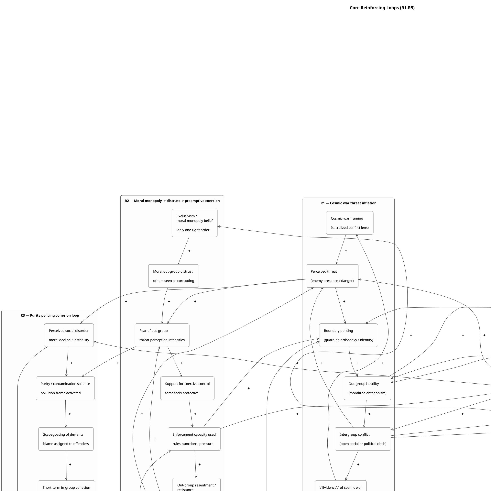
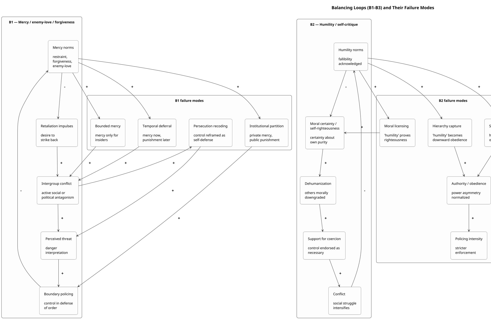
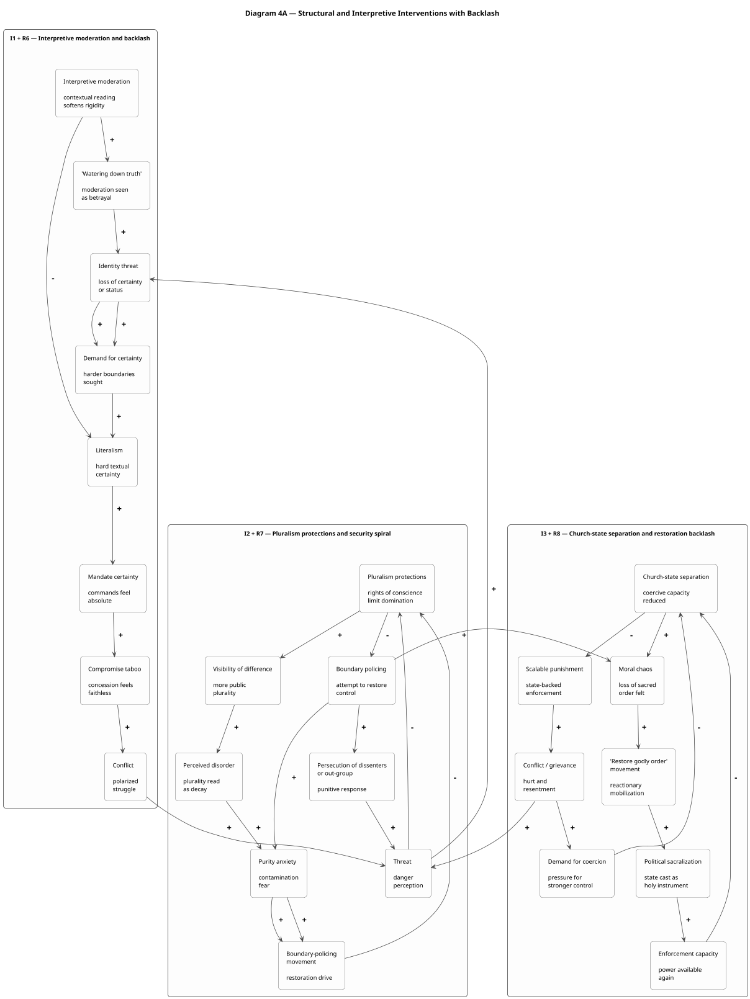
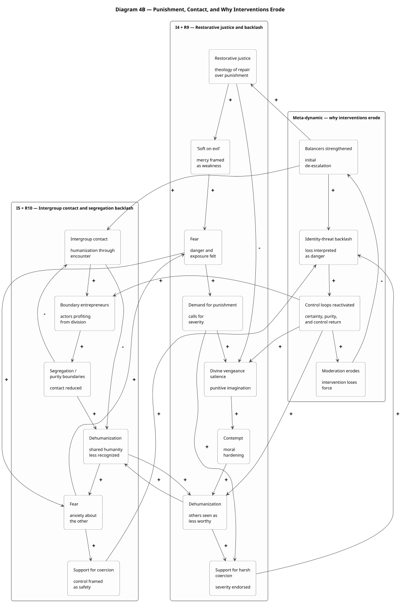

# Causal Loop Diagrams

## Diagram 1 — Core reinforcing loops (R1–R5)

## Diagram 2 — Balancing loops (B1–B3) and failure modes

## Diagram 3 — Enabling conditions that amplify loops and weaken restraints

```plantuml
@startuml
top to bottom direction
skinparam backgroundColor white
skinparam defaultFontName Arial
skinparam dpi 170
skinparam nodesep 60
skinparam ranksep 80
skinparam padding 12
skinparam ArrowColor #444444
skinparam ArrowThickness 1.25
skinparam packageStyle rectangle
skinparam ArrowFontSize 18
skinparam ArrowFontStyle bold

skinparam titleFontSize 20
skinparam packageFontSize 16
skinparam package {
  BorderColor #666666
  BackgroundColor #FAFAFA
  FontStyle bold
}

skinparam rectangle {
  BackgroundColor #FDFDFD
  BorderColor #333333
  RoundCorner 15
  FontSize 16
}

title Enabling Conditions: What Raises Gain and Weakens Balancers

package "Doctrinal absolutization" {
  rectangle "Exclusive truth claims\n\nerror becomes existential" as ETC
  rectangle "Divine command /\nscripture-as-directive\n\nobedience overrides hesitation" as DCD
  rectangle "Literalism /\ninerrancy\n\nreduced interpretive friction" as LI
}

package "Boundary criminalization" {
  rectangle "Heresy / apostasy /\nblasphemy framing\n\ndeviation treated as threat" as HAB
  rectangle "Purity / abomination\ncategories\n\ndifference moralized as contamination" as PAC
}

package "Eschatological intensification" {
  rectangle "Cosmic war +\napocalyptic urgency\n\ndisagreement sacralized" as CWAU
  rectangle "Divine vengeance /\nhell-as-justice\n\npunitive imagination sanctified" as DVH
}

package "Political sacralization" {
  rectangle "Sacred land /\nchosenness politicization\n\nterritory and identity sacralized" as SLCP
  rectangle "Missionary universalism\nunder power\n\nexpansion takes coercive form" as MU
  rectangle "Centralized orthodoxy +\nscalable enforcement\n\nideas become apparatus" as COSE
}

package "Amplified reinforcing loops" {
  rectangle "R1 gain\n\ncosmic war loop strengthens" as R1G
  rectangle "R2 gain\n\ncoercive distrust loop strengthens" as R2G
  rectangle "R3 gain\n\npurity-policing loop strengthens" as R3G
  rectangle "R4 gain\n\nvengeance loop strengthens" as R4G
  rectangle "R5 gain\n\ncertainty / literalism loop strengthens" as R5G
}

package "Weakened balancing loops" {
  rectangle "B1 effectiveness\n(mercy)\n\nlower ability to damp retaliation" as B1E
  rectangle "B2 effectiveness\n(humility)\n\nlower ability to check certainty" as B2E
  rectangle "B3 effectiveness\n(nonviolence)\n\nlower ability to restrain force" as B3E
}

ETC --> R1G : +
ETC --> R2G : +
ETC --> B2E : -

DCD --> R3G : +
DCD --> R5G : +

LI --> R3G : +
LI --> R5G : +

HAB --> R2G : +
HAB --> B1E : -

PAC --> R3G : +
PAC --> B1E : -
PAC --> B3E : -

CWAU --> R1G : +
CWAU --> R5G : +
CWAU --> B1E : -
CWAU --> B2E : -
CWAU --> B3E : -

DVH --> R4G : +
DVH --> B1E : -

SLCP --> R1G : +

MU --> R2G : +
MU --> R3G : +

COSE --> R2G : +
COSE --> R3G : +
COSE --> B2E : -

@enduml
```

## Diagram 4A — Structural and interpretive interventions with backlash

## Diagram 4B — Punishment, contact, and intervention erosion

