# Causal Loop Diagrams — Mermaid Conversion

## Diagram 1 — Core reinforcing loops (R1–R5)

```mermaid
flowchart TB
  %% Core Reinforcing Loops (R1–R5)
  classDef node fill:#FDFDFD,stroke:#333333,stroke-width:1px;
  subgraph SG1_1["R1 — Cosmic war threat inflation"]
    CWF["Cosmic-war framing<br/><br/>(sacralized conflict lens)"]
    PT["Perceived threat<br/><br/>(enemy presence / danger)"]
    BP["Boundary policing<br/><br/>(guarding orthodoxy / identity)"]
    OGH["Out-group hostility<br/><br/>(moralized antagonism)"]
    IGC["Intergroup conflict<br/><br/>(open social or political clash)"]
    EVCW["Evidence" of cosmic war<br/><br/> (conflict re-read as proof)"]
  end
  subgraph SG1_2["R2 — Moral monopoly -&gt; distrust -&gt; preemptive coercion"]
    EX["Exclusivism /<br/>moral monopoly belief<br/><br/>&#x27;only one right order&#x27;"]
    MOD["Moral out-group distrust<br/><br/>others seen as corrupting"]
    FOG["Fear of out-group<br/><br/>threat perception intensifies"]
    SCC["Support for coercive control<br/><br/>force feels protective"]
    ECU["Enforcement capacity used<br/><br/>rules, sanctions, pressure"]
    OGR["Out-group resentment /<br/>resistance<br/><br/>backlash to control"]
    TS["Threat signals<br/><br/>resentment read as danger"]
  end
  subgraph SG1_3["R3 — Purity policing cohesion loop"]
    PSD["Perceived social disorder<br/><br/>moral decline / instability"]
    PCS["Purity / contamination salience<br/><br/>pollution frame activated"]
    SCD["Scapegoating of deviants<br/><br/>blame assigned to offenders"]
    SIGC["Short-term in-group cohesion<br/><br/>unity through exclusion"]
    LL["Leader legitimacy<br/><br/>authority strengthened"]
    CPP["Capacity to police purity<br/><br/>organizational readiness"]
    PPI["Purity policing intensity<br/><br/>stronger enforcement"]
  end
  subgraph SG1_4["R4 — Outsourced vengeance / deferred revenge"]
    HG["Harm / grievance<br/><br/>injury, humiliation, loss"]
    AN["Anger<br/><br/>affective escalation"]
    DVS["Divine vengeance salience<br/><br/>punishment imagined as just"]
    MCC["Moral certainty /<br/>contempt<br/><br/>opponent judged absolutely"]
    DH["Dehumanization<br/><br/>reduced moral standing"]
    WSHP["Willingness to support<br/>harsh punishment<br/><br/>severity normalized"]
    IC["Institutional coercion<br/><br/>punishment through systems"]
  end
  subgraph SG1_5["R5 — Literalism / hard commands escalation"]
    LIT["Literalism /<br/>inerrancy intensity<br/><br/>low interpretive flexibility"]
    PDMC["Perceived divine<br/>mandate certainty<br/><br/>certainty of command"]
    CT["Compromise taboo<br/><br/>concession feels sinful"]
    POL["Polarization<br/><br/>positions harden"]
    CON["Conflict<br/><br/>social confrontation"]
    IT["Identity threat<br/><br/>self-understanding destabilized"]
    DFC["Demand for certainty<br/><br/>people seek harder answers"]
  end

  CWF -->|+| PT
  PT -->|+| BP
  BP -->|+| OGH
  OGH -->|+| IGC
  IGC -->|+| EVCW
  EVCW -->|+| CWF
  EX -->|+| MOD
  MOD -->|+| FOG
  FOG -->|+| SCC
  SCC -->|+| ECU
  ECU -->|+| OGR
  OGR -->|+| TS
  TS -->|+| FOG
  PSD -->|+| PCS
  PCS -->|+| SCD
  SCD -->|+| SIGC
  SIGC -->|+| LL
  LL -->|+| CPP
  CPP -->|+| PPI
  PPI -->|+| PSD
  HG -->|+| AN
  AN -->|+| DVS
  DVS -->|+| MCC
  MCC -->|+| DH
  DH -->|+| WSHP
  WSHP -->|+| IC
  IC -->|+| HG
  LIT -->|+| PDMC
  PDMC -->|+| CT
  CT -->|+| POL
  POL -->|+| CON
  CON -->|+| IT
  IT -->|+| DFC
  DFC -->|+| LIT
  IGC -->|+| PT
  IGC -->|+| HG
  IGC -->|+| CON
  PT -->|+| FOG
  PT -->|+| PSD
  ECU -->|+| BP
  ECU -->|+| IC
  OGH -->|+| DH
  DH -->|+| OGH
  IC -->|+| IGC
  IC -->|+| PSD
  PPI -->|+| BP
  PPI -->|+| ECU
  FOG -->|+| PCS
  TS -->|+| PT
  POL -->|+| BP
  POL -->|+| OGH
  MCC -->|+| CT
  DVS -->|+| CT
  IT -->|+| PT
  DFC -->|+| EX

  class CWF,PT,BP,OGH,IGC,EVCW,EX,MOD,FOG,SCC,ECU,OGR,TS,PSD,PCS,SCD,SIGC,LL,CPP,PPI,HG,AN,DVS,MCC,DH,WSHP,IC,LIT,PDMC,CT,POL,CON,IT,DFC node;
```

## Diagram 2 — Balancing loops (B1–B3) and failure modes

```mermaid
flowchart TB
  %% Balancing Loops (B1–B3) and Their Failure Modes
  classDef node fill:#FDFDFD,stroke:#333333,stroke-width:1px;
  subgraph SG2_1["B1 — Mercy / enemy-love / forgiveness"]
    MN["Mercy norms<br/><br/>restraint,<br/>forgiveness,<br/>enemy-love"]
    RI["Retaliation impulses<br/><br/>desire to<br/>strike back"]
    IGC["Intergroup conflict<br/><br/>active social or<br/>political antagonism"]
    PT["Perceived threat<br/><br/>danger<br/>interpretation"]
    BP["Boundary policing<br/><br/>control in defense<br/>of order"]
  end
  subgraph SG2_2["B1 failure modes"]
    BM["Bounded mercy<br/><br/>mercy only for<br/>insiders"]
    IP["Institutional partition<br/><br/>private mercy,<br/>public punishment"]
    TD["Temporal deferral<br/><br/>mercy now,<br/>punishment later"]
    PR["Persecution recoding<br/><br/>control reframed as<br/>self-defense"]
  end
  subgraph SG2_3["B2 — Humility / self-critique"]
    HN["Humility norms<br/><br/>fallibility<br/>acknowledged"]
    MCSR["Moral certainty /<br/>self-righteousness<br/><br/>certainty about<br/>own purity"]
    DH["Dehumanization<br/><br/>others morally<br/>downgraded"]
    SFC["Support for coercion<br/><br/>control endorsed as<br/>necessary"]
    CON["Conflict<br/><br/>social struggle<br/>intensifies"]
  end
  subgraph SG2_4["B2 failure modes"]
    ML["Moral licensing<br/><br/>&#x27;humility&#x27; proves<br/>righteousness"]
    HC["Hierarchy capture<br/><br/>&#x27;humility&#x27; becomes<br/>downward obedience"]
    SA["Selective application<br/><br/>humility demanded<br/>of subordinates"]
    AO["Authority / obedience<br/><br/>power asymmetry<br/>normalized"]
    PI["Policing intensity<br/><br/>stricter<br/>enforcement"]
  end
  subgraph SG2_5["B3 — Nonviolence / sanctity-of-life"]
    NV["Nonviolence norms<br/><br/>violence morally<br/>restrained"]
    LVM["Legitimacy of<br/>violent means<br/><br/>force seen as<br/>permissible"]
    V["Violence<br/><br/>actual coercive<br/>action"]
    G["Grievance<br/><br/>hurt and backlash<br/>accumulate"]
  end
  subgraph SG2_6["B3 failure modes"]
    RC["Reclassification<br/><br/>violence renamed<br/>&#x27;justice&#x27; or &#x27;defense&#x27;"]
    DV["Delegation to state /<br/>militia / divine violence<br/><br/>outsourced force"]
    AU["Apocalyptic urgency<br/><br/>emergency<br/>mentality"]
    EO["Emergency override<br/><br/>normal restraint<br/>suspended"]
  end

  MN -->|-| RI
  RI -->|+| IGC
  IGC -->|+| PT
  PT -->|+| BP
  BP -->|-| MN
  MN -->|+| BM
  BM -->|+| IGC
  MN -->|+| IP
  IP -->|+| BP
  MN -->|+| TD
  TD -->|+| IGC
  IGC -->|+| PR
  PR -->|+| PT
  HN -->|-| MCSR
  MCSR -->|+| DH
  DH -->|+| SFC
  SFC -->|+| CON
  CON -->|-| HN
  HN -->|+| ML
  ML -->|+| MCSR
  HN -->|+| HC
  HC -->|+| AO
  AO -->|+| PI
  HN -->|+| SA
  SA -->|+| AO
  NV -->|-| LVM
  LVM -->|+| V
  V -->|+| G
  G -->|-| NV
  NV -->|+| RC
  RC -->|+| LVM
  NV -->|+| DV
  DV -->|+| V
  AU -->|+| EO
  EO -->|+| LVM

  class MN,RI,IGC,PT,BP,BM,IP,TD,PR,HN,MCSR,DH,SFC,CON,ML,HC,SA,AO,PI,NV,LVM,V,G,RC,DV,AU,EO node;
```



## Diagram 3 — Enabling conditions that amplify loops and weaken restraints

```mermaid
flowchart TB
  %% Enabling Conditions: What Raises Gain and Weakens Balancers
  classDef node fill:#FDFDFD,stroke:#333333,stroke-width:1px;
  subgraph SG3_1["Doctrinal absolutization"]
    ETC["Exclusive truth claims<br/><br/>error becomes existential"]
    DCD["Divine command /<br/>scripture-as-directive<br/><br/>obedience overrides hesitation"]
    LI["Literalism /<br/>inerrancy<br/><br/>reduced interpretive friction"]
  end
  subgraph SG3_2["Boundary criminalization"]
    HAB["Heresy / apostasy /<br/>blasphemy framing<br/><br/>deviation treated as threat"]
    PAC["Purity / abomination<br/>categories<br/><br/>difference moralized as contamination"]
  end
  subgraph SG3_3["Eschatological intensification"]
    CWAU["Cosmic war +<br/>apocalyptic urgency<br/><br/>disagreement sacralized"]
    DVH["Divine vengeance /<br/>hell-as-justice<br/><br/>punitive imagination sanctified"]
  end
  subgraph SG3_4["Political sacralization"]
    SLCP["Sacred land /<br/>chosenness politicization<br/><br/>territory and identity sacralized"]
    MU["Missionary universalism<br/>under power<br/><br/>expansion takes coercive form"]
    COSE["Centralized orthodoxy +<br/>scalable enforcement<br/><br/>ideas become apparatus"]
  end
  subgraph SG3_5["Amplified reinforcing loops"]
    R1G["R1 gain<br/><br/>cosmic war loop strengthens"]
    R2G["R2 gain<br/><br/>coercive distrust loop strengthens"]
    R3G["R3 gain<br/><br/>purity-policing loop strengthens"]
    R4G["R4 gain<br/><br/>vengeance loop strengthens"]
    R5G["R5 gain<br/><br/>certainty / literalism loop strengthens"]
  end
  subgraph SG3_6["Weakened balancing loops"]
    B1E["B1 effectiveness<br/>(mercy)<br/><br/>lower ability to damp retaliation"]
    B2E["B2 effectiveness<br/>(humility)<br/><br/>lower ability to check certainty"]
    B3E["B3 effectiveness<br/>(nonviolence)<br/><br/>lower ability to restrain force"]
  end

  ETC -->|+| R1G
  ETC -->|+| R2G
  ETC -->|-| B2E
  DCD -->|+| R3G
  DCD -->|+| R5G
  LI -->|+| R3G
  LI -->|+| R5G
  HAB -->|+| R2G
  HAB -->|-| B1E
  PAC -->|+| R3G
  PAC -->|-| B1E
  PAC -->|-| B3E
  CWAU -->|+| R1G
  CWAU -->|+| R5G
  CWAU -->|-| B1E
  CWAU -->|-| B2E
  CWAU -->|-| B3E
  DVH -->|+| R4G
  DVH -->|-| B1E
  SLCP -->|+| R1G
  MU -->|+| R2G
  MU -->|+| R3G
  COSE -->|+| R2G
  COSE -->|+| R3G
  COSE -->|-| B2E

  class ETC,DCD,LI,HAB,PAC,CWAU,DVH,SLCP,MU,COSE,R1G,R2G,R3G,R4G,R5G,B1E,B2E,B3E node;
```



## Diagram 4A — Structural and interpretive interventions with backlash

```mermaid
flowchart TB
  %% Diagram 4A — Structural and Interpretive Interventions with Backlash
  classDef node fill:#FDFDFD,stroke:#333333,stroke-width:1px;
  subgraph SG4_1["I1 + R6 — Interpretive moderation and backlash"]
    IM["Interpretive moderation<br/><br/>contextual reading<br/>softens rigidity"]
    LIT["Literalism<br/><br/>hard textual<br/>certainty"]
    MC["Mandate certainty<br/><br/>commands feel<br/>absolute"]
    CT["Compromise taboo<br/><br/>concession feels<br/>faithless"]
    CON["Conflict<br/><br/>polarized<br/>struggle"]
    WDT["&#x27;Watering down truth&#x27;<br/><br/>moderation seen<br/>as betrayal"]
    IT["Identity threat<br/><br/>loss of certainty<br/>or status"]
    DFC["Demand for certainty<br/><br/>harder boundaries<br/>sought"]
  end
  subgraph SG4_2["I2 + R7 — Pluralism protections and security spiral"]
    PP["Pluralism protections<br/><br/>rights of conscience<br/>limit domination"]
    BP["Boundary policing<br/><br/>attempt to restore<br/>control"]
    PDO["Persecution of dissenters<br/>or out-group<br/><br/>punitive response"]
    TH["Threat<br/><br/>danger<br/>perception"]
    VOD["Visibility of difference<br/><br/>more public<br/>plurality"]
    PD["Perceived disorder<br/><br/>plurality read<br/>as decay"]
    PA["Purity anxiety<br/><br/>contamination<br/>fear"]
    BPM["Boundary-policing<br/>movement<br/><br/>restoration drive"]
  end
  subgraph SG4_3["I3 + R8 — Church-state separation and restoration backlash"]
    CSS["Church-state separation<br/><br/>coercive capacity<br/>reduced"]
    SP["Scalable punishment<br/><br/>state-backed<br/>enforcement"]
    CG["Conflict / grievance<br/><br/>hurt and<br/>resentment"]
    DFC2["Demand for coercion<br/><br/>pressure for<br/>stronger control"]
    PMC["Moral chaos<br/><br/>loss of sacred<br/>order felt"]
    RGOM["&#x27;Restore godly order&#x27;<br/>movement<br/><br/>reactionary<br/>mobilization"]
    PS["Political sacralization<br/><br/>state cast as<br/>holy instrument"]
    EC["Enforcement capacity<br/><br/>power available<br/>again"]
  end

  IM -->|-| LIT
  LIT -->|+| MC
  MC -->|+| CT
  CT -->|+| CON
  IM -->|+| WDT
  WDT -->|+| IT
  IT -->|+| DFC
  DFC -->|+| LIT
  PP -->|-| BP
  BP -->|+| PDO
  PDO -->|+| TH
  TH -->|-| PP
  PP -->|+| VOD
  VOD -->|+| PD
  PD -->|+| PA
  PA -->|+| BPM
  BPM -->|-| PP
  CSS -->|-| SP
  SP -->|+| CG
  CG -->|+| DFC2
  DFC2 -->|-| CSS
  CSS -->|+| PMC
  PMC -->|+| RGOM
  RGOM -->|+| PS
  PS -->|+| EC
  EC -->|-| CSS
  CON -->|+| TH
  TH -->|+| IT
  BP -->|+| PA
  BP -->|+| PMC
  CG -->|+| TH
  PA -->|+| BPM
  IT -->|+| DFC

  class IM,LIT,MC,CT,CON,WDT,IT,DFC,PP,BP,PDO,TH,VOD,PD,PA,BPM,CSS,SP,CG,DFC2,PMC,RGOM,PS,EC node;
```



## Diagram 4B — Punishment, contact, and intervention erosion

```mermaid
flowchart TB
  %% Diagram 4B — Punishment, Contact, and Why Interventions Erode
  classDef node fill:#FDFDFD,stroke:#333333,stroke-width:1px;
  subgraph SG5_1["I4 + R9 — Restorative justice and backlash"]
    RJT["Restorative justice<br/><br/>theology of repair<br/>over punishment"]
    DVS["Divine vengeance<br/>salience<br/><br/>punitive imagination"]
    CPT["Contempt<br/><br/>moral<br/>hardening"]
    DH["Dehumanization<br/><br/>others seen as<br/>less worthy"]
    SHC["Support for harsh<br/>coercion<br/><br/>severity endorsed"]
    SOE["&#x27;Soft on evil&#x27;<br/><br/>mercy framed<br/>as weakness"]
    FEAR["Fear<br/><br/>danger and<br/>exposure felt"]
    DFP["Demand for punishment<br/><br/>calls for<br/>severity"]
  end
  subgraph SG5_2["I5 + R10 — Intergroup contact and segregation backlash"]
    ICME["Intergroup contact<br/><br/>humanization through<br/>encounter"]
    DH2["Dehumanization<br/><br/>shared humanity<br/>less recognized"]
    FEAR2["Fear<br/><br/>anxiety about<br/>the other"]
    SFC["Support for coercion<br/><br/>control framed<br/>as safety"]
    BE["Boundary entrepreneurs<br/><br/>actors profiting<br/>from division"]
    SPB["Segregation /<br/>purity boundaries<br/><br/>contact reduced"]
  end
  subgraph SG5_3["Meta-dynamic — why interventions erode"]
    BS["Balancers strengthened<br/><br/>initial<br/>de-escalation"]
    ITB["Identity-threat backlash<br/><br/>loss interpreted<br/>as danger"]
    CPCR["Control loops reactivated<br/><br/>certainty, purity,<br/>and control return"]
    ME["Moderation erodes<br/><br/>intervention loses<br/>force"]
  end

  RJT -->|-| DVS
  DVS -->|+| CPT
  CPT -->|+| DH
  DH -->|+| SHC
  RJT -->|+| SOE
  SOE -->|+| FEAR
  FEAR -->|+| DFP
  DFP -->|+| DVS
  ICME -->|-| DH2
  DH2 -->|+| FEAR2
  FEAR2 -->|+| SFC
  ICME -->|+| BE
  BE -->|+| SPB
  SPB -->|-| ICME
  SPB -->|+| DH2
  BS -->|+| ITB
  ITB -->|+| CPCR
  CPCR -->|+| ME
  ME -->|-| BS
  FEAR -->|+| FEAR2
  FEAR2 -->|+| FEAR
  DFP -->|+| SHC
  DH -->|+| DH2
  DH2 -->|+| DH
  SFC -->|+| ITB
  SHC -->|+| ITB
  CPCR -->|+| DVS
  CPCR -->|+| DH
  CPCR -->|+| BE
  BS -->|+| RJT
  BS -->|+| ICME

  class RJT,DVS,CPT,DH,SHC,SOE,FEAR,DFP,ICME,DH2,FEAR2,SFC,BE,SPB,BS,ITB,CPCR,ME node;
```


