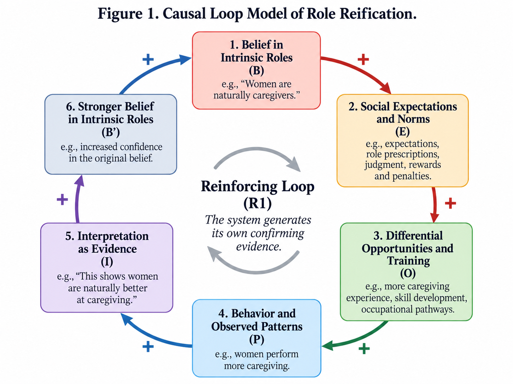

# When Roles Become Essences: The Reification of Social Responsibilities

## Table of Contents

1. [From Practical Allocation to Intrinsic Duty](#i-from-practical-allocation-to-intrinsic-duty)
2. [Responsibility Requires Reasons](#ii-responsibility-requires-reasons)
3. [The Essentialist Substitution](#iii-the-essentialist-substitution)
4. [Legitimation Narratives and Inscrutable Authority](#iv-legitimation-narratives-and-inscrutable-authority)
5. [How the System Manufactures Its Own Evidence](#v-how-the-system-manufactures-its-own-evidence)
6. [Epistemic Closure and the Diagnostic Test](#vi-epistemic-closure-and-the-diagnostic-test)
7. [Roles Should Remain Answerable to Reasons](#vii-roles-should-remain-answerable-to-reasons)

This essay examines a recurring pattern in the justification of social roles: a practical or historically contingent division of responsibility is reified into an intrinsic duty attached to a category of person. Instead of asking which allocation is justified by ability, consent, fairness, comparative advantage, circumstance, or other relevant considerations, essentialist reasoning treats identity itself as the source of obligation. The argument develops this pattern from several directions: the gap between descriptive facts and normative conclusions, the use of naturalizing or authoritative legitimation narratives, and the concealed interpretive structures that often support appeals to tradition or divine command. It then models the phenomenon as a reinforcing causal loop in which role beliefs shape expectations, opportunities, and behavior, thereby producing the very observations later cited as evidence for those beliefs. The central diagnostic is whether a role remains revisable when the reasons and evidence surrounding it change. The broader claim is that differentiated responsibilities can be justified, but they should remain answerable to reasons rather than becoming self-justifying properties of identity.

## I. From Practical Allocation to Intrinsic Duty

Consider an ordinary household question: who should cook dinner? On its face, this is a practical problem of allocating responsibility. One person may have more time, another may enjoy cooking more, one may be exhausted, or both may prefer to cook together. The arrangement can change from day to day because the reasons that support it can also change. Nothing about the task itself requires that it permanently belong to one person. Yet in many social contexts, this practical question is transformed into something very different: *the wife should cook because cooking is the wife’s responsibility*. What began as a question about how to divide labor has become a claim about what a certain kind of person is intrinsically obligated to do.

The problem is not merely that such an assignment may be unequal or inconvenient. It is that the structure of the reasoning has changed. Instead of asking which considerations justify assigning a task to one person rather than another, the obligation is derived from membership in a social category. The category—wife, husband, woman, man, parent, elder, or some other role—is treated as if it contains its own normative instructions. A contingent arrangement is thereby **reified into an intrinsic duty**: something that could have been justified by circumstance, preference, agreement, ability, or fairness is instead presented as a property of the role itself.

This move is easy to overlook because it often appears in familiar essentialist vocabulary. An arrangement is described as “natural,” “proper,” “traditional,” “masculine,” “feminine,” or simply “the role” of the person in question. But such language can create the appearance of explanation without supplying one. To say that a wife should cook because cooking is “the wife’s role” does not yet explain why wifehood should generate that obligation. It merely redescribes the proposed allocation in normative terms. The central problem of this essay is therefore not division of labor as such, but a particular way of justifying it: the conversion of historically or situationally contingent responsibilities into supposedly intrinsic obligations, and the tendency of those obligations to become insulated from the ordinary demand that responsibilities remain answerable to reasons.

## II. Responsibility Requires Reasons

To see what the essentialist move leaves out, it helps to begin with the more general problem that any division of labor must solve. A more defensible way to think about responsibility begins with a practical question: given some objective or need, a set of people, and a set of constraints, how should the relevant tasks be distributed? Framed this way, responsibility is not treated as something that simply inheres in a social category. It is allocated by reference to reasons. Those reasons may include ability, available time, preference, prior commitments, fairness, urgency, comparative advantage, reciprocity, or voluntary agreement. Different principles may sometimes conflict, and no single criterion will resolve every case. What matters is that the allocation remains responsive to the facts that are supposed to justify it.

This distinction becomes especially clear when physical or biological constraints are involved. Suppose a couple decides that their infant will be breastfed. In that case, biology places a real constraint on who can directly perform the act of breastfeeding. The feasible set of actions is not identical for both partners. But that fact does not, by itself, settle the entire distribution of responsibility surrounding infant care. It does not determine who should wake during the night, prepare bottles, clean equipment, soothe the child, manage other household work, or compensate for the unequal physical burden involved. A physical constraint can narrow the available options without yielding a complete theory of obligation.

This is an instance of a broader distinction between descriptive facts and normative conclusions. Facts about what people can do, tend to do, or have historically done do not automatically establish what they ought to do. Additional principles are required to bridge that gap. A difference in capacity may be relevant to an allocation, but its normative significance depends on what other values are in play: fairness, consent, efficiency, welfare, reciprocity, or some other principle. The mere existence of a difference does not dictate the form that responsibility must take.

The same is true of less biologically constrained tasks. If one partner is a better cook, that may provide a reason for that person to cook more often. If the other partner has more free time, that may point in the opposite direction. If both dislike cooking equally, perhaps they alternate, simplify meals, or divide the work in some other way. A good allocation can therefore be situational and revisable. Its justification is tied to the circumstances that support it. When those circumstances change, the arrangement can change as well.

This is what makes reason-responsive allocation fundamentally different from intrinsic-role reasoning. In the former, duties are justified by principles that remain open to examination and revision. In the latter, the category itself is treated as sufficient explanation. The next question, then, is how this substitution occurs: how a practical problem of task allocation gets transformed into an essentialist claim about what a person, by virtue of what they are, must do.

## III. The Essentialist Substitution

Once responsibility is understood as something that should be allocated by reference to reasons, the essentialist alternative becomes easier to isolate. The essentialist move can be stated in a simple argumentative form:

> Person X belongs to category A.  
> Members of category A intrinsically bear responsibility Y.  
> Therefore, X ought to perform Y.

The crucial premise is the second one. It does nearly all of the normative work, yet it is often the least examined. Once accepted, the ordinary considerations that might otherwise govern the allocation of responsibility become secondary. A wife may work longer hours than her husband, dislike cooking, have less experience with it, or simply prefer another arrangement. None of these facts necessarily matter if “wife” is already taken to imply “the person who ought to cook.” The social category has become sufficient to determine the duty.

This is different from merely using categories as rough sources of information. Categories can sometimes track facts that are genuinely relevant. A licensed surgeon and a layperson are not interchangeable when performing surgery because the category “surgeon” ordinarily corresponds to specialized training and competence. But even here, the category matters because of independently intelligible considerations: expertise, safety, certification, and ability. If those underlying considerations disappeared, the label alone would have little normative force. Essentialist reasoning reverses this relation. Instead of the category functioning as shorthand for relevant reasons, the category itself becomes the reason.

The resulting vocabulary can conceal how little justification has actually been supplied. Terms such as “natural,” “proper,” “traditional,” “masculine,” “feminine,” or “the role of a wife” can appear explanatory while simply restating the conclusion in a different form. Asked why a wife should cook, one is told that cooking is the wife’s role. Asked why it is her role, one is told that this is simply what wives are supposed to do. The language of intrinsic responsibility gives the allocation an air of inevitability without identifying the principle that makes the allocation appropriate.

In this sense, essentialism performs a kind of **normative information compression**. A complicated practical problem can involve time, ability, preference, fairness, opportunity cost, prior commitments, and changing circumstances. The essentialist framework compresses these variables into a single question: *what kind of person are you?* Once category membership is treated as dispositive, much of the information that would ordinarily matter is discarded. The practical problem is no longer solved by weighing competing reasons; it is settled by classification.

The assigned role can then become **lexically prior** to other considerations. Before asking what arrangement is fair, efficient, consensual, or responsive to present circumstances, the essentialist framework first determines what each kind of person supposedly owes by virtue of identity. Other considerations may be permitted to modify the details, but they are not ordinarily allowed to overturn the underlying allocation. A husband might occasionally cook because his wife is sick, for example, while the claim that cooking remains fundamentally *her* responsibility is left intact. Circumstance produces an exception rather than a reconsideration of the rule.

This helps explain why essentialist role claims are often unusually resistant to counterexamples. If a justification rests on comparative advantage, evidence that the supposed advantage has disappeared should weaken the justification. If it rests on available time, a change in schedules should matter. If it rests on voluntary agreement, withdrawal of that agreement should matter. But if the justification rests on an allegedly intrinsic role, the relevant facts can change without disturbing the conclusion. The argument has detached the obligation from the circumstances that would normally make an allocation reasonable.

The central substitution is therefore not merely one bad reason among many. It is a replacement of one mode of practical reasoning with another: **reason-responsive allocation is displaced by identity-derived obligation**. Once that substitution is made, the inherited role no longer appears as one possible arrangement requiring justification. It begins to appear as the normative baseline against which all deviations must explain themselves.

## IV. Legitimation Narratives and Inscrutable Authority

Treating category membership as a source of obligation does not eliminate the need for justification; it merely pushes that need back a level. Once a social arrangement has been reified into an intrinsic role, it still requires some account of why that role should command obedience. This is where **legitimation narratives** often enter. A legitimation narrative does not necessarily explain how an arrangement arose, nor does it independently establish why the arrangement is morally justified. Its function is instead to make the existing order appear natural, proper, necessary, or authoritative.

This distinction between explanation and legitimation is important. A particular division of labor may have emerged because of historical conditions involving property law, labor markets, technology, pregnancy, inheritance, economic dependence, political power, or customary practice. These are causal explanations. But explaining why an arrangement developed is different from showing why it ought to continue. The fact that a social order has existed for a long time does not itself supply a normative principle in its favor.

Legitimation narratives can obscure that gap by redescribing the inherited arrangement in idealized terms. Women are said to be naturally nurturing; men are said to be natural providers; the two roles are described as complementary; the resulting division is presented as the proper order of family life. Such claims may contain descriptive elements, but their argumentative role is often normative. They convert a contingent social pattern into an account of what each category of person is supposedly *for*. What might otherwise appear as one historically produced arrangement among several possibilities is recast as an expression of human nature.

Religious justifications can exhibit a related structure. Consider the claim that a certain responsibility belongs to women because God assigned it to them. This argument need not be formally circular. If one independently accepts both divine authority and the reliability of some source as a revelation of divine commands, then “God commands X” can function as a premise in a coherent argument for obligation. The deeper difficulty emerges when one asks why this particular role exists, or how one knows that the command has been correctly identified.

At that point, the justification may terminate in an appeal to **inscrutable authority**: the role is obligatory because God wills it, while the reasons for that divine will remain inaccessible. This may be acceptable within some theological systems, but it changes the character of the justification. The obligation is no longer defended by reasons that can be evaluated in relation to fairness, consequences, consent, capacity, or changing circumstances. Its force depends on submission to an authority whose underlying rationale may not be available for examination.

There is also an epistemic complication. Claims such as “God assigned this role” rarely arrive without mediation. They depend on texts, translations, interpretive traditions, theological frameworks, institutional authorities, historical assumptions, and judgments about which passages are literal, contextual, symbolic, universal, or time-bound. The apparently simple command therefore rests on a **concealed interpretive structure**. Disagreement can arise not only over whether divine authority should be accepted, but over whether the alleged command has been correctly reconstructed in the first place.

This problem is broader than religion. Traditional, familial, cultural, and institutional authorities can all function in the same way. An arrangement is defended because “this is how it has always been done,” because “this is what a proper husband does,” or because “this is the role expected of a woman.” In each case, the inherited norm is treated as if its authority relieved it of the need for further justification.

The result is a shift from **reason-responsive allocation to authority-responsive allocation**. Instead of asking what considerations justify assigning a responsibility here and now, the question becomes whether the assignment conforms to an accepted source of authority. Once that shift occurs, the role can become insulated from the very circumstances that would otherwise bear on whether the allocation remains sensible. The arrangement persists not because its reasons continue to hold, but because the narrative surrounding it has made continued obedience appear self-justifying.

## V. How the System Manufactures Its Own Evidence

Legitimation narratives help explain how an inherited arrangement is defended, but they do not yet explain how it can come to look empirically self-evident. Essentialist role claims are often resilient not only because they appeal to identity, tradition, or authority, but because they can generate the very patterns of behavior later cited as evidence in their favor. What begins as a belief about the intrinsic characteristics of a social category can shape expectations, opportunities, training, and behavior. Those effects then become observable social facts, which are interpreted as confirmation that the original belief was correct. The result is not merely a circular argument in the abstract, but a **reinforcing causal loop** in which the belief participates in producing its own apparent evidence.

The model can be represented using six stages.

**B — Belief in intrinsic roles.** This is the degree to which a social category is believed to possess some inherent trait or corresponding duty. An example would be the belief that women are naturally more suited to caregiving, or that caregiving is therefore properly a feminine responsibility.

**E — Social expectations and norms.** Essentialist beliefs generate expectations about how members of the category ought to behave. These expectations can take the form of explicit prescriptions, informal judgments, praise for conformity, criticism for deviation, or assumptions about what responsibilities should normally be assigned to whom.

**O — Differential opportunities and training.** Expectations influence the opportunities, experiences, and forms of training that people receive. If women are expected to be caregivers, they may be given more caregiving responsibilities from an early age, receive more practice in domestic or emotional labor, or be channeled toward occupations and family roles in which those skills are developed.

**P — Behavior and observed patterns.** Differential opportunities and experience produce actual differences in behavior. Members of the category may perform the relevant task more often, become more practiced at it, or appear more comfortable and competent in the role. At this point, the social system has produced an empirical pattern that observers can genuinely see.

**I — Interpretation as evidence.** The observed pattern is then interpreted as evidence of an underlying intrinsic difference. If women perform more caregiving and appear more experienced at it, the pattern may be read as evidence that women are naturally more nurturing or inherently better suited to caregiving.

**B′ — Stronger belief in intrinsic roles.** This interpretation increases confidence in the original essentialist belief. What began as an assumption has now acquired the appearance of empirical confirmation. The strengthened belief feeds back into the same expectations that generated the pattern in the first place.

The primary causal structure can therefore be represented as:

**B → E → O → P → I → B′ → B**

Each link is positive in the system-dynamics sense. A positive causal relationship does not mean that the effect is morally good or desirable; it means that, all else being equal, an increase in one variable tends to produce an increase in the next, while a decrease tends to produce a decrease.

The individual relationships are as follows:

**B → E (+):** stronger belief in intrinsic roles increases the strength of role expectations and social prescriptions.

**E → O (+):** stronger expectations increase the degree to which opportunities, training, experience, and responsibilities are distributed according to the role.

**O → P (+):** greater differential experience increases the likelihood of observable role-consistent behavior and differences in proficiency.

**P → I (+):** more visible role-consistent behavior increases the amount of material available to be interpreted as evidence for the original belief.

**I → B′ (+):** stronger essentialist interpretation increases confidence in the belief that the category possesses the relevant intrinsic trait.

**B′ → B (+):** increased confidence reinforces and reproduces the original belief, allowing the process to begin again with greater social force.

Because the loop contains only positive causal links, it is a **reinforcing loop**, which can be labeled **R1: Self-Confirming Role Production**. Reinforcing loops amplify an initial condition rather than counteract it. A stronger initial belief tends to generate stronger expectations, stronger differentiation of experience, more visible behavioral differences, and ultimately stronger belief.

The sequence is important because it reveals how a normative claim can gradually acquire the appearance of a descriptive fact. The process may begin with a statement about what members of a category *ought* to do. That prescription alters the distribution of opportunities and responsibilities, which then affects what members of the category *actually tend to do*. The resulting behavioral pattern is interpreted as evidence of what members of the category *are*. That supposed fact about their nature is then used to justify what they *ought* to do.

The movement can therefore be summarized as:

**what people ought to do → what people tend to do → what people supposedly are → what people ought to do**

This progression quietly collapses three different kinds of claims: normative prescriptions, empirical observations, and metaphysical claims about intrinsic nature. The fact that a behavioral difference is observable does not establish that the difference existed independently of the social structure that produced it. Yet once the causal history of the observation disappears from view, the resulting pattern can appear to validate the very theory that helped create it.

Consider caregiving. If women are widely believed to be natural caregivers, they may receive more caregiving responsibilities throughout childhood and adulthood. They therefore accumulate more experience, develop greater competence, and may organize their lives around the expectation that they will continue performing that work. An observer can then truthfully notice that women, on average within that social setting, perform more caregiving and may possess greater caregiving experience. The error occurs when this socially produced pattern is treated as independent evidence that caregiving is intrinsically feminine.

The system therefore **generates its own confirming evidence**. The evidence is not necessarily fabricated; the observed behavioral pattern may be entirely real. What is misleading is the inference from the existence of the pattern to an intrinsic explanation of the pattern while ignoring the role that social expectations played in producing it.

This is also why the process can become epistemically resistant. Evidence consistent with the norm is easily incorporated into the essentialist explanation: women who display caregiving skill are taken as examples of feminine nature. Counterexamples, however, can often be dismissed as exceptions, deviations, failures of socialization, or atypical individuals. The system thus creates an asymmetry in how evidence is interpreted. Conforming cases strengthen the rule, while nonconforming cases need not weaken it to the same degree.

Several features of the loop are therefore worth emphasizing. First, it is **self-reinforcing**: the initial belief increases the conditions that make the belief appear true. Second, it **conflates description with norm**: what people are socially induced to do becomes evidence of what they naturally are, which becomes a reason for what they should do. Third, it is **contingent but self-stabilizing**: the arrangement may have originated under particular historical or social conditions, yet the feedback loop can make it appear natural and timeless. Finally, it is **epistemically resistant** because the system helps determine both which patterns become visible and how those patterns are interpreted.

This is what makes the phenomenon more powerful than a simple logical fallacy. A circular argument merely repeats its conclusion among its premises. A self-reinforcing social system can alter behavior, institutions, expectations, and experience in ways that make its assumptions progressively more plausible. The social order does not merely assert its own justification; it can gradually produce a world that seems to confirm it.

## VI. Epistemic Closure and the Diagnostic Test

The reinforcing loop explains how a role can generate confirming evidence; the next question is what happens when contrary evidence appears. The same structure also helps explain why intrinsic-role reasoning can become **epistemically closed**. A belief is epistemically open when evidence and changing circumstances can count meaningfully for or against it. By contrast, a role claim becomes epistemically closed when the considerations that would ordinarily justify revising it are prevented from doing so. The conclusion is preserved even as the facts around it change.

This difference can be seen by comparing intrinsic-role reasoning with more ordinary forms of responsibility allocation. If one partner cooks because they have more free time, then a change in schedules should matter. If one person handles finances because they have greater expertise, then a change in competence should matter. If a division of labor is based on preference, then changing preferences should matter. In each case, the arrangement is tied to the reasons that support it, and the arrangement can change when those reasons change.

Intrinsic-role reasoning behaves differently. If the justification is simply that cooking belongs to the wife because she is the wife, then changes in workload, preference, skill, income, or available time may have surprisingly little effect on the underlying judgment. The husband may temporarily cook because his wife is ill or overworked, but the deviation can be treated as an exception rather than as evidence that the original allocation lacked an intrinsic basis. The practical arrangement changes while the normative hierarchy remains intact.

This suggests a useful diagnostic question:

**What change in circumstances would make you reconsider who has this responsibility?**

The force of this question is that it tests whether the assignment is genuinely responsive to reasons. If the role is justified by comparative advantage, then a reversal in comparative advantage should matter. If it is justified by workload, then workload should matter. If it is justified by consent, then withdrawal of consent should matter. A principle that explains an allocation should also identify, at least in principle, the conditions under which the allocation would cease to be justified.

If no ordinary change in circumstances can alter the conclusion, then the justification is operating differently. The role has become **lexically prior** to the considerations that would otherwise govern the decision. Facts about fairness, preference, burden, competence, or opportunity may be acknowledged, but they are not permitted to override the identity-based assignment itself. The category determines the duty first; situational considerations are allowed only to regulate exceptions.

This is also where legitimation narratives can protect the role from disconfirmation. A counterexample need not count against the rule if it can be redescribed as a deviation from the proper order. A husband who enjoys domestic work can be treated as unusual rather than as evidence that domestic responsibility is not inherently feminine. A woman who rejects a prescribed role can be interpreted as failing to fulfill her nature rather than as evidence against the claim that the role is natural. In this way, contrary evidence is absorbed without forcing revision.

The resulting structure has an important asymmetry. Evidence that conforms to the role can be treated as confirmation, while evidence that conflicts with it can be discounted as exceptional. The belief therefore becomes difficult to falsify. It does not merely survive counterexamples; it possesses interpretive resources that convert those counterexamples into cases that leave the original framework untouched.

At this point, the reasoning has shifted from **reason-responsive allocation to authority-responsive allocation**. The question is no longer primarily whether the task assignment remains justified under present conditions, but whether it conforms to an inherited norm, identity, tradition, or authoritative doctrine. The arrangement is maintained because it is treated as the correct order, and its correctness is inferred from the very framework that declares it correct.

The diagnostic value of this distinction is substantial. It does not require assuming that every differentiated role is arbitrary or unjustified. It asks instead whether the role remains answerable to the considerations that supposedly make it reasonable. A justified division of labor should be capable of changing when the relevant reasons change. An essentialized role, by contrast, is insulated from such revision because its deepest justification lies not in circumstances but in classification.

The clearest warning sign, then, is not merely that a role is stable or traditional. Stability can be perfectly compatible with good reasons. The warning sign is that **no imaginable change in the relevant evidence is allowed to count against the allocation**. When that happens, the role is no longer being defended as the conclusion of practical reasoning. It has become part of a closed normative order in which identity determines duty and evidence is permitted only to explain exceptions.

## VII. Roles Should Remain Answerable to Reasons

The analysis now returns to the distinction with which it began: differentiated responsibilities are not themselves the problem. The problem, then, is not division of labor itself. Human cooperation almost always requires differentiated responsibilities, and many such differences are perfectly defensible. People divide tasks according to ability, time, preference, expertise, physical constraints, efficiency, fairness, reciprocity, and voluntary agreement. Some divisions may remain stable for years because the reasons supporting them remain stable. There is nothing inherently suspect about specialization.

The problem arises when the justification for a division of responsibility becomes detached from the circumstances and principles that might make it reasonable. A practical arrangement is transformed into a property of the people occupying it. What began as “this person performs this task” becomes “this kind of person performs this task,” then “this kind of person is naturally suited to this task,” and finally “this kind of person ought to perform this task.” A contingent allocation has been converted into an intrinsic obligation.

Once that transformation occurs, the burden of justification can quietly reverse. Instead of asking why a wife should be responsible for cooking, one begins asking why she is *not* cooking. The inherited allocation has become the baseline, while deviations from it require explanation. What was once one possible arrangement among many now appears to be the natural order against which alternatives must defend themselves.

This is why the distinction between **constraints, roles, and obligations** matters. Constraints can affect what actions are feasible. Social roles can provide useful conventions for coordinating activity. But neither automatically establishes an intrinsic duty. To move from a descriptive fact or inherited practice to a normative obligation requires additional principles, and those principles should themselves remain open to examination.

The same demand applies to appeals to tradition, nature, authority, and identity. Such appeals may contain relevant information, but they should not function as substitutes for justification. A tradition can tell us what people have done; it cannot, by itself, tell us what they ought to continue doing. A biological difference can constrain possibilities; it cannot independently determine the entire distribution of social responsibility. An authority can issue a rule, but questions remain about the source, interpretation, scope, and rationale of that authority. And a social category can describe a person without automatically specifying what that person owes.

A healthier approach to responsibility therefore treats roles as **reason-responsive rather than self-justifying**. The relevant question is not simply, “What is the role of a wife, husband, man, woman, parent, or child?” It is: **what reasons justify assigning this responsibility to this person under these circumstances?** If the answer appeals to considerations such as capability, fairness, consent, burden, or mutual agreement, those considerations can be examined and revised. If the answer ultimately collapses into “because that is what this kind of person is supposed to do,” then the allocation has ceased to function as the conclusion of practical reasoning and has instead become an inherited premise.

The broader danger of essentialist role reasoning is therefore not only that it can preserve unfair arrangements. It is that it obscures the need for justification altogether. By reifying contingent arrangements into intrinsic duties, it makes historical and social products appear necessary. Through self-reinforcing expectations, it can then generate behavioral patterns that seem to confirm the original belief, while legitimation narratives and appeals to authority reduce the force of counterevidence. The result is a normative order that increasingly appears to explain itself.

The central safeguard is simple: **responsibilities should remain answerable to reasons**. Any allocation may be stable, traditional, efficient, or even deeply meaningful, but it should still be possible to ask why it exists, what principles support it, what evidence bears on it, and what changes in circumstance would justify revising it. When those questions are no longer allowed to matter, a social role has stopped functioning as a practical arrangement and has become an essence.