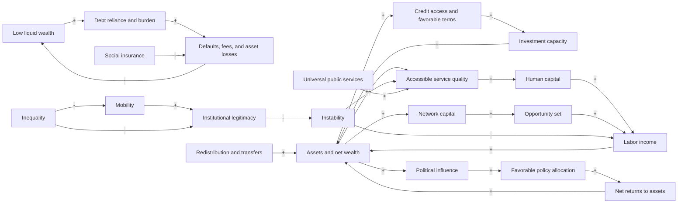

# 5. Causal-Loop Structure

A positive sign on an arrow means that, all else equal, an increase in the source tends to increase the target above what it otherwise would have been. A negative sign means that an increase in the source tends to reduce the target. A reinforcing loop amplifies change; a balancing loop counteracts change.

## 5.1 Overview causal-loop diagram



## 5.2 Reinforcing loop R1: Asset accumulation

```text
Assets
→ capital income and capital gains
→ saving and reinvestment
→ assets
```

Formally:

$$
A_g \uparrow
\Rightarrow r^A_g A_g \uparrow
\Rightarrow \text{asset acquisition}_g \uparrow
\Rightarrow A_g \uparrow.
$$

This loop does not require wealthy households to earn a higher percentage return. A larger asset base generates a larger absolute return even when rates of return are equal. Heterogeneous returns may strengthen the loop but are treated as an empirical question rather than an assumption.

## 5.3 Reinforcing loop R2: Wealth–credit–investment

```text
Assets, liquidity, and collateral
→ better approval probability and borrowing terms
→ greater feasible investment
→ higher expected income and asset accumulation
→ assets, liquidity, and collateral
```

The inverse dynamic can create a low-resource trap:

```text
Low collateral
→ limited or expensive credit
→ underinvestment or high-risk financing
→ lower expected net returns
→ low collateral
```

This loop represents the logic of imperfect capital markets developed in models of human-capital investment and occupational choice (Banerjee & Newman, 1993; Galor & Zeira, 1993).

## 5.4 Reinforcing loop R3: Service–human-capital–income

```text
Household resources
→ access to higher-quality education, health, housing, transport, and finance
→ human-capital accumulation and lower exposure to harm
→ labor income and saving
→ household resources
```

The link between resources and services operates through purchasing power, residence, travel capacity, private supplementation, local fiscal capacity, market profitability, and institutional allocation. Public provision can weaken this dependence.

## 5.5 Reinforcing loop R4: Debt and precarity

```text
Low liquid wealth
→ greater reliance on debt
→ high debt service and low shock tolerance
→ defaults, fees, forced asset sales, and service exclusion
→ lower liquid wealth
```

This loop distinguishes two roles of credit. Credit can enable productive investment, but debt can also magnify vulnerability when income is unstable or loan terms place disproportionate downside risk on borrowers.

## 5.6 Reinforcing loop R5: Political allocation

```text
Concentrated economic resources
→ political organization, access, and influence
→ favorable taxes, regulation, public allocation, and risk distribution
→ higher net returns or lower losses
→ concentrated economic resources
```

Political influence does not enter the model as a direct addition to private returns. It changes observable institutional levers, such as tax rates, transfers, public investment, labor protections, zoning, and financial regulation.

## 5.7 Reinforcing loop R6: Intergenerational persistence

```text
Parental assets, human capital, networks, and place
→ child opportunity set and protection from risk
→ child income and asset accumulation
→ resources transmitted to the following generation
```

This loop extends inheritance beyond bequests. Inter vivos transfers, education, residential location, family networks, institutional knowledge, and informal insurance all affect the next generation’s starting state.

## 5.8 Reinforcing loop R7: Inequality–legitimacy–instability

```text
Resource and opportunity inequality
→ perceived exclusion, blocked mobility, and economic precarity
→ declining institutional legitimacy
→ social, political, or economic instability
→ service deterioration, lower investment, and greater losses
→ resource inequality
```

This is a conditional loop rather than a universal law. Its strength depends on social protection, political inclusion, state capacity, identity cleavages, and institutional responsiveness.

## 5.9 Balancing loop B1: Redistribution

```text
Inequality
→ political demand for redistribution
→ taxes and transfers
→ increased lower-group resources
→ reduced inequality
```

This balancing process can be weakened by political concentration. The model therefore includes a contest between demand for equalization and the capacity of advantaged groups to prevent it.

## 5.10 Balancing loop B2: Universal public services

```text
Unequal opportunity
→ public investment and universal provision
→ improved access for disadvantaged groups
→ human-capital accumulation and mobility
→ reduced opportunity inequality
```

Universal provision partially decouples human-capital formation from household wealth.

## 5.11 Balancing loop B3: Social insurance

```text
Exposure to shocks
→ insurance and income support
→ fewer defaults, forced sales, and human-capital losses
→ greater household resilience
```

This loop reduces the debt-and-precarity process without necessarily equalizing all income or wealth.

## 5.12 Balancing loop B4: Progressive taxation and asset diffusion

```text
Wealth concentration
→ progressive taxation or asset-building policy
→ slower top accumulation and broader asset ownership
→ reduced concentration
```

Asset diffusion can include matched savings, baby bonds, homeownership support, pension access, employee ownership, or public wealth funds.

## 5.13 Balancing loop B5: Labor-market response

```text
Labor scarcity, organization, or political pressure
→ higher wages and improved employment terms
→ greater lower-group saving and lower debt reliance
→ reduced inequality
```

The strength of this loop depends on bargaining institutions, labor demand, unionization, minimum wages, employment protection, and macroeconomic conditions.

---