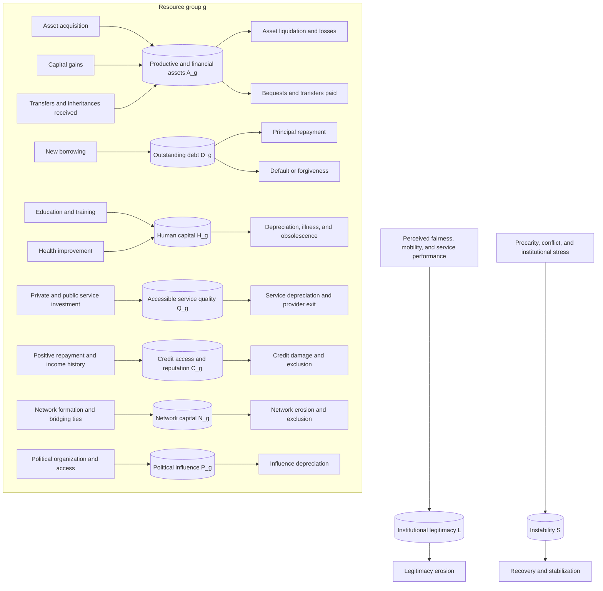

# 6. Stock–Flow Architecture

## 6.1 Evolution from the preliminary to the literature-informed model

The initial compact formulation contained the following stocks:

$$
W_g,\quad H_g,\quad Q_g,\quad C_g,\quad S.
$$

For three groups, this produced 13 stocks:

- wealth, human capital, service quality, and credit access for each group;
- one system-level instability stock.

The literature-informed model retains the basic structure but separates concepts that have different units and dynamics:

$$
A_g,\ D_g,\ H_g,\ Q_g,\ C_g,\ N_g,\ P_g,\ L,\ S.
$$

Net wealth becomes a derived variable:

$$
W_g=A_g-D_g.
$$

The extended model therefore contains seven group-specific stocks and two system-level stocks. With three groups, it contains:

$$
7(3)+2=23
$$

stocks. The compact model remains useful for exploratory analysis, while the extended model is preferable for theoretical precision.

## 6.2 Main stock–flow diagram

## 6.3 Stock definitions

| Symbol | Stock | Definition |
|---|---|---|
| $A_g$ | Assets | Productive, financial, housing, and business assets held by group $g$. |
| $D_g$ | Debt | Outstanding principal obligations of group $g$. |
| $H_g$ | Human capital | Accumulated education, skills, health, credentials, and experience. |
| $Q_g$ | Accessible service quality | Quality and practical accessibility of essential services available to the group. |
| $C_g$ | Credit access and reputation | Accumulated lender assessment, approval capacity, and financial standing. |
| $N_g$ | Network capital | Economically useful relationships, referrals, information channels, and institutional ties. |
| $P_g$ | Political influence | Capacity to shape policy agendas, rules, and allocations. |
| $L$ | Institutional legitimacy | Accumulated public belief that institutions are fair, effective, and responsive. |
| $S$ | Instability | Accumulated social, political, and economic stress disrupting investment, services, and livelihoods. |

## 6.4 Principal inflows and outflows

| Stock | Inflows | Outflows |
|---|---|---|
| Assets | saving-funded purchases; capital gains; transfers; inheritances | liquidation; depreciation; losses; taxes paid from assets; bequests |
| Debt | new borrowing; capitalized arrears | principal repayment; forgiveness; write-off; default resolution |
| Human capital | education; training; health investment; experience | depreciation; illness; skill obsolescence; displacement |
| Service quality | public investment; private provision; maintenance; provider entry | depreciation; crowding; underfunding; provider exit |
| Credit access | repayment history; stable income; collateral accumulation | missed payments; defaults; high utilization; exclusion |
| Network capital | family transmission; schooling; employment ties; bridging connections | geographic isolation; segregation; relationship decay |
| Political influence | organization; campaign resources; lobbying; institutional access | organizational decay; counter-mobilization; regulation |
| Legitimacy | fair treatment; mobility; responsive policy; reliable services | perceived exclusion; corruption; failure; repression |
| Instability | precarity; conflict; policy uncertainty; service failure | stabilization; recovery; conflict resolution; institutional reform |

---