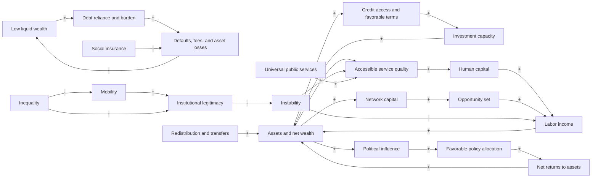
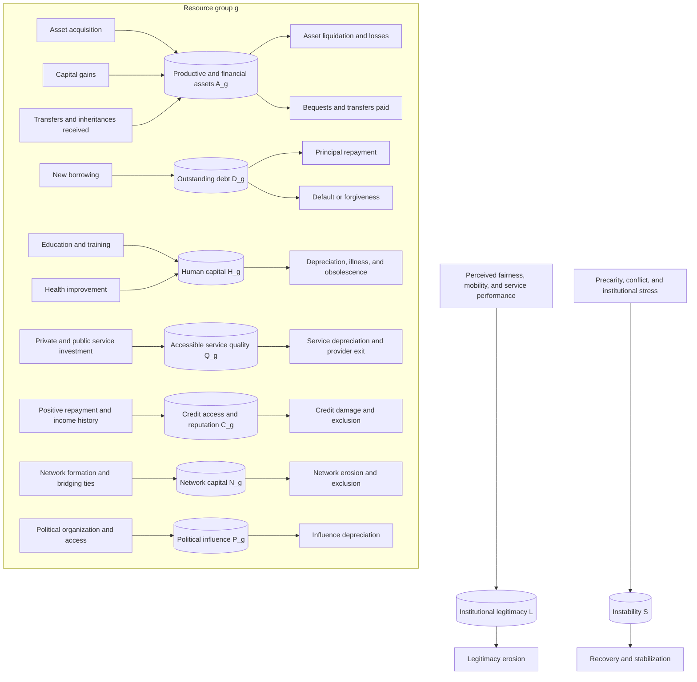

# Cumulative Inequality as a Dynamic System

## An Intergenerational Stock–Flow Model of Opportunity, Services, Mobility, and Instability

### Abstract

This paper develops a system dynamics model of cumulative economic inequality. The central proposition is that inequality is not only an outcome of economic activity but also a state condition that shapes the resources, risks, and opportunity sets governing subsequent activity. Each generation begins with a distribution of assets, debt, human capital, service access, social connections, and institutional influence produced by prior generations. These inherited or preexisting stocks affect access to education, healthcare, credit, housing, networks, investment opportunities, and political institutions. Differences in access alter both expected returns and exposure to losses, thereby updating the distribution transmitted to the next generation.

The model integrates mechanisms commonly studied separately in economics and related fields: intergenerational transmission, imperfect credit markets, human-capital formation, heterogeneous asset accumulation, neighborhood and place effects, social capital, political influence, and inequality-related instability. These mechanisms are represented as interacting reinforcing and balancing feedback loops. Reinforcing loops generate cumulative advantage and disadvantage through asset returns, credit terms, service quality, debt vulnerability, political allocation, and intergenerational transmission. Balancing loops operate through redistribution, universal public services, social insurance, progressive taxation, and asset-building policies.

The paper first states the theory verbally, then develops a causal-loop structure, a stock–flow architecture, and a discrete-time mathematical specification. It also maps each proposed stock and causal relationship to relevant literature, clarifying which links are well established, which are context dependent, and which remain hypotheses to be tested. The model is intended as a transparent theoretical framework that can later be implemented computationally, calibrated with empirical data, and used to compare institutional and policy regimes.

**Keywords:** economic inequality; system dynamics; intergenerational mobility; wealth; credit constraints; service quality; cumulative advantage; political economy; instability

---

# Paper Outline

1. Introduction  
2. Research problem and contribution  
3. Verbal theory of cumulative inequality  
4. System boundary, actors, and time structure  
5. Causal-loop structure  
6. Stock–flow architecture  
7. Formal mathematical specification  
8. Model-structure justification and continuity with the literature  
9. Model propositions and expected dynamic behavior  
10. Policy mechanisms and scenario design  
11. Empirical interpretation, calibration, and validation strategy  
12. Limitations and scope conditions  
13. Conclusion  
14. References  
15. Appendices  

---

# 1. Introduction

Economic inequality is often measured as a distributional outcome at a particular point in time. Income shares, wealth shares, percentile ratios, and mobility estimates describe how resources and outcomes are distributed, but they do not by themselves explain how those distributions are reproduced or transformed. A dynamic explanation requires attention to accumulation, feedback, delays, thresholds, and the ways in which prior outcomes alter future feasible choices.

This paper develops a system dynamics theory of cumulative inequality. Its starting point is that economic life is a repeated, intergenerational process rather than a sequence of independent contests. The distribution resulting from one period becomes part of the initial-condition vector for the next. Children and young adults do not enter the economy with equal stocks of assets, debt, education, health, neighborhood quality, networks, information, security, or political access. Their starting positions influence the opportunity sets available to them, the prices and terms they face, the risks they can absorb, and the services they can acquire.

The central claim is therefore:

> Inequality is both an outcome of economic processes and an input into their subsequent operation.

Capital tends to serve those who already possess collateral, liquidity, information, and risk-bearing capacity. High-resource households can acquire better services, tolerate delayed returns, diversify risk, borrow on more favorable terms, and convert economic resources into institutional influence. Low-resource households may face the opposite configuration: limited collateral, costly or inflexible credit, poorer-quality services, greater exposure to shocks, and fewer opportunities to invest in activities with high expected returns. These differences can generate cumulative advantage and cumulative disadvantage even when individuals are equally motivated or projects have similar underlying productivity.

The model does not claim that markets invariably amplify inequality or that mobility is impossible. Public services, redistribution, social insurance, labor institutions, antidiscrimination policy, inclusive finance, and asset-building programs can interrupt or reverse reinforcing processes. The substantive question is not whether a single inequality mechanism exists, but under what institutional conditions reinforcing processes dominate balancing processes.

The paper proceeds from verbal theory to causal loops, stocks and flows, and formal equations. It then provides a model-structure justification showing how the proposed architecture synthesizes established mechanisms from economics, political economy, sociology, and system dynamics.

---

# 2. Research Problem and Contribution

## 2.1 Research problem

The model addresses the following question:

> How do inherited and accumulated differences in wealth, debt, human capital, service access, networks, and political influence interact to reproduce or alter economic inequality, mobility, service quality, legitimacy, and instability across time and generations?

This broad question can be decomposed into five subsidiary questions:

1. How do prior resource distributions determine current opportunity sets?
2. How do credit markets, service systems, and risk allocation translate initial resources into unequal probabilities of success?
3. How do current economic outcomes update the stocks transmitted to future generations?
4. Which feedbacks produce cumulative advantage, cumulative disadvantage, or economic traps?
5. Which institutions and policies create balancing processes strong enough to offset these feedbacks?

## 2.2 Contribution

The model does not introduce an entirely new list of causal mechanisms. Intergenerational transmission, credit constraints, human-capital investment, wealth accumulation, neighborhood effects, social connectedness, political influence, and instability have substantial independent literatures. The model contributes by integrating these mechanisms into a common dynamic structure.

The distinctive contributions are:

- treating the resource distribution as an endogenous state of the economy;
- representing assets, debt, human capital, service quality, networks, influence, legitimacy, and instability as accumulations;
- making opportunity sets and mobility emergent consequences of those stocks;
- distinguishing beneficial credit from debt-driven vulnerability;
- representing political influence through explicit policy-allocation channels;
- identifying reinforcing and balancing loops that can dominate under different institutional regimes;
- incorporating delays between childhood conditions, adult outcomes, and intergenerational transmission;
- creating a structure suitable for simulation, structural validation, and policy comparison.

## 2.3 Relation to conventional economic modeling

Many economic models isolate one mechanism to obtain identification, analytical tractability, or causal estimates. That strategy is essential for testing specific relationships. A system dynamics model serves a complementary purpose. It asks what patterns may emerge when individually defensible mechanisms operate together, affect one another, and feed back over long horizons.

The model should therefore be understood as a synthesis and hypothesis-generating framework. It does not substitute simulated associations for empirical causal identification. Instead, empirical findings discipline the model structure, parameter ranges, and validation tests.

---

# 3. Verbal Theory of Cumulative Inequality

The economy is modeled as a repeated intergenerational game. At the beginning of each economic round, individuals or households inherit a multidimensional starting position. This position includes formal financial inheritance, but it also includes housing support, debt obligations, education, health, social connections, institutional knowledge, neighborhood conditions, and the capacity of families to insure members against failure.

The inherited distribution creates unequal opportunity sets. Some households can choose among high-quality schools, safe neighborhoods, specialized healthcare, favorable lenders, professional networks, business investments, relocation, and periods of unpaid training. Others face a narrower range of feasible choices. The latter may still have nominal access to credit or services, but on terms that transfer more risk to the borrower, require higher fees, offer less flexibility, or provide lower quality.

As economic activity unfolds, households receive labor income, asset income, transfers, and public services. They also incur consumption costs, debt service, taxes, fees, and losses from unemployment, illness, eviction, business failure, or asset-price shocks. The ability to absorb these losses depends on liquidity, insurance, portfolio diversification, family support, and access to institutions.

This process updates household stocks. Successful investment raises assets, human capital, credit standing, and networks. Adverse outcomes may increase debt, damage credit, reduce health or skills, force asset sales, and restrict future opportunities. High-quality resources and services tend to be directed toward populations that can pay, generate profit, or exercise political influence. Where public equalization is weak, lower-resource areas can experience declining service quality, provider exit, underinvestment, and a shrinking tax or revenue base.

The updated distribution becomes the starting condition for the next period and, eventually, the next generation. Parents transmit assets and debt directly, but they also transmit access to schools, neighborhoods, networks, information, expectations, and protection against risk. Mobility therefore emerges from the full system rather than from individual effort alone.

The resulting theory can be summarized as follows:

> Economic inequality persists through interacting accumulation processes. Unequal starting stocks affect access to credit, services, networks, investment opportunities, and political institutions. Differences in access alter expected returns and exposure to losses. Outcomes then update the stocks transmitted to the next generation. Reinforcing feedbacks reproduce advantage and disadvantage, while public provision, redistribution, social insurance, labor institutions, and political accountability can create balancing feedbacks.

---

# 4. System Boundary, Actors, and Time Structure

## 4.1 Unit of analysis

The initial model divides the population into three resource groups:

$$
g \in \{L,M,H\},
$$

where:

- $L$: low-resource households;
- $M$: middle-resource households;
- $H$: high-resource households or capital-owning households.

The groups are initially represented by group averages or representative group stocks. This simplification makes the feedback architecture transparent. Later versions can use deciles, percentiles, continuous distributions, heterogeneous agents, or a hybrid system dynamics–agent-based design.

## 4.2 Time

The basic simulation time step is one year:

$$
t=0,1,2,\ldots,T.
$$

A generation has approximate duration $T_G$, initially set near 25 years for exploratory simulation. Some processes operate annually, while explicit intergenerational transfers occur at generational transition points or through age-structured cohorts.

## 4.3 Endogenous variables

The core endogenous stocks are:

- productive and financial assets;
- outstanding debt;
- human capital;
- accessible service quality;
- credit access or financial reputation;
- social and network capital;
- political influence;
- institutional legitimacy;
- instability.

Labor income, capital income, borrowing terms, investment capacity, opportunity sets, mobility, inequality, public investment, and losses are modeled as flows or auxiliary variables.

## 4.4 Exogenous or policy-controlled variables

The first version may treat the following as exogenous scenario variables:

- macroeconomic growth;
- labor demand;
- technological change;
- population growth;
- baseline interest rates;
- tax schedules;
- transfer rules;
- public-service budgets;
- regulatory quality;
- antidiscrimination enforcement;
- social-insurance generosity.

A more complete model can endogenize selected variables after the core structure is validated.

## 4.5 Important delays

The model includes several substantive delays:

| Delay | Mechanism |
|---|---|
| Education delay | Childhood service quality affects adult earnings many years later. |
| Health delay | Poor health may have immediate and cumulative productivity effects. |
| Asset accumulation delay | Returns compound over long horizons. |
| Credit-history delay | Defaults and payment histories influence future terms for years. |
| Service-capacity delay | Schools, hospitals, transport, and lender networks adjust slowly. |
| Political delay | Resource concentration affects policy through organization and institutional cycles. |
| Legitimacy delay | Perceived unfairness and distrust accumulate before visible instability appears. |
| Generational delay | Mobility and inheritance are observed over decades rather than quarters. |

---

# 5. Causal-Loop Structure

A positive sign on an arrow means that, all else equal, an increase in the source tends to increase the target above what it otherwise would have been. A negative sign means that an increase in the source tends to reduce the target. A reinforcing loop amplifies change; a balancing loop counteracts change.

## 5.1 Overview causal-loop diagram



## 5.2 Reinforcing loop R1: Asset accumulation

```text
Assets
→ capital income and capital gains
→ saving and reinvestment
→ assets
```

Formally:

$$
A_g \uparrow
\Rightarrow r^A_g A_g \uparrow
\Rightarrow \text{asset acquisition}_g \uparrow
\Rightarrow A_g \uparrow.
$$

This loop does not require wealthy households to earn a higher percentage return. A larger asset base generates a larger absolute return even when rates of return are equal. Heterogeneous returns may strengthen the loop but are treated as an empirical question rather than an assumption.

## 5.3 Reinforcing loop R2: Wealth–credit–investment

```text
Assets, liquidity, and collateral
→ better approval probability and borrowing terms
→ greater feasible investment
→ higher expected income and asset accumulation
→ assets, liquidity, and collateral
```

The inverse dynamic can create a low-resource trap:

```text
Low collateral
→ limited or expensive credit
→ underinvestment or high-risk financing
→ lower expected net returns
→ low collateral
```

This loop represents the logic of imperfect capital markets developed in models of human-capital investment and occupational choice (Banerjee & Newman, 1993; Galor & Zeira, 1993).

## 5.4 Reinforcing loop R3: Service–human-capital–income

```text
Household resources
→ access to higher-quality education, health, housing, transport, and finance
→ human-capital accumulation and lower exposure to harm
→ labor income and saving
→ household resources
```

The link between resources and services operates through purchasing power, residence, travel capacity, private supplementation, local fiscal capacity, market profitability, and institutional allocation. Public provision can weaken this dependence.

## 5.5 Reinforcing loop R4: Debt and precarity

```text
Low liquid wealth
→ greater reliance on debt
→ high debt service and low shock tolerance
→ defaults, fees, forced asset sales, and service exclusion
→ lower liquid wealth
```

This loop distinguishes two roles of credit. Credit can enable productive investment, but debt can also magnify vulnerability when income is unstable or loan terms place disproportionate downside risk on borrowers.

## 5.6 Reinforcing loop R5: Political allocation

```text
Concentrated economic resources
→ political organization, access, and influence
→ favorable taxes, regulation, public allocation, and risk distribution
→ higher net returns or lower losses
→ concentrated economic resources
```

Political influence does not enter the model as a direct addition to private returns. It changes observable institutional levers, such as tax rates, transfers, public investment, labor protections, zoning, and financial regulation.

## 5.7 Reinforcing loop R6: Intergenerational persistence

```text
Parental assets, human capital, networks, and place
→ child opportunity set and protection from risk
→ child income and asset accumulation
→ resources transmitted to the following generation
```

This loop extends inheritance beyond bequests. Inter vivos transfers, education, residential location, family networks, institutional knowledge, and informal insurance all affect the next generation’s starting state.

## 5.8 Reinforcing loop R7: Inequality–legitimacy–instability

```text
Resource and opportunity inequality
→ perceived exclusion, blocked mobility, and economic precarity
→ declining institutional legitimacy
→ social, political, or economic instability
→ service deterioration, lower investment, and greater losses
→ resource inequality
```

This is a conditional loop rather than a universal law. Its strength depends on social protection, political inclusion, state capacity, identity cleavages, and institutional responsiveness.

## 5.9 Balancing loop B1: Redistribution

```text
Inequality
→ political demand for redistribution
→ taxes and transfers
→ increased lower-group resources
→ reduced inequality
```

This balancing process can be weakened by political concentration. The model therefore includes a contest between demand for equalization and the capacity of advantaged groups to prevent it.

## 5.10 Balancing loop B2: Universal public services

```text
Unequal opportunity
→ public investment and universal provision
→ improved access for disadvantaged groups
→ human-capital accumulation and mobility
→ reduced opportunity inequality
```

Universal provision partially decouples human-capital formation from household wealth.

## 5.11 Balancing loop B3: Social insurance

```text
Exposure to shocks
→ insurance and income support
→ fewer defaults, forced sales, and human-capital losses
→ greater household resilience
```

This loop reduces the debt-and-precarity process without necessarily equalizing all income or wealth.

## 5.12 Balancing loop B4: Progressive taxation and asset diffusion

```text
Wealth concentration
→ progressive taxation or asset-building policy
→ slower top accumulation and broader asset ownership
→ reduced concentration
```

Asset diffusion can include matched savings, baby bonds, homeownership support, pension access, employee ownership, or public wealth funds.

## 5.13 Balancing loop B5: Labor-market response

```text
Labor scarcity, organization, or political pressure
→ higher wages and improved employment terms
→ greater lower-group saving and lower debt reliance
→ reduced inequality
```

The strength of this loop depends on bargaining institutions, labor demand, unionization, minimum wages, employment protection, and macroeconomic conditions.

---

# 6. Stock–Flow Architecture

## 6.1 Evolution from the preliminary to the literature-informed model

The initial compact formulation contained the following stocks:

$$
W_g,\quad H_g,\quad Q_g,\quad C_g,\quad S.
$$

For three groups, this produced 13 stocks:

- wealth, human capital, service quality, and credit access for each group;
- one system-level instability stock.

The literature-informed model retains the basic structure but separates concepts that have different units and dynamics:

$$
A_g,\ D_g,\ H_g,\ Q_g,\ C_g,\ N_g,\ P_g,\ L,\ S.
$$

Net wealth becomes a derived variable:

$$
W_g=A_g-D_g.
$$

The extended model therefore contains seven group-specific stocks and two system-level stocks. With three groups, it contains:

$$
7(3)+2=23
$$

stocks. The compact model remains useful for exploratory analysis, while the extended model is preferable for theoretical precision.

## 6.2 Main stock–flow diagram



## 6.3 Stock definitions

| Symbol | Stock | Definition |
|---|---|---|
| $A_g$ | Assets | Productive, financial, housing, and business assets held by group $g$. |
| $D_g$ | Debt | Outstanding principal obligations of group $g$. |
| $H_g$ | Human capital | Accumulated education, skills, health, credentials, and experience. |
| $Q_g$ | Accessible service quality | Quality and practical accessibility of essential services available to the group. |
| $C_g$ | Credit access and reputation | Accumulated lender assessment, approval capacity, and financial standing. |
| $N_g$ | Network capital | Economically useful relationships, referrals, information channels, and institutional ties. |
| $P_g$ | Political influence | Capacity to shape policy agendas, rules, and allocations. |
| $L$ | Institutional legitimacy | Accumulated public belief that institutions are fair, effective, and responsive. |
| $S$ | Instability | Accumulated social, political, and economic stress disrupting investment, services, and livelihoods. |

## 6.4 Principal inflows and outflows

| Stock | Inflows | Outflows |
|---|---|---|
| Assets | saving-funded purchases; capital gains; transfers; inheritances | liquidation; depreciation; losses; taxes paid from assets; bequests |
| Debt | new borrowing; capitalized arrears | principal repayment; forgiveness; write-off; default resolution |
| Human capital | education; training; health investment; experience | depreciation; illness; skill obsolescence; displacement |
| Service quality | public investment; private provision; maintenance; provider entry | depreciation; crowding; underfunding; provider exit |
| Credit access | repayment history; stable income; collateral accumulation | missed payments; defaults; high utilization; exclusion |
| Network capital | family transmission; schooling; employment ties; bridging connections | geographic isolation; segregation; relationship decay |
| Political influence | organization; campaign resources; lobbying; institutional access | organizational decay; counter-mobilization; regulation |
| Legitimacy | fair treatment; mobility; responsive policy; reliable services | perceived exclusion; corruption; failure; repression |
| Instability | precarity; conflict; policy uncertainty; service failure | stabilization; recovery; conflict resolution; institutional reform |

---

# 7. Formal Mathematical Specification

## 7.1 Indices, units, and notation

Let:

$$
g\in\{L,M,H\}
$$

index resource groups and:

$$
t=0,1,\ldots,T
$$

index years.

For any stock $X$, the discrete-time accounting identity is:

$$
X_{t+1}=X_t+\text{inflows during }t-\text{outflows during }t.
$$

The model can later be converted to continuous time:

$$
\frac{dX}{dt}=\text{inflows}-\text{outflows}.
$$

Group-specific monetary stocks may be represented per household, per adult, or in aggregate. Nonmonetary stocks may be normalized to $[0,1]$ or indexed around a base year. Dimensional consistency must be maintained when the simulation is implemented.

## 7.2 Wealth and inequality

Net wealth is:

$$
W_{g,t}=A_{g,t}-D_{g,t}.
$$

Several preliminary inequality measures are possible.

A wealth ratio:

$$
I^{R}_t=\frac{W_{H,t}}{W_{L,t}+\epsilon},
$$

where $\epsilon>0$ avoids division by zero. This measure is difficult when lower-group wealth is zero or negative.

A normalized wealth gap is more stable:

$$
I^{G}_t=
\frac{W_{H,t}-W_{L,t}}
{\left|W_{H,t}\right|+\left|W_{L,t}\right|+\epsilon}.
$$

A broader implementation can use a Gini coefficient, top wealth share, percentile ratios, or the full distribution:

$$
I_t=\mathcal{I}\left(\{W_{i,t}\}_{i=1}^{n}\right).
$$

The three-group model should report multiple measures because different inequality metrics may imply different dynamics.

## 7.3 Opportunity set

Opportunity is an auxiliary variable rather than a stock. It summarizes the feasible set of education, employment, business, residential, and investment options.

A linear index is:

$$
O_{g,t}
=
\alpha_A \widetilde A_{g,t}
-\alpha_D \widetilde D_{g,t}
+\alpha_H \widetilde H_{g,t}
+\alpha_Q \widetilde Q_{g,t}
+\alpha_C \widetilde C_{g,t}
+\alpha_N \widetilde N_{g,t}
-\alpha_S S_t
-\alpha_{I,g} I_t,
$$

where tildes indicate normalized variables.

To keep the opportunity index bounded:

$$
\widehat O_{g,t}
=
\frac{1}{1+\exp(-O_{g,t})}.
$$

The inequality effect may vary by group:

$$
\alpha_{I,L}>\alpha_{I,M}\geq \alpha_{I,H}.
$$

This does not mean inequality directly reduces every low-resource opportunity. It summarizes institutional mechanisms not yet separately modeled, and its coefficient should shrink as those mechanisms are explicitly represented.

## 7.4 Labor income

Annual labor income is:

$$
Y^{L}_{g,t}
=
Y_{0,g}
\exp\left(
\beta_H H_{g,t}
+\beta_N N_{g,t}
+\beta_O \widehat O_{g,t}
+\beta_B BARG_{g,t}
-\beta_S S_t
\right)
\cdot \eta^{Y}_{g,t},
$$

where:

- $BARG_{g,t}$ is bargaining power or labor-market institutional strength;
- $\eta^{Y}_{g,t}$ is a stochastic income shock with expected value one.

A simpler first implementation may use:

$$
Y^{L}_{g,t}
=
y_{0,g}
+y_H H_{g,t}
+y_N N_{g,t}
+y_O\widehat O_{g,t}
-y_{S,g}S_t.
$$

Instability can have heterogeneous effects:

$$
y_{S,L}>y_{S,M}>y_{S,H}.
$$

## 7.5 Capital income and heterogeneous returns

Capital income is:

$$
Y^{K}_{g,t}=r^{A}_{g,t}A_{g,t}.
$$

The baseline model can initially impose:

$$
r^{A}_{L,t}=r^{A}_{M,t}=r^{A}_{H,t}=r^{A}_t
$$

to determine how much inequality emerges from unequal asset ownership alone.

An extended model allows:

$$
r^{A}_{g,t}
=
r_0
+\rho_{div}DIV_{g,t}
+\rho_{acc}ACC_{g,t}
-\rho_{fee}FEE_{g,t}
+\eta^{r}_{g,t},
$$

where portfolio diversification, access to investment vehicles, fees, leverage, and stochastic returns vary across groups. Empirical evidence of persistent heterogeneous returns motivates testing this extension (Fagereng et al., 2020).

## 7.6 Credit availability and borrowing terms

Credit should be decomposed rather than represented by a single index.

Approval probability:

$$
Pr(\text{approval}_{g,t})
=
\sigma\left(
\gamma_0
+\gamma_A A_{g,t}
+\gamma_Y Y^{L}_{g,t}
+\gamma_C C_{g,t}
-\gamma_D D_{g,t}
-\gamma_V VOL_{g,t}
\right).
$$

Interest rate:

$$
i_{g,t}
=
i_0
+\phi_D\frac{D_{g,t}}{Y^{L}_{g,t}+\epsilon}
-\phi_C C_{g,t}
-\phi_A A_{g,t}
+\phi_R RISK_{g,t}.
$$

A non-price terms index is:

$$
T^{loan}_{g,t}
=
\tau_0
+\tau_i i_{g,t}
+\tau_{col}COLREQ_{g,t}
+\tau_f FEE_{g,t}
+\tau_{rig}RIGID_{g,t}.
$$

Higher $T^{loan}$ means less favorable terms and more downside risk allocated to the borrower.

## 7.7 Investment capacity and investment success

Investment capacity is:

$$
IC_{g,t}
=
f\left(
LIQ_{g,t},
Pr(\text{approval}_{g,t}),
i_{g,t},
T^{loan}_{g,t},
N_{g,t},
\widehat O_{g,t}
\right).
$$

A bounded version is:

$$
IC_{g,t}
=
\sigma\left(
\kappa_0
+\kappa_L LIQ_{g,t}
+\kappa_A Pr(\text{approval}_{g,t})
-\kappa_i i_{g,t}
-\kappa_T T^{loan}_{g,t}
+\kappa_N N_{g,t}
\right).
$$

The probability of success for a productive investment is:

$$
Pr(SUCCESS_{g,t})
=
\sigma\left(
\psi_0
+\psi_H H_{g,t}
+\psi_Q Q_{g,t}
+\psi_N N_{g,t}
+\psi_{IC}IC_{g,t}
-\psi_T T^{loan}_{g,t}
-\psi_S S_t
\right).
$$

This formalizes the proposition that unequal terms and weaker support systems can reduce expected success even when an underlying project is potentially productive.

## 7.8 Asset stock

The asset stock evolves as:

$$
A_{g,t+1}
=
A_{g,t}
+ACQ_{g,t}
+GAIN_{g,t}
+TR^{in}_{g,t}
-INH^{out}_{g,t}
-LIQ_{g,t}
-LOSS^{A}_{g,t}
-\delta_A A_{g,t}.
$$

Asset acquisition is financed by disposable income, borrowing used for productive assets, and retained capital income:

$$
ACQ_{g,t}
=
s_{g,t}
\left[
Y^{L}_{g,t}
+Y^{K}_{g,t}
+TR^{cash}_{g,t}
-TAX_{g,t}
-DS_{g,t}
-CONS^{min}_{g,t}
\right]^+
+\chi_B BORR^{prod}_{g,t},
$$

where $[x]^+=\max(x,0)$.

Capital gain is:

$$
GAIN_{g,t}=q_{g,t}A_{g,t},
$$

where $q_{g,t}$ is the asset-price appreciation rate.

Asset losses rise with instability, leverage, and uninsured shocks:

$$
LOSS^{A}_{g,t}
=
\ell_0
+\ell_S S_t
+\ell_D\frac{D_{g,t}}{A_{g,t}+\epsilon}
+\ell_U UNSH_{g,t}
-\ell_{INS}INS_{g,t}.
$$

## 7.9 Debt stock

Debt evolves as:

$$
D_{g,t+1}
=
D_{g,t}
+BORR^{prod}_{g,t}
+BORR^{cons}_{g,t}
+ARREARS_{g,t}
-PRIN_{g,t}
-FORG_{g,t}
-WRITEOFF_{g,t}.
$$

Debt service is:

$$
DS_{g,t}=i_{g,t}D_{g,t}+PRIN_{g,t}.
$$

Consumption borrowing increases when resources fall below required expenditure:

$$
BORR^{cons}_{g,t}
=
\omega_g
\left[
CONS^{min}_{g,t}
+DS_{g,t}
-Y^{disp}_{g,t}
-LIQ_{g,t}
\right]^+.
$$

Default probability is:

$$
Pr(DEFAULT_{g,t})
=
\sigma\left(
\delta_0
+\delta_{DY}\frac{DS_{g,t}}{Y^{disp}_{g,t}+\epsilon}
+\delta_S S_t
+\delta_U UNSH_{g,t}
-\delta_L LIQ_{g,t}
-\delta_{INS}INS_{g,t}
\right).
$$

## 7.10 Human-capital stock

Human capital evolves as:

$$
H_{g,t+1}
=
H_{g,t}
+EDU_{g,t}
+HLTH_{g,t}
+EXP_{g,t}
-DEP^{H}_{g,t}.
$$

Education accumulation is:

$$
EDU_{g,t}
=
e_0
+e_Q Q^{edu}_{g,t}
+e_W \log(1+A_{g,t})
+e_C IC_{g,t}
+e_N N_{g,t}
-e_S S_t.
$$

Health contribution is:

$$
HLTH_{g,t}
=
h_0
+h_Q Q^{health}_{g,t}
+h_{INS}INS_{g,t}
-h_P PREC_{g,t}.
$$

Depreciation is:

$$
DEP^{H}_{g,t}
=
\delta_H H_{g,t}
+\delta_{ill}ILL_{g,t}
+\delta_{obs}OBS_{g,t}.
$$

The compact model may use a composite service index $Q_g$; later versions should separate education and health service quality.

## 7.11 Accessible service-quality stock

Service quality evolves as:

$$
Q_{g,t+1}
=
Q_{g,t}
+INV^{pub}_{g,t}
+INV^{priv}_{g,t}
+ENTRY_{g,t}
-MAINTGAP_{g,t}
-EXIT_{g,t}
-\delta_Q Q_{g,t}.
$$

Private provision responds to expected profitability:

$$
INV^{priv}_{g,t}
=
v_0
+v_W PURCH_{g,t}
+v_D DEMAND_{g,t}
-v_R PROVIDERRISK_{g,t}.
$$

Public investment depends on need, fiscal capacity, universal rules, and political influence:

$$
INV^{pub}_{g,t}
=
G_t
\left[
\theta_N NEED_{g,t}
+\theta_U UNIV_{g,t}
+\theta_P \frac{P_{g,t}}{\sum_j P_{j,t}+\epsilon}
\right].
$$

This equation permits alternative institutional regimes. A need-based regime has high $\theta_N$; a politically captured regime has high $\theta_P$.

## 7.12 Credit-access and financial-reputation stock

The credit stock evolves as:

$$
C_{g,t+1}
=
C_{g,t}
+GOODPAY_{g,t}
+INCSTAB_{g,t}
+COLLGAIN_{g,t}
-MISSPAY_{g,t}
-DEFAULT_{g,t}
-EXCL_{g,t}
-\delta_C C_{g,t}.
$$

This stock captures persistence in financial reputation and institutional access. It must be bounded:

$$
0\leq C_{g,t}\leq 1.
$$

## 7.13 Network-capital stock

Network capital evolves as:

$$
N_{g,t+1}
=
N_{g,t}
+FAMNET_{g,t}
+SCHNET_{g,t}
+WORKNET_{g,t}
+BRIDGE_{g,t}
-SEGLOSS_{g,t}
-\delta_N N_{g,t}.
$$

Cross-class economic connectedness is particularly relevant:

$$
BRIDGE_{g,t}
=
b_0
+b_Q Q^{edu}_{g,t}
+b_M MIX_{g,t}
-b_{seg}SEG_{g,t}.
$$

Evidence connecting cross-class ties to upward mobility supports treating networks as a distinct opportunity-producing stock (Chetty et al., 2022).

## 7.14 Political-influence stock

Political influence evolves as:

$$
P_{g,t+1}
=
P_{g,t}
+ORG_{g,t}
+ACCESS_{g,t}
+EXPERT_{g,t}
+MEDIA_{g,t}
-COUNTER_{g,t}
-\delta_P P_{g,t}.
$$

Resource-dependent organization can be represented as:

$$
ORG_{g,t}
=
p_0
+p_A \log(1+A_{g,t})
+p_N N_{g,t}.
$$

Influence affects explicit policy variables:

$$
\mathbf Z_t=
\left[
\tau^A_t,
\tau^Y_t,
TR_{g,t},
INV^{pub}_{g,t},
REG_t,
LAB_t
\right],
$$

where the policy vector is:

$$
\mathbf Z_t
=
\mathcal P
\left(
\{P_{g,t}\},
VOTE_t,
INST_t,
NEED_t
\right).
$$

The model should compare multiple political-institution functions $\mathcal P(\cdot)$, rather than assume that wealth always produces the same policy outcome.

## 7.15 Institutional legitimacy

Legitimacy evolves as:

$$
L_{t+1}
=
L_t
+FAIR_t
+RESP_t
+MOB^{obs}_t
+SERVPERF_t
-CORR_t
-EXCL_t
-FAIL_t
-\delta_L L_t.
$$

A compact functional form is:

$$
L_{t+1}
=
L_t
+\lambda_F FAIR_t
+\lambda_M MOB^{obs}_t
+\lambda_Q \overline Q_t
-\lambda_I I_t
-\lambda_P \overline{PREC}_t
-\delta_L L_t.
$$

Legitimacy is bounded between zero and one.

## 7.16 Instability

Instability evolves as:

$$
S_{t+1}
=
S_t
+STRESS_t
+CONFLICT_t
+POLUNC_t
+SERVFAIL_t
-RECOV_t
-\delta_S S_t.
$$

A compact form is:

$$
S_{t+1}
=
S_t
+k_I I_t
+k_P\overline{PREC}_t
+k_L(1-L_t)
+k_Q(1-\overline Q_t)
-k_R STATECAP_t
-\delta_S S_t.
$$

The direct inequality coefficient $k_I$ should be tested against a mediated specification in which inequality acts only through precarity and legitimacy:

$$
k_I=0.
$$

Comparing these alternatives is an important structural test.

## 7.17 Intergenerational transmission

Inheritance should not be modeled as $\lambda_g W_g$ added every year, because that would double-count existing wealth. Instead, transfers are explicit flows between age cohorts or generational transition events.

At a generation boundary $t=T_G,2T_G,\ldots$:

$$
A^{child}_{g,t^+}
=
A^{child}_{g,t^-}
+BEQ_{g,t}
+GIFT_{g,t}.
$$

Human capital is not inherited mechanically. Parental stocks influence child formation:

$$
H^{child}_{g,t+1}
=
H^{child}_{g,t}
+f\left(
A^{parent}_{g,t},
Q_{g,t},
N^{parent}_{g,t},
TIME^{parent}_{g,t},
PUB_{g,t}
\right)
-\delta_H H^{child}_{g,t}.
$$

Network capital has a direct family-transfer component:

$$
FAMNET^{child}_{g,t}
=
\nu_N N^{parent}_{g,t}.
$$

Risk protection is represented through family insurance:

$$
INS^{family}_{g,t}
=
\nu_A LIQ^{parent}_{g,t}
+\nu_N N^{parent}_{g,t}.
$$

## 7.18 Mobility as an emergent transition process

Mobility is not a stock in the refined model. It emerges from transition probabilities:

$$
P_{ij,t}
=
Pr\left(
g^{child}_{t+T_G}=j
\mid
g^{parent}_{t}=i
\right).
$$

For upward mobility from group $L$:

$$
P_{LH,t}
=
\sigma\left(
m_0
+m_H H_{L,t}
+m_Q Q_{L,t}
+m_C C_{L,t}
+m_N N_{L,t}
+m_O\widehat O_{L,t}
-m_D D_{L,t}
-m_S S_t
-m_I I_t
\right).
$$

The transition matrix is:

$$
\mathbf P_t=
\begin{bmatrix}
P_{LL,t} & P_{LM,t} & P_{LH,t}\\
P_{ML,t} & P_{MM,t} & P_{MH,t}\\
P_{HL,t} & P_{HM,t} & P_{HH,t}
\end{bmatrix},
$$

with:

$$
\sum_j P_{ij,t}=1
\quad
\forall i.
$$

Relative mobility, absolute mobility, rank persistence, and transition rates should be reported separately.

## 7.19 Preliminary compact system

For an initial simulation, the extended structure can be reduced to:

$$
W_g,\quad H_g,\quad Q_g,\quad C_g,\quad S.
$$

The compact update equations are:

$$
W_{g,t+1}
=
W_{g,t}
+s_gY_{g,t}
+R_{g,t}
+TR_{g,t}
-DS_{g,t}
-LOSS_{g,t},
$$

$$
H_{g,t+1}
=
H_{g,t}
+a_QQ_{g,t}
+a_WW_{g,t}
-a_SS_t
-\delta_HH_{g,t},
$$

$$
Q_{g,t+1}
=
Q_{g,t}
+b_WW_{g,t}
+b_PP_{g,t}
+b_{pub}G_{g,t}
-\delta_QQ_{g,t},
$$

$$
C_{g,t+1}
=
C_{g,t}
+c_WW_{g,t}
+c_YY_{g,t}
-c_DDS_{g,t}
-c_LLOSS_{g,t}
-\delta_CC_{g,t},
$$

$$
S_{t+1}
=
S_t
+k_I I_t
+k_M\left(1-MOB_t\right)
-\delta_SS_t.
$$

This compact model preserves the original theory but combines several mechanisms. It should be used as a pedagogical or exploratory version, while the extended model is used for substantive interpretation.

---

# 8. Model-Structure Justification and Continuity with the Literature

## 8.1 Purpose of the literature connection

The aim is not to present a comprehensive literature review of inequality. The aim is to justify the model structure. Each major stock should represent an accumulated condition recognized in prior research, and each causal link should correspond to a defensible mechanism. The complete feedback architecture is a synthesis: the literature generally evaluates its component links separately rather than estimating the full loop as one causal object.

## 8.2 Intergenerational starting conditions

Becker and Tomes (1986) model the transmission of earnings capacity, assets, consumption, and investments from parents to children. De Nardi (2004) shows how bequests and intergenerational earnings links contribute to a concentrated wealth distribution. Boserup et al. (2016) provide evidence that bequests materially alter recipients’ wealth and the distribution of wealth.

These works justify treating prior-generation resources as determinants of the next generation’s starting position. They also support an explicit transfer flow rather than an annual automatic addition to the same stock.

**Model elements justified:**

- asset and wealth stocks;
- inheritance and inter vivos transfer flows;
- parental investment in child human capital;
- intergenerational persistence loop R6;
- generation-specific initial conditions.

## 8.3 Credit constraints and investment opportunity

Galor and Zeira (1993) show that initial wealth can affect human-capital investment and long-run output when credit markets are imperfect and investments are indivisible. Banerjee and Newman (1993) show how wealth and capital-market imperfections shape occupational choice, including whether individuals can become entrepreneurs.

These mechanisms support the proposition that wealth changes feasible opportunities rather than merely final consumption. They justify separating credit approval, interest rates, collateral requirements, and non-price loan terms.

**Model elements justified:**

- credit-access stock;
- borrowing-terms auxiliary variables;
- investment-capacity function;
- success probability;
- reinforcing credit–investment loop R2;
- threshold and nonlinear behavior.

## 8.4 Human capital as an accumulation

Human capital theory treats education, skills, health, and experience as capacities accumulated over time. Becker and Tomes (1986) connect parental resources and investment to intergenerational outcomes. Galor and Zeira (1993) show how borrowing constraints can prevent otherwise productive human-capital investment.

The model therefore represents human capital as a stock with education, health, and experience inflows and depreciation, illness, and obsolescence outflows.

**Model elements justified:**

- human-capital stock;
- education and health inflows;
- delayed effects on labor income;
- service–human-capital–income loop R3.

## 8.5 Place, neighborhood, and service quality

Chetty et al. (2014) document large geographic differences in intergenerational mobility. Chetty and Hendren (2018a, 2018b) provide evidence that childhood exposure to places causally affects adult outcomes. This work supports the proposition that access to place-based institutions and environments is not merely correlated with household outcomes but can shape them over time.

The model’s service-quality stock is a synthetic representation of education, healthcare, financial services, housing, transport, legal services, and local institutional capacity. It should be disaggregated when the empirical application focuses on a specific service system.

**Model elements justified:**

- accessible service-quality stock;
- service-investment and service-decay flows;
- childhood exposure delays;
- wealth–place–service access link;
- service–human-capital–income loop R3;
- universal-services balancing loop B2.

## 8.6 Networks and economic connectedness

Chetty et al. (2022) find that cross-class economic connectedness is strongly associated with upward economic mobility. The result supports treating social and network capital as distinct from individual education or wealth.

Networks affect access to information, referrals, mentorship, credibility, and opportunity. The model therefore includes network formation, bridging, segregation, and erosion.

**Model elements justified:**

- network-capital stock;
- network effects on opportunity and income;
- network transmission across generations;
- segregation as an outflow or suppressor of bridging ties.

## 8.7 Asset accumulation and rates of return

De Nardi (2004) demonstrates the importance of saving behavior and intergenerational links for wealth concentration. Fagereng et al. (2020) document substantial, persistent heterogeneity in individual returns to wealth. These findings support distinguishing the stock of assets from rates of return and examining whether differential access, fees, portfolio composition, and financial sophistication strengthen accumulation.

The basic asset loop does not depend on return heterogeneity. It follows from:

$$
Y^K_{g,t}=r^A_{g,t}A_{g,t}.
$$

Return heterogeneity is an optional extension to be empirically calibrated.

**Model elements justified:**

- asset stock;
- capital-income flow;
- capital-gain flow;
- asset accumulation loop R1;
- heterogeneous-return scenarios.

## 8.8 Debt, fragility, and macroeconomic instability

Household leverage can amplify shocks and constrain consumption and investment. Mian et al. (2017) show that increases in household debt are associated with subsequent declines in growth and higher unemployment, supporting the broader proposition that debt accumulation can create systemic vulnerability.

At the household-group level, the model represents debt as a separate stock and includes debt service, arrears, default, and forced asset liquidation. This avoids treating all credit as productive and allows the same financial system to generate both investment and fragility.

**Model elements justified:**

- separate debt stock;
- debt-service burden;
- default and forced-sale mechanisms;
- debt-and-precarity loop R4;
- social-insurance balancing loop B3.

## 8.9 Political influence and policy allocation

Gilens and Page (2014) find that economic elites and organized business interests had substantially greater independent associations with U.S. policy outcomes than average citizens in the policy cases they studied. The result is institution- and country-specific, but it supports modeling unequal political influence as a possible channel connecting economic concentration to policy.

The model represents influence through explicit policy levers rather than allowing influence to directly raise private returns. This improves transparency and permits alternative institutional regimes.

**Model elements justified:**

- political-influence stock;
- resource-dependent organization;
- policy-allocation function;
- political allocation loop R5;
- interaction between reinforcing influence and balancing redistribution.

## 8.10 Inequality, legitimacy, and instability

Alesina and Perotti (1996) provide cross-national evidence for a channel in which inequality contributes to sociopolitical instability and instability reduces investment. This relationship is not treated as universal or mechanically linear. Institutions, state capacity, inclusion, and social protection condition whether inequality produces visible instability.

The model therefore separates inequality, precarity, legitimacy, and instability. It compares direct and mediated specifications rather than imposing a single causal pathway.

**Model elements justified:**

- institutional-legitimacy stock;
- instability stock;
- inequality–legitimacy–instability loop R7;
- instability effects on investment, income, and service quality;
- explicit institutional moderators.

## 8.11 System dynamics foundations

System dynamics represents complex behavior through stocks, flows, feedback, nonlinearities, and delays (Meadows, 2008; Sterman, 2000). This approach is appropriate when outcomes are generated endogenously by accumulated states and when policy resistance may result from delayed or counteracting feedback.

The model resembles the “success to the successful” archetype: initial advantage attracts resources, resources improve performance, and observed performance justifies further allocation. The present model extends that archetype by linking multiple domains—finance, services, human capital, networks, politics, and legitimacy—and by including balancing institutions.

## 8.12 Evidence and model-status matrix

| Proposed relationship | Status in the literature | Treatment in the model |
|---|---|---|
| Parental resources $\rightarrow$ child outcomes | Strong theoretical and empirical support | Endogenous, delayed, multidimensional |
| Assets $\rightarrow$ capital income | Accounting identity, strongly established | Explicit flow |
| Wealth/collateral $\rightarrow$ feasible investment | Strong theoretical support; empirical strength varies by setting | Nonlinear credit and investment functions |
| Credit constraints $\rightarrow$ human-capital investment | Established mechanism; heterogeneous incidence | Threshold effect |
| Place/service quality $\rightarrow$ adult outcomes | Strong and growing causal evidence | Service stock with exposure delay |
| Networks $\rightarrow$ opportunity and mobility | Strong recent empirical association; mechanisms still developing | Separate network stock |
| Wealth $\rightarrow$ higher percentage returns | Supported in some datasets, not universal | Optional extension |
| Debt burden $\rightarrow$ vulnerability | Strong household and macrofinancial rationale | Separate debt stock and precarity loop |
| Resources $\rightarrow$ political influence | Broad support, institution-specific and difficult to measure | Influence stock affecting policy levers |
| Inequality $\rightarrow$ lower mobility | Strong association; multiple causal mechanisms | Mobility emerges from transition probabilities |
| Inequality $\rightarrow$ instability | Conditional and context dependent | Mediated through precarity and legitimacy |
| Redistribution/public services $\rightarrow$ lower persistence | Considerable policy-specific support | Balancing loops |

## 8.13 How the model addresses gaps in the literature

The model addresses five integration gaps:

1. **Outcome-to-input feedback:** Wealth and inequality are not endpoints; they change future access and risk.
2. **Cross-domain interaction:** Finance, services, human capital, networks, and politics are modeled together.
3. **Dual role of credit:** Borrowing can finance investment and also produce fragility.
4. **Institutional endogeneity:** Policy allocation can respond to both need and unequal influence.
5. **Long horizons:** Delays connect childhood conditions, adult outcomes, and intergenerational transmission.

---

# 9. Model Propositions and Expected Dynamic Behavior

The formal structure generates propositions that can later be tested through simulation and empirical calibration.

## Proposition 1: Initial resource distributions can produce persistent divergence

When credit constraints, service stratification, and intergenerational transmission are sufficiently strong, differences in initial assets produce persistent or widening differences in wealth, even when groups have equal underlying preferences or abilities.

## Proposition 2: Equal percentage returns do not eliminate cumulative advantage

Even if all groups receive the same asset return $r^A$, unequal asset stocks generate unequal absolute capital income:

$$
r^AA_H>r^AA_M>r^AA_L.
$$

Savings out of those returns can widen asset gaps.

## Proposition 3: Heterogeneous returns amplify but are not required for concentration

If high-resource groups receive higher net returns because of lower fees, diversification, information, or access, wealth divergence accelerates. However, the model should demonstrate baseline behavior under equal returns before introducing this mechanism.

## Proposition 4: Credit inclusion can have opposite effects depending on terms

Expanded credit can increase mobility when it finances productive investment on sustainable terms. It can reduce mobility when it primarily increases costly consumption debt, borrower risk, and default exposure.

## Proposition 5: Universal services weaken the dependence of human capital on parental wealth

As public service quality becomes more equal across groups, the coefficient linking family assets to child human-capital accumulation should decline, increasing mobility and reducing persistence.

## Proposition 6: Social insurance has nonlinear effects near default thresholds

Insurance may have modest effects for financially secure households but large effects for households near default, eviction, forced sale, or educational interruption thresholds.

## Proposition 7: Political concentration can weaken endogenous redistribution

High inequality can increase demand for redistribution while simultaneously concentrating the political resources needed to block it. The observed policy response depends on which loop dominates.

## Proposition 8: Inequality need not generate instability under all institutions

The inequality–instability loop is weak when legitimacy, inclusion, state capacity, and social protection are strong. It becomes stronger when inequality is paired with blocked mobility, precarity, and unresponsive institutions.

## Proposition 9: Delays can create policy misperception

Policies that improve childhood services may impose immediate costs but yield mobility effects decades later. Short evaluation windows may therefore underestimate their impact and weaken political support before benefits appear.

## Proposition 10: Multiple equilibria and path dependence are possible

Thresholds in credit, service access, defaults, and political influence can create multiple long-run regimes. Similar economies may converge to different inequality levels because of different initial distributions or temporary shocks.

---

# 10. Policy Mechanisms and Scenario Design

The model is intended to compare institutional regimes rather than generate one unconditional forecast.

## 10.1 Baseline scenarios

1. **Market-stratified baseline:** Service provision and credit terms respond strongly to purchasing power and collateral.
2. **Equal-return baseline:** All groups receive the same asset return.
3. **Heterogeneous-return extension:** Returns differ through portfolio access, fees, and diversification.
4. **Weak public equalization:** Public investment has limited responsiveness to need.
5. **Strong universal-service regime:** Education, health, transport, and finance are less dependent on household wealth.
6. **Political-concentration regime:** Policy allocation responds strongly to group influence.
7. **Responsive-democracy regime:** Policy responds more strongly to need, votes, and inequality.
8. **High social-insurance regime:** Shocks are less likely to create defaults and asset liquidation.
9. **Asset-diffusion regime:** Low-resource households receive asset-building transfers or matched saving.
10. **Combined policy package:** Universal services, social insurance, asset diffusion, and progressive taxation operate together.

## 10.2 Policy levers

Candidate policy levers include:

$$
\tau^A_t
$$

for asset or wealth taxation;

$$
TR_{g,t}
$$

for income or asset transfers;

$$
INV^{pub}_{g,t}
$$

for group-specific public investment;

$$
INS_{g,t}
$$

for social-insurance coverage;

$$
SUB^{credit}_{g,t}
$$

for credit guarantees or interest subsidies;

$$
MINW_t
$$

for wage-floor policy;

$$
BOND_{g,t}
$$

for child asset accounts or baby bonds;

$$
REG^{loan}_t
$$

for consumer-credit and risk-sharing regulation.

## 10.3 Policy evaluation criteria

Policy outcomes should be evaluated across multiple dimensions:

- wealth inequality;
- debt burden;
- absolute and relative mobility;
- service quality;
- human capital;
- aggregate output;
- fiscal cost;
- defaults and financial fragility;
- legitimacy;
- instability;
- distribution of risk;
- time to effect.

A policy that reduces inequality but sharply reduces aggregate welfare or produces unsustainable debt should not automatically be classified as successful. Conversely, aggregate growth that increases insecurity or blocks mobility should not be treated as sufficient.

---

# 11. Empirical Interpretation, Calibration, and Validation Strategy

## 11.1 Candidate empirical measures

| Model concept | Candidate measures |
|---|---|
| Assets | Survey of Consumer Finances; tax records; property records; pension assets |
| Debt | Mortgage, student, auto, revolving, medical, and business debt |
| Human capital | Education, credentials, health status, test scores, experience |
| Service quality | School spending/outcomes; provider density; travel time; approval rates; infrastructure quality |
| Credit access | Approval probability; credit score; interest rate; fees; collateral requirements |
| Network capital | Cross-class connectedness; referral access; occupational networks; association membership |
| Political influence | Campaign contributions; lobbying; meetings; policy preference responsiveness |
| Legitimacy | Trust surveys; perceived fairness; confidence in institutions |
| Instability | Unemployment volatility; protest; crime; political violence; investment volatility |
| Mobility | Rank–rank slope; intergenerational elasticity; transition matrices; absolute mobility |

## 11.2 Parameter classes

Parameters can be grouped into:

1. **Accounting parameters:** savings rates, depreciation, debt service.
2. **Behavioral parameters:** consumption response, borrowing, investment choice.
3. **Institutional parameters:** public allocation, tax rules, credit regulation.
4. **Transmission parameters:** bequests, parental investment, network inheritance.
5. **Risk parameters:** shock frequency, loss severity, insurance coverage.
6. **Political parameters:** influence formation and policy responsiveness.
7. **Delay parameters:** education, services, political response, generational turnover.

## 11.3 Structural validation

Before calibration, the model should be subjected to standard system dynamics tests:

- boundary adequacy;
- dimensional consistency;
- equation and unit checking;
- extreme-condition tests;
- conservation and accounting checks;
- parameter plausibility;
- feedback-loop dominance analysis;
- sensitivity to time step;
- replication of known stylized facts;
- comparison with simpler nested models.

## 11.4 Behavior reproduction

The model should be tested against historical patterns such as:

- wealth concentration;
- debt-to-income trajectories;
- intergenerational rank persistence;
- differences in service access;
- heterogeneous asset returns;
- spatial variation in mobility;
- observed effects of major policy changes.

Matching one aggregate time series is insufficient. The model should reproduce several independent patterns without excessive parameter tuning.

## 11.5 Uncertainty and sensitivity

Because many relationships are uncertain, results should be presented as distributions across plausible parameter sets. Global sensitivity analysis should identify which assumptions drive inequality, mobility, and instability outcomes.

Particular attention should be paid to:

- the strength of credit constraints;
- service-quality responsiveness to wealth and public investment;
- heterogeneous returns;
- intergenerational transfer rates;
- political-influence elasticity;
- legitimacy and instability thresholds;
- delays.

## 11.6 Model comparison

The following nested structures should be compared:

1. assets only;
2. assets plus debt;
3. assets, debt, and human capital;
4. addition of service quality;
5. addition of networks;
6. addition of political influence;
7. addition of legitimacy and instability;
8. full model with balancing policies.

This permits assessment of the incremental explanatory and behavioral contribution of each loop.

---

# 12. Limitations and Scope Conditions

## 12.1 Group aggregation

Three resource groups conceal substantial within-group heterogeneity. Race, gender, immigration status, disability, geography, age, and household structure may change access and returns independently of wealth. The initial grouping is a modeling convenience, not a claim that class position is the only relevant dimension.

## 12.2 Endogeneity and identification

A causal-loop model contains reciprocal relationships by design. Empirical estimation of individual arrows requires strategies capable of addressing reverse causality, omitted variables, and selection. Simulation cannot establish causal validity on its own.

## 12.3 Composite service quality

A single service-quality stock combines institutions with different financing, spatial, and technological dynamics. Education, healthcare, housing, transport, legal services, and finance should be separated when data permit.

## 12.4 Political influence

Political influence is difficult to observe and varies across political systems. The Gilens and Page (2014) evidence is specific to U.S. policy cases and should not be generalized mechanically. Competing institutional specifications should be tested.

## 12.5 Instability

Inequality does not inevitably produce instability. The relationship is mediated by legitimacy, inclusion, social protection, state capacity, and group identities. Instability should therefore remain a conditional module.

## 12.6 Normative interpretation

The model describes mechanisms that may produce persistent inequality; it does not by itself define the socially optimal distribution. Normative evaluation requires explicit welfare criteria, rights, fairness principles, and policy constraints.

## 12.7 Expectations and behavior

The current structure does not fully model expectations, identity, preferences, adaptation, or strategic behavior. Households and institutions may alter behavior in anticipation of policy or future inequality.

## 12.8 Open economy and macroeconomic structure

The initial model abstracts from international capital flows, trade, monetary policy, firm dynamics, technological change, and sectoral structure. These may be important in specific applications.

---

# 13. Conclusion

This paper develops a formal theory of cumulative economic inequality as a dynamic, intergenerational system. The economy is represented as a repeated process in which the distribution generated in one period shapes the opportunities, terms, risks, and institutional access available in the next. Assets, debt, human capital, service quality, networks, political influence, legitimacy, and instability are treated as stocks that retain the consequences of past activity.

The model integrates mechanisms that are well established individually but rarely represented in one feedback architecture. Assets generate capital income; collateral affects credit and investment; service quality affects human capital; networks affect opportunity; debt changes vulnerability; economic resources affect political organization; and current outcomes shape intergenerational starting conditions. These mechanisms create reinforcing loops of cumulative advantage and disadvantage. Redistribution, universal public services, social insurance, labor institutions, progressive taxation, and asset diffusion create balancing loops.

The literature does not validate the complete diagram as one unified causal structure. Instead, it supports many component relationships and identifies important scope conditions. The model’s contribution is to make those relationships explicit, connect them dynamically, and generate testable propositions about loop dominance, thresholds, delays, path dependence, mobility, and policy resistance.

The next stage is computational implementation. That stage should begin with a small nested model, maintain strict dimensional consistency, test extreme conditions, and add mechanisms only when they improve theoretical clarity or empirical performance. The purpose of implementation will not be to produce a single deterministic forecast, but to investigate the institutional conditions under which inequality is reproduced, reduced, or transformed.

---

# References

Alesina, A., & Perotti, R. (1996). Income distribution, political instability, and investment. *European Economic Review, 40*(6), 1203–1228. https://doi.org/10.1016/0014-2921(95)00030-5

Banerjee, A. V., & Newman, A. F. (1993). Occupational choice and the process of development. *Journal of Political Economy, 101*(2), 274–298. https://doi.org/10.1086/261876

Becker, G. S., & Tomes, N. (1986). Human capital and the rise and fall of families. *Journal of Labor Economics, 4*(3, Part 2), S1–S39. https://doi.org/10.1086/298118

Boserup, S. H., Kopczuk, W., & Kreiner, C. T. (2016). The role of bequests in shaping wealth inequality: Evidence from Danish wealth records. *American Economic Review, 106*(5), 656–661. https://doi.org/10.1257/aer.p20161036

Chetty, R., & Hendren, N. (2018a). The impacts of neighborhoods on intergenerational mobility I: Childhood exposure effects. *The Quarterly Journal of Economics, 133*(3), 1107–1162. https://doi.org/10.1093/qje/qjy007

Chetty, R., & Hendren, N. (2018b). The impacts of neighborhoods on intergenerational mobility II: County-level estimates. *The Quarterly Journal of Economics, 133*(3), 1163–1228. https://doi.org/10.1093/qje/qjy006

Chetty, R., Hendren, N., Kline, P., & Saez, E. (2014). Where is the land of opportunity? The geography of intergenerational mobility in the United States. *The Quarterly Journal of Economics, 129*(4), 1553–1623. https://doi.org/10.1093/qje/qju022

Chetty, R., Jackson, M. O., Kuchler, T., Stroebel, J., Hendren, N., Fluegge, R. B., Gong, S., Gonzalez, F., Grondin, A., Jacob, M., Johnston, D., Koenen, M., Laguna-Muggenburg, E., Mudekereza, F., Rutter, T., Thor, N., Townsend, W., Zhang, R., Bailey, M., ... Wernerfelt, N. (2022). Social capital I: Measurement and associations with economic mobility. *Nature, 608*, 108–121. https://doi.org/10.1038/s41586-022-04996-4

De Nardi, M. (2004). Wealth inequality and intergenerational links. *The Review of Economic Studies, 71*(3), 743–768. https://doi.org/10.1111/j.1467-937X.2004.00302.x

Fagereng, A., Guiso, L., Malacrino, D., & Pistaferri, L. (2020). Heterogeneity and persistence in returns to wealth. *Econometrica, 88*(1), 115–170. https://doi.org/10.3982/ECTA14835

Galor, O., & Zeira, J. (1993). Income distribution and macroeconomics. *The Review of Economic Studies, 60*(1), 35–52. https://doi.org/10.2307/2297811

Gilens, M., & Page, B. I. (2014). Testing theories of American politics: Elites, interest groups, and average citizens. *Perspectives on Politics, 12*(3), 564–581. https://doi.org/10.1017/S1537592714001595

Meadows, D. H. (2008). *Thinking in systems: A primer* (D. Wright, Ed.). Chelsea Green Publishing. https://www.chelseagreen.com/product/thinking-in-systems/

Mian, A., Sufi, A., & Verner, E. (2017). Household debt and business cycles worldwide. *The Quarterly Journal of Economics, 132*(4), 1755–1817. https://doi.org/10.1093/qje/qjx017

OECD. (2018). *A broken social elevator? How to promote social mobility*. OECD Publishing. https://doi.org/10.1787/9789264301085-en

Sterman, J. D. (2000). *Business dynamics: Systems thinking and modeling for a complex world*. Irwin/McGraw-Hill. https://www.mheducation.com/highered/product/business-dynamics-sterman.html

---

# Appendix A. Variable Dictionary

| Symbol | Description | Suggested unit |
|---|---|---|
| $A_{g,t}$ | Assets | Currency per household |
| $D_{g,t}$ | Debt principal | Currency per household |
| $W_{g,t}$ | Net wealth, $A-D$ | Currency per household |
| $H_{g,t}$ | Human capital | Normalized index |
| $Q_{g,t}$ | Accessible service quality | Normalized index |
| $C_{g,t}$ | Credit access/reputation | Index in $[0,1]$ |
| $N_{g,t}$ | Network capital | Normalized index |
| $P_{g,t}$ | Political influence | Share or normalized index |
| $L_t$ | Institutional legitimacy | Index in $[0,1]$ |
| $S_t$ | Instability | Normalized index |
| $Y^L_{g,t}$ | Labor income | Currency per year |
| $Y^K_{g,t}$ | Capital income | Currency per year |
| $i_{g,t}$ | Borrowing rate | Fraction per year |
| $r^A_{g,t}$ | Asset return | Fraction per year |
| $DS_{g,t}$ | Debt service | Currency per year |
| $IC_{g,t}$ | Investment capacity | Index in $[0,1]$ |
| $O_{g,t}$ | Opportunity-set index | Normalized index |
| $I_t$ | Inequality measure | Dimensionless |
| $P_{ij,t}$ | Intergenerational transition probability | Probability |

---

# Appendix B. Loop Polarity Table

| Loop | Causal sequence | Type |
|---|---|---|
| R1 | Assets $\rightarrow$ capital income $\rightarrow$ reinvestment $\rightarrow$ assets | Reinforcing |
| R2 | Collateral $\rightarrow$ credit terms $\rightarrow$ investment $\rightarrow$ wealth | Reinforcing |
| R3 | Resources $\rightarrow$ service access $\rightarrow$ human capital $\rightarrow$ income $\rightarrow$ resources | Reinforcing |
| R4 | Low liquidity $\rightarrow$ debt reliance $\rightarrow$ default/loss $\rightarrow$ low liquidity | Reinforcing |
| R5 | Wealth concentration $\rightarrow$ influence $\rightarrow$ favorable allocation $\rightarrow$ wealth concentration | Reinforcing |
| R6 | Parental resources $\rightarrow$ child opportunity $\rightarrow$ child resources $\rightarrow$ next-generation resources | Reinforcing |
| R7 | Inequality $\rightarrow$ precarity/exclusion $\rightarrow$ low legitimacy $\rightarrow$ instability $\rightarrow$ inequality | Reinforcing |
| B1 | Inequality $\rightarrow$ redistribution $\rightarrow$ lower-group resources $\rightarrow$ lower inequality | Balancing |
| B2 | Unequal opportunity $\rightarrow$ public services $\rightarrow$ mobility $\rightarrow$ lower inequality | Balancing |
| B3 | Shock exposure $\rightarrow$ insurance $\rightarrow$ fewer losses $\rightarrow$ resilience | Balancing |
| B4 | Wealth concentration $\rightarrow$ taxation/asset diffusion $\rightarrow$ broader ownership $\rightarrow$ lower concentration | Balancing |
| B5 | Labor pressure $\rightarrow$ wages/terms $\rightarrow$ lower-group saving $\rightarrow$ lower inequality | Balancing |

---

# Appendix C. Suggested Figures and Tables for a Later Publication Version

1. **Figure 1:** Overall causal-loop diagram.
2. **Figure 2:** Group-level stock–flow architecture.
3. **Figure 3:** Intergenerational transfer and mobility submodel.
4. **Figure 4:** Credit-investment and debt-precarity submodels.
5. **Figure 5:** Political influence and balancing-policy submodel.
6. **Table 1:** Stocks, units, and empirical measures.
7. **Table 2:** Feedback loops and literature justification.
8. **Table 3:** Parameters and candidate calibration sources.
9. **Table 4:** Nested model-comparison sequence.
10. **Table 5:** Policy scenarios and expected loop effects.
