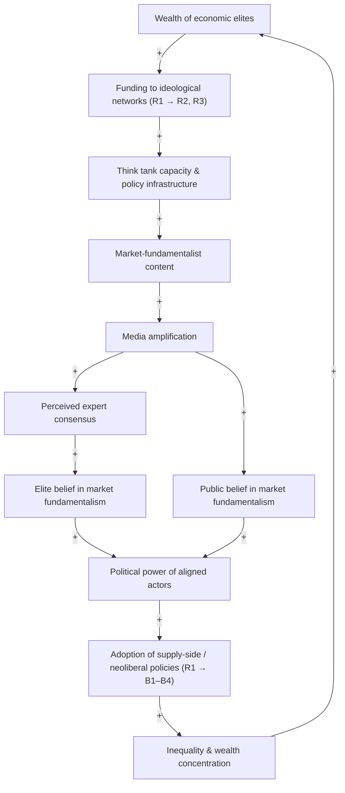
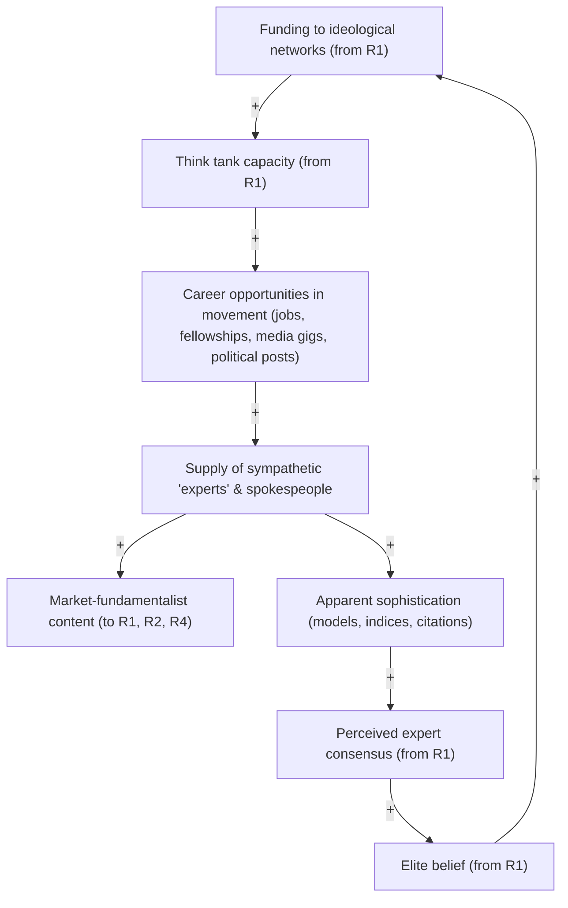
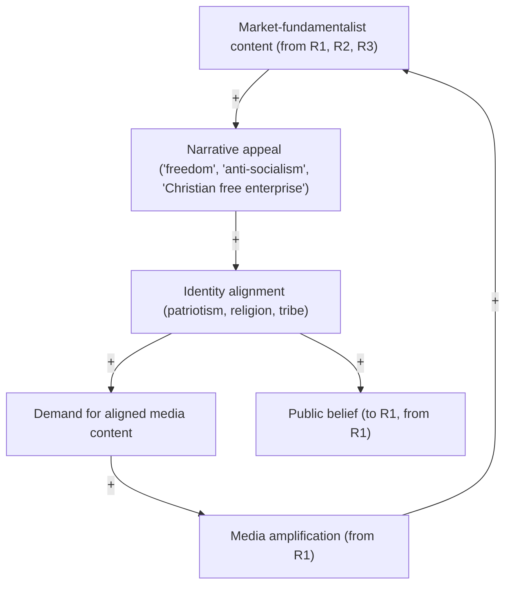
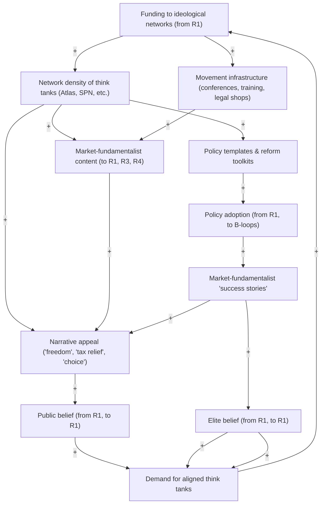
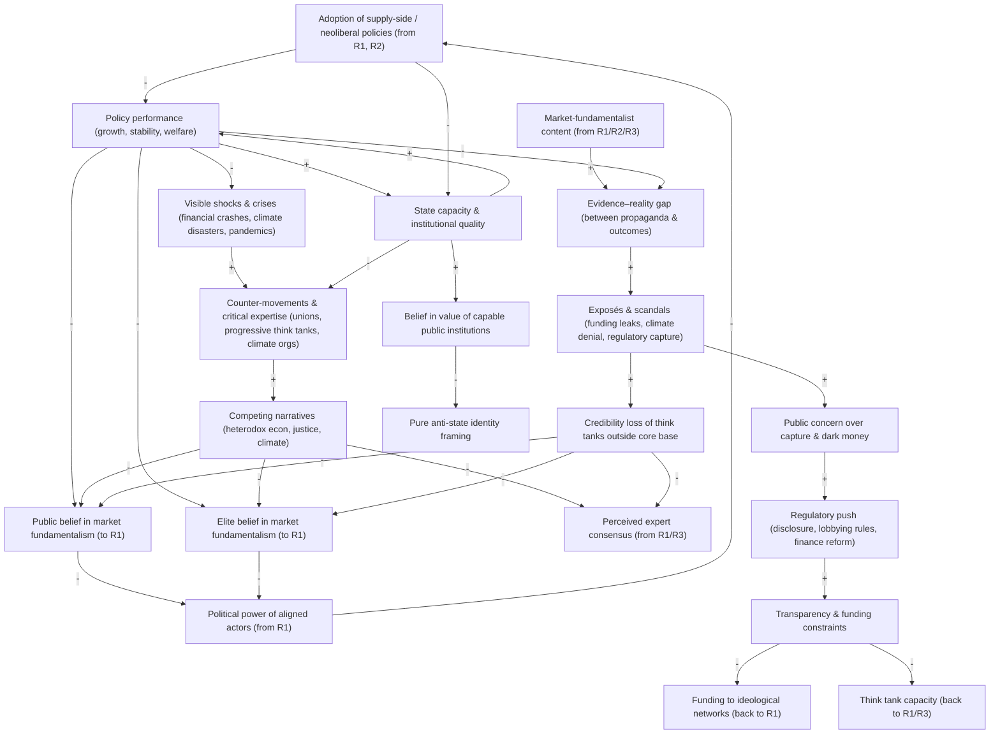
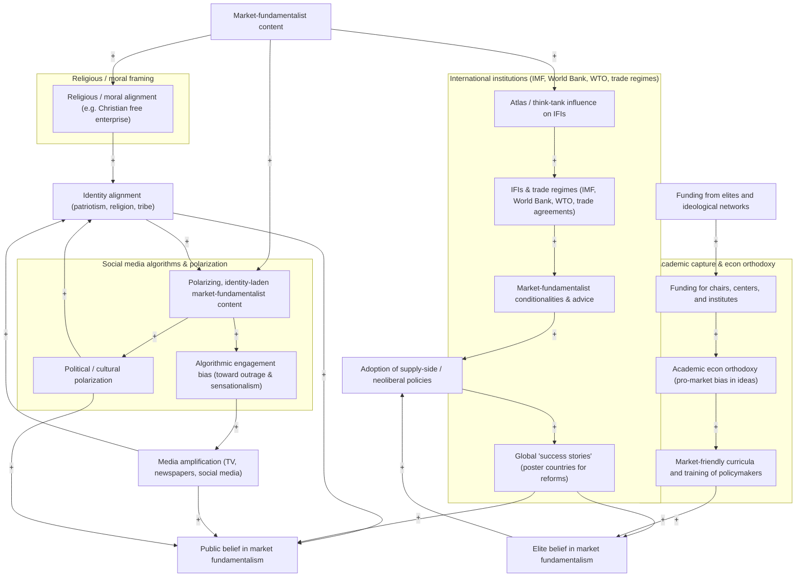

# The Market Fundamentalism Feedback Loop

In the first two parts of this blog series, I explained why supply side economics is theoretically and empirically weak. I then discussed why the ideology persists within the public. I want to be a tad bit more rigorous in this post. I've alluded to the fact that supply-side economics is normally combined with austerity policies. We also introduced market fundamentalism; the extension of neoliberal market ideologies to all facets of life. In this post, I will treat all of these concepts as equivalent, and we will construct a system dynamics model that encapsulates some of the causal forces introduced last post. 

Here we will introduce the [Atlas Network](https://en.wikipedia.org/wiki/Atlas_Network) and the [State Policy Network (SPN)](https://en.wikipedia.org/wiki/State_Policy_Network); two organizations that act as the "think tanks" for "think tanks". They are essentially hubs in a network that are basically **infrastructure for market fundamentalism** – not just on narrow tax policy, but across austerity, neoliberal “reforms,” climate inaction, and libertarian culture-war stuff. They provide instruction, training, and funding for new think tanks that propagate these bad ideas. 

Across the Atlas ecosystem and related conservative/libertarian think tanks you see a **bundle** of ideas repeatedly:

* **Supply-side economics** – tax cuts, deregulation, labor “flexibility,” privatization framed as growth engines.
* **Austerity & “fiscal responsibility”** – spending caps, balanced-budget rules, welfare and pension cuts, often in the middle of downturns.
* **Neoliberal structural reforms** – privatizing utilities and pensions, trade and capital account liberalization, independent central banks *plus* weakened unions and social protections.
* **Climate inaction / environmental skepticism** – from full denial to “delay/derail” strategies that oppose binding regulations. ([Brown Climate Social Science Network][1])
* **Libertarian cultural politics** – anti-union, school vouchers/charters, “parental choice,” anti-DEI, anti-ESG, hostility to public health mandates, etc.

Atlas Network in particular describes its mission as supporting “classically liberal” and “pro-freedom” organizations worldwide, helping them learn how to “win the battle for hearts and minds” on free markets and small government. ([Wikipedia][2]) They’re explicitly extending **market fundamentalism** into everything from pensions and schools to environmental regulation and culture.

Atlas is literally a **meta-network**. Founded 1981, now claims **~580–590 partner organizations in 100+ countries**. ([Wikipedia][2]) Its budget is around **$24–28M/year**, with **$7–8M in grants** to partners and ~4,000 people trained annually through “Atlas Network Academy” on fundraising, marketing, leadership, and campaign tactics. ([Wikipedia][2]) Its self-described as a connector: “a think tank that creates think tanks,” giving seed grants, training, and networking to pro-market groups globally. ([Wikipedia][2]) Recent research (Vucetic 2024, “Atlas Asunder?”) treats Atlas as a **global neoliberal thought network** and analyzes dozens of partner orgs’ outputs from 2017–22, finding they prioritize “free market” causes and often see rising radical-right movements as tactical allies rather than threats. ([OUP Academic][3]) Investigative work (Lee Fang, Intercept) shows Atlas-linked think tanks deeply involved in **Latin American politics**, training activists and politicians who helped implement austerity/privatization agendas and undermine left governments in Brazil, Argentina, Bolivia, etc. ([Alainet][4])

In the U.S., the **State Policy Network (SPN)** mirrors Atlas at the state level. It was formed in 1992 as an outgrowth of Heritage-inspired state groups; now has **65+ member think tanks in all 50 states** and hundreds of affiliates. ([Wikipedia][5]) Its explicit mission: advance “market-oriented public policy solutions” and “limited government” at the state level. ([Wikipedia][5]) It generates about ~**$25–27M/year** in revenue, plus tens of millions in combined revenues among affiliates. ([Wikipedia][5]) Its closely linked to ALEC (model right-wing state legislation) and to major national advocacy orgs like Americans for Prosperity and Americans for Tax Reform. ([Wikipedia][5]) SPN affiliates push state tax cuts and spending caps, welfare cuts and Medicaid rollbacks, school vouchers and union attacks (“workplace freedom”), and deregulation in energy, environment, and labor. ([Wikipedia][5]) Hertel-Fernandez’s book *State Capture* basically argues SPN + ALEC + Koch groups have **reengineered state policy regimes** to lock in neoliberal and anti-labor rules. ([Wikipedia][5])

There are three big funding patterns:

   1. Billionaire / corporate families & foundations: Jane Mayer’s *Dark Money* documents a core set of right-wing billionaire families whose foundations built this infrastructure: **Koch, Scaife (Mellon heir), Bradley, Olin, Coors, DeVos, etc.** ([Wikipedia][6])

   * Koch network: seeded Cato, heavily funded Americans for Prosperity, AEI, etc. ([Wikipedia][7])
   * Scaife: gave ~$23M to Heritage and was previously the largest single donor to AEI. ([The Guardian][8])
   * Bradley and others fund SPN and state-level groups. ([Wikipedia][5])

   2. Donor-advised “dark money” conduits: A lot of the funding flows through **DonorsTrust** and **Donors Capital Fund**, donor-advised funds explicitly marketed as a “dark money ATM for the conservative movement.” ([The Guardian][9]) In 2024, DonorsTrust alone granted about **$195M** to more than 300 right-wing influence groups, litigation centers, media outlets, and climate deniers. ([EXPOSEDbyCMD][11])

   * Investigations show DonorsTrust and Donors Capital funneled tens or hundreds of millions into:

   * SPN affiliates,
   * climate denial and “free-market” think tanks,
   * right-wing media outlets. ([Center for Public Integrity][10])

   3. Fossil fuel and tobacco money: Conservative think tanks’ role in climate and tobacco policy is heavily documented. Robert Brulle’s funding analysis calls these conservative foundations and front groups the core organizational base of the climate denial movement. ([Scientific American][12])

   * Atlas itself received funding from **Koch-affiliated groups, ExxonMobil Foundation, and tobacco industry** in earlier decades; many partners were funded by tobacco companies in the 1990s–2000s and acted to oppose tobacco control. ([Wikipedia][2])
   * Dunlap & McCright and others show fossil-fuel-funded think tanks (Heritage, Cato, Heartland, etc.) as central **nodes in the climate denial countermovement**. ([Brown Climate Social Science Network][1])

From a systems / network perspective, Atlas, SPN, and cousin networks act as **central hubs** in a multi-layered graph. The core strategies. Atlas and SPN don’t just fund ideas; they **manufacture organizations**; they are seeding and scaling nodes (“think tank that creates think tanks”). Grants of a few thousand dollars and training help launch new think tanks, especially in the Global South (Peru’s ILD, think tanks in Africa, Eastern Europe, etc.). ([Wikipedia][2]) These new nodes import a shared **ideological template** (free markets, anti-statism) and **organizational playbook** (policy papers, op-eds, “index” reports, media outreach). This is classic **scale-free network growth**: central hubs preferentially attach to new nodes that share their ideology, creating a network with a small number of highly connected hubs (Atlas, SPN, Koch-related funds) and many peripheral but aligned nodes.

Atlas explicitly runs Atlas Network Academy and regional Liberty Forums to teach partners how to frame issues as moral battles (freedom vs statism), fundraising and marketing skills, and media engagement and grassroots organizing. ([Wikipedia][2]) ABC News described partners as being trained to “win the battle for hearts and minds” – this is *not* just white papers; it’s political communication. ([Wikipedia][2]) SPN similarly offers training so state think tanks “run like business franchises,” aligned around school choice, tax cuts, union weakening, and deregulation. ([Wikipedia][5])

Conservative think tanks produce **“policy-based evidence”** (studies, indexes, and contrarian books) in multiple forms: short “studies” supporting tax cuts, deregulation, privatization, and austerity; freedom / economic freedom indices that encode neoliberal metrics and shame countries/states with strong public sectors; and climate-skeptic books and reports that manufacture uncertainty about science. Dunlap and colleagues show a strong link between conservative think tanks and **108 climate change denial books**, arguing these are key vehicles for attacking mainstream climate science. ([PMC][13]) Boussalis & Co. show the **volume of climate contrarian content from conservative think tanks has grown sharply**, with messaging shifting from “is climate change real?” to “policy responses are harmful,” which aligns with delaying or weakening regulation. ([ScienceDirect][14])

Information flows through several paths as Multi-channel diffusion (media, social media, and politics). First is the **Think tank → media** channel. This includes Op-eds, press releases, and policy briefings. It also includes journalists on deadline who quote them as “experts,” especially in ideological media ecosystems. Another is the **Think tank → politicians & staffers** channel, consisting of Model bills (via ALEC & SPN) and Policy blueprints (Heritage’s *Mandate for Leadership*; *Project 2025*). ([The Guardian][9]) Very important for the modern information age is the **Think tank → movement organizations & influencers** channel. This consists of training activists (Free Brazil Movement, Latin American youth orgs, Tea Party/AFP activists). ([Alainet][4]) and supplying talking points and “studies” to pastors, YouTubers, and movement media. Lastly, there is the **Think tank → public** channel in which think tanks communicate directly with the public in some form or another. For example, Branded “Tax Freedom Day,” “economic freedom” rankings, “welfare dependency” narratives that become part of popular vocabulary. From a systems perspective, think tanks are **information hubs** with high betweenness centrality: they sit between billionaire donors, politicians, media, and grassroots supporters and control what “expert knowledge” flows between them.

There is also a clear pattern of pushing market fundamentalism into the culture more broadly outside of the economic domain. McCright, Dunlap, and others call conservative think tanks a **“denial machine”**; They turn a narrow economic skepticism about regulation into **full-spectrum environmental skepticism**: climate, pollution, environmental health, often libertarianized as “property rights” issues. ([Brown Climate Social Science Network][1]) Atlas has historically helped partner think tanks oppose tobacco controls and later vape regulation, aligning with corporate interests while deploying generic “freedom / consumer choice / nanny state” framing. ([Wikipedia][2]) Climate denial messaging has diffused **transnationally**: from US think tanks to UK, Canada, Australia, New Zealand, and beyond, via networks like Atlas and SPN. ([sciencepolicy.colorado.edu][15]) More broadly, SPN and Atlas partners push: **School vouchers & charters** as “choice” – marketizing education ([Wikipedia][5]), **Healthcare privatization and anti-Medicaid expansion** – marketizing health ([Wikipedia][5]), **Attacks on unions and collective bargaining** as “workplace freedom” ([Wikipedia][5]) and **Anti-DEI/ESG campaigns** reframed as “protecting shareholders” and “keeping politics out of business,” again weaponizing a narrow market logic. This is what Wendy Brown calls neoliberalism as a **political rationality**: everything – schools, families, democracy, identity – is reframed in market terms (competition, choice, human capital), and think tanks are the engineers of that reframing.

From a systems-dynamics angle, you can think of this as a set of **reinforcing feedback loops**. This is what we will be analyzing in this post. For example, there is a reinforcing loop : Wealth → influence → policy → more wealth; a classic **positive feedback loop** – a political economy version of a compound-interest process.

1. **Wealthy donors & corporations** fund think tanks and networks.
2. Think tanks design and promote **policies that increase returns to capital** (tax cuts, deregulation, weakened labor/environment rules).
3. These policies further **concentrate wealth** among the same elites.
4. Increased wealth → more funding capacity to expand the network.

We can also construct a second reinforcing loop: Narrative → belief → support → capacity:

1. **Think tanks generate narratives**: “tax cuts grow the economy,” “regulation kills jobs,” “climate policies hurt the poor,” etc.
2. These narratives spread through media, churches, schools, and activist networks, shaping **public and elite beliefs**.
3. Believers donate, vote, and consume partisan media, which in turn increases **demand** for think-tank content and **political clout** for aligned politicians.
4. Success stories (“we defeated X bill,” “we elected Y”) increase **credibility and in-group loyalty**, leading to more support and more narrative production.

Over time, this can create **epistemic closure**: inside the movement’s information network, only in-network “experts” (Heritage, AEI, Atlas partners) are trusted; critical scholarship is dismissed as partisan or “globalist.” That’s exactly the “apologetics” dynamic we noted earlier: conclusion-first, community-reinforced, and self-sealing. Structural features that keep the system closed to outside influence via aspects such as: 

* **Donor anonymity** (via DonorsTrust, etc.) breaks the accountability loop between source and public; you see the message, not the money. ([Center for Public Integrity][10])
* **Network density and homophily**: Atlas/SPN affiliates mostly cross-reference each other, invite each other to conferences, and publicize each others’ work, increasing perceived “consensus” within the bubble. ([Wikipedia][2])
* **Parallel media ecosystem**: when your “experts” appear constantly on Fox, talk radio, YouTube, aligned newspapers, there is little incentive for your audience to ever check what, say, the IMF or mainstream econ journals are saying.

In system terms, you’ve got a **self-reinforcing attractor**: once actors enter this basin (funders, think tanks, politicians, activists, citizens), everything from incentives to identity keeps them orbiting inside it, even when external evidence contradicts the core beliefs.

The reach is quite broad. A few concrete indicators:

* **Atlas**: ~580–590 partner organizations in 100+ countries; multi-million-dollar grant-making and thousands trained annually (we will look at map plots of this later). ([Wikipedia][2])
* **SPN**: at least one affiliate in each U.S. state; combined revenues of network orgs in the tens of millions; active on tax, labor, education, welfare, environment. ([Wikipedia][5])
* **DonorsTrust / Donors Capital**: almost $200M in 2024 alone to 300+ right-wing groups; tens of millions annually for more than a decade prior. ([EXPOSEDbyCMD][11])
* **Climate denial**: conservative think-tank climate output has grown rapidly, and think-tank-linked denial books form a key spine of the global denial movement. ([ScienceDirect][14])

And in Latin America in particular, investigations show Atlas-affiliated think tanks helping shape party platforms, advise ministers, and coordinate campaigns against left governments, using imported “free market / anti-corruption / anti-statist” narratives. ([Alainet][4]) So this isn’t marginal. It’s a **globalized ideological supply chain**.

Now, given this background, lets go ahead and build a systems dynamics model. We will first define the main variables, then lay out the **reinforcing (R)** and **balancing (B)** loops that explain how supply-side / market-fundamentalist ideas spread via think-tank networks (Atlas, SPN, Heritage/AEI orbit, etc.).

---

## 1. Core variables (what’s on the diagram)

Think in four layers:

**Resources & structure**

* **Wealth of economic elites (WEALTH)**
* **Donor funding to ideological networks (FUNDING)**
* **Think tank network size/density (NETWORK_DENSITY)**
* **Think tank capacity (TT_CAP)** – staff, comms, research, training
* **Movement infrastructure (INFRA)** – conferences, training programs, legal shops, media outlets

**Information & narratives**

* **Market-fundamentalist content volume (MF_CONTENT)** – papers, op-eds, TV hits, social posts
* **Perceived expert consensus on markets (PERCEIVED_CONSENSUS)**
* **Media amplification (MEDIA_AMP)** – how often these orgs show up as “experts”
* **Resonant narratives / frames (NARRATIVE_APPEAL)** – “tax cuts create growth,” “regulation = socialism,” “freedom vs nanny state,” etc.

**Beliefs & politics**

* **Public belief in market fundamentalism (PUBLIC_BELIEF)**
* **Elite belief / policy preferences (ELITE_BELIEF)** – among politicians, judges, high-level bureaucrats
* **Political power of aligned actors (POLITICAL_POWER)** – seats, committee chairs, appointments
* **Policy adoption of supply-side/neoliberal reforms (POLICY_ADOPTION)**

**Outcomes & feedback**

* **Inequality / wealth concentration (INEQUALITY)**
* **Regulatory capacity & state legitimacy (STATE_CAPACITY)** – quality of public institutions, enforcement, social trust
* **Policy performance (POLICY_PERFORMANCE)** – growth, stability, crises, social indicators
* **Counter-movement strength (COUNTER_MVT)** – unions, progressive think tanks, climate/justice orgs
* **Systemic shocks (SHOCKS)** – crises that visibly contradict the narrative (financial crashes, climate disasters, pandemics)

We’ll hook these together in loops.

---

## 2. Big reinforcing loops (the “engine” of propagation)

### R1 – **Wealth → funding → policy → more wealth**

*(The classic plutocratic growth loop)*

1. **WEALTH (+) → FUNDING**

   * More concentrated wealth among economic elites → more surplus cash available to funnel into Atlas/SPN/Heritage-type networks.

2. **FUNDING (+) → TT_CAP & INFRA**

   * More money → more staff, better comms teams, more training programs, more spin-offs (new think tanks, front groups, student orgs).

3. **TT_CAP & INFRA (+) → MF_CONTENT**

   * Capacity and infrastructure allow high volumes of reports, op-eds, “indexes,” YouTube content, training sessions, school curricula.

4. **MF_CONTENT (+) → MEDIA_AMP & PERCEIVED_CONSENSUS**

   * Journalists and platforms under time pressure quote “experts” who are always available. Repetition across many branded orgs creates the **illusion of a broad expert consensus** around market fundamentalism.

5. **MEDIA_AMP & PERCEIVED_CONSENSUS (+) → ELITE_BELIEF & PUBLIC_BELIEF**

   * Politicians, judges, and voters internalize “everyone knows” tax cuts & deregulation are the route to growth and freedom.

6. **ELITE_BELIEF (+) → POLITICAL_POWER & POLICY_ADOPTION**

   * Market-fundamentalist elites win elections, staff agencies, and implement supply-side, austerity, privatization, and deregulatory policies.

7. **POLICY_ADOPTION (+) → INEQUALITY & WEALTH**

   * The policies themselves **increase profits, asset prices, and top-end incomes**, further concentrating WEALTH among the same class that funds the network.

8. **INEQUALITY (+) → WEALTH**

   * More inequality → more wealth available to be used as political capital → back to **FUNDING**.

This is the central **reinforcing loop R1**:

> WEALTH → FUNDING → TT_CAP → MF_CONTENT → BELIEFS → POLICY → WEALTH

### Diagram 1 – Core political economy loop (R1)

- This is the engine: wealth → funding → think tanks → content → belief → policy → more wealth.

---

### R2 – **Network growth & ideological diffusion**

*(The Atlas/SPN “think tank that creates think tanks” loop)*

1. **FUNDING (+) → NETWORK_DENSITY & INFRA**

   * Atlas/SPN use money to **seed new think tanks**, train staff, and convene regional forums.

2. **NETWORK_DENSITY (+) → MF_CONTENT & MEDIA_AMP**

   * More nodes = more reports + more local “experts” in more places.
   * Journalists and local officials keep seeing different org logos echoing the same ideas → stronger PERCEIVED_CONSENSUS.

3. **NETWORK_DENSITY (+) → NARRATIVE_APPEAL**

   * The same frames (e.g., “Tax Freedom Day,” “economic freedom index,” “school choice”) get **localized and culturally adapted**, making them more resonant.

4. **NARRATIVE_APPEAL (+) → PUBLIC_BELIEF & ELITE_BELIEF**

5. **BELIEFS (+) → DEMAND for aligned think tanks**

   * More receptive audience → easier recruiting of young staff, politicians, donors.

6. **DEMAND (+) → FUNDING & NETWORK_DENSITY**

   * Donors see “impact” (media hits, policy wins, social media traction) → more willing to fund expansion and spin-offs.

That’s **R2**:

> FUNDING → NETWORK_DENSITY → MF_CONTENT → BELIEFS → DEMAND → FUNDING

Atlas and SPN are specifically engineered to exploit this loop.

---

### R3 – **Career incentives & intellectual supply**

*(Why you get a steady supply of “experts”)*

1. **TT_CAP & INFRA (+) → CAREER_OPPORTUNITIES_IN_MOVEMENT**

   * Fellowships, think-tank jobs, media gigs, speaking circuits, consulting, political appointments.

2. **CAREER_OPPORTUNITIES (+) → SUPPLY_OF_INTELLECTUALS & SPOKESPEOPLE**

   * Smart ambitious people (including PhDs) realize there’s a career path if they play inside the ideology.

3. **SUPPLY_OF_INTELLECTUALS (+) → MF_CONTENT & APPARENT SOPHISTICATION**

   * More white papers, models, “studies,” polished media performances → movement looks intellectually serious.

4. **APPARENT SOPHISTICATION (+) → PERCEIVED_CONSENSUS & ELITE_BELIEF**

   * The more “serious” it all looks, the more elites feel safe citing it.

5. **ELITE_BELIEF (+) → POLICY_ADOPTION → DONOR SATISFACTION → FUNDING**

6. **FUNDING (+) → TT_CAP & INFRA**

That’s **R3**:

> TT_CAP → CAREER_OPPORTUNITIES → INTELLECTUAL_SUPPLY → MF_CONTENT → LEGITIMACY → FUNDING → TT_CAP

This is the “apologetics industrial complex” parallel: the system **rewards** people who can generate “evidence” for fixed conclusions.

### Diagram 2 – Careers & “expertise” loop (R3)

- This is the apologetics-industrial-complex loop: why you get a steady stream of “experts.”

---

### R4 – **Narrative–identity–media loop**

*(Turning ideas into identity and culture)*

1. **MF_CONTENT & NARRATIVE_APPEAL (+) → IDENTITY_ALIGNMENT**

   * Messages are framed as “American values,” “Christian values,” “patriotism,” “freedom,” “anti-communism,” etc., making belief a matter of identity, not just opinion.

2. **IDENTITY_ALIGNMENT (+) → MEDIA_DEMAND & AUDIENCE_LOYALTY**

   * Audiences seek media that fits their identity (Fox, talk radio, YouTube channels, newsletters).

3. **MEDIA_DEMAND (+) → MEDIA_AMP**

   * Media outlets amplify think-tank content because it resonates and drives engagement.

4. **MEDIA_AMP (+) → MF_CONTENT VISIBILITY**

5. **VISIBILITY (+) → IDENTITY_ALIGNMENT & PUBLIC_BELIEF**

This is **R4**:

> MF_CONTENT → IDENTITY → MEDIA_DEMAND → MEDIA_AMP → MF_CONTENT (visibility)

It closes the epistemic bubble: changing your mind now threatens your identity and tribe.

### Diagram 3 – Identity & media loop (R4)

- This shows how market fundamentalism becomes part of identity and culture, locking in belief.

---

### R5 – **Global policy diffusion loop**

*(Atlas exporting neoliberal scripts worldwide)*

1. **NETWORK_DENSITY (global) (+) → POLICY_TEMPLATE_AVAILABILITY**

   * Pre-packaged reforms: voucher laws, pension privatization, deregulation scripts, “economic freedom” benchmarking.

2. **POLICY_TEMPLATE_AVAILABILITY (+) → POLICY_ADOPTION in multiple countries**

   * Especially when:

   * international lenders,

   * trade bodies,

   * or regional elites are already leaning that way.

3. **POLICY_ADOPTION (+) → SUCCESS_STORIES (or at least narratives of success)**

   * “Look at Chile / Estonia / Georgia / [X] after our reforms!”
   * Whether or not the full evidence supports the story.

4. **SUCCESS_STORIES (+) → NARRATIVE_APPEAL & ELITE_BELIEF elsewhere**

5. **ELITE_BELIEF (+) → DEMAND for Atlas/SPN-style think tanks in new countries**

6. **DEMAND (+) → FUNDING & NETWORK_DENSITY**

That’s **R5**:

> NETWORK_DENSITY → POLICY_TEMPLATES → POLICY_ADOPTION → SUCCESS_STORIES → BELIEF → DEMAND → NETWORK_DENSITY

This is why you see similar policy packages and talking points popping up in very different countries.

### Diagram 4 – Network growth & global diffusion (R2 + R5)

- This shows Atlas/SPN-style network formation and how “success stories” spread globally.

---

## 3. Balancing loops (countervailing forces & potential failure modes)

Even powerful ideological systems face constraints. These are **balancing loops (B)** that can dampen or reverse the growth of market fundamentalism.

### B1 – **Empirical reality & policy failure**

1. **POLICY_ADOPTION (extreme supply-side/austerity) (−) → POLICY_PERFORMANCE**

   * Deep inequality, fiscal crises, financial crashes, decaying public services, visible climate harms.

2. **POLICY_PERFORMANCE (−) → STATE_LEGITIMACY & PUBLIC_BELIEF**

   * People experience precarity, crises, and state failure.

3. **Poor PERFORMANCE (+) → SHOCKS & CRITICAL_PUBLIC_DEBATE**

4. **SHOCKS & DEBATE (+) → COUNTER_MVT & CRITICAL_SCHOLARSHIP visibility**

   * Progressive think tanks, unions, climate/justice movements, and heterodox economists gain audience.

5. **COUNTER_MVT (+) → COMPETING_NARRATIVES (−) PUBLIC_BELIEF in market fundamentalism**

6. **Lower PUBLIC_BELIEF (−) → POLITICAL_POWER of market-fundamentalist actors → less POLICY_ADOPTION**

That’s **B1**:

> Extreme POLICY_ADOPTION → bad OUTCOMES → SHOCKS → COUNTER_MOVEMENT → reduced BELIEF → reduced POLICY_ADOPTION

There’s often a **delay** here: short-term booms can mask long-run fragility (e.g., pre-2008 financialization, pre-crisis austerity) so the balancing effect kicks in late.

---

### B2 – **Credibility / scandal loop**

1. **MF_CONTENT BIAS & LOW RIGOR (+) → EVIDENCE-REALITY GAP**

   * The more propaganda-ish the “research,” the larger the gap with mainstream academic and empirical findings.

2. **EVIDENCE-REALITY GAP (+) → EXPOSÉS & REPUTATIONAL HITS**

   * Investigative journalism, leaked documents, academic critiques (e.g., climate denial funding, tobacco links).

3. **REPUTATIONAL_HITS (+) → CREDIBILITY_LOSS (−) PERCEIVED_CONSENSUS & ELITE_BELIEF**

   * Some elites and media start to see the think tanks as partisan shops, not neutral experts.

4. **CREDIBILITY_LOSS (−) → MEDIA_AMP & POLICY_ADOPTION**

That’s **B2**:

> Propaganda excess → credibility crisis → reduced influence

This loop is often weak inside the core right-wing media ecosystem (which will shield its own think tanks) but stronger in more pluralistic or technocratic venues (courts, bureaucracies, some mainstream outlets).

---

### B3 – **Regulation & transparency loop**

1. **REVELATIONS about dark money & influence (+) → PUBLIC_CONCERN**

   * Leaks, academic work, and campaigns reveal donor networks, conflicts of interest, and corporate capture.

2. **PUBLIC_CONCERN (+) → REGULATORY_PUSH (disclosure, lobbying rules, campaign finance rules)**

3. **REGULATORY_PUSH (+) → TRANSPARENCY & FUNDING_CONSTRAINTS (−) FUNDING**

   * Harder to use anonymous donor-advised funds; disclosure can deter some donors or change behavior.

4. **Lower FUNDING (−) → TT_CAP & INFRA → weaker MF_CONTENT & MEDIA_AMP**

That’s **B3**:

> Exposure → regulation → funding limits → reduced capacity

---

### B4 – **Institutional capture → institutional collapse**

This is subtler, but important.

1. **POLICY_ADOPTION (anti-union, anti-public investment, deregulatory) (−) → STATE_CAPACITY**

   * Degraded public services, regulatory agencies, and civil service capacity.

2. **STATE_CAPACITY (−) → ABILITY_TO_DELIVER_BASIC_GOODS**

   * Lower quality schools, infrastructure, healthcare, catastrophe response.

3. **FAILURE_TO_DELIVER (+) → LEGITIMACY_CRISIS & POLITICAL_VOLATILITY**

   * People lose trust not only in “big government,” but in institutions *overall*, including property rights and rule of law.

4. **VOLATILITY (−) → FAVORABILITY_FOR PREDICTABLE MARKETS**

   * Even many capitalists prefer stability; chaos can make investors flee or demand a different model (sometimes authoritarian, sometimes social democratic).

5. **DEMAND_FOR_ALTERNATIVES (+) → COUNTER_MVT & POLICY_REORIENTATION (−) POLITICAL_POWER of supply-side ideologues**

That’s **B4**:

> Market fundamentalism undermines the very institutional foundations markets need, eventually reducing its own appeal.

### Diagram 5 – Outcomes, shocks, and balancing loops (B1–B4)

- This diagram pulls in policy performance, crises, counter-movements, credibility, and regulation.

---

## 4. Other causal influences

* **Religious / moral framing**

  * Variable: **RELIGIOUS_ALIGNMENT**
  * MF_CONTENT → RELIGIOUS_ALIGNMENT (via Christian free enterprise narratives) → IDENTITY_ALIGNMENT → PUBLIC_BELIEF.
* **International institutions**

  * Variable: **IFIs & TRADE_REGIMES** (IMF, World Bank, WTO)
  * Atlas/think tanks → influence IFI discourse → embed market-fundamentalist conditionalities → POLICY_ADOPTION in debtor countries → SUCCESS_STORIES.
* **Academic capture**

  * Variable: **ACADEMIC_ECON_ORTHODOXY**
  * FUNDING (via chairs, centers) → selective support for pro-market scholars → more market-friendly curricula → ELITE_BELIEF among future policymakers → POLICY_ADOPTION.
* **Social media algorithms**

  * Variables: **ALGO_ENGAGEMENT_BIAS**, **POLARIZATION**
  * Polarizing, identity-laden market-fundamentalist content performs well → ALGO amplifies → MEDIA_AMP → PUBLIC_BELIEF & IDENTITY_ALIGNMENT → more polarizing content → etc. (another reinforcing loop).

## Diagram 6 - Other Causal Influences

* **Religious / moral framing**

  * `mf_content → religious_align → identity_align → public_belief`
    - Market-fundamentalist ideas are wrapped in religious language (Christian free enterprise, prosperity gospel, etc.), reinforcing identity and belief.

* **International institutions**

  * `mf_content → atlas_tt → ifi_trade → cond_policies → policy_adopt → success_stories → public_belief / elite_belief`
    - Think tanks shape IFI discourse; conditionalities and advice embed market fundamentalism in debtor countries; “success stories” are then used as global proof.

* **Academic capture**

  * `f_funding_acad → funding_chairs → econ_orthodoxy → curricula → elite_belief → policy_adopt`
    - Targeted funding shapes econ departments and centers, which shapes what future policymakers learn, feeding elite belief and policy choices.

* **Social media & algorithms**

  * `mf_content + identity_align → polarizing_content → algo_bias → media_amp → public_belief & identity_align`
    - Polarizing, identity-laden content performs well, so algorithms amplify it, boosting both belief and identity alignment — and polarization further reinforces that.

[1]: https://cssn.org/wp-content/uploads/2020/12/DunlapMcCrightRoutledgeHB2010.pdf?  "14 Climate change denial: sources, actors and - strategies"
[2]: https://en.wikipedia.org/wiki/Atlas_Network?  "Atlas Network"
[3]: https://academic.oup.com/ia/article-pdf/100/5/2173/59032962/iiae132.pdf?  "Atlas asunder? Neo-liberal think tanks and the radical right"
[4]: https://www.alainet.org/en/articulo/187421?  "Sphere of Influence: How American Libertarians Are ..."
[5]: https://en.wikipedia.org/wiki/State_Policy_Network?  "State Policy Network"
[6]: https://en.wikipedia.org/wiki/Dark_Money_%28book%29?  "Dark Money (book)"
[7]: https://en.wikipedia.org/wiki/Koch_network?  "Koch network"
[8]: https://www.theguardian.com/us-news/2016/jan/17/dark-money-review-nazi-oil-the-koch-brothers-and-a-rightwing-revolution?  "Dark Money review: Nazi oil, the Koch brothers and a ..."
[9]: https://www.theguardian.com/environment/2015/jun/09/secretive-donors-gave-us-climate-denial-groups-125m-over-three-years?  "Secretive donors gave US climate denial groups $125m ..."
[10]: https://publicintegrity.org/politics/donors-use-charity-to-push-free-market-policies-in-states/?  "Donors use charity to push free-market policies in states"
[11]: https://www.exposedbycmd.org/2025/11/21/dark-money-donor-conduit-funneled-195-million-to-right-wing-groups-in-2024/?  "Dark Money Donor Conduit Funneled $195 Million to Right ..."
[12]: https://www.scientificamerican.com/article/dark-money-funds-climate-change-denial-effort/?  "\"Dark Money\" Funds Climate Change Denial Effort"
[13]: https://pmc.ncbi.nlm.nih.gov/articles/PMC3787818/?  "Climate Change Denial Books and Conservative Think Tanks"
[14]: https://www.sciencedirect.com/science/article/abs/pii/S0959378015300728?  "Text-mining the signals of climate change doubt"
[15]: https://sciencepolicy.colorado.edu/students/envs_5000/mccright_2011.pdf?  "Cool dudes"
