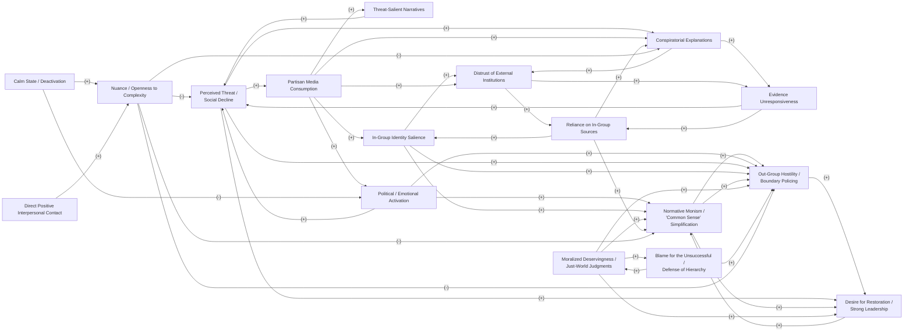

# Appendix A — Conceptual Latent-Factor Model

This first diagram is **SEM-style / CFA-style**, but conceptual rather than estimated.  
It shows:

- six latent factors,
- a selected set of observable indicators,
- several correlations among the latent factors,
- and a contextual **state / media activation** box.

```mermaid
flowchart TB

%% ----------------------------
%% LATENT FACTORS
%% ----------------------------

subgraph L["Latent Factors"]
    F1((F1: Epistemic Defensiveness<br/>/ Conspiratorial Cognition))
    F2((F2: Threatened-Order<br/>Grievance / Restoration))
    F3((F3: Tribal Identity<br/>/ Boundary Policing))
    F4((F4: Hierarchy, Merit,<br/>and Deservingness))
    F5((F5: Naive Voluntarism<br/>about Choice))
    F6((F6: Normative Monism<br/>/ Authoritarian Conventionalism))
end

%% ----------------------------
%% OBSERVED INDICATORS
%% ----------------------------

subgraph O["Observed Indicators / Manifest Behaviors"]
    X1["Institutional distrust"]
    X2["'They are lying to you'<br/>rhetoric"]
    X3["Evidence unresponsiveness"]
    X4["Argument shotgunning"]

    X5["'Fallen society'<br/>rhetoric"]
    X6["Existential threat inflation"]
    X7["Poor relative risk assessment"]
    X8["Feeling of being wronged"]

    X9["'Libs' / out-group labeling"]
    X10["Whataboutism"]
    X11["Defensive in-group apologetics"]
    X12["'True Americans' rhetoric"]

    X13["Identification with billionaires"]
    X14["Wealth as evidence of<br/>intelligence / virtue"]
    X15["Anti-'handout'<br/>moral framing"]
    X16["Poverty as self-caused"]

    X17["'They chose it' rhetoric"]
    X18["Ignoring structural constraints"]
    X19["Ignoring stochastic shocks / luck"]
    X20["Outcome = character logic"]

    X21["'Common sense' rhetoric"]
    X22["Intolerance of alternative lifestyles"]
    X23["One right way / norm enforcement"]
    X24["Punitive reaction to deviation"]

    X25["Xenophobic rhetoric"]
    X26["Hostility to change"]
    X27["Simple solutions / savior rhetoric"]
    X28["Judgmentalism"]
end

%% ----------------------------
%% MAIN LOADINGS
%% ----------------------------

F1 --> X1
F1 --> X2
F1 --> X3
F1 --> X4

F2 --> X5
F2 --> X6
F2 --> X7
F2 --> X8

F3 --> X9
F3 --> X10
F3 --> X11
F3 --> X12

F4 --> X13
F4 --> X14
F4 --> X15
F4 --> X16

F5 --> X17
F5 --> X18
F5 --> X19
F5 --> X20

F6 --> X21
F6 --> X22
F6 --> X23
F6 --> X24

%% ----------------------------
%% CROSS-LOADINGS / OVERLAP
%% ----------------------------

F2 --> X25
F3 --> X25
F6 --> X25

F2 --> X26
F6 --> X26

F2 --> X27
F6 --> X27

F4 --> X28
F5 --> X28
F6 --> X28

%% ----------------------------
%% LATENT CORRELATIONS
%% ----------------------------

F1 --- F2
F1 --- F3
F2 --- F3
F2 --- F6
F3 --- F6
F4 --- F5

%% ----------------------------
%% STATE / MEDIA ACTIVATION
%% ----------------------------

subgraph C["Context / Activation"]
    S["State / Media Activation<br/>- anger / irritation<br/>- perceived threat<br/>- identity salience<br/>- recent partisan media exposure"]
end

S -. moderates expression .-> X1
S -. moderates expression .-> X5
S -. moderates expression .-> X9
S -. moderates expression .-> X13
S -. moderates expression .-> X17
S -. moderates expression .-> X21
S -. amplifies .-> X25
S -. amplifies .-> X26
S -. amplifies .-> X27
S -. amplifies .-> X28
```

---

# Appendix B — Conceptual Feedback / Endogenous Amplification Model

This second diagram is a **causal-loop / systems-dynamics style** model.  
It shows the **reinforcing loops** and one **balancing loop**.

It is designed to visualize:

- endogenous amplification,
- media selection + activation,
- threat and grievance,
- epistemic closure,
- tribal reinforcement,
- deservingness logic,
- and deactivation through interpersonal contact / calm states.

---
