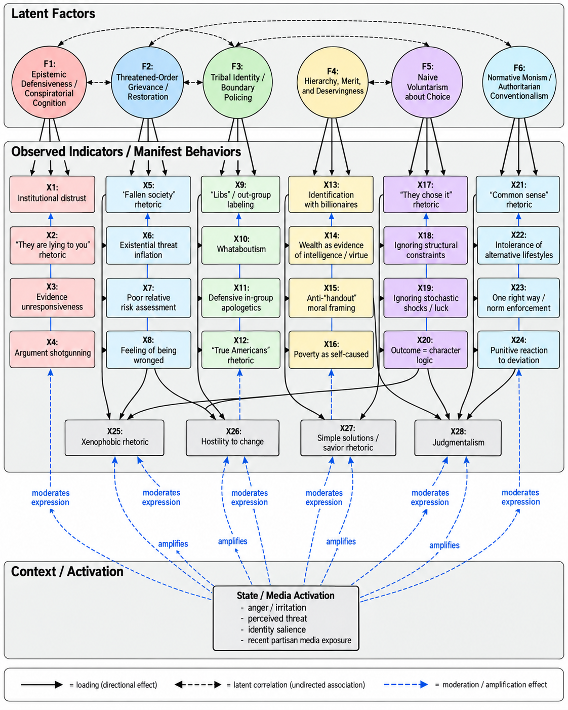
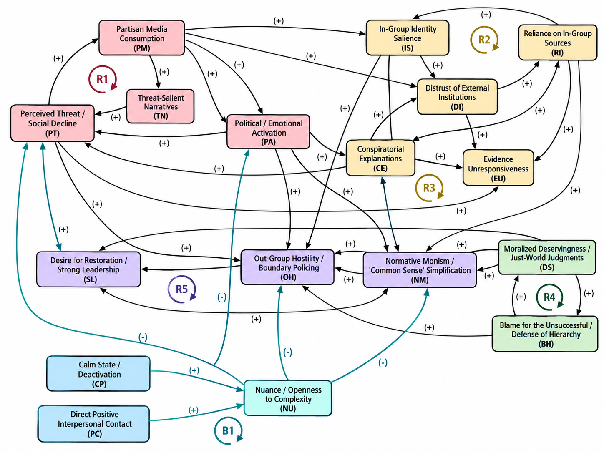

# Is This Simply What “Conservative” Means Now?

## Table of Contents

- **[Part I — From Observation to Model](#part-i--from-observation-to-model)**
  - [I. Something Changed](#i-something-changed)
  - [II. What Does “Conservative” Mean?](#ii-what-does-conservative-mean)
  - [III. From Behavior to Latent Structure](#iii-from-behavior-to-latent-structure)
- **[Part II — Six Dimensions of the Worldview](#part-ii--six-dimensions-of-the-worldview)**
  - [IV. Epistemic Defensiveness and Conspiratorial Cognition](#iv-epistemic-defensiveness-and-conspiratorial-cognition)
  - [V. Threatened Order, Grievance, and the “Fallen Society”](#v-threatened-order-grievance-and-the-fallen-society)
  - [VI. Tribal Identity and Boundary Policing](#vi-tribal-identity-and-boundary-policing)
  - [VII. Hierarchy, Merit, and Deservingness](#vii-hierarchy-merit-and-deservingness)
  - [VIII. Choice-Centered Attribution and the Mythology of “Choice”](#viii-choice-centered-attribution-and-the-mythology-of-choice)
  - [IX. Normative Monism and the Politics of “Common Sense”](#ix-normative-monism-and-the-politics-of-common-sense)
- **[Part III — From Factors to a System](#part-iii--from-factors-to-a-system)**
  - [X. How the Factors Reinforce One Another](#x-how-the-factors-reinforce-one-another)
  - [XI. Fox News as Endogenous Amplifier](#xi-fox-news-as-endogenous-amplifier)
- **[Part IV — Scope, Limits, and Meaning](#part-iv--scope-limits-and-meaning)**
  - [XII. Scope, Alternatives, and Falsifiability](#xii-scope-alternatives-and-falsifiability)
  - [XIII. Is This Simply What “Conservative” Means Now?](#xiii-is-this-simply-what-conservative-means-now)
- [Appendix A — Conceptual latent-factor model](#appendix-a--conceptual-latent-factor-model)
- [Appendix B — Feedback / endogenous amplification model](#appendix-b--feedback--endogenous-amplification-model)
- [Appendix C — Interaction notes](#appendix-c--interaction-notes)
- [References](#references)

# Part I — From Observation to Model

## I. Something Changed

Over the last five years or so, I have watched members of my family become much more comfortable identifying themselves explicitly as “conservative.” The label itself seems to matter more than it once did. So does the accompanying vocabulary: “libs,” “woke,” “socialist,” “communist.” Fox News has become a kind of default source of political information, often treated not simply as one news outlet among many, but as one of the few sources that can still be trusted. None of this would be especially interesting to me if what had changed were merely a collection of policy preferences. People change their minds about taxes, regulation, immigration, welfare, or foreign policy all the time. Years ago, I would have described my family as socially liberal with a recognizable rightward tilt on economic questions: lower taxes, supply-side arguments, skepticism toward government spending, and other familiar Republican positions. I disagreed with some of those views, but they were at least recognizable as positions about policy.

What has struck me instead is the extent to which changes in political identification have coincided with changes in behavior that seem to reach far beyond ordinary policy disagreement. There is much more conspiratorial thinking: claims that institutions are hiding the truth, that experts are lying, that climate change is a hoax, that immigration is part of some deliberate effort to replace the existing population, or that an unseen group is intentionally undermining the country. There is much more talk of social decline, of a world in which almost everything important was better in the past and almost everything new represents deterioration. There is more xenophobic rhetoric and, at times, casual use of racial epithets that I rarely heard before.

There is also a different style of reasoning. Political and social questions increasingly become binary. Ambiguity is difficult to tolerate. Uncertainty tends to disappear. Risks that are merely possible are discussed as if they are imminent or existential. Complex problems acquire remarkably simple causes, usually involving identifiable villains. Complex solutions become unnecessary because the solution is often framed as finding the right person, punishing the right group, or restoring some previous social order. The changes are not confined to politics. There is more judgment toward people who make different lifestyle, consumption, career, or financial decisions. Different preferences are easily interpreted as stupidity or irresponsibility. Wealth increasingly appears to function not merely as an economic outcome but as evidence of intelligence, discipline, and moral worth. The rich are imagined as people who “earned it.” The poor are more easily understood as people who made bad choices. There is a recurring implication that one's own relative stability is evidence of having understood the world correctly.

And there is a broader sense of grievance underneath much of it. Someone, somewhere, has done something to them. The exact injury is often difficult to specify. It may not correspond to a measurable decline in income, safety, rights, or material well-being. Yet the feeling of having been wronged is persistent. Society has been taken in the wrong direction; institutions have been captured; outsiders are changing the country; elites are imposing values that ordinary people supposedly reject. I initially experienced these as separate frustrations. One conversation was about immigration, another about economics, another about race, another about education, another about the media. Over time, though, the simultaneity became harder to ignore.

What eventually seemed most interesting was not any single belief, but the covariance.

Why should conspiratorial thinking, social pessimism, hostility to ambiguity, tribal defensiveness, xenophobic rhetoric, moralization of economic success, simplistic decision narratives, and distrust of institutions so often appear together? Why should they intensify alongside a stronger identification with the word *conservative*? I do not think the answer is that every conservative possesses these characteristics, nor that these characteristics somehow constitute the eternal philosophical essence of conservatism. That would replace one crude simplification with another. But neither does it seem adequate to insist that these changes have nothing to do with contemporary conservative identity simply because they cannot be derived from some canonical conservative text.

The question that interests me is more sociological than philosophical. If people increasingly use the word *conservative* to name not only a set of policy positions but also an identity, a media environment, a collection of trusted and distrusted institutions, a moral vocabulary, and a way of interpreting social change, then what exactly does the word mean in practice? Put differently: **is this simply what “conservative” means now?**

## II. What Does “Conservative” Mean?

Before trying to explain why these behaviors seem to occur together, there is a more basic problem: it is not obvious that the word *conservative* refers to only one kind of thing. At least three meanings tend to be collapsed into the same label. The first is **conservatism as a political philosophy**. In this sense, conservatism refers to a long intellectual tradition concerned with questions of institutional continuity, inherited social practices, political order, the limits of abstract reason, and the dangers of attempting to reconstruct society according to comprehensive theories. The tradition itself is internally diverse, but one of its recurring themes is skepticism toward rapid or revolutionary transformation and a preference for gradual reform informed by accumulated experience. Contemporary philosophical treatments explicitly distinguish this kind of conservatism from simple reaction: conserving an institution does not necessarily mean freezing it permanently in its existing form, and cautious reform can itself be understood as necessary for preservation.

The second meaning is much more mundane: **conservatism as a bundle of policy preferences**. In contemporary American politics, someone may be described as conservative because they prefer lower taxes, less regulation, greater restrictions on abortion, expansive gun rights, particular immigration policies, a larger role for markets, or some combination of these positions. Under this usage, conservatism functions mainly as a location in political issue space. A person could conceivably change their position on several of these questions and become “more conservative” or “less conservative” without substantially changing their personality, social identity, or general way of interpreting the world.

The third meaning is the one that interests me most: **conservative as a social identity**. Here, the word does much more work. To call oneself conservative can communicate not merely a preferred tax rate or theory of regulation, but a sense of group membership. It can indicate which public figures feel trustworthy, which institutions appear suspicious, which news sources seem credible, which groups are regarded as political allies, which groups are regarded as enemies, which historical narratives seem plausible, and even which kinds of people appear respectable or contemptible. In this usage, *conservative* begins to resemble an identity category through which political information is interpreted rather than merely a summary of conclusions reached after political information has been evaluated.

That distinction matters because otherwise much of what I am describing can be dismissed by appealing to philosophical definition. One might object that paranoia, conspiratorial thinking, xenophobia, or racial hostility are not logical implications of Burkean conservatism, and therefore that their appearance among self-described conservatives tells us nothing about conservatism itself. In one sense, that objection is obviously correct. None of these characteristics follows deductively from skepticism toward political rationalism or respect for inherited institutions. Indeed, philosophical conservatism is itself contested, and contemporary philosophical surveys note substantial disagreement over whether it should be understood as a systematic ideology, a political disposition, a particular skepticism toward abstract reasoning, or some combination of these.

But that response also risks answering the wrong question. I am not primarily interested in determining whether contemporary conservatives are faithfully implementing an intellectual tradition. Political identities do not have to remain philosophically faithful to the books from which their names originated. They are social objects. Their meanings can change as coalitions change, as new conflicts become politically salient, as media environments reorganize, and as people use the label to communicate increasingly broad forms of group affiliation. If millions of people use *conservative* to refer to themselves, then there is a legitimate sociological question about what that identity contains in practice, regardless of whether every component can be derived from conservative philosophy.

This does not mean that every person who identifies as conservative possesses the same worldview. Political movements are coalitions, not homogeneous psychological populations. Someone may identify as conservative because of abortion, taxation, firearms, religion, immigration, business regulation, foreign policy, partisan inheritance, or any number of combinations. Nor are the psychological tendencies discussed in this essay—motivated reasoning, tribalism, prejudice, conspiratorial thinking, authoritarianism, or self-serving attribution—exclusive to the political right. The claim I want to investigate is narrower. It is that contemporary American conservative identity appears, at least in important parts of its coalition, to carry a recurring set of meanings and dispositions that extend substantially beyond conventional policy conservatism. These features need not appear in every person, nor with equal intensity. What matters is that they seem to recur together often enough to demand explanation.

That raises a methodological problem of its own. If a person sometimes makes xenophobic arguments, it does not necessarily follow that xenophobia constitutes some fixed essence of that person. If someone becomes conspiratorial when politically agitated, that does not necessarily mean every domain of their reasoning is conspiratorial. The very same person can appear strikingly different under different circumstances. So before asking what these recurring behaviors reveal about contemporary conservatism, it is necessary to separate **what a person does in a particular moment** from **the underlying dispositions that make some kinds of responses more likely than others**. That distinction—from observable behavior to latent structure—is where the analysis really begins.

## III. From Behavior to Latent Structure

One of the easiest mistakes in trying to make sense of political behavior is to move too quickly from an observed response to a claim about what a person fundamentally is. If someone makes a xenophobic remark, it is tempting to conclude that the person is simply xenophobic. If someone reaches for a conspiracy explanation, it is tempting to conclude that conspiracy thinking is a fixed feature of their personality. If someone becomes rigid, hostile, or dismissive during a political argument, it is tempting to infer that they are incapable of nuance or critical thought in general.

My own observations make me hesitant to draw conclusions that strong. The same people can behave very differently across contexts. Catch someone in a relaxed mood, on a topic that does not strongly implicate political identity, and they may be capable of considerable nuance. They may acknowledge uncertainty, entertain competing explanations, and recognize tradeoffs. Catch the same person while irritated, politically activated, or shortly after consuming highly partisan media, and the conversational style can change dramatically. Ambiguity becomes harder to tolerate. Out-group explanations become more readily available. Confidence rises while qualification disappears. Disagreement becomes more personal, and evidence that would ordinarily receive consideration is instead treated as hostile. That variation suggests that it is more useful to think in terms of **dispositions interacting with temporary states** than in terms of immutable personality types. Suppose a person has some relatively persistent underlying orientation, denoted by $F_i$ for individual $i$. This does not have to represent one single trait. It can be understood more generally as a collection of relatively stable tendencies: susceptibility to threat, preference for hierarchy, conspiratorial orientation, partisan identification, tolerance for ambiguity, or other recurring features that shape how information is interpreted. At any particular moment, however, that person also occupies a temporary state $s_{it}$, where $t$ denotes time. That state might include anger, boredom, anxiety, perceived threat, irritation, identity salience, recent exposure to politically charged material, or simply the degree to which a particular social category has been made salient. The behavior we observe may therefore be better represented schematically as:

$$
x_{it}
=
\Lambda F_i
+
B s_{it}
+
C(F_i \times s_{it})
+
\epsilon_{it}.
$$

The notation is not intended as an estimated causal model. It is a conceptual device. The first term represents the influence of relatively persistent underlying orientations. The second represents temporary state effects. The interaction term matters because the same underlying disposition may express itself very differently depending on the moment. The final term captures everything else that remains unexplained. This helps make sense of behaviors that would otherwise look contradictory. A person may not be consistently xenophobic in ordinary social life. They may have friends, coworkers, neighbors, or family members from groups that become targets of political rhetoric. Yet when immigration, terrorism, demographic change, or national identity becomes politically salient, a xenophobic explanation may become unusually available as a default interpretation. The important observation, then, is not necessarily:

> “This person possesses a permanently xenophobic personality.”

It may instead be:

> “Under certain conditions, interpretations organized around xenophobia become much more likely to be activated.”

The same distinction applies to conspiratorial thinking. Someone may reason perfectly normally about a mechanical problem, household finances, or a workplace decision, yet become unusually suspicious of institutions when the subject shifts to elections, climate science, immigration, or public health. Likewise, a person who can reason probabilistically in one domain may suddenly treat remote possibilities as near certainties when political threat is activated. For that reason, the behavioral changes I have observed are not well described by simply saying that my family members “became irrational” or “became xenophobic” or “became authoritarian.” Those labels are too static. What seems to have changed is the probability that certain interpretive modes become dominant under particular conditions. In statistical language, the manifest behavior is conditional. We might imagine, for example:

$$
P
\left(
\text{xenophobic interpretation}
\mid
F_i,
s_{it}
\right).
$$

For the same individual, that probability may be relatively low in one state and dramatically higher in another. Likewise:

$$
P
\left(
\text{nuanced interpretation}
\mid
F_i,
s_{it}
\right)
$$

may fall when anger, threat, or political identity becomes highly salient. This also explains why the immediate media environment matters without requiring the simplistic conclusion that media exposure mechanically causes the worldview. Media can function as one element of the state variable. It can activate particular categories, narratives, emotional responses, or group identities that are already available. The result is not necessarily a new personality. It may be a different **mode of expression**. That distinction is important for another reason: it prevents the analysis from becoming morally or psychologically essentialist. The goal is not to identify “what these people really are.” The goal is to identify recurring patterns in how certain dispositions become expressed. Once that distinction is made, the original list of behaviors starts to look different. The question is no longer:

> Why did one person independently become more conspiratorial, more xenophobic, more judgmental, more pessimistic, more tribal, more authoritarian, and more intolerant of ambiguity?

A more parsimonious question becomes possible:

> Could a smaller number of underlying orientations, activated differently across contexts, generate many of these observable behaviors at once?

That is the point at which the problem begins to resemble a latent-factor model.

### The latent-factor model

Once the distinction between behavior and underlying disposition is made, the original list of observations begins to look less like a catalog of unrelated traits and more like a measurement problem. Suppose the things I actually observe are represented as a vector of manifest variables:

$$
\mathbf{x}
=
\begin{bmatrix}
x_1 \\
x_2 \\
x_3 \\
\vdots \\
x_n
\end{bmatrix}.
$$

Some of those variables might correspond to behaviors described earlier: $x_1$ = conspiratorial explanations; $x_2$ = xenophobic or racialized rhetoric; $x_3$ = declinist “fallen society” narratives; $x_4$ = institutional distrust; $x_5$ = whataboutism and tribal defensiveness; $x_6$ = intolerance of ambiguity; $x_7$ = poor calibration of political risk; $x_8$ = moralization of wealth and poverty; and $x_9$ = judgment of alternative lifestyles or decisions. The list could be extended further. The most literal way to interpret these observations would be to treat each one as a substantially independent characteristic. Under that interpretation, a person independently becomes more conspiratorial, more judgmental, more suspicious of outsiders, more pessimistic about society, more deferential to wealth, less tolerant of uncertainty, and more tribal. That is possible. But it is not especially parsimonious. A different possibility is that these observable behaviors are partially generated by a smaller number of underlying orientations. In the language of factor analysis, we might write:

$$
\mathbf{x}
=
\Lambda\mathbf{F}
+
\boldsymbol{\epsilon},
$$

where:

$$
\mathbf{F}
=
\begin{bmatrix}
F_1 \\
F_2 \\
\vdots \\
F_k
\end{bmatrix}
$$

represents a lower-dimensional vector of latent factors, while the loading matrix $\Lambda$ describes how strongly each latent factor is associated with each observed behavior. Again, I am not claiming to have estimated such a model. There is no dataset here from which I am recovering factor loadings. I am using the structure of a latent-variable model as an analytical analogy: **what if the apparently high-dimensional collection of political behaviors is partly the visible output of a much lower-dimensional set of recurring interpretive orientations?** There is precedent in political psychology for thinking this way. Researchers distinguish, for example, between belief in one particular conspiracy theory and a more generalized **conspiracy mentality**—a relatively broad disposition toward interpreting important events as the products of hidden coordination. That generalized orientation can be measured separately from any particular conspiracy belief and can be treated as a distal disposition behind multiple more specific beliefs.

Likewise, constructs such as **right-wing authoritarianism** and **social dominance orientation** are treated as related but distinct higher-order attitudes. The first is commonly associated with conformity, submission to accepted authority, and punitive attitudes toward norm violation; the second with preference for hierarchy among social groups. Their distinction matters precisely because superficially similar political behaviors can arise from different underlying orientations. That is the intuition I want to borrow. The mapping between the latent factors and observable behaviors need not be one-to-one. Take xenophobic rhetoric. It would be too simple to write:

$$
\text{xenophobia}
=
\text{one xenophobia factor}.
$$

A xenophobic interpretation could instead be produced by several partially overlapping orientations:

$$
x_{\text{xenophobia}}
=
\lambda_1F_{\text{threat}}
+
\lambda_2F_{\text{tribalism}}
+
\lambda_3F_{\text{conspiracy}}
+
\lambda_4F_{\text{normative conformity}}
+
\epsilon.
$$

One person may react negatively to immigration because demographic change is experienced as threatening. Another may be especially sensitive to in-group and out-group distinctions. Another may interpret migration through conspiracy narratives about elites deliberately changing the population. Another may treat assimilation to existing norms as a moral requirement. The manifest statement may look similar while the underlying combination of factors differs. The reverse is also true. A single latent orientation can produce many superficially unrelated behaviors. Suppose there is some underlying tendency toward epistemic defensiveness. It might express itself as:

$$
F_{\text{epistemic defensiveness}}
\rightarrow
\begin{cases}
\text{institutional distrust},\\
\text{source dismissal},\\
\text{motivated counterargument},\\
\text{conspiratorial attribution},\\
\text{whataboutism},\\
\text{resistance to updating}.
\end{cases}
$$

The individual behaviors differ, but the underlying logic may be similar. This is why the latent-factor analogy is useful. It changes the central question from:

> Which label best describes each objectionable behavior?

to:

> What smaller set of orientations could generate the patterned covariance among them?

The model I will use throughout the rest of the essay contains six candidate dimensions:

$$
\begin{aligned}
F_1 &= \text{epistemic defensiveness / conspiratorial cognition},\\
F_2 &= \text{threatened-order grievance / restoration},\\
F_3 &= \text{tribal identity / boundary policing},\\
F_4 &= \text{hierarchy, merit, and deservingness},\\
F_5 &= \text{choice-centered attribution / naïve voluntarism},\\
F_6 &= \text{normative monism / conventionalism}.
\end{aligned}
$$

### A reader's map of the six factors

The six factors can be read as answers to six different questions. This table is intended as a map for the sections that follow; it does not imply that the factors are independent or that each behavior belongs to only one factor.

| Latent factor | Core question | Characteristic interpretation | Illustrative manifestations |
|---|---|---|---|
| **Epistemic defensiveness / conspiratorial cognition** | Whom can I trust, and what counts as evidence? | Contrary evidence may be discounted by reclassifying its source as biased, captured, or hostile. | institutional distrust; source dismissal; conspiratorial attribution; resistance to updating |
| **Threatened-order grievance / restoration** | What happened to society? | A rightful social order has been degraded or taken away and should be restored. | declinism; existential threat inflation; grievance; restoration rhetoric |
| **Tribal identity / boundary policing** | Who are *we*? | Political affiliation becomes a social and moral identity with insiders, outsiders, and tests of loyalty. | “libs”; whataboutism; “true American” boundaries; in-group apologetics |
| **Hierarchy, merit, and deservingness** | Who deserves status and resources? | Economic outcomes become evidence of competence, virtue, and desert. | upward identification with wealth; anti-“handout” framing; poverty as moralized failure |
| **Choice-centered attribution / naïve voluntarism** | Why did people get the outcomes they got? | Outcomes are attributed heavily to choices while constraints, option sets, shocks, and luck are underweighted. | “they chose it”; hindsight attribution; neglect of feasible-set differences |
| **Normative monism / conventionalism** | What is the correct way to live? | One preference structure or social norm is treated as “common sense” rather than one legitimate ordering among several. | judgmentalism; conformity demands; intolerance of pluralism; punitive reactions to deviation |

These categories should not be treated as cleanly independent variables. They almost certainly overlap. A person who perceives society as deeply threatening may become more attracted to conformity. Strong tribal identity may make politically inconvenient information harder to accept. Belief in a moral hierarchy of deserving and undeserving people may make certain forms of inequality appear natural. Conspiratorial explanations may provide intentional agents capable of explaining perceived social decline. In other words, the factors may themselves be correlated:

$$
\operatorname{Cov}(F_j,F_k)\neq 0.
$$

That is not a defect in the model. It is part of what the model is intended to capture. Nor am I proposing a single higher-order factor called “conservatism” that mechanically produces everything underneath it. That would simply reintroduce the essentialism I am trying to avoid. A more plausible representation is a **correlated multi-factor structure** whose components appear in different combinations and intensities across individuals. The complete conceptual picture also retains the state dependence introduced earlier. The behaviors we observe at a particular moment may therefore be represented as:

$$
\mathbf{x}_{it}
=
\Lambda\mathbf{F}_i
+
B\mathbf{s}_{it}
+
C(\mathbf{F}_i\times\mathbf{s}_{it})
+
\boldsymbol{\epsilon}_{it}.
$$

The latent orientations influence which interpretations are cognitively available. The immediate state influences which of those interpretations become salient. Social and media cues can alter that state or activate particular parts of the latent structure. The purpose, then, is not to discover what a conservative “really is.” It is to ask whether recurring political behaviors that initially appear unrelated can be understood as manifestations of a smaller number of interacting dispositions. If that is approximately right, then the original list is no longer merely a list. It is a covariance structure. The next question is what those underlying dimensions actually look like.

# Part II — Six Dimensions of the Worldview

## IV. Epistemic Defensiveness and Conspiratorial Cognition

The first latent dimension is the one I have found most difficult to ignore because it repeatedly appears underneath disagreements that initially seem to concern something else. I will call it **epistemic defensiveness**: a tendency for reasoning to become organized around protecting an existing conclusion, identity, or interpretive framework rather than determining how strongly the available evidence should change one’s beliefs. Consider an argument about economics. Suppose I make a claim about the empirical performance of a supply-side policy. In principle, there are many ways to disagree with me. Someone could dispute the relevant elasticity estimates, question the identification strategy of a particular study, argue that an estimate lacks external validity, propose a different model of behavioral response, or point toward contrary evidence. These would all remain disagreements about the object-level proposition. But that is often not where the disagreement stays. When I point toward professional economic research that challenges a strongly held political claim, the answer may instead become something like:

> Economists are liberals. The universities are woke. Of course the literature says that.

The disagreement has now moved up one level. We are no longer primarily arguing about the object-level proposition $P$; we are arguing about $T(S)$, the trustworthiness of the source producing evidence about $P$. In other words, the dispute has shifted from **claim-level updating** to **source-level updating**.

That move is not inherently irrational. Experts can be biased. Academic fields can suffer from methodological fashions, ideological selection, publication bias, bad incentives, or institutional conformity. Governments lie. Journalists make errors. Corporations manipulate information. Genuine conspiracies occur. The epistemic problem appears when suspicion of a source becomes sufficiently flexible that virtually any inconvenient evidence can be neutralized by expanding the alleged corruption surrounding its production. The structure can become a repeated reclassification rule:

| Contrary source | Defensive reclassification |
|---|---|
| Economists disagree | Economists are captured. |
| Universities disagree | Universities are captured. |
| Journalists disagree | The media are captured. |
| Government data disagree | The bureaucracy is captured. |

At that point, institutional capture begins functioning almost like an unrestricted residual term. Whatever the original model fails to explain can be absorbed into it. The philosophical literature on conspiracy theories contains an important caution here. Critics have often described conspiracy theories as “self-sealing”: counterevidence can itself be reinterpreted as evidence that the conspiracy is larger or more effective than previously believed. But recent philosophical work emphasizes that resistance to counterevidence is not automatically irrational. Scientific theories also survive anomalous observations by questioning measurements, adding auxiliary assumptions, or reconsidering data quality. The epistemic problem arises in the stronger case where a belief becomes effectively impervious to serious counterevidence because additional assumptions can be introduced without adequate independent justification (Hagen, 2026).

That distinction is useful because it prevents “conspiracy theory” from becoming an insult applied to any distrust of institutions. The issue is not skepticism. The issue is **whether skepticism itself is constrained by evidence**. This connects directly to the literature on motivated political reasoning. A large 2025 review concludes that partisan judgment displays robust in-group favoritism: people systematically differ in how they seek, believe, and remember information depending on whether it supports their political commitments (Ditto et al., 2025). The review also stresses that researchers continue to debate how much of this behavior should be understood as motivation, ordinary cognition, or rational inference under different priors. Earlier experimental work on “motivated skepticism” similarly found that participants evaluated politically congenial arguments as stronger than incongruent arguments (Taber & Lodge, 2006). This suggests an important distinction:

$$
\text{reasoning}
\neq
\text{critical inquiry}.
$$

Someone can be reasoning intensely while becoming less epistemically open. In fact, politically activated reasoning can generate an extraordinary amount of cognitive activity. A person can produce counterarguments, remember examples, identify possible flaws, question motives, attack sources, generate analogies, and retrieve anecdotes in rapid succession. The question is what that reasoning is trying to accomplish. An inquiry-oriented process asks, in effect, **“What degree of confidence is justified by the total evidence?”** A defensive process asks something closer to **“Can I produce another reason that allows me to retain my current conclusion?”** Those objective functions produce very different conversational behavior. The second helps explain a pattern I have repeatedly encountered that might be called **argument shotgunning**. One justification is offered. It is challenged. Another immediately replaces it. When that one fails, the conversation moves to an anecdote, then to a different historical event, then to something the opposing political coalition once did, then to a criticism of the source itself. The important feature is that the belief does not appear to depend very strongly on any one of these arguments. What matters is that the arguments are substitutable: if $A_1$ fails, $A_2$ is supplied; if $A_2$ fails, $A_3$ follows. If enough object-level arguments fail, the discussion can retreat to the higher-order claim that **the information system itself cannot be trusted**.

**Evidence responsiveness** therefore seems more informative than simply asking whether somebody is biased. Everyone is biased. Everyone begins with priors. Everyone uses heuristics and discounts some sources. The more revealing question is:

> What evidence would actually cause this person to reduce their confidence?

Ideally, we should expect something like:

$$
\frac{\partial \text{belief confidence}}
{\partial \text{quality of counterevidence}}
<
0.
$$

As relevant counterevidence becomes stronger, confidence in the challenged proposition should eventually decline. A defensive epistemic system approaches:

$$
\frac{\partial \text{belief confidence}}
{\partial \text{quality of counterevidence}}
\approx
0.
$$

The counterevidence arrives, but the belief barely moves because another defensive explanation absorbs it. In the most extreme form, one can even obtain the perverse relationship:

$$
\frac{\partial \text{belief confidence}}
{\partial \text{counterevidence}}
>
0,
$$

because sufficiently strong contradictory evidence is interpreted as proof that the alleged institutional coordination must be even broader than previously believed. I do not mean that this describes every person who believes a conspiracy theory, nor that everyone who distrusts an institution exhibits this structure. There is evidence that even strongly held conspiracy beliefs can sometimes respond to sufficiently tailored counterevidence, which is another reason not to treat conspiratorial cognition as synonymous with permanent irrationality. Nor is motivated reasoning exclusive to conservatives. Partisan bias appears across political groups.

There is, however, evidence relevant to the narrower American pattern motivating this essay. In four U.S. studies totaling 5,049 participants, van der Linden and colleagues found a positive association between political conservatism and a generalized measure of conspiratorial thinking, not merely endorsement of one politically congenial conspiracy theory (van der Linden et al., 2021). The authors also found that distrust of official institutions and paranoid ideation statistically mediated the relationship in their samples. These findings concern particular U.S. samples and measures and should not be transformed into the much stronger claim that conservatism simply *is* conspiratorial cognition. But they do indicate that the covariance I am describing is not confined to my family anecdotes.

The distinction matters because conspiratorial cognition can become more than another political opinion. It can become a **meta-rule governing which observations are allowed to count as evidence**. Once that happens, it becomes capable of supporting many other parts of the worldview. If society appears to be deteriorating, conspiratorial cognition supplies intentional agents responsible for the decline. If outsiders appear threatening, it supplies elites secretly enabling them. If the preferred political coalition loses, it can supply hidden manipulation. If experts reject an in-group claim, it can supply institutional capture. What begins as distrust therefore becomes something potentially much more powerful: an explanatory architecture capable of preserving a worldview against contradiction.

And that leads directly to the second latent factor. If epistemic defensiveness helps explain **who supposedly caused the problem**, we still need to understand why so many different social changes are first experienced as problems at all. That requires turning to the recurring belief that society is not merely changing, but **falling**.

## V. Threatened Order, Grievance, and the “Fallen Society”

Conspiratorial cognition helps explain how contrary evidence can be neutralized and how intentional agents can be supplied for otherwise complicated social outcomes. But it does not, by itself, explain another persistent feature of the worldview I have been describing: the conviction that society is deteriorating. This is more than ordinary nostalgia. Nor is it adequately described as the conservative preference for stability over change. Someone can reasonably believe that institutions contain accumulated knowledge, that rapid social transformations create unforeseen risks, or that reform should proceed incrementally. None of those positions requires believing that contemporary society is fundamentally corrupted or that change itself constitutes an existential threat. The orientation I have in mind is stronger. I will call it **threatened-order grievance**. Its underlying narrative can be represented schematically as:

$$
\text{proper social order}
\rightarrow
\text{degraded present}
\rightarrow
\text{hostile agency}
\rightarrow
\text{restoration}.
$$

The first component is an imagined baseline: a previous social order understood as safer, more coherent, more prosperous, more moral, or more recognizably “ours.” The second is the perception that this order has been lost. The third is especially important: the loss is not experienced merely as historical change. Someone has caused it. And the fourth follows naturally. If the current condition represents a deviation from a rightful order, politics becomes partly a project of restoring what has been taken away.

### Decline as a model of history

The “fallen society” rhetoric I hear repeatedly has a very distinctive temporal structure. The past is selectively populated by evidence of social coherence, prosperity, safety, family stability, cultural confidence, and national strength. The present is selectively populated by crime, disorder, demographic change, institutional failure, cultural conflict, economic insecurity, and examples of moral decline. This does not require the speaker to identify a precise historical period in which all of the supposedly desirable conditions actually coexisted. The past functions less as an empirical period than as a reference state. Conceptually, the past and present are being represented as:

$$
\begin{aligned}
S_{\text{past}} &= \text{idealized social equilibrium},\\
S_{\text{present}} &= S_{\text{past}}-\text{order}-\text{status}-\text{cohesion}.
\end{aligned}
$$

Once history is represented this way, new developments acquire an unusually strong negative prior. Change is no longer merely change. It becomes additional evidence of decline. Political psychology gives us a useful related concept in **nostalgic deprivation**: the perception that one’s group has lost economic position, social status, or political power relative to a more favorable past. A recent study using representative surveys across 19 European countries found that perceived economic, social, and power decline were all associated with populist attitudes (Ferwerda et al., 2025). Importantly, the authors found this relationship among both left- and right-wing respondents, which is a useful reminder that perceived decline is not inherently a right-wing psychological mechanism. What differs politically is the content attached to the decline. In the contemporary American right-wing narratives that motivate this essay, the lost order can be described in national, ethnic, religious, cultural, or moral terms. The country was recognizable. Then something happened to it.

That final sentence contains the crucial transition. One can interpret social transformation in at least two fundamentally different ways. The first treats it as an emergent process:

$$
\text{social outcome}
=
f(
\text{demography},
\text{technology},
\text{institutions},
\text{markets},
\text{preferences},
\text{migration},
\text{policy},
\text{chance},
\ldots
).
$$

The second asks:

> Who did this?

The difference is enormous. Demographic change becomes:

> “They are replacing us.”

Cultural liberalization becomes:

> “They are destroying our values.”

Immigration becomes:

> “They are bringing these people here.”

Institutional disagreement becomes:

> “They captured the institution.”

A changing society becomes something that has been **done to the in-group**. Here threatened-order grievance and conspiratorial cognition reinforce one another: the first says that something rightful has been lost, while the second supplies an intentional agent who caused the loss. The resulting political narrative is vastly more emotionally powerful than a model involving demographic transition, technological change, institutional incentives, heterogeneous preferences, and stochastic outcomes. It contains protagonists, antagonists, intentionality, injury, and a possible route to restoration.

### Threat and the collapse of risk calibration

This orientation also helps explain another feature I have repeatedly noticed: extraordinarily poor calibration of political risk. A serious risk model distinguishes at least between the probability of an event and the magnitude of its consequences. In simplified form:

$$
R(E)
=
P(E)
\times
L(E),
$$

where $P(E)$ is the probability of event $E$ and $L(E)$ is the loss conditional on $E$.

Actual decision analysis is of course much more complicated. There may be distributions over outcomes, model uncertainty, nonlinear losses, correlated risks, fat tails, irreversibility, and uncertainty about the probabilities themselves. But even the elementary distinction matters. Political threat rhetoric frequently seems to collapse it. Once a category is encoded as existential—*communism*, *terrorism*, *jihadism*, *invasion*, *replacement*, *the destruction of America*—the ordinary requirement to estimate relative probability can become psychologically secondary. The reasoning starts to resemble:

$$
E
\in
\text{existential-threat category}
\Rightarrow
R(E)
\approx
\text{unacceptably large}.
$$

This can make an extremely low-probability possibility feel more politically urgent than a much more probable but less emotionally vivid risk. There is nothing irrational about considering catastrophic tail risks. Good risk analysis does exactly that. But serious tail-risk analysis still asks:

- How likely is the event?
- How reliable is the estimate?
- What is the relevant base rate?
- What alternative risks compete for attention?
- What costs are created by the proposed mitigation?
- What secondary risks does the response introduce?
- How reversible are the relevant decisions?

Existential political rhetoric can bypass these questions by altering the perceived loss function before probability has been seriously considered. That is why fear-inducing labels can become so persuasive even when the underlying concepts are poorly understood. “Communism,” for example, need not function as a carefully defined system of property relations, political institutions, or economic organization. It can function as:

$$
\text{communism}
\rightarrow
\text{tyranny}
\rightarrow
\text{anti-freedom}
\rightarrow
\text{existential enemy}.
$$

The classification itself supplies the risk assessment.

### Threat, conformity, and xenophobic output

This also clarifies the relationship between the worldview I am describing and authoritarianism. Authoritarianism is sometimes caricatured as simply “liking tradition” or “respecting authority.” The psychological literature is more specific. A major 2023 review describes a common core centered on preference for group conformity over individual autonomy, deference to in-group authority, and punitive attitudes toward people who violate valued group norms (Osborne et al., 2023). It also reviews evidence that perceived danger and contextual threats to safety can activate authoritarian predispositions. The authors emphasize that authoritarian structures are theoretically possible on both the political left and right, even though the existing literature has concentrated heavily on right-wing authoritarianism. That distinction matters. There is a considerable difference between:

> “I value the institutions and customs I inherited.”

and:

> “Our social order is under attack, deviation threatens the group, and powerful authorities should restore conformity.”

The latter is much closer to the behavioral pattern I am trying to describe. Threatened order creates a reason why deviation cannot simply be tolerated as pluralism. If difference is interpreted as danger, then conformity becomes a form of protection.

This framework also helps me make sense of something I noted earlier: I am not convinced that my family members are consistently or intrinsically xenophobic. They can behave perfectly normally toward individual immigrants. They can like coworkers, neighbors, acquaintances, or friends from groups that become targets of political rhetoric. Yet when immigration is politically activated, the default causal explanation can become strikingly xenophobic. That makes more sense if xenophobia is sometimes treated as an **output of threatened-order cognition** rather than as a constant personality trait. Under ordinary conditions:

$$
\text{immigrant}
\rightarrow
\text{individual person}.
$$

Under highly activated political conditions:

$$
\text{immigrant}
\rightarrow
\text{outsider}
\rightarrow
\text{demographic change}
\rightarrow
\text{loss of national identity}
\rightarrow
\text{threat}.
$$

A person has been cognitively transformed into a symbol of a larger process. Current American survey data suggest that the invasion-and-replacement frame has substantial resonance within the Republican coalition, although this should not be confused with evidence that every Republican holds a fully elaborated replacement conspiracy theory. In a 2026 PRRI survey, 66 percent of Republicans agreed with the statement that immigrants were “invading” the country and “replacing” its cultural and ethnic background, compared with 28 percent of independents and 10 percent of Democrats (PRRI, 2026). The wording matters. Agreement with one survey statement does not tell us exactly what causal theory each respondent has in mind. But it does demonstrate that the underlying **invasion/replacement frame** is not a fringe association with no meaningful presence in contemporary Republican politics. This is precisely the distinction important to the latent-factor argument. Someone does not have to endorse the most elaborate version of a theory for its underlying structure to resonate. The weaker intuition may simply be:

> the country is becoming less ours.

That can be enough.

### Grievance and restoration

This brings me to one of the most persistent and difficult-to-define observations from my family: a generalized sensation of having been wronged. The exact injury is frequently unclear. There may be no corresponding reduction in income. No identifiable legal right may have been taken away. The person may remain securely employed, own a home, travel, consume freely, and enjoy a standard of living that would have been extraordinary by historical standards. Yet there remains a feeling that something has been lost. This begins to make sense if the relevant object is not absolute material welfare but **relative social position**. The perceived loss may involve **status, cultural centrality, normative authority, political power, or recognition**.

A group can therefore experience decline even while individual members remain materially comfortable. The research on nostalgic deprivation is useful here because the construct is explicitly subjective: people compare their perceived current position with a remembered or imagined past position. In the 19-country study mentioned above, these perceptions were not reducible to objective socioeconomic characteristics, and the authors caution that their observational results do not establish whether perceived deprivation produces populist attitudes or populist identification intensifies perceived deprivation. That causal ambiguity fits the broader argument of this essay unusually well. The grievance may be both input and output. Political narratives can appeal to an existing perception of decline while simultaneously teaching people how to interpret additional events as evidence of that decline.

Once the structure is assembled, restoration becomes the natural political response. If:

$$
S_{\text{past}}
>
S_{\text{present}},
$$

and:

$$
S_{\text{present}}
$$

is understood not as the result of complicated historical processes but as the product of hostile actors, then the political task is no longer simply governance. It becomes recovery. One must:

> restore order,

> take the country back,

> defeat the people destroying it,

> recover the values that were lost.

The “fallen society” factor therefore cannot be reduced to ordinary respect for tradition. It is a theory of **loss, threat, agency, and restoration**. And it connects naturally to the other latent dimensions. Epistemic defensiveness explains why institutions denying the decline may be distrusted. Conspiratorial cognition identifies the actors supposedly causing it. Poor risk calibration makes every new threat appear existential. Xenophobic interpretations identify outsiders with the changing social order. Authoritarian tendencies make conformity and forceful leadership more attractive responses to perceived disorder. But one question remains unresolved. Who exactly is the group whose order has been lost? Who constitutes the “we” in statements like “they are replacing us,” “they are taking our country,” or “we need our country back”? Answering that requires moving from threatened order to **tribal identity and boundary policing**.

## VI. Tribal Identity and Boundary Policing

The threatened-order narrative immediately raises a question that often goes unstated: **whose order is under threat?** Phrases such as “they are replacing us,” “they are taking our country,” or “we need to take the country back” depend on a distinction between an in-group and an out-group. Before a society can be experienced as having been taken away, there must first be some imagined community understood as its rightful possessor. That is where political disagreement begins to merge with **social identity**. There is a substantial difference between saying:

> I support policy \(P\).

and saying:

> People like us support policy \(P\).

In the first case, the policy preference can in principle be separated from the self. Evidence against the policy threatens a proposition. In the second, the proposition has become entangled with group membership. Schematically, the first case treats $P$ as a policy preference; the second links $P$ to $G_i$, membership in the relevant political group.

As the relationship between \(P\) and \(G_i\) becomes stronger, changing one’s mind about \(P\) can acquire social and psychological costs that have little to do with the policy itself. A concession is no longer merely:

> “I was mistaken about this empirical question.”

It can begin to imply:

> “The other side was right.”

And because the “other side” has become a social out-group, that concession may feel qualitatively different. This is one of the central insights of the literature on **affective polarization**. Political polarization is not limited to disagreement over policy positions. Partisanship can operate as a social identity, with people evaluating members of their own partisan group more favorably and members of the opposing group more negatively. A major review of American affective polarization emphasizes that partisan animosity can influence behavior far outside formal political disagreement. (Iyengar et al., 2019) More recent work has tried to characterize that phenomenon more precisely. One multidimensional measure of affective polarization distinguishes among **othering**, **aversion**, and **moralization**: seeing opposing partisans as fundamentally different kinds of people, disliking them, and experiencing one’s own partisan identity as connected to deeper moral values. (Campos & Federico, 2026) That tripartite distinction is useful for the behavior I have been describing.

### From disagreement to group defense

Once a political identity is moralized, criticism of the group can become difficult to separate from criticism of the self. This helps explain why conversations can so easily shift from substantive disagreement to **tribal defense**. A criticism of a conservative politician may receive an answer about something a Democrat did. A criticism of one policy may become a discussion of the moral defects of liberals. A factual claim about one event may be answered with an unrelated example involving the opposing coalition. The familiar form is:

> “What about when your side did this?”

Whataboutism is sometimes treated simply as a logical fallacy or debating tactic, but in a tribal context it serves another function. It restores **moral symmetry between groups**. Suppose an accusation implies:

$$
G_{\text{in}}
<
G_{\text{out}}
$$

on some dimension of competence or morality. An immediate counteraccusation can restore:

$$
G_{\text{in}}
\approx
G_{\text{out}}.
$$

From the standpoint of determining whether the original proposition is true, the response may be irrelevant. From the standpoint of protecting group status, however, it makes perfect sense. The objective is no longer solely to evaluate the original claim. It is also to prevent the in-group from being placed in a morally subordinate position. This links tribal identity directly back to the epistemic defensiveness discussed earlier. Evidence is not necessarily processed only for its informational content. It may also be evaluated for what accepting it would imply about the relative status of competing groups.

### Political identity as a social category

Seemingly trivial language therefore matters. A term such as “lib” does not merely abbreviate *liberal*. In sufficiently polarized settings, it can become a socially saturated category. The person being described is no longer simply someone who has different preferences concerning taxation, immigration, abortion, environmental regulation, or health policy. The term can carry assumptions about:

- morality;
- intelligence;
- patriotism;
- masculinity or femininity;
- religion;
- cultural taste;
- class;
- education;
- geography;
- institutional affiliation.

As the category expands and the out-group is imagined as a relatively coherent type, unfamiliar individuals can be evaluated through that category before their actual views are known. That is what makes political identity qualitatively different from a mere policy index. It becomes a model of **what kind of person someone is**. Political theorists and political scientists have increasingly distinguished between partisanship as a political attachment and partisanship as a broader cultural or social identity. One recent treatment argues that strongly socialized partisan identities can constrain individual agency and make political compromise more difficult precisely because political differences become attached to more encompassing conceptions of who people are. (Ruckelshaus, 2022)

The tribal structure becomes even more consequential when partisan identity intersects with **national identity**. There is an obvious legal definition of an American citizen. But political rhetoric frequently invokes a different category:

$$
\text{“true American.”}
$$

That is not a legal category. It is a social prototype. We can distinguish $A_L$, **legal membership**, from $A_P$, **prototypical or authentic membership**.

A person can satisfy $A_L=1$ while still being treated as having $A_P<1$. In other words, someone can be unambiguously American under the law while simultaneously being treated as somehow less authentically American. What determines \(A_P\) is socially contested. It can involve assumptions about:

- speaking English;
- sharing particular customs;
- birthplace;
- religion;
- ancestry;
- political values;
- cultural practices;
- symbolic demonstrations of patriotism.

This is not merely theoretical. Pew Research Center surveyed Americans in 2024 about characteristics considered important for being “truly American” and found large ideological differences. Seventy-one percent of self-described conservatives said speaking English was **very important** for being truly American, compared with 21 percent of liberals. On sharing American customs and traditions, the corresponding shares were 54 percent and 14 percent. Conservatives were also more likely than liberals to assign high importance to birthplace and religion. (Smerkovich & Gubbala, 2025) Those findings do not establish that conservatives possess one uniform conception of national identity. Large numbers of conservatives reject strongly exclusionary definitions, and the meaning of each survey item itself can vary across respondents.

But the ideological gap is relevant to the structure I am trying to describe. It demonstrates that political ideology is associated not merely with disagreement over immigration policy but with disagreement over **what characteristics make someone an authentic member of the nation in the first place**.

### Assimilation, threat, and boundary policing

A demand for assimilation can therefore take two very different forms. One version is instrumental:

> A shared language or certain civic conventions make cooperation easier.

That is compatible with substantial pluralism. Another version is proprietorial:

> This is our country. People who come here must become like us.

The difference is subtle but important. The second formulation presupposes an in-group with privileged authority to define the legitimate national norm. The implicit structure assigns $G_{	ext{in}}$ the role of **rightful owner of the national prototype**, while $G_{	ext{out}}$ becomes a **conditional entrant**.

Membership is therefore not fully reciprocal: the established in-group does not experience itself as one cultural constituency among many. Its own practices become the unmarked baseline—**our way = normal American life**—while alternatives become **their way = difference requiring justification**.

Here tribal identity begins to interact with the normative monism discussed later. The in-group does not merely prefer its norms. It begins to experience them as **the norms**.

Now combine this structure with the threatened-order factor from the previous section. Suppose $F_2$ represents the belief that the rightful national order is deteriorating and $F_3$ the belief that one’s own group most authentically embodies that order. Their interaction makes **out-group difference evidence of national decline**.

That is a powerful interaction. An immigrant is no longer merely someone who moved from one country to another. A Muslim is no longer merely someone practicing a different religion. A liberal is no longer merely someone assigning different weights to political objectives. Each can become symbolically associated with a broader story about what the country is becoming. That does not mean every person who strongly identifies as conservative consciously thinks through such a chain. Latent structures do not require explicit articulation. The weaker phenomenon may simply be a recurring sense that:

> “People like us are the normal ones, and the country is becoming less like us.”

That intuition alone can alter how political change is perceived.

Once group identity becomes important, communities also need ways to distinguish authentic members from insufficiently loyal ones. This is where terms like:

> RINO,

> sellout,

> establishment Republican,

or accusations that somebody is not a “real conservative” can become important. These labels do not primarily locate someone on a continuous policy dimension. They police the boundary of the group. A political coalition therefore develops not only an out-group distinction:

$$
\text{us}
\quad \text{vs.} \quad
\text{them},
$$

but also an internal distinction:

$$
\text{authentic us}
\quad \text{vs.} \quad
\text{insufficiently loyal us}.
$$

This matters because it can increase the cost of internal criticism. If criticizing an in-group leader or accepting an out-group argument raises questions about one’s own group membership, then disagreement becomes socially expensive even before anyone consciously evaluates the evidence. The result is an environment in which loyalty can become confused with epistemic agreement.

### The function of tribalism in the broader model

Tribal identity therefore performs several functions within the latent structure developed in this essay. It tells the individual:

$$
\text{who “we” are}.
$$

Threatened-order grievance tells them:

$$
\text{what “we” are losing}.
$$

Conspiratorial cognition can tell them:

$$
\text{who is doing it to us}.
$$

And boundary policing helps determine:

$$
\text{who remains entitled to speak as one of us}.
$$

The interaction among those elements makes political disagreement much harder to contain at the level of policy. A debate over immigration can become a debate over who authentically belongs. A debate over racial inequality can become a debate over whether criticism of the country itself is disloyal. A debate over a political leader can become a test of group allegiance. At that point, tribal identity is no longer simply one more political attitude. It is part of the architecture through which other attitudes acquire meaning. But group identity still leaves another question unanswered. Why are some people within this worldview treated as naturally more admirable, competent, or deserving than others?

Why can someone economically much closer to an ordinary wage earner nevertheless identify symbolically with a billionaire? And why does material success so easily become evidence not merely of wealth, but of intelligence, judgment, virtue, and even political authority? Those questions point toward the next latent dimension: **hierarchy, merit, and deservingness**.

## VII. Hierarchy, Merit, and Deservingness

Another feature of the worldview I have been describing initially struck me as almost paradoxical: the tendency to identify morally and politically with people whose economic position is almost unimaginably distant from one’s own. A middle- or upper-middle-class household may be separated from a billionaire by several orders of magnitude in wealth, ownership, bargaining power, access to political institutions, and insulation from ordinary economic risk. In material terms, that household is incomparably closer to an ordinary wage earner than to the owner of a multibillion-dollar fortune. Yet the symbolic identification can run upward. The billionaire becomes:

> one of the successful people,

> someone who worked for what he has,

> someone who understands how the economy works,

> someone who should not be punished for succeeding.

The person receiving public assistance, by contrast, may be geographically, economically, and socially much closer to the observer while nevertheless being placed in an entirely different moral category. This suggests that the psychologically operative distinction is not necessarily:

$$
\text{labor}
\quad \text{vs.} \quad
\text{capital},
$$

or even:

$$
\text{ordinary income}
\quad \text{vs.} \quad
\text{extreme wealth}.
$$

It may instead resemble:

$$
\text{productive}
+
\text{intelligent}
+
\text{disciplined}
+
\text{self-reliant}
+
\text{deserving}
$$

versus:

$$
\text{dependent}
+
\text{irresponsible}
+
\text{unproductive}
+
\text{undeserving}.
$$

The crucial transformation is that **economic hierarchy becomes moral hierarchy**.

### From wealth to virtue

The initial proposition is not entirely unreasonable:

$$
\text{ability}
+
\text{effort}
+
\text{good decisions}
\rightarrow
\text{some probability of economic success}.
$$

Few serious accounts of economic outcomes deny that effort, ability, planning, and individual decisions matter. The problem appears when this causal proposition is inverted. If successful people often possess useful abilities, then economic success begins to be treated as evidence that the successful person possesses those abilities:

$$
\text{economic success}
\Rightarrow
\text{competence}.
$$

Then competence becomes generalized:

$$
\text{competence}
\Rightarrow
\text{intelligence}.
$$

And intelligence becomes moralized:

$$
\text{intelligence}
+
\text{discipline}
\Rightarrow
\text{deservingness}.
$$

The chain can therefore become:

$$
\text{wealth}
\Rightarrow
\text{success}
\Rightarrow
\text{competence}
\Rightarrow
\text{intelligence}
\Rightarrow
\text{virtue}.
$$

The same inference can run in reverse:

$$
\text{poverty}
\Rightarrow
\text{bad decisions}
\Rightarrow
\text{poor judgment}
\Rightarrow
\text{personal responsibility for the outcome}.
$$

Once those relationships are internalized, inequality no longer appears merely as a distribution of resources. It begins to appear as a distribution of **desert**. The psychological literature on belief in a just world is relevant here. In a large study spanning 27 European countries and more than 47,000 respondents, stronger belief that people generally receive the outcomes they deserve predicted greater legitimation of economic inequality (García-Sánchez et al., 2022). The relationship was especially pronounced in judgments concerning the earnings of people near the bottom of the income distribution, and those legitimacy judgments were in turn associated with lower support for redistribution.

Experimental work similarly finds that just-world beliefs can shape preferences over compensation (Frank et al., 2015). Participants induced to think more strongly in just-world terms became more favorable toward performance-based rather than redistributive compensation systems. The important point is not simply that some people oppose redistribution. It is that an economic distribution can acquire a **moral interpretation**.

### Success as autobiographical evidence

The mechanism becomes particularly powerful when the observer has done reasonably well. Suppose someone owns a home, maintained steady employment, accumulated savings, and reached a comfortable standard of living. They can reasonably conclude:

> Some of my choices contributed to this outcome.

But that claim can quietly become:

> My choices explain this outcome.

Then:

$$
\text{my favorable outcome}
\Rightarrow
\text{I chose correctly}.
$$

And:

$$
\text{I chose correctly}
\Rightarrow
\text{I possess good judgment}.
$$

Now economic success performs two psychological functions simultaneously. It provides material security, but it also becomes **evidence about the self**. I am successful because I am competent. I am stable because I am responsible. I possess what I have because I made the correct decisions. This matters because any broader account emphasizing luck, inherited circumstances, occupational exposure, health, networks, institutional structures, or stochastic shocks can then sound like more than a descriptive correction. It can sound like an attack on the meaning assigned to one’s own biography. Recent experimental work illustrates how success itself can contribute to such meritocratic interpretations (Blouin et al., 2025). In experiments conducted in the United States and United Kingdom, Blouin and colleagues created situations in which participants received unequal rewards while the extent to which those rewards reflected effort or luck was uncertain. Higher earners subsequently favored more meritocratic redistributive rules, including after lucky success, and the authors found evidence that some participants avoided information that could undermine the interpretation that their favorable outcome was deserved. They describe the resulting pattern as a **“meritocratic illusion.”**

The result should not be interpreted as saying that successful people are uniquely irrational or that meritocratic beliefs are necessarily false. Rather, it demonstrates experimentally that a favorable outcome can itself alter how people interpret the legitimacy of economic outcomes. Success does not merely follow from beliefs about merit. Under some conditions, it can help produce them.

### From personal competence to political authority

The reasoning can then be ratcheted upward another level. Suppose:

$$
\text{my income}
\Rightarrow
\text{evidence that I make good decisions}.
$$

Then:

$$
\text{greater economic success}
\Rightarrow
\text{evidence of even better decision-making}.
$$

A billionaire can consequently become more than someone who possesses a large quantity of capital. The billionaire becomes an **epistemic authority**. The implicit inference becomes:

$$
\text{economic success}
\Rightarrow
\text{business competence}
\Rightarrow
\text{general competence}
\Rightarrow
\text{good political judgment}.
$$

But these arrows do not follow automatically. The ability to build a software company, acquire real estate, allocate investment capital, or run a logistics operation does not by itself establish expertise in:

- monetary policy;
- epidemiology;
- climate science;
- constitutional law;
- educational policy;
- welfare design;
- international relations;
- public finance.

Domain-specific competence does not automatically generalize. Yet if wealth has already been moralized as evidence of intelligence and superior judgment, this transportability can feel natural. That creates a form of **vertical identification**. The middle-class observer need not literally believe:

> I will someday become a billionaire.

The identification can instead be:

> We are the same *kind* of person.

Both belong to the symbolic category:

$$
\text{people who work}
+
\text{people who understand incentives}
+
\text{people who make good decisions}.
$$

The relevant proximity is therefore not material but **moral-category proximity**. This is why the familiar caricature of the “temporarily embarrassed millionaire” is probably too crude. A 2025 U.S. study specifically tested whether opposition to redistribution could be explained by exaggerated expectations of future upward mobility and found little evidence for that mechanism; political ideology and related attitudes were more informative in that study (Moore et al., 2025). Someone does not have to expect to become rich in order to identify with the rich. They may simply believe that successful people belong to the same moral class to which they assign themselves.

### Counterexamples, selection, and subjective status

This interpretation produces an obvious problem. Wealthy people do not all hold the same political views. There are wealthy people who favor lower taxes and less redistribution. There are also wealthy people who favor progressive taxation, wealth taxes, expanded public programs, or greater redistribution. If the actual epistemic rule were:

$$
\text{wealth}
\Rightarrow
\text{superior political judgment},
$$

then wealthy people advocating redistribution should receive the same deference as wealthy people opposing it. Their existence should substantially weaken the inference. But that is often not what happens in the discourse I observe. The wealthy person whose politics align with the in-group may be described as:

> successful,

> self-made,

> someone who understands the economy,

> someone who knows how the real world works.

The equally successful person taking the opposing position can instead become:

> woke,

> guilty,

> captured,

> establishment,

> virtue-signaling,

> part of the elite.

That asymmetry reveals that economic success itself cannot be the complete credibility criterion. The operative relationship begins to look more like:

$$
\text{wealth}
+
\text{ideological congruence}
\rightarrow
\text{enhanced credibility},
$$

while:

$$
\text{wealth}
+
\text{ideological incongruence}
\rightarrow
\text{exception requiring explanation}.
$$

This is one of the places where the hierarchy factor reconnects with epistemic defensiveness. An observation that should falsify the rule can instead be excluded from the relevant reference class. Start with:

$$
S
=
\{\text{wealthy people}\}.
$$

Within \(S\), there are clearly people advocating different economic policies. But now redefine the relevant group:

$$
S^*
=
\{
\text{successful, sensible, independent, genuinely productive wealthy people}
\}.
$$

If ideological agreement is implicitly used when deciding who belongs in \(S^*\), then unsurprisingly:

$$
P
\left(
\text{preferred political view}
\mid
S^*
\right)
>
P
\left(
\text{preferred political view}
\mid
S
\right).
$$

The sample has been constructed partly from the outcome it is supposed to validate. The wealthy conservative becomes evidence that successful people understand economics. The wealthy redistributivist becomes evidence that elites can be captured. Both observations preserve the original worldview.

This asymmetry is important because empirical research does not support treating high-income individuals as possessing a single political-economic worldview. A 2025 study using administrative tax records and survey data from Uruguay found lower average support for redistribution among the top 1 percent, but also found that income alone was far from sufficient to explain preferences. Political ideology, meritocratic beliefs, and views of government accounted for substantial variation. Likewise, experimental work on wealthy respondents has examined conditions under which wealthy individuals support redistribution rather than assuming their preferences are mechanically determined by income. So even among the objectively wealthy, political preferences remain heterogeneous. That matters because it exposes the circularity of using selected wealthy people as proof that a particular economic worldview must be correct.

There is another reason objective class position may not tell us who someone psychologically identifies with. People carry a **subjective social status**—a perception of where they stand relative to others—which does not perfectly correspond to income or wealth. A 2026 study using longitudinal survey data from Chile found that higher subjective social status was associated with stronger perceptions that the surrounding system was meritocratic, even after examining objective status indicators. The authors interpret subjective position as an important lens through which people evaluate whether social outcomes reflect effort and talent. This helps explain how two households with similar incomes can understand the same economic hierarchy very differently. One may think:

> I am an ordinary worker vulnerable to many of the same risks as other workers.

Another may think:

> I am one of the successful people.

Those are different identities even if the W-2s look similar.

The effect can go deeper still. A meritocratic worldview may not merely answer the normative question:

> Is this amount of inequality fair?

It can affect the descriptive question:

> How unequal is society in the first place?

Recent research using experiments, representative samples, and cross-national data found that stronger just-world beliefs influenced both evaluations and perceptions of financial inequality. In other words, fairness beliefs were associated not merely with accepting inequality but with perceiving the distribution itself differently. That matters for the latent model developed here. An underlying belief about deservingness can influence:

$$
\text{moral evaluation}
$$

and:

$$
\text{perception of the empirical environment}.
$$

The factor is therefore doing more than generating an opinion about tax rates. It helps structure the reality being evaluated.

### From economic hierarchy to political hierarchy

The complete progression can now be written as:

$$
\text{economic hierarchy}
\rightarrow
\text{merit hierarchy}
\rightarrow
\text{moral hierarchy}
\rightarrow
\text{epistemic hierarchy}.
$$

Those with favorable economic outcomes are increasingly interpreted as having:

$$
\text{more competence},
$$

$$
\text{better judgment},
$$

and therefore:

$$
\text{greater entitlement to determine how society should be organized}.
$$

At the same time, people with poor outcomes can be interpreted as having demonstrated the opposite. This is where the politics of “handouts” acquires its moral force. Redistribution is no longer represented merely as:

$$
\text{transfer resources from } A \text{ to } B.
$$

It becomes:

$$
\text{take resources from the responsible}
\rightarrow
\text{reward the irresponsible}.
$$

Under that representation, opposition to redistribution is not primarily a calculation about deadweight loss, insurance, marginal tax rates, or optimal social welfare. It is a defense of an imagined relationship between virtue and reward. And redistribution threatens that relationship. The concern may therefore be partly expressive:

> If outcomes cease to track deservingness, what becomes of the meaning I assign to my own outcome?

This helps connect hierarchy to the next factor. The meritocratic narrative depends heavily on the proposition that people **choose** their outcomes. Successful people made the right decisions. Unsuccessful people made the wrong ones. But that phrase—“they chose”—contains an extraordinarily naïve model of what decision-making actually looks like. Once choices are examined in the language of decision theory, constrained optimization, uncertainty, heterogeneous feasible sets, and stochastic outcomes, much of the apparent simplicity disappears. That is the next problem.

## VIII. Choice-Centered Attribution and the Mythology of “Choice”

The meritocratic worldview described in the previous section depends heavily on a simple proposition:

> People get the outcomes they get because of the choices they make.

There is an obvious truth contained in this statement. Choices matter. People can save or overspend, take on or avoid debt, pursue one occupation rather than another, maintain or neglect relationships, plan carefully or impulsively, and respond more or less effectively to the circumstances around them. But the phrase **“they chose it”** often carries much more explanatory weight than that modest proposition can support. From the standpoint of decision theory, observing that somebody made a choice tells us surprisingly little by itself. An individual’s eventual outcome can be represented schematically as:

$$
Y_i
=
f
\left(
a_i,
A_i,
I_i,
C_i,
E_i,
\omega_i,
a_{-i}
\right),
$$

where:

$$
a_i
=
\text{the action selected by individual } i,
$$

$$
A_i
=
\text{the feasible set of alternatives available to } i,
$$

$$
I_i
=
\text{the information available when the choice was made},
$$

$$
C_i
=
\text{resource, time, and cognitive constraints},
$$

$$
E_i
=
\text{the individual’s inherited or initial state},
$$

$$
\omega_i
=
\text{the realized state of the world},
$$

and:

$$
a_{-i}
=
\text{the decisions of other relevant actors}.
$$

The observed action is only one argument in the outcome function. Yet everyday moral reasoning often behaves as though:

$$
Y_i
\approx
f(a_i).
$$

Once the other terms disappear, the explanation of success or failure becomes almost tautological:

> successful people made successful choices;

> unsuccessful people made unsuccessful choices.

The choice itself is inferred backward from the outcome.

### Decision quality is not outcome quality

One of the most basic distinctions in decision analysis is between the quality of a decision **ex ante** and the quality of the outcome **ex post**. Suppose two actions are available:

$$
a_1
$$

and:

$$
a_2.
$$

Given the information reasonably available beforehand, it may be true that:

$$
E[U(a_1)]
>
E[U(a_2)].
$$

Choosing \(a_1\) is therefore the better decision under the relevant model. But the realized state of nature may be:

$$
\omega^*,
$$

and under that realization:

$$
U(a_1,\omega^*)
<
U(a_2,\omega^*).
$$

The better decision produced the worse outcome. Nothing about this is paradoxical. Uncertainty guarantees that it will happen regularly. The reverse is also possible. A poor decision can produce a favorable realization. Therefore:

$$
\text{good outcome}
\not\Rightarrow
\text{good decision},
$$

just as:

$$
\text{bad outcome}
\not\Rightarrow
\text{bad decision}.
$$

This distinction is obvious in technical decision analysis but routinely disappears in retrospective judgments of other people’s lives. Someone who took a highly concentrated financial risk and happened to become rich may be described as visionary. Another person who took a comparable risk and encountered an adverse realization may be described as reckless. The outcome changes the story we tell about the quality of the decision.

### Feasible sets, bounded agents, and search

There is an even more basic problem. People do not choose from the same option space. Suppose two individuals solve:

$$
a_i^*
=
\arg\max_{a\in A_i}
E[U_i(a)].
$$

If:

$$
A_i
\neq
A_j,
$$

then observing:

$$
a_i
\neq
a_j
$$

tells us very little about their relative judgment. The feasible set itself differs. Someone with:

- substantial savings;
- healthy dependents;
- stable employment;
- family assistance;
- reliable transportation;
- good credit;
- flexible working hours;
- geographic mobility;

is solving a different problem from someone without those resources. The second person may not merely choose differently from the first. Many of the first person’s alternatives may not exist in the second person’s feasible set at all. The rhetoric of choice often treats the option space as though it were universal:

$$
A_i
=
A_j
=
A.
$$

Once that assumption is made implicitly, differences in outcomes can be attributed much more easily to differences in judgment. But the assumption itself is frequently false.

The same problem appears in the decision process. An idealized decision-maker might possess:

- complete knowledge of the available alternatives;
- reliable probability estimates;
- stable and coherent preferences;
- enough computational capacity to compare every option;
- enough time to perform the comparison;
- sufficient information about downstream consequences.

Real people possess none of these perfectly. The literature on **bounded rationality**, originating with Herbert Simon, was developed precisely to replace the picture of an agent with complete information and unlimited computational ability with one better suited to actual human decision-makers (Wheeler, 2024). Contemporary treatments emphasize that reasoning itself has costs and that agents operate under constraints on information, search, computation, and time. That is where an operations-research perspective makes the folk rhetoric of choice look particularly thin. Imagine treating a major life decision as a formal multicriteria decision-analysis problem. One might begin by identifying the feasible alternatives:

$$
A
=
\{a_1,a_2,\ldots,a_n\}.
$$

Then define multiple objectives:

$$
O
=
\{o_1,o_2,\ldots,o_k\}.
$$

One would estimate the value of each option on each criterion, specify weights:

$$
w_1,w_2,\ldots,w_k,
$$

and perhaps construct an aggregate utility function:

$$
U(a)
=
\sum_{k=1}^{K}
w_k u_k(a).
$$

But that would only be the beginning. A careful analysis might also require:

- examining the Pareto frontier;
- estimating uncertainty around important inputs;
- conducting sensitivity analysis;
- checking how the preferred decision changes as the weights vary;
- considering alternative future scenarios;
- assessing data quality;
- identifying correlated risks;
- examining irreversible outcomes;
- estimating stakeholder externalities;
- testing assumptions about probabilities and utility.

Almost nobody formally does this when deciding where to work, whom to marry, whether to move, what house to buy, what career to pursue, or how much risk to accept. That is not a criticism of ordinary people. It is simply a recognition of the actual computational problem. Real human choice takes place under:

$$
\text{limited information}
+
\text{limited search}
+
\text{limited time}
+
\text{limited cognition}.
$$

The relevant question is therefore not merely:

> What did this person choose?

It is:

> **What decision problem were they actually capable of solving?**

Even the option set is partly endogenous to the search process. A person cannot evaluate an alternative they never discover. So the observed feasible set may itself depend on:

$$
A_i
=
g(
\text{networks},
\text{education},
\text{geography},
\text{search effort},
\text{time},
\text{information},
\text{institutional access}
).
$$

Someone who knows that a particular educational program, occupation, financial instrument, public benefit, or professional pathway exists possesses an option that another person may not even know to investigate. This is why the phrase:

> “They could have done what I did”

is so often analytically incomplete. Perhaps they could have. But the relevant comparison requires asking whether they had:

- the same information;
- the same search horizon;
- the same opportunity costs;
- the same downside protection;
- the same access to alternatives.

Without that information, the observation that one person selected \(a\) and another did not is insufficient to infer relative competence.

### Shocks, luck, and externalities

The Great Recession provides a useful illustration. A person who remained steadily employed through the recession may retrospectively explain the experience as:

> I did not make foolish financial choices.

That statement can be partly true. Avoiding excessive leverage, maintaining savings, and making prudent financial decisions can reduce vulnerability. But those choices existed inside an economic environment in which employment risk was distributed very unevenly. U.S. Bureau of Labor Statistics data show that between 2007 and 2010, employment in natural resources, construction, and maintenance occupations fell by 16.9 percent, while production, transportation, and material-moving occupations fell by 11 percent (Cunningham, 2018). Management, professional, and related occupations, by contrast, were essentially unchanged at negative 0.1 percent. Construction alone lost more than 1.5 million jobs between December 2007 and October 2009, a decline of almost 21 percent (U.S. Bureau of Labor Statistics, 2009). The recession therefore did not present everyone with the same stochastic environment. We can write:

$$
P
\left(
\text{job loss}
\mid
\text{occupation } A
\right)
\neq
P
\left(
\text{job loss}
\mid
\text{occupation } B
\right).
$$

Someone employed in a relatively insulated occupation may indeed have made prudent choices. But another component of the favorable outcome was simply:

$$
\text{lower exposure to the realized shock}.
$$

The incomplete retrospective story is:

$$
\text{I remained financially stable}
\Rightarrow
\text{I made better decisions}.
$$

The more complete version is:

$$
\text{financial stability}
=
f(
\text{decisions},
\text{occupation},
\text{sector exposure},
\text{assets},
\text{geography},
\text{institutions},
\text{luck}
).
$$

The first narrative is morally satisfying; the second is causally more serious.

There is another source of self-serving interpretation: favorable states of the world that never announce themselves. Consider something as basic as having healthy children. A family may maintain uninterrupted employment, accumulate savings, preserve career continuity, and avoid severe debt. Years later, that stability can be narrated almost entirely in terms of discipline and good planning. But consider the counterfactual:

$$
\omega'
=
\text{serious childhood illness}.
$$

That shock can alter:

- parental labor supply;
- working hours;
- income;
- medical expenditure;
- career progression;
- childcare requirements;
- savings;
- mobility.

A 2021 study using Danish administrative data examined the onset of type 1 diabetes in children as an unpredictable health shock (Eriksen et al., 2021). Mothers shifted toward part-time employment and experienced a persistent 4–5 percent decline in wage income, even though the effects became smaller over time. The purpose of the example is not to suggest that every family faces the same medical risks or economic consequences. It is to make the counterfactual visible. A family may never experience the shock and therefore never recognize its absence as one of the conditions supporting its economic outcome. Good fortune often enters an autobiography as silence: conditions that never went wrong are rarely experienced as causal inputs.

Even if someone makes a perfectly rational decision from their own perspective, another problem remains. Private optimization is not social optimization. Suppose individual \(i\) selects:

$$
a_i^*
=
\arg\max_{a\in A_i}
U_i(a).
$$

It does not follow that:

$$
a_i^*
=
\arg\max_{a}
\sum_{j=1}^{N}
U_j(a).
$$

The person can make the privately optimal decision while imposing costs on stakeholders who are not represented in their objective function. This is elementary in economics. Pollution is the classic example. A firm may rationally choose a production process because part of its environmental cost falls on people outside the transaction. Likewise, private decisions concerning land use, financial risk, labor practices, transportation, public health, or natural resources can impose costs that the chooser does not fully bear. So even the strongest possible claim:

> “I made a careful, individually rational decision”

does not entail:

> “My preferred decision rule should govern society.”

The social planner faces a different objective function.

### Self-serving attribution and the moral progression

The psychological problem becomes clearer once favorable outcomes are realized. Experimental evidence suggests that people do not evaluate effort, luck, and deservingness from a perfectly neutral position. In one experiment on redistribution, subjects were randomly assigned both payoff levels and effort levels and then voted over redistribution (Lefgren et al., 2016). Participants took effort seriously when judging deservingness, but they also overweighted their own effort relative to the group average. Related experimental work on inherited opportunity found that people redistributed more when unequal opportunity was explicitly associated with luck, while entitlement was stronger when the opportunity could be connected to effort (Lekfuangfu et al., 2023). The broader point is not that people are incapable of distinguishing effort from luck. It is that judgments of deservingness depend partly on how the causal story is framed and on the observer’s own position within it. This makes retrospective merit narratives especially seductive.

The entire reasoning process can now be represented as a sequence:

$$
\text{I experienced a favorable outcome}
$$

becomes:

$$
\text{I must have made good choices}.
$$

Then:

$$
\text{I made good choices}
\Rightarrow
\text{I possess good judgment}.
$$

Then:

$$
\text{I possess good judgment}
\Rightarrow
\text{people with worse outcomes probably chose less well}.
$$

And finally:

$$
\text{people chose their outcomes}
\Rightarrow
\text{those outcomes are substantially deserved}.
$$

At every step, information disappears. The feasible set disappears. The search process disappears. The information environment disappears. The stochastic realization disappears. Other actors disappear. Externalities disappear. Inherited conditions disappear. And what remains is an extraordinarily simple moral story:

$$
\text{outcome}
\approx
\text{choice}
\approx
\text{character}.
$$

That story is powerful partly because it is not wholly false. Choices do matter. The error is treating a partial cause as though it were the complete causal model. And once that simplification is established, another judgment follows almost automatically. If I made the correct choice and another person made a different one, perhaps the problem is not merely that we faced different constraints. Perhaps they simply chose **wrong**. But even that conclusion assumes something else that has not yet been justified: that reasonable people should share the same objectives, assign the same weights to competing values, tolerate the same risks, and prefer the same outcomes. They do not. That brings us to the next latent factor: **normative monism and the politics of “common sense.”**

## IX. Normative Monism and the Politics of “Common Sense”

The previous section focused on a naïve model of choice: the tendency to infer too much from observed outcomes while ignoring heterogeneous constraints, option sets, information, and uncertainty. But there is a second problem underneath the judgmentalism I described at the beginning of this essay. Even if two people had access to the same information and the same feasible options, they might still rationally choose differently because they value different things. This seems obvious in formal decision theory and strangely easy to forget in ordinary moral judgment. Suppose person \(i\) evaluates an action \(a\) according to a multi-objective utility function:

$$
U_i(a)
=
\sum_{k=1}^{K}
w_{ik}u_{ik}(a).
$$

The weights:

$$
w_{ik}
$$

represent the relative importance person \(i\) assigns to different objectives. Another person \(j\) may assign different weights:

$$
w_{jk}
\neq
w_{ik}.
$$

One person may prioritize:

$$
\text{income},
$$

$$
\text{stability},
$$

$$
\text{prestige},
$$

while another prioritizes:

$$
\text{autonomy},
$$

$$
\text{leisure},
$$

$$
\text{proximity to family}.
$$

A third may care much more about novelty, artistic fulfillment, geographic mobility, or minimizing downside risk. None of these differences requires irrationality. Two people can face a similar option set and still rationally choose differently because their objective functions differ. The same applies to uncertainty. People can have different risk tolerances:

$$
\rho_i
\neq
\rho_j,
$$

different time preferences:

$$
\delta_i
\neq
\delta_j,
$$

and different search or exploration strategies. One person may exploit a stable path that is already working. Another may continue exploring because the option value of discovering something better is worth the short-term cost. Neither strategy is universally correct. Its quality depends on preferences, horizon, uncertainty, and context. Yet in ordinary judgment, these dimensions are frequently collapsed. The reasoning becomes:

> I would not choose that.

then:

> That is a bad choice.

and finally:

> Anyone who chooses that must be stupid.

Formally:

$$
a_j
\neq
a_i
\Rightarrow
a_j
\text{ is irrational}.
$$

That inference only works if we silently assume:

$$
U_j
=
U_i,
$$

$$
w_j
=
w_i,
$$

$$
\rho_j
=
\rho_i,
$$

and often:

$$
A_j
=
A_i.
$$

Those assumptions are almost never justified.

### Preferences, utility weights, and naïve realism

The deeper problem is that one’s own preferences often do not feel like preferences. They feel like **reality**. If I value financial security very highly, I may experience choosing a lower-paying but more personally meaningful career as obviously foolish. If I value geographic stability, someone willing to move frequently for opportunity may look reckless. If I value consumption less and leisure more, another person’s long working hours may look irrational. The mistake is not having a preference. The mistake is failing to recognize that it is one. This is where the literature on **naïve realism** becomes useful. In social psychology, naïve realism refers to the tendency to experience one’s own perception of the world as objective and relatively unmediated, while interpreting disagreement as evidence that others are uninformed, biased, or ideologically distorted. (Brown-Iannuzzi et al., 2021) That maps unusually well onto the pattern I have observed. The implicit rule becomes:

$$
\text{my evaluation}
=
\text{the obvious evaluation}.
$$

Then disagreement requires explanation. Not explanation of the tradeoff. Explanation of **the other person**.

### “Common sense” as hidden utility weights

This is why the phrase **common sense** matters so much. Used casually, it sounds almost content-free. But rhetorically, it can perform substantial work. Suppose a political decision actually involves tradeoffs among:

- autonomy;
- equality;
- efficiency;
- security;
- tradition;
- cost;
- liberty;
- distributional effects;
- administrative feasibility.

A serious argument might say:

> Given my assumptions, I assign these objectives approximately these relative weights, and under those assumptions I prefer policy \(P\).

That is cumbersome. “Common sense” compresses it into:

> \(P\) is obviously right.

The hidden transformation is:

$$
\text{my objective function}
\rightarrow
\text{universal reason}.
$$

Once that happens, disagreement with \(P\) no longer looks like a competing weighting of legitimate objectives. It looks like:

- ignorance;
- irrationality;
- ideological corruption;
- bad character.

In that sense, “common sense” can function as an **epistemic shortcut around pluralism**. Recent work on populist discourse describes “common sense” in a similar way: as a rhetorical device through which contingent political claims are presented as self-evident truths supposedly recognizable by ordinary people, obscuring the assumptions and ideological commitments embedded in them. (Vernon & Smith, 2026) The important point is not that every appeal to common sense is manipulative or irrational. Some propositions really are obvious. The problem appears when the phrase is used to terminate analysis of genuinely multi-objective questions.

### From personal preference to social norm

The same structure scales upward from private decisions to social life. At the individual level:

> This is how I prefer to live.

becomes:

> This is how sensible people live.

At the social level:

> This is the family structure I prefer.

becomes:

> This is what a proper family looks like.

At the political level:

> These are the institutions and norms I value.

becomes:

> These are the institutions and norms that define the proper society.

This is what I mean by **normative monism**. It is not merely having strong values. It is the tendency to treat one preferred value structure as the uniquely legitimate one. Instead of:

$$
\{U_1,U_2,\ldots,U_n\}
$$

representing a plurality of legitimate evaluative functions, the worldview implicitly assumes something closer to:

$$
U_i
\approx
U^*
$$

for all reasonable people, where:

$$
U^*
$$

is the supposedly correct objective function. People who deviate from it are not simply different. They are wrong.

This also changes how “tradition” functions. There is a coherent conservative argument that inherited norms deserve some epistemic respect because social practices may encode knowledge that no individual fully understands. That is different from what I am describing. In the more ad hoc version, tradition can become whatever arrangement the speaker already recognizes as normal. The favored equilibrium is assigned:

$$
N^*
=
\text{the traditional norm}.
$$

Alternatives are then evaluated as deviations:

$$
a
\neq
N^*
\Rightarrow
\text{departure requiring justification}.
$$

The asymmetry matters. The person adhering to the preferred convention does not experience themselves as making a choice that requires defense. They are simply doing what people do. The person deviating must explain themselves. So “tradition” can become less a historically careful description than a **retrospective legitimation of the preferred norm**.

### Conformity, national identity, and authoritarian connection

This is where normative monism intersects with authoritarianism. A person can value tradition and still accept pluralism:

> I strongly prefer this way of life for myself, but other people may reasonably choose differently.

That orientation is compatible with substantial individual autonomy. The more authoritarian structure adds:

$$
\text{one legitimate norm}
+
\text{conformity expectation}
+
\text{punishment of deviation}.
$$

A major review of authoritarianism identifies a common core involving preference for group conformity over individual autonomy, deference to in-group authorities, and punitive attitudes toward people perceived as violating valued norms. (Osborne et al., 2023) This makes the distinction clearer. The issue is not:

> “Traditions matter.”

It is:

> “There is a correct norm, legitimate members should conform to it, and deviation is evidence of disorder.”

That is substantially closer to the domineering mentality I described earlier.

The logic becomes especially visible in national identity. Suppose a person’s preferred cultural arrangement is:

$$
C_i.
$$

Normative pluralism treats:

$$
C_i
$$

as one legitimate cultural arrangement among others compatible with citizenship. Normative monism transforms:

$$
C_i
\rightarrow
C^*
=
\text{authentic American norm}.
$$

Now deviation from \(C^*\) is no longer merely cultural difference. It can become evidence of insufficient belonging. That explains how phrases like:

> “If they want to live here, they need to live the way we do”

can feel intuitively obvious to someone operating under this structure. The phrase assumes that:

$$
\text{ingroup norm}
=
\text{national norm}.
$$

The group is not merely one constituency within the country. It becomes the reference population from which legitimacy is defined.

### Pluralism, false consensus, and democratic misunderstanding

Once one’s own preferences become universalized, disagreement becomes increasingly difficult to interpret charitably. Suppose another person rejects policy \(P\). Under a pluralistic model:

$$
P_i
\neq
P_j
$$

may result from:

$$
w_i
\neq
w_j,
$$

different priors:

$$
\pi_i
\neq
\pi_j,
$$

different constraints:

$$
A_i
\neq
A_j,
$$

or different risk tolerances. Under normative monism, the same disagreement is more likely to be interpreted as:

$$
\text{error},
$$

$$
\text{ignorance},
$$

$$
\text{corruption},
$$

or:

$$
\text{hostility}.
$$

This loops directly back to epistemic defensiveness. If the correct answer is obvious, then intelligent people who disagree become suspicious. One explanation is:

> they are captured.

Another is:

> they are lying.

Another is:

> they hate people like us.

Normative monism therefore supplies part of the psychological demand that conspiratorial cognition can satisfy.

There is also a democratic implication. A pluralist model of politics begins with the assumption that citizens possess heterogeneous values and preferences. The democratic problem is therefore partly one of aggregating:

$$
\{U_1,U_2,\ldots,U_n\}
$$

under institutional constraints. That means persistent disagreement is expected. But suppose someone assumes that reasonable people should converge on:

$$
U^*.
$$

Then political disagreement looks very different. If most normal people supposedly know what the obvious answer is, why does government sometimes produce another outcome? One available explanation is institutional complexity. Another is that people genuinely disagree. But another is:

> elites are ignoring the real people.

Recent political-psychology work on **false consensus** is relevant here. Research finds that people often overestimate how widely their own political preferences are shared, and that these perceptions can be associated with populist attitudes and the belief that political institutions are failing to enact the will of the supposed majority. Importantly, this mechanism is not uniquely right-wing; recent work has found it across ideological groups. (Steiner et al., 2026) That point matters because it shows how an ordinary human bias can become politically consequential. The reasoning becomes:

$$
\text{my preference}
\rightarrow
\text{common sense}
\rightarrow
\text{what normal people believe}
\rightarrow
\text{what the majority must believe}.
$$

If political outcomes differ:

$$
\text{political outcome}
\neq
\text{my preference},
$$

then:

$$
\text{system failure}
$$

can appear more plausible than:

$$
\text{genuine pluralism}.
$$

Normative monism therefore helps explain several behaviors from the original list that otherwise look disconnected:

$$
F_{\text{normative monism}}
\rightarrow
\begin{cases}
\text{judgment of alternative lifestyles},\\
\text{“common sense” rhetoric},\\
\text{intolerance of ambiguity},\\
\text{conventionalism},\\
\text{punitive attitudes toward deviation},\\
\text{difficulty understanding plural preferences},\\
\text{“true American” boundary claims}.
\end{cases}
$$

Its central feature is not merely conservatism in the sense of preferring an existing norm. It is **universalizing the norm**. My way of living becomes the rational way. My preference becomes common sense. My cultural baseline becomes tradition. My group’s conventions become national conventions. And people who deviate increasingly appear not merely different, but defective. This is one of the reasons the worldview can feel simultaneously judgmental and simple. Pluralism is cognitively expensive. It requires recognizing that reasonable people can assign different weights to legitimate objectives and still arrive at coherent but incompatible conclusions. Normative monism replaces that complexity with a much easier rule:

$$
\text{one correct ordering of values}.
$$

Once that rule is in place, a large portion of political disagreement ceases to require substantive analysis. The other side is simply wrong. The six factors developed so far can now be considered together. Their real explanatory power does not come from treating them as independent boxes, but from examining how they reinforce one another and jointly produce the observable behaviors that motivated this essay in the first place.

# Part III — From Factors to a System

## X. How the Factors Reinforce One Another

The six dimensions described so far are analytically useful only if they do more than rename the behaviors with which I began. The latent-factor framework is meant to explain why apparently different behaviors recur together and why the same underlying orientation can appear across several domains. In other words, the structure is not a one-to-one mapping in which each factor produces one behavior. It is a network of overlapping loadings:

$$
\mathbf{x}=\Lambda\mathbf{F}+\boldsymbol{\epsilon},
\qquad
\operatorname{Cov}(F_j,F_k)\neq 0
$$

for many pairs of factors. A manifest response may therefore be jointly generated by several orientations, and the strength of those relationships may change with context.

### Immigration as a worked example

Consider an argument about immigration. At the manifest level, I may hear a statement such as:

> They are coming here, changing the country, refusing to become American, taking advantage of the system, and the government is allowing it to happen on purpose.

Calling that simply a xenophobic statement may be descriptively accurate, but it does not explain its internal structure. Several factors can contribute simultaneously:

| Factor | Contribution to the interpretation |
|---|---|
| **Threatened-order grievance** | The country is changing in a dangerous direction. |
| **Tribal identity** | There is an authentic “us” whose country is changing. |
| **Normative monism** | Our way of living is treated as the legitimate national norm. |
| **Epistemic defensiveness / conspiracy cognition** | Elites may be deliberately causing or concealing the change. |
| **Merit and deservingness** | People perceived to have contributed properly deserve priority over those perceived not to have. |
| **Choice-centered attribution** | Outsiders are imagined as having chosen their circumstances and as responsible for choosing correctly once here. |

The observed response can therefore be represented schematically as:

$$
x_{\text{immigration},it}
=
\lambda_1F_{1i}
+
\lambda_2F_{2i}
+
\lambda_3F_{3i}
+
\lambda_4F_{4i}
+
\lambda_5F_{5i}
+
\lambda_6F_{6i}
+
\beta s_{it}
+
\epsilon_{it}.
$$

This does not imply that every anti-immigration statement contains all six components or that every speaker assigns them equal weight. The point is that a single political response may be the surface manifestation of several distinct orientations. That is analytically different from concluding only that “this person dislikes immigrants.”

### Internal complementarity

The factors also fill explanatory gaps for one another. Threatened-order grievance supplies **the loss**; conspiratorial cognition supplies **the agent who caused it**; tribal identity supplies **the injured “we”**; normative monism supplies **the rightful baseline**; hierarchy and deservingness supply **a moral ranking**; and choice-centered attribution supplies **an account of responsibility**. Together they can produce a coherent story about who belongs, who deserves resources, why society is declining, who caused the decline, why contrary experts can be distrusted, why existing inequalities may appear legitimate, and why deviation from preferred norms may seem objectionable.

| Factor | What it contributes to the larger story |
|---|---|
| Epistemic defensiveness | Explains why contrary evidence or institutions can be discounted. |
| Threatened-order grievance | Supplies the sense that something rightful has been lost. |
| Tribal identity | Identifies the injured “we” and the threatening “they.” |
| Merit and deservingness | Moralizes hierarchy and differentiates deserving from undeserving groups. |
| Choice-centered attribution | Assigns responsibility for outcomes primarily to individual decisions. |
| Normative monism | Defines one preferred order as normal, legitimate, or “common sense.” |

The detailed pairwise mechanisms are retained in **Appendix C**. Moving them there keeps the main synthesis focused on the system-level point: the factors are mutually supportive, and explanatory weight can shift among them when one part of the worldview encounters contradiction.

### How the system can absorb contradiction

The interaction among factors can give the worldview resilience. The following interpretive moves illustrate the pattern:

| Observation | Available interpretive move |
|---|---|
| A person succeeds economically | Success becomes evidence of merit. |
| An equally successful person disagrees politically | Ideological disagreement becomes evidence of capture or corruption. |
| Social conditions change | Change becomes evidence of decline. |
| Demographic diversity increases | Diversity becomes evidence of threatened national identity. |
| Institutions reject the explanation | Institutional disagreement becomes evidence of institutional corruption. |
| Political outcomes diverge from the presumed “common sense” majority | The outcome becomes evidence of elite betrayal or system failure. |

Each factor therefore gives another factor somewhere to move when it encounters contradiction. That does not make the system literally unfalsifiable in every person, nor should it be imagined as a consciously constructed doctrine. The coherence can be emergent. Recent work on affective polarization increasingly emphasizes multi-level interaction rather than a single master cause (Kogel & Zinnatullin, 2026). A 2026 systematic review of 135 studies organizes the evidence around psychological dispositions, media and information environments, identity and group processes, institutional conditions, and socioeconomic factors. Its authors argue for an “emergence” perspective in which these components jointly generate polarization rather than operating as isolated causes. (Kogel & Zinnatullin, 2026) That is broadly compatible with the framework developed here: a political worldview can emerge from mutually reinforcing dispositions, identities, narratives, and social environments without requiring one psychological variable to sit at the top of a causal hierarchy.

### Why one master factor is unnecessary

There is an understandable temptation to search for a single variable underneath everything—a general factor $G$ such that $\mathbf{F}=\Gamma G+\boldsymbol{\zeta}$. I do not think that is necessary, and it may be actively misleading. The six factors can overlap without being reducible to one another. A person can be highly tribal without strongly believing conspiracy theories; strongly meritocratic without being especially xenophobic; nostalgic and threatened by social change while remaining economically egalitarian; or normatively authoritarian while trusting mainstream institutions.

What matters is not perfect unidimensionality. It is enough that, in some political environments,

$$
P(F_j\text{ high}\mid F_k\text{ high})>P(F_j\text{ high})
$$

for enough pairs of factors that recognizable behavioral clusters emerge. The structure is probabilistic: not everyone exhibits every manifestation, not every factor is equally intense, and not every cue activates the same response.

### A more complete state-dependent model

The earlier model can now be extended by distinguishing persistent latent orientations $\mathbf{F}_i$, transient states $\mathbf{s}_{it}$—anger, anxiety, boredom, perceived threat, identity salience, recent political activation—and the immediate social and informational environment $\mathbf{M}_{it}$. A compact conceptual representation is:

$$
\mathbf{x}_{it}
=
\Lambda(\mathbf{s}_{it},\mathbf{M}_{it})\mathbf{F}_i
+
B\mathbf{s}_{it}
+
D\mathbf{M}_{it}
+
\boldsymbol{\epsilon}_{it}.
$$

The important addition is that the effective loading matrix $\Lambda$ may itself vary with context. A latent tendency that normally produces little observable behavior may become highly consequential when the right cue appears. This reconciles two observations that otherwise seem contradictory: the same person can genuinely be capable of nuance, empathy, and probabilistic reasoning in one state while becoming rigid, conspiratorial, xenophobic, or morally absolutist in another. Conditional expression makes that variation easier to understand without turning it into a claim about immutable essence.

Appendix A represents the measurement structure visually; Appendix B represents the feedback relationships among threat, identity, media, distrust, and activation. Together they make clear what remains unresolved. I have described a latent structure capable of organizing the behaviors I observe, but I have not identified where that structure came from or shown that any particular media source caused it. Those are harder causal questions.

The narrower question is what kinds of environments repeatedly **activate, organize, and reinforce** dispositions that are already available. That brings me back to the increasingly habitual role of Fox News. The hypothesis is not that Fox created six latent psychological dimensions in otherwise neutral viewers. It is that a partisan media environment can function as an **endogenous amplifier**: people select into it partly because of existing identities and emotional states, while its content repeatedly makes particular threats, categories, enemies, and explanatory narratives more cognitively available. Understanding that feedback requires separating **selection** from **activation**.

## XI. Fox News as Endogenous Amplifier

Fox News has appeared repeatedly throughout this essay because it is part of the environment in which I have observed these behavioral changes most clearly. But I do not think the useful claim is that Fox News simply “caused” them. That would be too crude. People do not encounter political media randomly. They choose what to watch, return to sources they find validating, avoid sources they distrust, and consume political content in particular emotional states. The media environment is therefore partly selected by the same dispositions it may later reinforce. Conceptually:

$$
\mathbf{F}_i,\mathbf{s}_{it}
\rightarrow
M_{it},
$$

where:

$$
M_{it}
=
\text{media exposure at time } t.
$$

Existing identity, mood, threat sensitivity, boredom, irritation, and prior beliefs may all affect what someone chooses to watch. But the process can also run in the other direction:

$$
M_{it}
\rightarrow
\mathbf{s}_{i,t+1}.
$$

The content can alter what is salient, which groups feel threatening, which interpretations are readily available, and which identities are emotionally activated. So the more plausible structure is a feedback loop:

$$
\mathbf{s}_{it}
\rightarrow
M_{it}
\rightarrow
\mathbf{s}_{i,t+1}
\rightarrow
\mathbf{x}_{i,t+1}.
$$

That is why I think of partisan media less as a single causal origin than as an **endogenous amplifier**. It is selected partly because it fits the worldview, and then it can strengthen the accessibility of the very schemas that made the selection attractive.

### Activation, selection, and emotional regulation

What makes this especially striking to me is not merely that members of my family watch Fox News. It is that their conversational style often appears different depending on when they have been watching it. Catch someone in a good mood, away from political media, and a complicated explanation may receive a fair hearing. Catch the same person shortly after or during a segment emphasizing immigration, crime, liberal hypocrisy, social collapse, or some other politically charged threat, and the threshold for defensiveness can drop dramatically. The effect is not limited to explicitly political topics. The person may become more irritable, more certain, less willing to qualify, and more inclined to interpret disagreement as challenge.

I am not claiming to have identified a causal treatment effect from these observations. This is informal within-person evidence, vulnerable to obvious endogeneity. Someone who is already irritated may be more likely to turn on Fox. A politically activating segment may then intensify that state. Both processes can occur simultaneously. That is exactly why the amplifier model is useful. The media environment and the emotional state can be mutually reinforcing rather than unidirectional.

Another feature is how casually the viewing occurs. Fox News is not always approached as a formal effort to gather political information. It can simply be turned on when someone is:

- bored;
- irritated;
- tired;
- fed up;
- looking for background noise;
- seeking stimulation.

That suggests that political media may sometimes function as a form of **emotional regulation** or familiar ritual rather than as deliberate information acquisition. A partisan news program can offer several psychological rewards simultaneously:

$$
\text{stimulation}
+
\text{certainty}
+
\text{ingroup affirmation}
+
\text{clear villains}
+
\text{causal explanation}.
$$

This is part of what makes the “drug” analogy tempting, although I would avoid treating it literally as addiction without evidence. The more precise point is that the content can offer:

$$
\text{high subjective explanatory satisfaction}
$$

with:

$$
\text{low explanatory resolution}.
$$

A complicated social problem may involve dozens of interacting variables. A partisan narrative can compress that complexity into:

> liberals,

> elites,

> immigrants,

> socialists,

> bureaucrats,

> corporations,

> globalists.

The explanatory depth may decrease even as the **feeling of understanding** increases. That can be highly reinforcing.

### Labels, affect, and cognitive classification

One of the most revealing patterns is how dramatically discussion can change when an ideological label is introduced. Consider a policy proposal described without branding. If the mechanisms are explained concretely, someone may be willing to discuss:

- cost;
- incentives;
- implementation;
- tradeoffs;
- expected effects.

But attach a label such as:

> socialist,

> communist,

> woke,

and the discussion can stop almost immediately. The policy is no longer evaluated as a bundle of institutional mechanisms. It is classified. Conceptually:

$$
\text{policy description}
\rightarrow
\text{substantive evaluation}.
$$

But with an affectively loaded label:

$$
\text{policy}
\rightarrow
\text{hostile category}
\rightarrow
\text{known affect}
\rightarrow
\text{evaluation complete}.
$$

This is what I think of as a **cognitive terminator**. The term does not literally stop cognition. Rather, it supplies a sufficiently complete classification that further analysis feels unnecessary. Once the word *communist* has activated:

$$
\text{tyranny}
+
\text{anti-freedom}
+
\text{enemy},
$$

there may be little motivation left to ask what the policy actually does. That is why requests for definition can produce answers such as:

> capitalism means freedom; communism means no freedom.

The response is not really an institutional taxonomy. It is a moral category.

This distinction can be expressed as:

$$
\text{semantic content}
\neq
\text{affective content}.
$$

A political term may have a technically precise meaning in one context and a much broader affective meaning in another. For example, a person may not be able to specify:

$$
\text{communism}
=
\text{particular property relations}
+
\text{allocation mechanisms}
+
\text{political institutions}.
$$

But they may possess a very strong associative representation:

$$
\text{communism}
\leftrightarrow
\text{tyranny}
\leftrightarrow
\text{liberals}
\leftrightarrow
\text{government control}
\leftrightarrow
\text{enemy}.
$$

This helps explain why unlabeled policy mechanisms can sometimes receive a more nuanced response than the same mechanisms placed inside a politically charged category. The policy did not change; the classification did.

The media environment fits directly into the latent-factor model at this point. Suppose:

$$
\mathbf{F}_i
$$

contains the six latent orientations described earlier. Media content does not need to create them from scratch. It may simply alter their salience. A segment emphasizing immigration and crime may activate:

$$
F_2
=
\text{threatened-order grievance},
$$

and:

$$
F_3
=
\text{tribal boundary policing}.
$$

A segment attacking universities or scientists may activate:

$$
F_1
=
\text{epistemic defensiveness}.
$$

A segment praising entrepreneurs and attacking redistribution may activate:

$$
F_4
=
\text{merit and deservingness},
$$

and:

$$
F_5
=
\text{naïve voluntarism}.
$$

A segment framed around cultural deviance may activate:

$$
F_6
=
\text{normative monism}.
$$

So the media effect may operate partly through changing the effective loadings:

$$
\Lambda
=
\Lambda(M_{it},s_{it}).
$$

The same latent orientation can become much more behaviorally visible after being repeatedly cued.

### Identity institutions and asymmetrical trust

Fox News also matters because it is not experienced merely as a source of information. For many viewers, it occupies a privileged identity position. In Pew Research Center’s 2025 survey, 56 percent of Republicans and Republican-leaning independents said they trusted Fox News (Shearer et al., 2025). Republican trust was also more concentrated in a relatively narrow set of right-oriented outlets than Democratic trust across the sources Pew measured. (Shearer et al., 2025) That makes Fox more than another node in a competitive information market. For some viewers, it can function as:

$$
\text{news source}
+
\text{ingroup signal}
+
\text{validator of distrust toward outside institutions}.
$$

The stronger that identity role becomes, the harder it is to interpret contradictory information neutrally. If Fox and another institution disagree, the conflict may not be processed simply as:

> two sources offer different claims.

It may be processed as:

> our source versus their source.

That changes the epistemic structure of media consumption.

This is especially important when one source is treated as uniquely trustworthy while most competing institutions are treated as presumptively suspect. Suppose a person has:

$$
T(\text{Fox})
\gg
T(\text{mainstream media}),
$$

$$
T(\text{Fox})
\gg
T(\text{universities}),
$$

$$
T(\text{Fox})
\gg
T(\text{government agencies}),
$$

$$
T(\text{Fox})
\gg
T(\text{scientific institutions}).
$$

Then Fox is not merely contributing one data point. It is helping determine which other institutions retain standing to contradict it. That creates a potentially self-reinforcing information hierarchy. The trusted source says another institution is corrupt. The institution is then discounted. Its future contradictions matter less. The trusted source’s relative epistemic status rises further. This resembles:

$$
T_{t+1}(\text{Fox})
=
f
\left(
T_t(\text{Fox}),
1-T_t(\text{outside institutions})
\right).
$$

Again, this is conceptual rather than estimated. The point is that selective trust can become dynamic.

### Endogenous amplification and causal caution

None of this justifies saying:

> Fox made them conservative,

or:

> Fox caused the xenophobia,

or:

> Fox produced the conspiratorial worldview.

The causal structure is too endogenous for such claims. People with existing right-wing identities are more likely to select right-wing media. People who distrust mainstream institutions are more likely to value a source that validates that distrust. People irritated by political developments may consume media that intensifies the same irritation. At the same time, repeated exposure can plausibly alter salience, knowledge, trust, and the accessibility of certain frames. The best description is therefore not:

$$
M
\rightarrow
F
$$

alone. It is:

$$
F
\leftrightarrow
M,
$$

mediated through state, identity, and repeated exposure.

This matters for the essay’s central question because the social meaning of a political identity is partly produced by the institutions through which that identity is continuously narrated. A person does not merely hold conservative policy views and then independently happen to watch conservative media. The media environment can help define:

- what conservatives are told they are defending;
- who threatens them;
- which institutions deserve distrust;
- which moral categories matter;
- what counts as “common sense”;
- what counts as betrayal.

In that sense, partisan media can serve as an **identity-maintenance institution**. It does not need to invent every underlying disposition. It can repeatedly organize them into a coherent story. And that brings the analysis back to the question with which this essay began. If “conservative” now names not merely a collection of policy preferences but also a recurring set of threat narratives, epistemic rules, group boundaries, deservingness judgments, social norms, and trusted media institutions, then perhaps the most important question is no longer whether these behaviors fit classical conservative philosophy. The more interesting question is what the word *conservative* has come to mean in actual political practice.

# Part IV — Scope, Limits, and Meaning

## XII. Scope, Alternatives, and Falsifiability

The framework in this essay is deliberately more modest than a claim that contemporary conservatism has one psychological essence. The motivating observations come from my family and therefore cannot establish population prevalence. The latent factors are conceptual constructs rather than factors recovered from an estimated confirmatory factor analysis, and the feedback loops described later are hypotheses about mutually reinforcing processes rather than identified causal effects. Their value lies in organizing recurring observations and generating more precise questions, not in substituting a schematic model for empirical identification.

### Two errors to avoid

One possible response to everything described here is:

> None of this has anything to do with conservatism.

The argument would be that conservatism, correctly understood, is a philosophy concerning institutional continuity, markets, tradition, limited government, or cautious reform. Therefore behaviors such as conspiratorial reasoning, xenophobic rhetoric, or authoritarian grievance should simply be classified as something else. There is a legitimate distinction being defended there. But taken too far, it becomes sociologically evasive. Political movements are not defined exclusively by intellectual ancestry. Their meaning is also produced by coalitions, institutions, leaders, media environments, social identities, and ordinary usage. If a political label repeatedly becomes associated with particular ways of speaking about:

- outsiders;
- expertise;
- inequality;
- national identity;
- decline;
- deservingness;
- social norms;

then that association becomes part of the empirical phenomenon requiring explanation. One cannot make it disappear merely by observing that Edmund Burke did not say it. The opposite conclusion would be:

> This is what conservatism fundamentally is.

That would be equally unsatisfactory. It would take a contingent configuration of contemporary American political behavior and convert it into a timeless psychological essence. That would ignore enormous heterogeneity within the political right. It would also ignore the fact that many of the underlying psychological mechanisms discussed here are not uniquely conservative. Motivated reasoning is not uniquely conservative. Tribalism is not uniquely conservative. False consensus is not uniquely conservative. Self-serving attribution is not uniquely conservative. Authoritarian structures are not theoretically restricted to the right. Conspiracy theories do not belong exclusively to one ideology. The scientific literature repeatedly gives reasons to resist replacing political analysis with caricatures of one side as uniquely irrational. The relevant question is not:

$$
\text{Does mechanism } M \text{ exist only among conservatives?}
$$

It is:

$$
\text{How is } M \text{ distributed, activated, combined, and politically organized?}
$$

That is a much more demanding question.

### Ordinary mechanisms, politically organized

This distinction may be one of the most important conclusions of the entire analysis. Many of the latent mechanisms described here are ordinary features of human cognition. People generally have self-serving biases. People generally identify with groups. People generally dislike uncertainty. People generally overestimate the normality of their own preferences. People generally seek narratives that make complicated events comprehensible. People generally prefer to believe that good outcomes reflect something about their own competence. A political identity does not need to invent these tendencies. It can **organize them**. It can supply socially available narratives through which they are expressed. The self-serving bias becomes:

> I succeeded because I made the right choices.

The just-world intuition becomes:

> people mostly get what they deserve.

The preference for familiar norms becomes:

> this is the traditional American way.

The false-consensus tendency becomes:

> ordinary Americans all know this is common sense.

The fear response becomes:

> our country is being taken away.

The search for intentional causes becomes:

> elites are deliberately doing this to us.

The in-group preference becomes:

> true Americans versus liberals, immigrants, elites, or whichever out-group is salient.

The political worldview supplies a grammar through which ordinary psychological tendencies become mutually intelligible. That is different from saying conservatism uniquely causes those tendencies.

### Alternative explanations and negative cases

Several alternative interpretations remain possible and should be taken seriously. Some of the covariance described here may arise from coalition sorting rather than from stable psychological dispositions: people with different motives can enter the same political coalition and then acquire a common vocabulary without sharing the same latent structure. Some apparent factor correlations may be produced by common exposure to partisan cues. Some may reflect generational, regional, religious, class, or educational differences that are only imperfectly represented by the conservative label. And some behaviors may be transient responses to political conditions rather than durable dispositions.

Negative cases are therefore analytically important. A conservative who strongly favors markets but remains highly pluralistic, evidence-responsive, and institutionally trusting is not an embarrassment to the model; that person helps identify which dimensions are genuinely separable. So does a left-wing or nonpartisan person who exhibits conspiratorial cognition, authoritarian or conventionalist tendencies, tribal hostility, or moralized deservingness. The useful empirical question is not whether any one mechanism belongs exclusively to the right, but how the mechanisms are distributed, correlated, cued, and given political content in particular populations and periods.

### What would weaken the account?

A serious conceptual model should expose itself to possible failure. The argument would be weakened if the proposed factors showed little covariance outside my anecdotal sample; if the same manifest behaviors were better explained by a much simpler construct; if media and state activation did not meaningfully alter their expression; if the purported factors could not be distinguished empirically from ordinary policy conservatism; or if comparable patterns appeared with roughly the same content, frequency, and coalition structure across political identities. Evidence that apparently related behaviors separate cleanly under measurement would also count against the proposed factor structure.

That standard matters because one of the essay's central criticisms concerns epistemic systems that absorb counterevidence rather than update in response to it. The framework should not reproduce that problem. It should be treated as a provisional explanatory model whose categories can be revised, split, combined, or rejected as better evidence becomes available.

## XIII. Is This Simply What “Conservative” Means Now?

The question with which I began was intentionally provocative:

> **Is this simply what “conservative” means now?**

After working through the behaviors I have observed, I do not think the most useful answer is either an uncomplicated yes or an uncomplicated no. The answer depends on what kind of object we think the word *conservative* is supposed to name. If it names a philosophical tradition, then the answer is obviously no. Conspiratorial cognition, racial hostility, poor probabilistic reasoning, tribal defensiveness, moralization of wealth, and fantasies of social collapse are not logical implications of skepticism toward rapid institutional change or preference for market allocation. If it names a list of policy positions, the answer is also incomplete. A person can favor lower taxes, reduced regulation, restrictive immigration policy, expansive gun rights, or other conventionally conservative policies without exhibiting the psychological structure described throughout this essay. But if *conservative* is also a **social identity**, the question becomes harder to dismiss. Political identities are not merely philosophical propositions. They are lived categories. They organize:

- affiliation;
- language;
- media consumption;
- trust;
- distrust;
- moral evaluation;
- conceptions of group membership;
- narratives about history;
- explanations of social change.

Under that interpretation, asking what *conservative* means cannot be answered entirely by consulting the canonical literature of conservative political philosophy. It also requires observing what people who use the label actually mean by it.

### Returning to the original list

I began with what seemed like a disorderly collection of behavioral changes. There was more conspiratorial reasoning. More pessimism about social decline. More hostility toward outsiders. More racialized language. More intolerance of ambiguity. Less ability to compare relative risks. More certainty. More attraction to simple solutions and strong political actors. More distrust of institutions. More tribal defensiveness. More judgment toward people making different life choices. More moral identification with economic success. More insistence that poor outcomes reflect bad decisions. More suspicion of social change. And underneath much of it, a recurring sensation that:

> someone has done something to us.

Taken individually, these behaviors seemed disconnected. The purpose of the latent-factor framework has been to ask whether they are better understood as manifestations of a smaller set of interacting orientations. The model developed throughout this essay can be summarized by six candidate dimensions: **epistemic defensiveness / conspiratorial cognition; threatened-order grievance / restoration; tribal identity / boundary policing; hierarchy, merit, and deservingness; choice-centered attribution / naïve voluntarism; and normative monism / conventionalism.** These are not six boxes into which every conservative can be neatly placed. They are candidate dimensions. Different people may occupy very different positions on each. One person may be highly meritocratic but relatively tolerant of cultural pluralism. Another may be intensely tribal but economically egalitarian. Another may distrust institutions without being particularly authoritarian. Another may be strongly traditional without engaging in conspiracy thinking. The argument does not require:

$$
F_{1i}
=
F_{2i}
=
\cdots
=
F_{6i}.
$$

It requires only that the factors recur together often enough, and interact strongly enough, that recognizable political patterns emerge. The resulting system is probabilistic rather than essential.

### From policy identity to interpretive framework

This distinction also helps explain why the change in my family feels deeper than a shift in policy preferences. Years ago, disagreement might have concerned questions such as **what the marginal tax rate should be** or **how much regulation a market should have**. Those are disagreements about policy instruments. The disagreements I encounter now much more frequently concern a different level of analysis: **Who can be trusted? Who belongs? Who deserves what? Why is society changing, and who caused the change? Which way of life is legitimate? What kind of person is competent? What evidence is allowed to count?** Those are not merely questions about government. They are questions about **reality, morality, identity, and social ontology**. That is why the contemporary use of the label can feel qualitatively different from the older policy conservatism I remember. The term, in other words, is doing more work than a policy label alone.

This also suggests a reversal in how political reasoning is often imagined. The idealized model is:

$$
\text{evidence}
\rightarrow
\text{policy evaluation}
\rightarrow
\text{political identification}.
$$

One examines the evidence, develops policy preferences, notices that those preferences align mostly with one coalition, and adopts the corresponding label. But once identity becomes sufficiently important, the process can operate partly in reverse:

$$
\text{political identity}
\rightarrow
\text{trusted sources}
\rightarrow
\text{salient threats}
\rightarrow
\text{interpretive categories}
\rightarrow
\text{policy evaluation}.
$$

That does not mean nobody reasons independently. Nor does it mean people consciously ask what their “tribe” believes before adopting an opinion. It means that identity can shape the epistemic environment in which reasoning occurs. The label helps determine:

- which sources are encountered;
- which sources are trusted;
- which problems seem urgent;
- which analogies seem natural;
- which people seem credible;
- which outcomes feel threatening.

That is much closer to an **interpretive framework** than a conventional ideology understood as a list of policy propositions.

The media component reinforces this interpretation. Current survey evidence shows sharp partisan differences in which news sources Americans trust and distrust, with Republican trust concentrated more heavily in a relatively small set of right-oriented outlets. That descriptive fact does not tell us that a particular outlet caused a particular belief. But it does demonstrate that political identity and information environment are tightly connected in contemporary American life. A political identity therefore carries with it not merely conclusions but an **epistemic infrastructure**. And once that infrastructure becomes socially meaningful, political disagreement can reproduce itself even when the original policy issue changes. The subject might be climate. Then immigration. Then taxation. Then public health. Then education. The substantive questions differ, but the underlying rules about who is credible and which side is morally trustworthy can remain stable.

### Why the title remains a question

So is this simply what “conservative” means now? I would still keep the question mark. The term remains contested. There are conservatives who would reject almost every behavioral pattern described in this essay. There are conservatives who remain primarily motivated by conventional questions of taxation, constitutional interpretation, religious doctrine, markets, foreign policy, or institutional design. There are conservatives deeply uncomfortable with populism, conspiratorial politics, racial hostility, or authoritarian leadership. The label therefore cannot simply be reduced to the latent structure developed here. But neither can that structure simply be declared irrelevant to the label because it fails to conform to an abstract philosophical definition. The more plausible conclusion is that **conservative now names several overlapping things at once**: a political philosophy, a policy coalition, a partisan identity, a social group, and, in some settings, an interpretive and moral framework. The mixture varies from person to person. That is why attempts to define the label by one canonical essence are so unsatisfying.

### What the model allows us to ask

My original family observations therefore lead to a question larger than my family. Political analysis often takes people’s ideological labels as explanatory variables:

> conservatives think this;

> liberals think that.

But those labels themselves require explanation. What psychological dispositions cluster underneath them? What social identities reinforce them? What media environments activate them? Which moral narratives make them coherent? Which behaviors are stable dispositions, and which appear only under conditions of threat or partisan activation? Which correlations are historically contingent, and which recur across political movements? Those are empirical questions. The latent-factor model offered here is not an answer to all of them. It is a way of asking them more precisely. Instead of saying:

> conservatives are xenophobic,

we can ask which combination of threatened-order cognition, tribal identity, normative monism, and political activation increases the probability of xenophobic interpretation. Instead of saying:

> conservatives do not care about evidence,

we can ask when epistemic defensiveness produces asymmetric standards of evidence and what conditions restore evidence responsiveness. Instead of saying:

> conservatives worship rich people,

we can ask how economic outcomes become moralized into competence, deservingness, and epistemic authority. Instead of saying:

> conservatives are judgmental,

we can ask how heterogeneous utility functions disappear from view and one preference ordering becomes reclassified as common sense. Those are more interesting questions because they describe mechanisms rather than insults. And mechanisms can be investigated.

### What changed?

I began this essay by saying that something changed. I still think that is the most accurate description of what I have observed. The change is not simply that members of my family moved several points to the right on an ideological scale. It seems instead that politics has become increasingly entangled with how they interpret people, institutions, history, risk, success, social change, and truth itself. The word *conservative* now appears to organize substantially more of that worldview than it once did. That does not prove that the worldview is conservatism in some timeless philosophical sense. But political identities acquire meaning through what people repeatedly use them to signify. If the label increasingly communicates not merely a preference for lower taxes or smaller government but a recurring combination of **threat, grievance, tribal identity, deservingness, normative conformity, and epistemic distrust**, then that combination cannot simply be dismissed as conceptually unrelated to contemporary conservatism. It has become part of the phenomenon. The question, then, is not whether every conservative is conspiratorial, authoritarian, xenophobic, judgmental, or convinced that society is collapsing. Plainly they are not. The more interesting question is why these dispositions so often appear in recognizable combination; why contemporary conservative identity can provide a vocabulary that organizes them into a coherent story; and what happens when a political label ceases to identify merely a view of government and begins to identify **a way of interpreting reality**.

## Appendix — Conceptual Models

The following figures are conceptual rather than empirical. Figure A1 presents a hypothesized latent-factor structure in which a smaller number of underlying orientations help explain covariance among observed behaviors. Figure A2 presents a feedback model showing how those orientations may be activated and reinforced over time through media selection, identity processes, threat perception, epistemic closure, and moralized social judgment. Neither figure is intended as an estimated statistical model; both are schematic representations of the interpretive framework developed in the essay.

### Appendix A — Conceptual latent-factor model

**Figure A1. Conceptual latent-factor model.**  
Observable political and interpersonal behaviors are represented as manifest indicators loading on a smaller set of latent orientations. The model is conceptual rather than estimated and is intended to illustrate covariance structure, overlap among factors, and the role of state/media activation in moderating behavioral expression.

### Appendix B — Feedback / endogenous amplification model

**Figure A2. Conceptual feedback / endogenous amplification model.**  
The diagram represents mutually reinforcing relationships among perceived threat, partisan media consumption, identity salience, institutional distrust, conspiratorial explanation, normative simplification, and out-group hostility. A balancing pathway is also included to represent the possibility of deactivation, nuance, and reduced threat generalization under calmer states or more direct human contact.

### Appendix C — Interaction notes

The main text summarizes the factor system at a higher level. The following interaction notes preserve the more detailed pairwise mechanisms developed during the analysis.

### Conspiracy cognition solves the problem of disagreement

Consider normative monism. If the political world really is governed by common sense, then an obvious problem appears:

> Why do so many intelligent people disagree?

The conspiratorial factor supplies an answer. They are:

> captured,

> ideological,

> bought,

> woke,

> corrupted,

> lying.

Thus:

$$
F_6
+
F_1
$$

can transform:

$$
\text{reasonable disagreement}
$$

into:

$$
\text{evidence of institutional corruption}.
$$

The very existence of pluralism becomes something requiring explanation. This is an important feature of the system because otherwise normative monism would repeatedly encounter obvious counterexamples. If reasonable people can sincerely disagree, then “common sense” loses much of its force. Conspiratorial cognition preserves it.

### Tribal identity protects deservingness narratives

A similar interaction occurs between hierarchy and tribalism. Suppose the worldview says:

$$
\text{successful people}
\rightarrow
\text{competent and deserving}.
$$

But politically inconvenient successful people exist. A wealthy person may advocate redistribution. An accomplished scientist may endorse a politically inconvenient conclusion. A highly educated economist may reject a favored economic theory. If merit alone determined credibility, these people should create substantial updating. But tribal identity can condition the interpretation of merit:

$$
\text{achievement}
+
\text{ingroup congruence}
\rightarrow
\text{evidence of competence},
$$

while:

$$
\text{achievement}
+
\text{outgroup congruence}
\rightarrow
\text{evidence of elite capture}.
$$

The tribal factor therefore helps protect the hierarchy factor from counterexamples. A person does not have to abandon the proposition:

> successful people understand reality.

They need only redefine which successful people count as authentic representatives of success.

### Threat strengthens conformity

Threatened-order cognition and normative monism also reinforce one another. Normative monism says:

$$
\text{there is a correct social order}.
$$

Threatened-order cognition says:

$$
\text{that order is endangered}.
$$

Together:

$$
F_2+F_6
\rightarrow
\text{deviation becomes threatening rather than merely different}.
$$

That changes the moral meaning of pluralism. A lifestyle one merely dislikes in peaceful conditions can become evidence of civilizational decline when perceived threat is high. A minority religion can become not merely unfamiliar but associated with danger. Demographic change can become not merely change but replacement. Political dissent can become not merely disagreement but disloyalty. This interaction helps explain why state activation matters so much. When perceived threat rises, the loading of some latent dimensions onto behavior may rise with it. Conceptually:

$$
\lambda_{jk}
=
\lambda_{jk}(s_{it}).
$$

In other words, the relationship between an underlying disposition and an observed behavior need not remain constant across psychological states.

### Self-serving attribution supports the moral order

The decision and deservingness factors also fit together especially well. Naïve voluntarism says:

$$
\text{outcome}
\approx
\text{choice}.
$$

Meritocratic hierarchy says:

$$
\text{favorable outcome}
\approx
\text{deserved outcome}.
$$

Together:

$$
F_4+F_5
\rightarrow
\text{existing hierarchy appears morally informative}.
$$

If the rich generally made better decisions and the poor generally made worse ones, then redistribution can easily be represented as interference with the morally appropriate consequences of choice. The causal simplification supports the normative judgment. And the normative judgment makes the causal simplification attractive. The relationship is reciprocal.

## References

Blouin, A., Mani, A., Mukand, S. W., & Sgroi, D. (2025). The meritocratic illusion: Inequality and the cognitive basis of redistribution. *Oxford Economic Papers, 77*(4), 1128–1147. doi: 10.1093/oep/gpaf014

Brown-Iannuzzi, J. L., Lundberg, K. B., Kay, A. C., & Payne, B. K. (2021). A privileged point of view: Effects of subjective socioeconomic status on naïve realism and political division. *Personality and Social Psychology Bulletin, 47*(2), 241–256. doi: 10.1177/0146167220921043

Campos, N., & Federico, C. M. (2026). A new measure of affective polarization. *American Political Science Review, 120*(1), 160–178. doi: 10.1017/S0003055425000255

Cunningham, E. (2018). Great Recession, great recovery? Trends from the Current Population Survey. *Monthly Labor Review*. U.S. Bureau of Labor Statistics. doi: 10.21916/mlr.2018.10

Ditto, P. H., Celniker, J. B., Siddiqi, S. S., Güngör, M., & Relihan, D. P. (2025). Partisan bias in political judgment. *Annual Review of Psychology, 76*, 717–740. doi: 10.1146/annurev-psych-030424-122723

Eriksen, T. L. M., Gaulke, A., Skipper, N., & Svensson, J. (2021). The impact of childhood health shocks on parental labor supply. *Journal of Health Economics, 78*, 102486. doi: 10.1016/j.jhealeco.2021.102486

Ferwerda, J., Gest, J., & Reny, T. (2025). Nostalgic deprivation and populism: Evidence from 19 European countries. *European Journal of Political Research, 64*(3), 1506–1518. doi: 10.1111/1475-6765.12738

Frank, D. H., Wertenbroch, K., & Maddux, W. W. (2015). Performance pay or redistribution? Cultural differences in just-world beliefs and preferences for wage inequality. *Organizational Behavior and Human Decision Processes, 130*, 160–170. doi: 10.1016/j.obhdp.2015.04.001

García-Sánchez, E., Correia, I., Pereira, C. R., Willis, G. B., Rodríguez-Bailón, R., & Vala, J. (2022). How fair is economic inequality? Belief in a just world and the legitimation of economic disparities in 27 European countries. *Personality and Social Psychology Bulletin, 48*(3), 382–395. doi: 10.1177/01461672211002366

Hagen, K. (2026). Are conspiracy theories problematically self-sealing? *Episteme*, 1–19. doi: 10.1017/epi.2026.10115

Hamilton, A. (2025). Conservatism. In *The Stanford Encyclopedia of Philosophy*. Metaphysics Research Lab, Stanford University.

Imhoff, R. (2026). The psychology of conspiracy mentality. *Advances in Experimental Social Psychology, 73*, 69–122. doi: 10.1016/bs.aesp.2025.10.002

Iturra-Sanhueza, J., Castillo, J. C., & García-Castro, J. D. (2026). Social hierarchies and meritocracy: Objective status and the moderating role of subjective social status on perceived meritocracy. *Frontiers in Sociology, 11*, 1750965. doi: 10.3389/fsoc.2026.1750965

Iyengar, S., Lelkes, Y., Levendusky, M., Malhotra, N., & Westwood, S. J. (2019). The origins and consequences of affective polarization in the United States. *Annual Review of Political Science, 22*, 129–146. doi: 10.1146/annurev-polisci-051117-073034

John, M., & Bless, H. (2025). Seeing is believing: Believing in a just world reduces perceived inequality. *Frontiers in Psychology, 16*, 1531682. doi: 10.3389/fpsyg.2025.1531682

Kogel, M. J., & Zinnatullin, A. (2026). What drives affective polarization? A systematic literature review. *European Political Science*, 1–21. doi: 10.1017/S1682098326100642

Lefgren, L. J., Sims, D. P., & Stoddard, O. B. (2016). Effort, luck, and voting for redistribution. *Journal of Public Economics, 143*, 89–97. doi: 10.1016/j.jpubeco.2016.08.012

Lekfuangfu, W. N., Powdthavee, N., & Riyanto, Y. E. (2023). Luck or rights? An experiment on preferences for redistribution following inheritance of opportunity. *Journal of Behavioral and Experimental Economics, 106*, 102078. doi: 10.1016/j.socec.2023.102078

Moore, D. A., Choudhari, R., & Wu, A. (2025). Does the prospect of upward mobility undermine support for redistribution? *Journal of Public Economics, 248*, 105418. doi: 10.1016/j.jpubeco.2025.105418

Osborne, D., Costello, T. H., Duckitt, J., & Sibley, C. G. (2023). The psychological causes and societal consequences of authoritarianism. *Nature Reviews Psychology, 2*, 220–232. doi: 10.1038/s44159-023-00161-4

PRRI. (2026, March 26). *Immigration enforcement, ICE, and civil liberties in the second Trump administration*. Public Religion Research Institute.

Resmini, F., & Rojas, D. (2026). Government ideology and support for redistribution among the wealthy. *Political Science Research and Methods, 14*(3), 754–770. doi: 10.1017/psrm.2025.10029

Ruckelshaus, J. (2022). What kind of identity is partisan identity? “Social” versus “political” partisanship in divided democracies. *American Political Science Review, 116*(4), 1477–1489. doi: 10.1017/S0003055422000211

Shearer, E., Eddy, K., Lipka, M., & Matsa, K. E. (2025, June 10). *The political gap in Americans’ news sources: Exploring use of and trust in 30 sources across U.S. political lines*. Pew Research Center.

Smerkovich, M., & Gubbala, S. (2025, January 28). *What makes someone “truly” belong in a country? Views differ on language, birthplace, other factors*. Pew Research Center.

Steiner, N. D., Landwehr, C., & Harms, P. (2026). False consensus beliefs and populist attitudes. *Political Psychology, 47*(1), e70026. doi: 10.1111/pops.70026

Strehl-Pessina, M., Bergolo, M., & Leites, M. (2025). Beyond income: Understanding preferences for redistribution among the top 1%. *Journal of Economic Behavior & Organization, 237*, 107132. doi: 10.1016/j.jebo.2025.107132

Taber, C. S., & Lodge, M. (2006). Motivated skepticism in the evaluation of political beliefs. *American Journal of Political Science, 50*(3), 755–769. doi: 10.1111/j.1540-5907.2006.00214.x

U.S. Bureau of Labor Statistics. (2009, November). *Occupational Employment Statistics highlights: An occupational analysis of industries with the most job losses*.

van der Linden, S., Panagopoulos, C., Azevedo, F., & Jost, J. T. (2021). The paranoid style in American politics revisited: An ideological asymmetry in conspiratorial thinking. *Political Psychology, 42*(1), 23–51. doi: 10.1111/pops.12681

Vernon, P. J., & Smith, N. (2026). Common sense and the common people: A queer typology of radical right populist discourse in the UK. *British Politics, 21*, Article 11. doi: 10.1057/s41293-026-00300-4

Wheeler, G. (2024). Bounded rationality. In *The Stanford Encyclopedia of Philosophy*. Metaphysics Research Lab, Stanford University.
