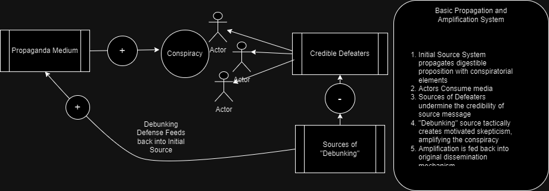

I've been thinking about these four concepts in relation to one another for quite some time. They seem to mutual co-exist, co-occur, and amplify one another through intricate feedback mechanisms. For example, a propaganda source can disseminate a conspiratorial assertion which can be accepted uncritically on irrational grounds; attempts to undercut (with undermining evidence), [defeat](https://en.wikipedia.org/wiki/Defeater), or rebut the proposition is met with the "debunking" methodology, a type of scorched earth tactic (typically a result of motivated skepticism) that dismisses relevant criticisms and leverages elements of the initial conspiracy in such a way to reaffirm its conspiratorial elements. For example, the act of criticism is "proof" of the conspiracies legitimacy; a form of evidential preemption (more on that later). The act of debunking is fed back into the propaganda machine, where the debunking argument amplifies the validity of the conspiracy, which is then propagated and consumed by irrational agents unwilling to pose critical questions. The cycle continues. Below is a diagram representing the causal feedback cycles and points of amplification.

Above is just an initial judgment on how we could describe or think about these interrelated concepts. It implies that we cannot focus on just one aspect. For example, you could probably approach this topic from anyone of the following perspectives:

1.  An argumentation theory approach, perhaps conducting an analysis of fallacies and how people fail to identify common weak arguments
2.  The classical rhetorical tactics speakers use to persuade people.
3.  The role of cognitive mechanisms that enable the proliferation of bad ideas
4.  Socio-structural explanations, such as social network theory, diffusion of information, and identity.
5.  Economic explanations, such as the role of financial incentives, market structure, and economic insecurity.
6.  Media theory, especially new media like podcasts and algorithmically driven applications
7.  An institutional perspective, perhaps identifying failures in key education systems.
8.  Interpersonal psychology and the role of trust.

I am sure there are more aspects I've not thought of. These are all undeniably relevant to the topic, while also inextricably linked. None of these are individually necessary or sufficient to bring about the proliferation of conspiracies. For example, the existence of cognitive biases alone does not produce a conspiracy, but the existence of an economic incentive to exploit these biases might make it more probable that a conspiracy emerges and flourishes. Likewise, the existence of an economic incentive might be cancelled out by strong community dynamics that have checks on the proliferation of this form of manipulation. In one context, diffusion of information on a social network might be sufficient to explain something while in other contexts it is insufficient. What I am proposing is that any one of these could be an INUS condition; an insufficient but necessary part of an unnecessary but sufficient set of conditions. A cause is often not sufficient on its own to bring about an effect, but it is a necessary part of a larger set of conditions that is sufficient to cause the effect. This larger set is often not the only set that could produce the same effect (hence it is unnecessary). I think its important to focus on causation as part of a set of conditions, not in isolation. Too often, we focus on one of these very legitimate concerns at the expense of others; unfortunately sometimes in circumstances where the single condition is not extremely important or relevant relative to others. Its best to think of these concepts as a set of interrelated components all interacting within a broader system. This is what makes it challenging to address and correct.
Before we do anything, I think its necessary we define a benchmark by which we can evaluate basic propositions in order to understand when a claim, set of propositions, or bodies of information are conspiratorial or propaganda. If we don't establish basic guidelines for what it means to be reasonable, then we cannot understand the vulnerable mechanisms that pernicious actors exploit and manipulate. For my understanding of this, please refer to the post linked below because I will draw heavily from concepts there:

- [A Working "Theory" of Rationality](https://thecriticalthinkingacademy.blogspot.com/2025/08/a-working-theory-of-rationality.html)

For this post, I want to approach it from the argumentation theory perspective. We will pay close attention the the "intellectual virtues" that ought to guide knowledge discovery. Unsurprisingly, we will see that in the case of conspiracy theories, these are consistently violated. It's as if, we can describe the structure of a conspiracy theory as the negation of one or many of these intellectual virtues. This could be one approach to partially defining "conspiracy"; the disregard or negation of intellectual standards. Before we go down that path, how have people in the past defined conspiracy? Is there a typology of conspiracy theories, some being more legitimate than others, with reference to some grade or ranking mechanism? Why do some become more prolific than others? What is the role of background plausibility? How does conspiracy based skepticism contrast with philosophical or scientific based skepticism?

#### Articles

1.  [Extreme Beliefs: An Interview with Rik Peels](https://imperfectcognitions.blogspot.com/2021/11/extreme-beliefs-interview-with-rik-peels.html?m=1)
2.  [On the Origin of Conspiracy Theories](https://imperfectcognitions.blogspot.com/2024/01/on-origin-of-conspiracy-theories.html?m=1)
3.  [The relationship between conspiratorial beliefs and cognitive styles](https://imperfectcognitions.blogspot.com/2024/03/disentangling-relationship-between.html?m=1)
4.  [Deliberation, Interpretation, and Confabulation (1)](https://imperfectcognitions.blogspot.com/2015/07/deliberation-interpretation-and.html?m=1)
5.  [Conspiracy Beliefs between Secret Evidence and Delusion](https://imperfectcognitions.blogspot.com/2024/10/conspiracy-beliefs-between-secret.html?m=1)
6.  [Big Data Analysis of Conspiracy Theorists](https://imperfectcognitions.blogspot.com/2018/07/big-data-analysis-of-conspiracy.html?m=1)
7.  [Conspiracy Beliefs, Democracy, and Confabulation](https://imperfectcognitions.blogspot.com/2023/07/conspiracy-beliefs-democracy-and.html?m=1)
8.  [Rethinking Conspiracy Theories](https://imperfectcognitions.blogspot.com/2023/01/rethinking-conspiracy-theories.html?m=1)

#### Video Resources

1.  [Social Media Algorithms - by The New Enlightenment with Ashley](https://youtube.com/playlist?list=PLf_FnoTsoAgG8NM0O1JWugvrz07zes59Z&si=SWjsB6JCRRDgpERl)
2.  [Media Theory - by Carefree Wandering](https://youtube.com/playlist?list=PLM0AijAXbZKmRJLOHdzlHZQzoB5K_Gvos&si=-A5BUl51hlkilgou)
3.  [Conspiracy-Non-Conspiracy Related Videos](https://youtube.com/playlist?list=PLf_FnoTsoAgF9VsAvo70iOUUfcuzTikvh&si=Ddth9nvGMJJ0hqCJ)
4.  [Power Concentration - by The New Enlightenment with Ashley](https://youtube.com/playlist?list=PLf_FnoTsoAgGivjYP_MOFMEcCN-Vwmx5e&si=6_aaOZLtMLUvKj7I)
5.  [Corporate Ecosystem - by The New Enlightenment with Ashley](https://youtube.com/playlist?list=PLf_FnoTsoAgHKd6yl2AqBM6O2qRr0bZL6&si=3M9pBJtNlg3m8xkg)
6.  [Attention Economy - by The New Enlightenment with Ashley](https://youtube.com/playlist?list=PLf_FnoTsoAgGiPWeUZCFM1jFb17CUz7rB&si=9RELU88zUAgcu2wE)
7.  [Ideologies & Religions are Maps \| Why Fights Over Maps Fail](https://youtu.be/rWEjZIk4vAw?si=3QBcGtsMQETu9iLM)

#### Additional Sources

1.  [Belief in conspiracy theories: Basic principles of an emerging research domain](https://pmc.ncbi.nlm.nih.gov/articles/PMC6282974/)
2.  [The Conspiracy Theory of Society \*](https://www.taylorfrancis.com/chapters/edit/10.4324/9781315259574-2/conspiracy-theory-society-karl-popper)
3.  [Chapter 3 Is a Belief in Providence the Same as a Belief in Conspiracy?](https://brill.com/display/book/edcoll/9789004382022/BP000005.xml)
4.  [Motivated reasoning](https://en.wikipedia.org/wiki/Motivated_reasoning)
5.  [The Paranoid Style in American Politics](https://en.wikipedia.org/wiki/The_Paranoid_Style_in_American_Politics)
6.  [The Skeptic and the Climate Change Skeptic](https://philarchive.org/rec/WORTSA)
7.  [The Rules of Persuasion](https://westsidetoastmasters.com/resources/laws_persuasion/toc.html)
8.  [Prove it! The Burden of Proof Game in Science vs. Pseudoscience Disputes](https://philarchive.org/rec/PIGPIT)
9.  [Chapter Fifteen: Arguments from Analogy](https://open.lib.umn.edu/goodreasoning/chapter/chapter-fifteen-arguments-from-analogy/)
10. [Appeal to Ignorance](https://pmc.ncbi.nlm.nih.gov/articles/PMC6354513/)
11. [Rules for reasoning from knowledge and lack of knowledge](https://philpapers.org/rec/WALRFR)
12. [A Closer Look at Climate Change Skepticism](https://pmc.ncbi.nlm.nih.gov/articles/PMC3002211/)
13. [How to Spot a Fake Skeptic](https://theethicalskeptic.com/2014/08/10/when-you-are-not-a-skeptic/https://theethicalskeptic.com/2014/08/10/when-you-are-not-a-skeptic/)
14. [Filter bubble](https://en.wikipedia.org/wiki/Filter_bubble)
15. [The Engineering of Consent](https://en.wikipedia.org/wiki/The_Engineering_of_Consent)
16. [Is critical thinking epistemically responsible?](https://philpapers.org/rec/MICICT)
17. [Underdetermination Skepticism and Skeptical Dogmatism](https://philpapers.org/rec/WALUSA-3)
18. O[ccam’s Razor, Dogmatism, Skepticism, and Skeptical Dogmatism](https://philpapers.org/rec/WALORD-3)
19. [Whataboutism](https://en.wikipedia.org/wiki/Whataboutism)
20. [Third-party technique](https://en.wikipedia.org/wiki/Third-party_technique)
21. [Semantic satiation](https://en.wikipedia.org/wiki/Semantic_satiation)
22. [Operant conditioning](https://en.wikipedia.org/wiki/Operant_conditioning)
23. [Milieu control](https://en.wikipedia.org/wiki/Milieu_control)
24. [Information overload](https://en.wikipedia.org/wiki/Information_overload)
25. [Gish gallop](https://en.wikipedia.org/wiki/Gish_gallop)
26. [Firehose of falsehood](https://en.wikipedia.org/wiki/Firehose_of_falsehood)
27. [Fear, uncertainty, and doubt](https://en.wikipedia.org/wiki/Fear,_uncertainty,_and_doubt)
28. [Propaganda techniques](https://en.wikipedia.org/wiki/Propaganda_techniques)
29. [Demoralization (warfare)](https://en.wikipedia.org/wiki/Demoralization_(warfare))
30. [Proportionality bias](https://en.wikipedia.org/wiki/Proportionality_bias)
31. [Agenda-setting theory](https://en.wikipedia.org/wiki/Agenda-setting_theory)
32. [Cult of personality](https://en.wikipedia.org/wiki/Cult_of_personality)
