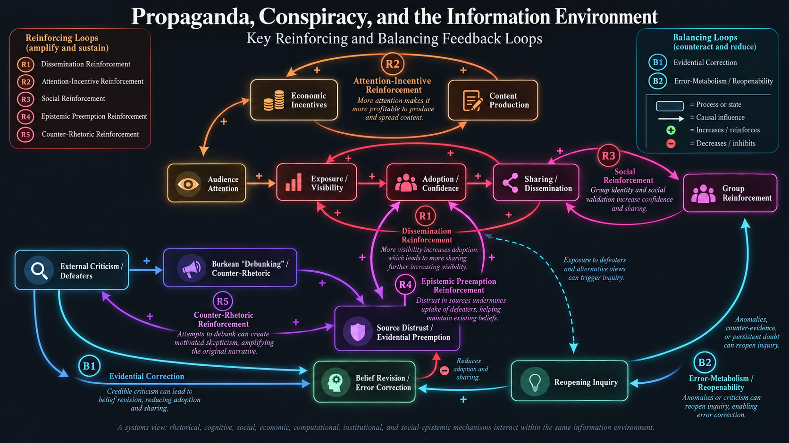

# Propaganda, Conspiracy, and the Information Environment: A Systems View

I've been thinking about propaganda and conspiracy in relation to one another for quite some time. What interests me most is not a single mechanism that explains either phenomenon, but the way several mechanisms can coexist, interact, and sometimes amplify one another through feedback.

As an initial example, imagine a propaganda source disseminating a conspiratorial assertion. Some audience members accept or repeat it. Critics then introduce undermining evidence, [defeaters](https://en.wikipedia.org/wiki/Defeater), or rebuttals. Those criticisms may reduce confidence in the claim, but they may also be rhetorically reinterpreted. In Kenneth Burke's sense of the **debunking** method, a critic, institution, or source can itself become the object of a systematic "let down": its motives are redescribed, its credibility is attacked, and the criticism is absorbed into an adversarial interpretive frame. In a sufficiently insulated epistemic environment, criticism can even be taken as evidence that the alleged conspiracy is threatened by exposure. I will refer to one version of that move as **evidential preemption**: a social-epistemic strategy that supplies reasons in advance for discounting possible counterevidence or outside testimony.

This is not intended as *the* mechanism behind propaganda or conspiracy theories. It is an entry point into the kind of system I want to study. The same criticism may function as a genuine defeater for one audience, as irrelevant noise for another, and as material for further rhetorical reinforcement in a third. The outcome depends on the other mechanisms already operating in the system.

The original sketch that motivated this project tried to capture that intuition. A cleaner causal-loop representation is below.

The signs on the arrows are causal-loop signs, not value judgments. A **+** means that, all else equal, movement in one variable tends to move the next in the same direction; a **-** means it tends to move it in the opposite direction. The diagram is deliberately schematic. It does not claim that every arrow is present, equally strong, or dominant in every context.

Several recognizable loops appear in the sketch:

| Loop | Type | Basic structure | What it highlights |
|---|---|---|---|
| **R1: Propagation** | Reinforcing | exposure → commitment → sharing → exposure | A message can create more opportunities for its own uptake as believers become disseminators. |
| **R2: Attention/incentive** | Reinforcing | exposure → engagement → production incentive → promotion → exposure | Economic and platform incentives can reward the production and amplification of attention-capturing material. |
| **R3: Social reinforcement** | Reinforcing | commitment → public expression → perceived group acceptance → commitment | Expressions of belief can alter perceived norms and credibility within a group. |
| **R4: Epistemic insulation** | Reinforcing | commitment → preemptive distrust → reduced uptake of defeaters → persistence of commitment | Trust can be reorganized so that outside correction loses epistemic force before it is considered. |
| **R5: Counter-rhetorical reinforcement** | Reinforcing | dissemination → criticism → counter-rhetoric → distrust → reduced uptake → continued commitment/dissemination | Where greater visibility attracts criticism, that criticism can be transformed into material for attacking the critic and sustaining the original commitment. |
| **B1: Evidential correction** | Balancing | dissemination → criticism/defeaters → evidential uptake → reduced confidence → reduced dissemination | Where dissemination generates corrective attention and the correction is actually taken up, propagation can dampen itself. |
| **B2: Error metabolism** | Balancing | commitment → specific expectations → anomalies → reopening inquiry → model revision → reduced commitment | Where a view makes sufficiently specific commitments, failed expectations can trigger procedures that discover and repair error rather than merely defend prior commitments. |

There are almost certainly additional loops: institutional moderation or friction, reputation effects, legal constraints, social sanctions, changes in platform design, and resource limitations could all create balancing or reinforcing processes. The point of the diagram is not to finish the model now. It is to give the rest of the series a common object to investigate.

## The System and the Views We Take of It

The same system can be approached from several perspectives. I currently see at least seven useful views:

1. **Argumentation and rhetoric**: fallacies, dialogue rules, burdens of proof, argument schemes, persuasive tactics, framing, and rhetorical counteraction.
2. **Cognitive science and psychology**: attention, memory, motivated cognition, uncertainty, threat, heuristics, and the cognitive costs of inquiry.
3. **Social structure and networks**: identity, group norms, homophily, social learning, diffusion, network topology, and perceived consensus.
4. **Economics and incentives**: attention markets, advertising, monetization, creator incentives, funding, platform competition, and the costs of verification.
5. **Media theory and computational systems**: affordances, format, recommendation systems, ranking, metrics, algorithmic amplification, participatory disinformation, and distributed media ecosystems.
6. **Institutions and governance**: education, journalism, regulation, consumer protection, professional norms, transparency, and institutional credibility.
7. **Interpersonal psychology and social epistemology**: trust, testimony, expertise, echo chambers, hostile epistemic environments, source credibility, and evidential preemption.

These are not competing explanations. They are **views of the same system**. Each foregrounds different variables and causal relations while leaving others in the background.

| View | What it foregrounds | Typical links in the system |
|---|---|---|
| Argumentation / rhetoric | How claims are framed, defended, attacked, and insulated | message → acceptance; criticism → counter-rhetoric; burden shifting → persistence |
| Cognitive | How limited agents attend, interpret, remember, and update | exposure → attention; salience → acceptance; cognitive load → heuristic reliance |
| Social / network | How information and credibility move between people and groups | sharing → exposure; group acceptance → credibility; network position → reach |
| Economic | Why information is produced, packaged, and promoted | engagement → revenue/incentive; cost of verification → production choices |
| Media / computational | How communication infrastructures select and distribute information | engagement → ranking; ranking → exposure; format → communicability |
| Institutional | How rules, organizations, and public systems shape information quality and correction | governance → friction; education → evaluative capacity; institutional trust → uptake |
| Social epistemic | How agents decide whom to trust and what testimony can count as evidence | source credibility → uptake; preemption → distrust; expertise → deference |

This distinction is important. A cognitive account may explain why a message is appealing; an economic account may explain why someone produces it; a network account may explain why it spreads; a media account may explain why it is made unusually visible; and a social-epistemic account may explain why a correction fails. Those explanations can all be true of the same case.

## Why a Systems View? INUS Conditions and Causal Fields

None of the seven views is individually necessary or sufficient for the proliferation of conspiratorial or propagandistic information. Cognitive biases alone do not generate a propaganda campaign. An economic incentive alone does not determine which message will be believed. A network can enable rapid diffusion without determining whether the information is credible. Strong community norms can suppress a mechanism that is highly effective elsewhere.

One useful way to express this is J. L. Mackie's concept of an **INUS condition**: an *insufficient but necessary part of an unnecessary but sufficient set* of conditions. A factor we casually call "the cause" may be neither necessary nor sufficient by itself. Instead, it is one component of a configuration that is sufficient in a particular causal field, while some other configuration could have generated a similar outcome.

That language is useful here because it discourages monocausal explanation. The relevant question is not only whether a factor matters, but **what causal role it plays, in which configuration, at what stage, and under which background conditions**. This is also why causal importance can vary across cases. The same mechanism may dominate in one information environment and matter very little in another.

This series will therefore treat propaganda and conspiratorial reasoning as phenomena emerging from a broader information system: actors, messages, audiences, institutions, technologies, incentives, trust relations, and feedback processes interacting over time.

A few causal distinctions will be useful throughout the series:

- **Production**: Why is a message created in this form?
- **Adoption**: Why does an individual or group come to accept or entertain it?
- **Diffusion**: Through what pathways does it travel?
- **Persistence**: Why does it survive criticism, contradiction, or failed expectations?
- **Amplification**: Why does it become disproportionately visible or salient?
- **Correction**: Under what conditions do defeaters, rival explanations, or institutional processes successfully reduce confidence or reach?

This lifecycle is not strictly linear. The stages feed back into one another. Diffusion changes incentives for production; adoption changes social norms; criticism changes trust; metrics change visibility; visibility changes perceived credibility; and correction can itself generate new rhetorical material. That recursive structure is precisely why a systems view is useful.

## An Epistemic Benchmark

Before trying to identify what is defective about a piece of conspiratorial or propagandistic reasoning, we need a benchmark for responsible inquiry. Otherwise terms such as *irrational*, *skeptical*, *biased*, or *unreasonable* can become little more than labels for conclusions we dislike.

I develop the benchmark I have in mind in [A Working "Theory" of Rationality](https://afontana1.github.io/critical-thinking-academy/philosophy/rationality-theory/blog.html). The basic proposal there is that rational inquiry is layered. It includes the structure and goal of the dialogue, comparison among rival explanatory models, interpretation and provenance of evidence, evidence-responsive belief updating, intellectual virtues, and the epistemic environment in which inquiry takes place. Rationality is therefore not exhausted by formal validity or by avoiding a list of named fallacies.

For this series, several standards from that framework will recur:

- **Dialogical appropriateness**: What kind of disagreement is this, what are the burdens of proof, and is the exchange structured so that criticism can actually matter?
- **Rival-model comparison**: Is the favored hypothesis being compared with the strongest serious alternatives, or merely defended one argument at a time?
- **Evidential relevance and structure**: Why should a datum count for or against the hypothesis, and what inferential chain connects it to the conclusion?
- **Provenance**: How was the evidence produced, selected, measured, filtered, or transmitted?
- **Evidence-responsive updating**: Do relevant defeaters change confidence when they should?
- **Epistemic virtue**: Are similar standards being applied to favored and disfavored claims? Are humility, conscientiousness, fairness, and open-mindedness functioning as real constraints?
- **Environmental awareness**: How are platforms, institutions, incentives, communities, and trust networks shaping the information available to the inquirer?
- **Reopenability and error metabolism**: What would cause a conclusion to be revisited, and does the system contain a mechanism for discovering and correcting its own errors?

These standards do not mechanically classify a belief as rational or irrational. They give us dimensions along which an inquiry can be examined.

## Definitions: What Exactly Are We Talking About?

This section needs to do more than supply dictionary definitions. Several distinctions will matter for the entire series, especially because *conspiracy* and *conspiracy theory* are often used as evaluative labels rather than descriptive categories.

A first distinction should separate:

- an **actual conspiracy**: covert coordination among multiple actors toward some end;
- a **conspiracy hypothesis or theory**: an explanatory claim that posits such coordination;
- **conspiratorial or conspiracist reasoning**: characteristic ways of constructing, defending, or insulating conspiracy explanations.

The first two are not inherently irrational. Real conspiracies occur, and it can be reasonable to investigate a conspiracy hypothesis. The more difficult question is what distinguishes responsible investigation of covert coordination from an epistemically defective mode of inquiry.

This is where the rationality framework becomes useful. The relevant pathology may not be the presence of conspiracy in the content of a hypothesis, but the way the hypothesis is generated, compared with alternatives, supported by evidence, protected from criticism, or embedded in a trust network.

The same care is needed with **propaganda**. A useful definition will have to distinguish propaganda from persuasion generally, and likely from misinformation and disinformation. Questions of truth or falsity alone will not be enough: propaganda can contain true claims, and a false statement need not be propaganda. Intent, strategic selection, framing, repetition, audience design, institutional context, and the management of attention or identification may all matter.

I also need to define several technical terms that recur throughout the series:

- **rebutting defeater** versus **undercutting defeater**;
- **skepticism** versus motivated or selective skepticism;
- **debunking**, specifically in the Burkean rhetorical sense used here;
- **evidential preemption**;
- **epistemic insulation / self-sealing**;
- **echo chamber** versus **epistemic bubble**;
- **misinformation**, **disinformation**, and **malinformation** where those distinctions are useful.

### Questions to develop in the definitions essay

- What properties are genuinely definitional, and which are merely common features?
- Should *conspiracy theory* be a neutral descriptive term, a pejorative term, or a family-resemblance category?
- Can a conspiracy hypothesis be well supported while still containing some defective reasoning, or poorly supported while investigated responsibly?
- How should background plausibility enter the evaluation?
- When does ordinary skepticism become skeptical dogmatism?
- What is the difference between legitimate protection of a hypothesis with auxiliary assumptions and ad hoc immunization from counterevidence?

## An Epistemic Profile Rather Than a "Conspiracy Score"

It is tempting to ask whether some conspiracy theories are more legitimate than others and then search for a single ranking mechanism. I think a better approach is **multidimensional**. The object being evaluated should receive an epistemic profile rather than a single score.

| Dimension | Question |
|---|---|
| **Background plausibility** | How well does the hypothesis fit independently established knowledge about the relevant actors, mechanisms, constraints, and context? |
| **Rival-model performance** | How well does it explain the evidence compared with the strongest serious alternatives? |
| **Evidential relevance** | Why should each cited observation count for or against the hypothesis? |
| **Evidential structure** | How do the pieces of evidence combine: independence, corroboration, dependence, conflict, or common sourcing? |
| **Provenance** | Where did the evidence come from, how was it gathered, and what selection or filtering processes shaped it? |
| **Source independence** | Do apparently convergent sources represent genuinely independent information pathways, or are they repeating the same upstream source? |
| **Evidential symmetry** | Are favorable and unfavorable considerations being judged by comparable standards? |
| **Defeater responsiveness** | Does relevant counterevidence appropriately reduce confidence, or is it ignored or redescribed without cost? |
| **Preemption** | Does the theory contain built-in reasons for dismissing broad classes of possible counterevidence or testimony in advance? |
| **Reopenability** | What conceivable observation, prediction failure, or argument would cause the inquiry to be reopened? |
| **Ad hoc complexity** | How much auxiliary machinery is being added primarily to protect the favored explanation from difficulty? |

No single dimension should be treated as decisive. Scientific and historical explanations can legitimately be complex; genuine conspiracies can involve secrecy; testimony can be untrustworthy; and theories sometimes survive apparent counterevidence for good reasons. The point is comparative and procedural: **what explanatory and epistemic costs are being incurred, and are those costs acknowledged consistently?**

This is also where I want to resist treating "self-sealing" as an all-or-nothing property. There are stronger and weaker forms of evidential insulation, and the mere possibility of revising an auxiliary hypothesis does not uniquely distinguish conspiracy theories from other forms of theorizing. The interesting questions concern degree, practice, plausibility, and the costs imposed by the defensive move.

## View 1: Argumentation Theory and Rhetoric

The argumentation view asks what happens *inside the exchange of reasons*. Conspiratorial and propagandistic communication does not consist only of propositions that are true or false; it also involves burdens of proof, dialogue types, argument schemes, framing, audience adaptation, strategic ambiguity, and efforts to define which criticisms are admissible.

This section should connect classical rhetoric with contemporary argumentation theory. One useful organizing question is whether an argumentative move helps a critical discussion do its epistemic job or instead blocks the procedures by which claims can be challenged and revised. That makes fallacies more than a checklist of invalid forms. Burden shifting, selective standards, straw men, ambiguity, Gish gallops, whataboutism, and source attacks can function as **dialogical obstructions** even when individual statements are not formally invalid.

Burke's concept of debunking belongs here. I am using *debunking* in Burke's rhetorical sense rather than the contemporary sense of fact-checking. The interest is in a strategy of deflation or "let down": exposing or redescribing the supposedly elevated motives, ideals, authorities, or appearances that sustain an opponent's position. In the present system, that method can interact with social epistemology when rhetorical attacks on a critic become reasons to discount the critic's testimony.

### Questions to develop

- Which argument schemes recur in conspiratorial reasoning, and what are their critical questions?
- When do source attacks constitute relevant credibility assessment, and when do they become genetic fallacies or preemptive dismissal?
- How do burden-of-proof games allow a hypothesis to survive without accumulating positive support?
- How do rhetorical techniques transform the *meaning* of a defeater rather than merely answer its propositional content?
- What is the relationship between persuasion, identification, symbolic action, and truth-tracking?

### References to start with

- Kenneth Burke, *Permanence and Change: An Anatomy of Purpose*.
- Frans H. van Eemeren and Rob Grootendorst on pragma-dialectics and critical discussion.
- Douglas Walton on dialogue types, argument schemes, and critical questions.
- The argumentation and evidence-analysis sources already collected in [A Working "Theory" of Rationality](https://afontana1.github.io/critical-thinking-academy/philosophy/rationality-theory/blog.html).

## View 2: Cognitive Science and Psychology

The cognitive view asks how finite agents process messages under conditions of uncertainty, limited attention, incomplete information, and motivational pressure. The important point is not that "bias causes conspiracy." Biases are ubiquitous. The question is how cognitive mechanisms interact with particular messages and environments so that some claims are more memorable, intuitively satisfying, threatening, identity-congruent, or cognitively inexpensive than their competitors.

This section should distinguish several mechanisms that are often collapsed together: limits on attention and working memory, pattern perception, proportionality intuitions, uncertainty reduction, need for control, motivated reasoning, repetition and familiarity, emotional salience, and the appeal of explanatory closure. It should also distinguish *believing* a claim from *sharing* it; the mechanisms producing those behaviors need not be identical.

### Questions to develop

- What psychological motives make some conspiracy explanations attractive?
- How do uncertainty, threat, control, and identity affect hypothesis generation and evidential weighting?
- When does analytic reflection reduce susceptibility, and when is analytic capacity recruited to defend a preferred conclusion?
- How do repetition, fluency, emotion, and narrative coherence affect perceived plausibility?
- How do cognitive scarcity and information overload change the use of heuristics and trusted proxies?

### References to start with

- Karen M. Douglas, Robbie M. Sutton, and Aleksandra Cichocka, "The Psychology of Conspiracy Theories."
- Jan-Willem van Prooijen and Karen M. Douglas, "Belief in conspiracy theories: Basic principles of an emerging research domain."
- The work already collected in the existing bibliography on cognitive style, proportionality bias, motivated reasoning, confabulation, and extreme belief.

## View 3: Social Structure, Identity, and Information Diffusion

The network view changes the unit of analysis. Instead of asking only why an individual accepts a claim, it asks how claims move through a population and how network structure changes what people encounter, whom they observe, and which beliefs appear socially validated.

Information diffusion is not neutral transport. Homophily, clustering, bridge nodes, influencers, repeated exposure, community boundaries, and social learning can alter both reach and perceived credibility. Identity can make certain messages more communicable because sharing them performs social work: signaling group membership, loyalty, grievance, status, or opposition.

This is also where the concept of **communicability** becomes important. Some messages are better adapted to particular media and network structures than others. A short emotionally vivid claim may travel differently from a long evidential reconstruction. "Fitness" in an information ecosystem therefore does not imply truth; it can mean compatibility with the selection pressures imposed by attention, format, network structure, and audience incentives.

### Questions to develop

- What network structures accelerate or inhibit diffusion?
- How should we distinguish independent corroboration from repeated exposure within a connected network?
- How do identity and perceived group consensus change source credibility?
- What features make a message easy to reproduce, compress, remix, or transmit?
- How do local clusters interact with bridge actors, mass media, and platform recommendation systems?

### References to start with

- Michela Del Vicario et al., "The spreading of misinformation online."
- Soroush Vosoughi, Deb Roy, and Sinan Aral, "The spread of true and false news online."
- Kate Starbird and collaborators on alternative-media ecosystems and participatory information operations.

## View 4: Economics and Incentives

The economic view asks why certain information is worth producing and distributing. Modern information environments contain markets for attention, advertising, subscriptions, donations, influence, reputation, and political or organizational advantage. These incentives do not determine content by themselves, but they shape which forms of content are cheap to produce, profitable to repeat, costly to verify, or attractive to amplify.

A systems treatment should examine both **supply** and **demand**. Producers face incentives to create content; platforms face incentives to retain users and sell access to attention; advertisers and funders supply revenue; audiences spend scarce time and attention; and verification itself has a cost. These pressures can interact with psychological and social mechanisms rather than replacing them.

### Questions to develop

- When does attention become economically valuable, and to whom?
- How do advertising and creator-revenue models alter incentives for sensational, polarizing, or conspiratorial content?
- What are the relative costs of producing, verifying, correcting, and consuming information?
- How do platform competition and recommendation systems affect the production/distribution equilibrium?
- What financial mechanisms support ostensibly grassroots information campaigns?
- Which economic incentives select for volume, novelty, emotionality, or controversy rather than truth-tracking?

### References to start with

- Guy Aridor, Rafael Jiménez-Durán, Ro'ee Levy, and Lena Song, "The Economics of Social Media."
- Wajeeha Ahmad et al., "Companies inadvertently fund online misinformation despite consumer backlash."
- Research on the attention economy and verification incentives.

## View 5: Media Theory and Computational Propaganda

The media view examines the infrastructure through which messages become visible and meaningful. We no longer inhabit a simple centralized model in which a small number of broadcasters send finished messages to passive audiences. Communication is distributed across platforms, creators, users, recommendation systems, reposting networks, private groups, search systems, and traditional media that increasingly react to one another.

This matters because the medium is not merely a pipe. Formats impose constraints; metrics provide feedback; recommendation systems rank; interfaces make some actions easier than others; and audiences participate in the production, reinterpretation, and circulation of narratives. A strategic information operation may therefore be partly centralized and partly emergent.

This is where I want to examine **participatory disinformation**: the possibility that ordinary users, influencers, media organizations, activists, and strategic actors can collaboratively produce and amplify an information campaign without every participant sharing the same intention or even knowing they are part of a larger process.

### Questions to develop

- How do media affordances change the form of persuasive content?
- What does algorithmic amplification actually mean, and how should it be measured?
- How do engagement metrics create feedback between audience behavior and future visibility?
- How do different media formats select for different rhetorical strategies?
- How does distributed participation blur the line between centrally planned propaganda and emergent crowd behavior?
- Where do classical media concepts such as agenda setting, framing, gatekeeping, and selectors fit in a platform environment?

### References to start with

- Kate Starbird, Ahmer Arif, and Tom Wilson, "Disinformation as Collaborative Work: Surfacing the Participatory Nature of Strategic Information Operations."
- Killian McLoughlin and William Brady, "Human-algorithm interactions help explain the spread of misinformation."
- Joseph Bak-Coleman et al., "Stewardship of global collective behavior."
- Work on agenda-setting, computational propaganda, recommendation systems, and Niklas Luhmann's media theory.

## View 6: Institutions, Education, and Governance

The institutional view asks what organized systems do with information problems that individuals cannot solve alone. Education systems teach—or fail to teach—reasoning and information evaluation. Journalism develops professional procedures for verification. Scientific communities distribute expertise and error correction. Governments regulate markets and communication infrastructures. Platforms establish rules for moderation and recommendation. Consumer-protection systems address deception and asymmetric information.

The difficult question is not simply whether institutions should intervene. Institutions are themselves actors inside the system. They have incentives, legitimacy constraints, error rates, limited information, procedural obligations, and trust relationships with the public. An intervention can therefore change not only the immediate information flow but also the credibility of the institution imposing it.

### Questions to develop

- What epistemic functions are institutions supposed to perform that individuals cannot perform efficiently themselves?
- Why does general education often fail to prepare people for adversarial information environments?
- What forms of transparency improve accountability, and when does more information merely increase overload?
- How should we distinguish moderation, friction, correction, censorship, and governance analytically?
- How do institutional errors feed back into trust and future receptivity to correction?
- What outcome should an intervention optimize: accuracy, autonomy, exposure diversity, harm reduction, trust, or something else?

### References to start with

- Research on misinformation interventions and accuracy prompts, including Gordon Pennycook and David Rand.
- Work on institutional trust, science communication, media literacy, platform governance, and consumer protection.
- The "error metabolism" framework already developed in [A Working "Theory" of Rationality](https://afontana1.github.io/critical-thinking-academy/philosophy/rationality-theory/blog.html).

## View 7: Trust, Testimony, and Social Epistemology

The social-epistemic view may be the point at which many of the other mechanisms meet. Human beings cannot personally verify most of what they believe. We depend on testimony, specialists, institutions, records, instruments, and social procedures. Trust is therefore not an optional supplement to rationality; it is one of the conditions under which finite agents can know anything beyond a very small domain.

That dependence creates an attack surface. An information environment can manipulate not only *what* someone believes but **who is permitted to count as a knower**. C. Thi Nguyen's distinction between epistemic bubbles and echo chambers is especially important here. An epistemic bubble omits relevant voices; an echo chamber actively discredits outside voices and restructures trust. The latter helps explain why merely adding more information may fail: the correction arrives through a channel that has already been marked as untrustworthy.

This is where I want to develop **evidential preemption** in more detail. A worldview can supply reasons in advance for why anticipated criticism, expert testimony, institutional records, or contrary data should not count. The problem is not that rejecting testimony is always irrational. Sources can be corrupt, mistaken, captured, or incompetent. The problem is whether distrust is itself supported, discriminating, revisable, and symmetrically applied—or whether it functions as a general-purpose device for immunizing a favored conclusion.

### Questions to develop

- How do non-experts rationally identify experts when experts disagree?
- What makes trust warranted, and what makes distrust warranted?
- When does "do your own research" represent epistemic responsibility, and when does it conceal unavoidable dependence on different intermediaries?
- How are echo chambers built and maintained through trust manipulation rather than mere information omission?
- How does evidential preemption differ from legitimate source criticism?
- How do humiliation, vilification, status threats, or identity conflicts alter testimonial relationships?
- What does it mean for discourse to be gamified, and how do status/reward systems shape epistemic behavior?

### References to start with

- C. Thi Nguyen, "Echo Chambers and Epistemic Bubbles."
- Alvin Goldman, "Experts: Which Ones Should You Trust?"
- Maarten Boudry, "On epistemic black holes: How self-sealing belief systems develop and evolve."
- Kurtis Hagen, "Are Conspiracy Theories Problematically Self-Sealing?" as a useful challenge to overly broad self-sealing accounts.

## What Follows from a Systems Approach?

Treating this as a systems problem changes what counts as an adequate explanation.

First, it makes **monocausal stories suspicious**. A correlation between one cognitive trait and conspiracy belief does not by itself explain production, diffusion, persistence, or amplification. An algorithmic effect does not by itself explain why users respond to the content it promotes. An economic incentive does not explain which claims audiences will treat as credible. A trust failure does not explain why a particular narrative was produced in the first place.

Second, it forces us to distinguish **mechanism from stage**. Different mechanisms can dominate different portions of the claim lifecycle. Production, adoption, diffusion, persistence, amplification, and correction need not have the same causes.

Third, it directs attention to **feedback, delays, and unintended effects**. A corrective action can reduce belief in one group while increasing distrust in another. A moderation policy can reduce reach while changing the perceived legitimacy of the platform. A highly visible fact-check can correct some users while giving additional exposure to the original claim. None of those effects should be assumed in advance; they are empirical questions about the system.

Fourth, it encourages **conditional explanation**. The goal is not to say that a mechanism always causes a particular outcome, but to identify the configurations and background conditions under which it becomes causally important.

Finally, it places limits on premature intervention. Before asking how to "solve" the problem, we need to know what outcome we are trying to change, which variables are causally relevant, how the proposed intervention enters the feedback structure, and how success will be measured. That is a later problem for this series. For now, the priority is representation: building a sufficiently rich model of the system that interventions can eventually be discussed without pretending the system is simpler than it is.

## Where the Series Goes from Here

This post is the kickoff rather than the finished argument. Each later essay will take one view of the same system and ask what that perspective can explain, what mechanisms it identifies, what evidence supports those mechanisms, what it leaves unexplained, and how it connects to the other views.

A useful template for each essay will be:

1. **Define the object of analysis.** What exactly is this lens trying to explain?
2. **Identify mechanisms.** What variables and causal relations does the literature propose?
3. **Locate them in the larger system.** Which stages—production, adoption, diffusion, persistence, amplification, correction—do they affect?
4. **Examine evidence.** What empirical or conceptual evidence supports the mechanism, and what are its limits?
5. **Identify interactions.** Which mechanisms from the other views strengthen, weaken, or condition it?
6. **Identify failure modes and countervailing processes.** What balancing loops or correction mechanisms oppose it?
7. **State open questions.** What remains uncertain, contested, or difficult to measure?
8. **Update the system diagram.** Each essay should add, remove, or refine arrows rather than merely adding another list of concepts.

If this project works, the final product should not be seven independent literature reviews. It should be a progressively refined systems model in which argumentation, cognition, social structure, incentives, media technologies, institutions, and trust are different views of a common information environment.

## Suggested References to Add to the Working Bibliography

These are not meant to replace the sources already collected below. They are a first pass at references that map cleanly onto the system views above.

1. [J. L. Mackie, "Causes and Conditions" (1965)](https://www.jstor.org/stable/20009173) — the original INUS-condition formulation.
2. [Kenneth Burke, *Permanence and Change: An Anatomy of Purpose*](https://www.ucpress.edu/books/permanence-and-change/paper) — useful for the Burkean rhetorical framework and the debunking discussion.
3. [Karen M. Douglas, Robbie M. Sutton, and Aleksandra Cichocka, "The Psychology of Conspiracy Theories" (2017)](https://doi.org/10.1177/0963721417718261) — concise review of epistemic, existential, and social motives.
4. [Jan-Willem van Prooijen and Karen M. Douglas, "Belief in conspiracy theories: Basic principles of an emerging research domain" (2018)](https://pmc.ncbi.nlm.nih.gov/articles/PMC6282974/) — broad social-psychological framing.
5. [Michela Del Vicario et al., "The spreading of misinformation online" (2016)](https://pmc.ncbi.nlm.nih.gov/articles/PMC4725489/) — network diffusion and clustering.
6. [Soroush Vosoughi, Deb Roy, and Sinan Aral, "The spread of true and false news online" (2018)](https://pubmed.ncbi.nlm.nih.gov/29590045/) — large-scale diffusion study.
7. [C. Thi Nguyen, "Echo Chambers and Epistemic Bubbles" (2020)](https://www.cambridge.org/core/journals/episteme/article/echo-chambers-and-epistemic-bubbles/5D4AC3A808C538E17C50A7C09EC706F0) — essential for the social-epistemic distinction between omission and active discrediting.
8. [Alvin I. Goldman, "Experts: Which Ones Should You Trust?" (2001)](https://doi.org/10.1111/j.1933-1592.2001.tb00093.x) — the expert-identification problem.
9. [Kate Starbird, Ahmer Arif, and Tom Wilson, "Disinformation as Collaborative Work" (2019)](https://faculty.washington.edu/kstarbi/Disinformation-as-Collaborative-Work-Authors-Version.pdf) — participatory and sociotechnical account of strategic information operations.
10. [Joseph Bak-Coleman et al., "Stewardship of global collective behavior" (2021)](https://pmc.ncbi.nlm.nih.gov/articles/PMC8271675/) — treats digital information systems as collective-behavior systems requiring cross-level analysis.
11. [Killian McLoughlin and William Brady, "Human-algorithm interactions help explain the spread of misinformation" (2024)](https://pubmed.ncbi.nlm.nih.gov/38128169/) — directly useful for human-algorithm feedback.
12. [Guy Aridor, Rafael Jiménez-Durán, Ro'ee Levy, and Lena Song, "The Economics of Social Media" (2024)](https://www.aeaweb.org/articles?id=10.1257%2Fjel.20241743) — economic review organized around production, distribution, and consumption.
13. [Wajeeha Ahmad et al., "Companies inadvertently fund online misinformation despite consumer backlash" (2024)](https://www.nature.com/articles/s41586-024-07404-1) — useful for the financial supply side of misinformation.
14. [Maarten Boudry, "On epistemic black holes: How self-sealing belief systems develop and evolve" (2024)](https://onlinelibrary.wiley.com/doi/full/10.1111/theo.12554) — mechanisms of epistemic insulation.
15. [Kurtis Hagen, "Are Conspiracy Theories Problematically Self-Sealing?" (2026)](https://www.cambridge.org/core/journals/episteme/article/are-conspiracy-theories-problematically-selfsealing/58BAC2A2347BF7F7F59A64BC94752539) — a useful counterpoint arguing that self-sealing claims require case-sensitive evaluation.
16. [Gordon Pennycook and David G. Rand, "Accuracy prompts are a replicable and generalizable approach for reducing the spread of misinformation" (2022)](https://www.nature.com/articles/s41467-022-30073-5) — useful later when the series reaches intervention and correction.

#### Articles

1.  [Extreme Beliefs: An Interview with Rik Peels](https://imperfectcognitions.blogspot.com/2021/11/extreme-beliefs-interview-with-rik-peels.html?m=1)
2.  [On the Origin of Conspiracy Theories](https://imperfectcognitions.blogspot.com/2024/01/on-origin-of-conspiracy-theories.html?m=1)
3.  [The relationship between conspiratorial beliefs and cognitive styles](https://imperfectcognitions.blogspot.com/2024/03/disentangling-relationship-between.html?m=1)
4.  [Deliberation, Interpretation, and Confabulation (1)](https://imperfectcognitions.blogspot.com/2015/07/deliberation-interpretation-and.html?m=1)
5.  [Conspiracy Beliefs between Secret Evidence and Delusion](https://imperfectcognitions.blogspot.com/2024/10/conspiracy-beliefs-between-secret.html?m=1)
6.  [Big Data Analysis of Conspiracy Theorists](https://imperfectcognitions.blogspot.com/2018/07/big-data-analysis-of-conspiracy.html?m=1)
7.  [Conspiracy Beliefs, Democracy, and Confabulation](https://imperfectcognitions.blogspot.com/2023/07/conspiracy-beliefs-democracy-and.html?m=1)
8.  [Rethinking Conspiracy Theories](https://imperfectcognitions.blogspot.com/2023/01/rethinking-conspiracy-theories.html?m=1)

#### Video Resources

1.  [Social Media Algorithms - by The New Enlightenment with Ashley](https://youtube.com/playlist?list=PLf_FnoTsoAgG8NM0O1JWugvrz07zes59Z&si=SWjsB6JCRRDgpERl)
2.  [Media Theory - by Carefree Wandering](https://youtube.com/playlist?list=PLM0AijAXbZKmRJLOHdzlHZQzoB5K_Gvos&si=-A5BUl51hlkilgou)
3.  [Conspiracy-Non-Conspiracy Related Videos](https://youtube.com/playlist?list=PLf_FnoTsoAgF9VsAvo70iOUUfcuzTikvh&si=Ddth9nvGMJJ0hqCJ)
4.  [Power Concentration - by The New Enlightenment with Ashley](https://youtube.com/playlist?list=PLf_FnoTsoAgGivjYP_MOFMEcCN-Vwmx5e&si=6_aaOZLtMLUvKj7I)
5.  [Corporate Ecosystem - by The New Enlightenment with Ashley](https://youtube.com/playlist?list=PLf_FnoTsoAgHKd6yl2AqBM6O2qRr0bZL6&si=3M9pBJtNlg3m8xkg)
6.  [Attention Economy - by The New Enlightenment with Ashley](https://youtube.com/playlist?list=PLf_FnoTsoAgGiPWeUZCFM1jFb17CUz7rB&si=9RELU88zUAgcu2wE)
7.  [Ideologies & Religions are Maps \| Why Fights Over Maps Fail](https://youtu.be/rWEjZIk4vAw?si=3QBcGtsMQETu9iLM)

#### Additional Sources

1.  [Belief in conspiracy theories: Basic principles of an emerging research domain](https://pmc.ncbi.nlm.nih.gov/articles/PMC6282974/)
2.  [The Conspiracy Theory of Society \*](https://www.taylorfrancis.com/chapters/edit/10.4324/9781315259574-2/conspiracy-theory-society-karl-popper)
3.  [Chapter 3 Is a Belief in Providence the Same as a Belief in Conspiracy?](https://brill.com/display/book/edcoll/9789004382022/BP000005.xml)
4.  [Motivated reasoning](https://en.wikipedia.org/wiki/Motivated_reasoning)
5.  [The Paranoid Style in American Politics](https://en.wikipedia.org/wiki/The_Paranoid_Style_in_American_Politics)
6.  [The Skeptic and the Climate Change Skeptic](https://philarchive.org/rec/WORTSA)
7.  [The Rules of Persuasion](https://westsidetoastmasters.com/resources/laws_persuasion/toc.html)
8.  [Prove it! The Burden of Proof Game in Science vs. Pseudoscience Disputes](https://philarchive.org/rec/PIGPIT)
9.  [Chapter Fifteen: Arguments from Analogy](https://open.lib.umn.edu/goodreasoning/chapter/chapter-fifteen-arguments-from-analogy/)
10. [Appeal to Ignorance](https://pmc.ncbi.nlm.nih.gov/articles/PMC6354513/)
11. [Rules for reasoning from knowledge and lack of knowledge](https://philpapers.org/rec/WALRFR)
12. [A Closer Look at Climate Change Skepticism](https://pmc.ncbi.nlm.nih.gov/articles/PMC3002211/)
13. [How to Spot a Fake Skeptic](https://theethicalskeptic.com/2014/08/10/when-you-are-not-a-skeptic/https://theethicalskeptic.com/2014/08/10/when-you-are-not-a-skeptic/)
14. [Filter bubble](https://en.wikipedia.org/wiki/Filter_bubble)
15. [The Engineering of Consent](https://en.wikipedia.org/wiki/The_Engineering_of_Consent)
16. [Is critical thinking epistemically responsible?](https://philpapers.org/rec/MICICT)
17. [Underdetermination Skepticism and Skeptical Dogmatism](https://philpapers.org/rec/WALUSA-3)
18. O[ccam’s Razor, Dogmatism, Skepticism, and Skeptical Dogmatism](https://philpapers.org/rec/WALORD-3)
19. [Whataboutism](https://en.wikipedia.org/wiki/Whataboutism)
20. [Third-party technique](https://en.wikipedia.org/wiki/Third-party_technique)
21. [Semantic satiation](https://en.wikipedia.org/wiki/Semantic_satiation)
22. [Operant conditioning](https://en.wikipedia.org/wiki/Operant_conditioning)
23. [Milieu control](https://en.wikipedia.org/wiki/Milieu_control)
24. [Information overload](https://en.wikipedia.org/wiki/Information_overload)
25. [Gish gallop](https://en.wikipedia.org/wiki/Gish_gallop)
26. [Firehose of falsehood](https://en.wikipedia.org/wiki/Firehose_of_falsehood)
27. [Fear, uncertainty, and doubt](https://en.wikipedia.org/wiki/Fear,_uncertainty,_and_doubt)
28. [Propaganda techniques](https://en.wikipedia.org/wiki/Propaganda_techniques)
29. [Demoralization (warfare)](https://en.wikipedia.org/wiki/Demoralization_(warfare))
30. [Proportionality bias](https://en.wikipedia.org/wiki/Proportionality_bias)
31. [Agenda-setting theory](https://en.wikipedia.org/wiki/Agenda-setting_theory)
32. [Cult of personality](https://en.wikipedia.org/wiki/Cult_of_personality)

