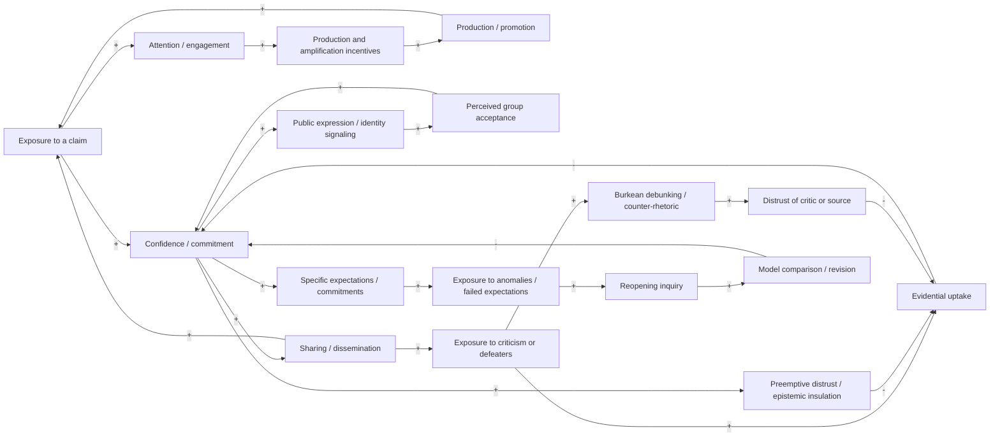

```mermaid
flowchart LR
    E[Exposure to a claim] -->|+| C[Confidence / commitment]
    C -->|+| S[Sharing / dissemination]
    S -->|+| E

    E -->|+| G[Attention / engagement]
    G -->|+| I[Production and amplification incentives]
    I -->|+| P[Production / promotion]
    P -->|+| E

    C -->|+| X[Public expression / identity signaling]
    X -->|+| N[Perceived group acceptance]
    N -->|+| C

    D[Exposure to criticism or defeaters] -->|+| U[Evidential uptake]
    U -->|-| C

    C -->|+| Q[Preemptive distrust / epistemic insulation]
    Q -->|-| U

    S -->|+| D
    D -->|+| B[Burkean debunking / counter-rhetoric]
    B -->|+| T[Distrust of critic or source]
    T -->|-| U

    C -->|+| F[Specific expectations / commitments]
    F -->|+| A[Exposure to anomalies / failed expectations]
    A -->|+| R[Reopening inquiry]
    R -->|+| M[Model comparison / revision]
    M -->|-| C
```