# Systems Science

When asking ourselves "What is Systems Thinking", we may naturally wonder "what is a system?" That is a good starting point. We need a clear understanding of what a system is before exploring how to "think" in systems. Luckily, in George Mobus's "Systems Science: Theory, Analysis, Modeling, and Design", he provides a formal definition that I find extremely useful, that can be used to establish a starting point for understanding all kinds of systems. "Systems Science" is the attempt at forming a meta-science; establishing principles and methods that apply to all sub-domains of science. The idea is that this definition can catpure every aspect of a system from biological, social, physical, socio-technical, or engineered.

## Principles

In order to understand systems in nature and engineered systems, you need to understand the principles that underlie all systems. Each principle can be activated at different times or for different systems. Mobus identifies 12 principles that are basic and apply variously across all systems. 

1. Systemness: Bounded networks of relations among parts constitute a holistic unit. Systems interact with other systems, forming yet larger systems. The Universe is composed of systems of systems.
2. Systems are processes organized in structural and functional hierarchies.
3. Systems are themselves and can be represented abstractly as, networks of relations between components.
4. Systems are dynamic on multiple time scales.
5. Systems exhibit various kinds and levels of complexity.
6. Systems evolve to accommodate long-term changes in their environments.
7. Systems encode knowledge and receive and send information.
8. Systems have governance subsystems to achieve stability.
9. Systems contain models of other systems (e.g., simple built-in protocols for interaction with other systems and up to complex anticipatory models).
10. Sufficiently complex, adaptive systems can contain self-models.
11. Systems can be understood (a corollary of #9)—Science.
12. Systems can be improved (a corollary of #6)—Engineering.

We will explore each of these in depth. Below is a diagram representing how the principles relate:

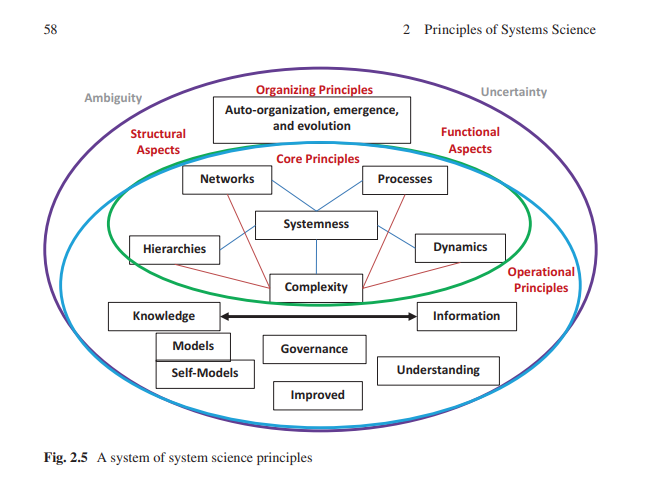

In Principles of Systems Science, Mobus applies these principles to the case of drug resistant TB. It's a great example because it shows that its a multi-faceted issue where multiple perspectives need to interesct to solve the problem. It spans multiple systems (biological, social, economic, health), and is therefore in the interest of researchers in each of these domains. I'll provide descriptions of this case in the sections below:

### Principle 1: Systemness

For Mobus, “systemness” is the core idea: what makes something a system is not just “having parts,” but having organized relations that create a whole with a boundary and an environment. Systems are also recursive: systems contain subsystems and are embedded in larger systems (“systems within systems”), which matters for both analysis (decomposing) and synthesis (seeing roles in a larger web).

Mobus frames drug-resistant TB as a *nested* “system of systems”: TB bacilli live in lungs; lungs belong to persons; persons sit in families and social groups; those sit in communities, regions, nations, and global society. The point of this lens is methodological: once you see the nested structure, you get a “map” of where to look for interactions that shape emergence and spread (from microbial ecology up through social/political/economic organization). 

### Principle 2: Systems Are Processes Organized in Structural and Functional Hierarchies

Mobus pushes a strong claim: system and process are “essentially synonymous” because components and interactions only exist as activities unfolding in time. He then emphasizes hierarchy as a near-universal architecture for managing complexity: lower levels contain many simpler, faster-changing components; higher levels are made of subsystems with stronger internal interactions and some kind of boundary. Functional hierarchies track the same architecture: “work” gets organized across layers. An example of this recursive hierarchy can be seen in the image below:

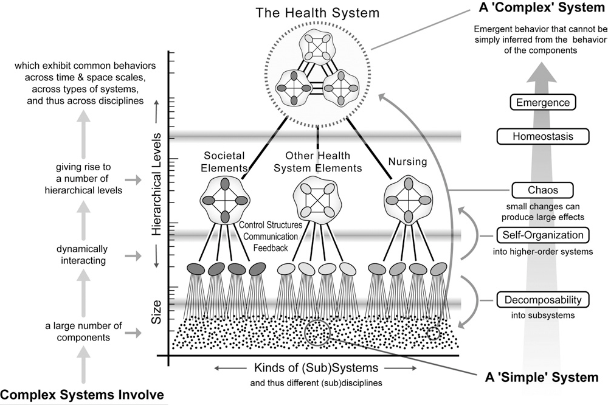

In this example, the "health system" can be decomposed into functional sub-units that, when combined and organized in various ways, yield the behaviors we associate with "the health system". Another example below is of a "complex adaptive system":

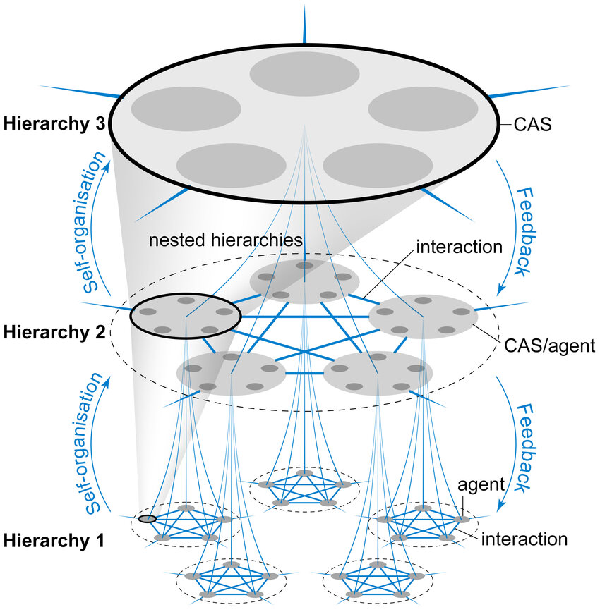

A complex adaptive system has a nested hierarchical network structure, which emerges from the bottom-up selforganisation of many interacting agents, endowed with indeterminate dynamics and adaptability. [source](https://www.researchgate.net/publication/369971412_The_evolution_and_impacts_of_'complexity_notions'_in_landscape_architecture)

Mobus pushes you to view TB not just as an “enemy microbe,” but as something embedded in the *process hierarchies* of living systems. At the biological level he emphasizes that humans are already ecosystems of microbes; antibiotics disrupt multiple processes (e.g., gut bacteria), reframing “side effects” as consequences of intervening in a process-network. Then he climbs the hierarchy: TB’s meaning changes when you shift from microbes/metabolism to persons-in-families-in-communities, where communicability reshapes everyday contact, fear, and social dynamics. He uses this to motivate questions about immune-system “discernment,” training (resistance), vaccination, and how social conditions shape treatment completion and resistance. 

### Principle 3: Systems Are Networks of Relations Among Components and Can Be Represented Abstractly as Such Networks of Relations

This was obviously alluded to in the last principle. A system is a network: components linked by relations/flows. Mobus highlights that network representations (graph theory, flow networks, etc.) give formal tools for revealing properties that casual observation misses. This principle also bridges to modeling (#9/#11): you can represent systems with other systems (mental or abstract) partly because networks are representable. Mobus provides two examples of network/graphical representations. The first is a network with a hub:

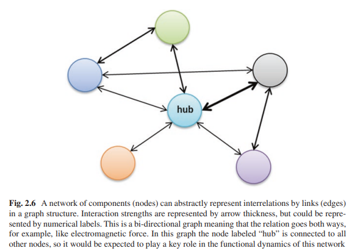

This simply represents the structure of a graph. Think of a "hub" like an airport; it acts as a transportation bridge for air travel. In the second image, the same graph is represented as a "flow network":

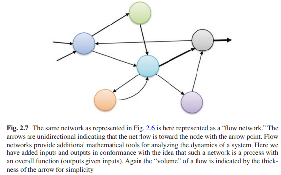

Flow networks allow you to understand an analyze how energy and information flow from nodes through edges in a graph. A simple example is blood in your veins flowing to organs. Another example is communication in a social network being sent through communication channels from an influencer. 

This applies directly to the drug-resistant TB case. The network lens, for Mobus, is the antidote to simplistic “A causes B causes C” stories. In complex systems, effects are typically multi-causal and causes multi-effect; therefore interventions reliably produce “unintended consequences” unless you reason in terms of *webs of linkage*. He illustrates this with medicine: drugs have many effects in the body’s network, and multi-drug interactions amplify unpredictability—an analogy for why TB policy also needs network thinking to anticipate knock-on effects across medical, social, economic, and institutional linkages. 

### Principle 4: Systems Are Dynamic over Multiple Spatial and Time Scales

Mobus stresses that “dynamics” is how processes transform inputs to outputs over time—and that relevant time scales shift with the scale of organization (molecular vs cellular vs geological, etc.). Some systems that look "inert" are simply operating on timescales difficult to conceptualize (geologic time). Likewise, other systems have extremely short lifecycles (think of a cell). A key systems warning here is time-scale mismatch: feedback loops operating at different speeds can destabilize a whole system (his example: fast economic incentives vs slow ecological regeneration). Systems analysis should therefore explicitly attend to all time scales where conflicts can threaten sustainability. Systems constantly adjust themselves by feedback loops, but when interdependent components operate with feedback loops of different temporal scales the system may become unstable.

In the TB case, Mobus highlights a core mismatch: microbes reproduce and evolve quickly, while human social change (institutions, habits, incentives) moves much more slowly. He uses this to show why antibiotic resistance is so hard: even if humans can change faster than many large organisms, the microbe timescale is still “too fast,” so the system’s dynamics are dominated by cross-scale feedback (fast biological adaptation interacting with slower human behavioral/institutional change). 

### Principle 5: Systems Exhibit Various Kinds and Levels of Complexity

Mobus treats complexity as deeply tied to systemness, but important enough to make explicit: complexity helps explain why systems behave unexpectedly or fail. He leans on a Simon-style view: complexity derives from multiple structural attributes of hierarchically organized networks of strongly interacting modules—so complexity isn’t just “many parts,” but organized multiplicity, nested modules, and interaction structure. In "Principles of System Science", he distinguishes between different types of complexity:

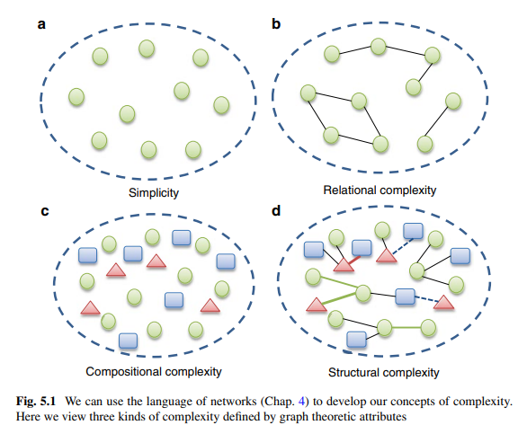

Here, he distinguishes between relational, compositional, and structural complexity. Each of these are aspects of complexity. And in his more recent book, he tells us "Ultimately the complexity of any identified system is based on the total number of components, number of kinds of components, and the attributes of networks within a level and between levels (i.e., the degree of modularization)." These "complexities" can lead to unexpected behavior of the system, chaotic dynamics, and non-linearities.

In the TB case, he argues that calling TB “a health problem” barely narrows anything, because the problem spans layered complexities: bacterial internal organization; disease-course complexity; contagion intertwined with social contact networks; and then an even different order of complexity when you move to human psychological, social, economic, political, and cultural systems—plus the emergent “whole” when those domains interact. This is why specialization is necessary but insufficient: no single domain can “add up” to the holistic dynamics driving drug resistance.

### Principle 6: Systems Evolve

Systems evolve to accommodate long-term changes in their environments. Mobus frames evolution broadly (not only biology): systems can move toward greater organization/complexity, maintain steady-state dynamics, or decay. A central driver is energy flow: with abundant “free energy” available to do work, systems tend (in general) toward higher organization/complexity; when energy is diminished, entropy dominates and order deteriorates. This principle also underwrites #12 (“improvement”)—but Mobus warns that more complexity doesn’t automatically mean “better.”

This principle is obvious. Drug resistance is his “poster child” for evolution: inheritable variation + selective pressure (antibiotics) + reproduction yields directional change. But he also extends the idea: multiple selective pressures exist at different levels (microbial survival, patient behavior, institutional incentives, political/economic pressures), and while each trajectory can look predictable in isolation, their intersection produces system-level outcomes that are hard to foresee and govern. 

### Principle 7: Systems Encode Knowledge and Receive and Send Information

Mobus widens “knowledge/information” beyond minds: in a basic sense, a system’s structure embodies constraints that shape how it can react—so “by its very structure” the system “knows” how to respond to events. From that grounding, more elaborate forms of information/knowledge emerge across evolution (physical → biological → psychological), with living organisms exhibiting more complex, evolved modes of encoding/processing. Consider something like the police responding to the call. The police "knows" the proper response, because the agent is embedded within an organizational structure that consists of policies, norms, customs, and rules for handling certain inflows of information. This "knowledge" is embedded within a history of ever changing incidents, responses, and points of improvement. 

Mobus uses TB to introduce his idea that *structure encodes “knowledge of how to act”*—no brain required—and that ongoing information flows modify behavior by modifying structure. He then shifts to social organization: poverty, malnutrition, corruption/ineffective governance, and organizational inertia are treated as “knowledge built into structure,” shaping predictable responses (“not our job,” “we’ve always done it this way,” etc.). So bacterial evolution and social response are both guided by structurally embedded “knowledge,” even though they operate at very different levels of organization. 

### Principle 8: Systems Have Regulatory Subsystems to Achieve Stability

As systems become more complex, coordination among subsystems can’t be left to chance synergies—reliable coordination requires control, typically through feedback and specialized regulatory subsystems (often forming control hierarchies). This is why cybernetics becomes central for Mobus: regulation is what lets complex systems maintain something like a steady state (not static, but statistically stable) and keep functioning despite disturbances.

Mobus treats stability as “keeping function and integrity over time,” and argues that as complexity rises, breakdown modes multiply—so systems evolve monitoring/correction subsystems (feedback + expectations). TB makes this vivid because defense systems hinge on detection/false alarms: immune systems must react to real invaders without overreacting to benign inputs (allergies as regulatory failure), and medicine/public health are layered regulatory infrastructures that try to keep the health system reliable—though regulation can also slow flexibility. He then parallels this with governance: stable governments tend to have effective public health agencies; governments in turmoil tend to have impaired defenses, and priority-setting across competing regulatory goals (growth vs worker health) can create conditions (urban slums, crowding) that amplify TB. 

### Principle 9: Systems Can Contain Models of Other Systems

Mobus starts with familiar cases (maps, blueprints, mental images) but insists modeling is not only mental: systems can “expect” other systems via structural complementarity and interaction rules (his examples include puzzle pieces and molecular interactions). More generally, systems encode models of aspects of their environment that they interact with—implemented in different ways at different levels of organization.

Mobus describes “models” as interaction protocols: consistent system interactions imply partial models of what matters for the interaction (immune recognition as a model of “enemy”; camouflage and lures as exploiting an organism’s model of the world). Applied to TB, he emphasizes that bacteria “model” their antibiotic-laced environment through evolutionary shaping of what works, while researchers model bacterial survival to disrupt it; across society, institutions also carry models (economic, ethical, political) that guide strategies and conflicts. He flags a common failure mode: people hold partial models as if they were the whole truth (“if only…” thinking), but models are inevitably partial and can’t just be maximized or added without creating disruptions and trade-offs. 

### Principle 10: Sufficiently Complex, Adaptive Systems Can Contain Models of Themselves

Adaptive systems (especially living organisms) can update their environmental models via learning/adaptation, and some can also form models of themselves (roles, identities, self-representation). Mobus connects this to social-scale consequences: in humans, intertwined models of world-and-self become structured into societies and shape society–environment interaction; inaccurate models can drive dysfunctional interaction, making this principle relevant to sustainability.

He extends “self-models” from humans to biology: humans/institutions carry self-identities that guide action, while TB bacteria carry a self-model in DNA (a protocol for producing/maintaining the organism and reproducing it). Self-models create continuity—and thus can become a bulwark against needed change (“this is who we are/how we do things”), including bureaucratic mission lock-in and activist identity lock-in. He also stresses that self-models include the system’s modeled relation to its environment, and that layered self-models (individuals ↔ families ↔ institutions ↔ governments) interact in feedback loops; understanding that “dance” is part of finding leverage points for change. 

### Principle 11: Systems Can Be Understood (a Corollary of #9)

Mobus treats “understanding” as largely about building and improving models: science explicates systems by constructing formal/abstract models and iteratively refining them as they’re tested and fed back into experience. He ties understanding to model efficacy: when you understand, you can make predictions or at least generate testable scenarios; feedback then improves or replaces models.

Mobus ties understanding to iterative model-building plus feedback: the universe’s relational patterning makes partial prediction possible; models are revised when expectations fail. For TB, he says science/technology have advanced enough to defeat some mistaken causal stories, and massive measurement/statistics can reveal layered causal correlations (income, education, water, crowding, nutrition, etc.) and even predict where TB/resistance will emerge. But he emphasizes a key limit: social problems remain multi-causal and contested—there’s no single agreed “function” to optimize, so understanding does not automatically yield aligned motivation or coordinated action. 

### Principle 12: Systems Can Be Improved (a Corollary of #6)

Mobus flags a classic systems difficulty: “improvement” is value-laden and can trade off against other system impacts (a highway might be “better” for transport but “worse” for land, noise, air, etc.). So he frames improvement in terms of function and systemic consequences: systems inevitably produce consequences through their operation, and “better” has to be evaluated systemically (including side effects, long-term dynamics, and risk of instability/collapse as complexity grows).

"Improvement” is inherently perspectival and therefore about trade-offs across levels/groups. Using antibiotics as the intuitive “improvement,” he shows the systemic downside: curing disease can increase reproduction/survival and thus increase population pressures and resource consumption; meanwhile antibiotic use creates selective pressure for resistance, threatening the very improvement. So engineering responses (new incentives for R&D, regulatory design, public health interventions, education to change medication-use models, etc.) have to be treated as interventions in a coupled system—where gains in one place can produce costs and risks elsewhere. 

## Systems Ontology

In a philosophical sense of the term, an Ontology is a description of the most fundamental categories that exist. It is not a truth claim, but a committment to a set of categories and relations, treating this description as complete and internally consistent. Technically, philosophical ontology is the "study of being", the features all entities have in common, and how we can divide this into "categories of being". That is the "categorical" aspect of the discipline I was referring to earlier. 

Everything kind of began with Aristotle's theory of categories. In [The Categories](https://en.wikipedia.org/wiki/Categories_(Aristotle)), he enumerates all possible kinds of things that can be the subject or predicate of a proposition; the two being linked by a inheritance-type relation. Any given subject/being can inherent from multiple categories. His ten basic categories include: Substance (primary, irreducible), Quantity (how much), Quality (description), Relative (relatedness towards other subjects), Where (place), When (time), Relative position (posture or attitude), Having (an entities state or condition), Doing (action), Being affected (affection). If you have read any Aristotle, you'll notice that his subsequent philosophy depends on his fundamental categories. Aristotle's categories are "out there" in the world; it is a realist position.

Other philosophers have proposed systems of categories as well. In Critique of Pure Reason, Immanual Kant argues that categories are part of our own mental structure, consisting of a set of a-priori concepts through which we interpret the world around us. Kant is anti-realist about the categories as structures of mind-independent being, but not anti-realist about their objective validity within possible experience. Aristotle, by contrast, is much closer to a realist about categories as articulations of reality itself. Kant introduces the "Forms of Judgement", basic patterns of reasoning that allow us to understand anything at all. These "judgements" map on to the fundamental categories; categories are derived or "found out" because of these "sense making" faculties. The same faculty that makes judgments also structures experience. Therefore, if we can identify the basic logical forms of judgment, we can identify the basic pure concepts needed to think objects. So for example, hypothetical judgements such as "If A, then B" correspond to the general ontological category "cause and effect". Or consider modality; An apodictic judgement might be something like “A may be B,” “A is B,” “A must be B”. This form of judgement maps on to general categories like possibility, existence, and necessity. Therfore, the categories are derived from the forms of judgment, which are the basic functions of the understanding. 

The philosophical sense of an ontology can be contrasted with ontology from information science. In the latter, an ontology "encompasses a representation, formal naming, and definitions of the categories, properties, and relations between the concepts, data, or entities, that pertain to one, many, or all domains of discourse." In plain terms, an ontology is a description or model of some subject area, providing rules for how the subjects relate. In philosophy and information science, they're both attempts to represent entities, objects, and events, their properties and relations, according to a system of categories. There are different types of ontologies in information science: top, mid, and domain specific. Top-level, mid-level, and domain ontologies differ mainly in scope and specificity. A top-level ontology describes very general concepts that apply across almost any field, such as object, event, process, time, space, quality, and relation. A mid-level ontology sits between broad theory and practical application, organizing concepts that are reusable across several related areas, such as organizations, roles, measurements, documents, or transactions. A domain ontology is the most specific: it models the concepts, relationships, and rules of one particular field, such as medicine, law, finance, or cybersecurity. Top-level ontologies provide the broadest foundation, mid-level ontologies provide reusable structure for families of domains, and domain ontologies provide detailed vocabulary for a specific area.

Systems Ontology, is the attempt to construct an ontology for all systems. This is required for establishing a common language that will form the basis for subsequent activities like analysis and design. In the book, Mobus claims the system ontology to be somewhere between the philosophical and information science senses. In a footnote, he notes that a reviewer of the book suggested using an upper ontology, the [General Formal Ontology (GFO)](https://en.wikipedia.org/wiki/General_formal_ontology). Mobus notes the similarities between the systems ontology he constructs and the GFO, but says the systems ontology is less formalized, deliberately. Based on this, I think the best analogue of the systems ontology would be a top level ontology. There are other top level ontologies like [Basic Formal Ontology (BFO)](https://en.wikipedia.org/wiki/Basic_Formal_Ontology), which could also be analagous. If this analogy holds, the systems ontology, as a top level ontology, would be the most general categorization of systems across all disciplines. From this, you could derive mid-level and domain specific ontologies for individual disciplines like economics.

So the flow goes like this: principles, then the ontology, then a formalized generic definition of a system. 

### Ontogenesis

Mobus dedicates a significant amount of time to explain ontogenesis: **the process of auto-organization, emergence, and selection**. He is concerned not just with the system ontology, but how systems come about. All systems can be decomposed into subsystems until we reach the most fundamental particle level. Ontogenesis is the process by which we work upwards to further levels of complexity. The "ontogenic cycle" is the process where by "things" existing at a specific level of organization interact with one another, to form more complex systems having emergent capabilities that the lower levels did not possess. Ontogenesis for Mobus is therefore the **origin and development (complexification)** of systems and systems-of-systems—i.e., why the universe seems to generate increasing organization over time. His ontogenesis idea is essentially two interlocking pieces:

1. The fundamental “cycle” that drives complexification

    Ontogenesis is described as operating via four fundamental elements **matter, energy, information, knowledge**, and a cycle:

    * **Material organization** (structure/state) is changed by **energy flows** when that energy is “new” to the system (i.e., it functions as **information**) →
    * new organization (**knowledge**) permits **new behaviors** →
    * enabling new possible interactions (new energy flows) → and the cycle repeats. 

    New interactions lead to combinations of material objects of greater complexity. This operates on all levels of existence. So ontogenesis is not “progress” in a moral sense; it’s a *process theory* for how systems accumulate organization.

2. The emergence pathway: auto-organization → emergence → selection → governance

    Mobus links ontogenesis to a recurring pattern in major transitions: components associate, stabilize, and become a new “whole” that persists if it fits environmental constraints. In *Sapience*, he describes the same emergence pathway:

    * increasing complexity proceeds through **auto-organization / emergence / subsequent selection** patterns (he notes many authors converge on this general scheme).
    * key transitions depend on parts finding ways to **communicate** and cooperate to maintain the new form’s function; outputs must be acceptable to the environment or the form won’t persist. 
    * beyond some complexity threshold, “mere cooperation is insufficient” and a **coordinator function** must emerge; if the coordinator doesn’t emerge (or is faulty) the form disintegrates.

That last point is how ontogenesis ties directly into Mobus’s emphasis on **hierarchical cybernetics / governance** as complexity rises. An example of this process applied to human social systems is provided below:

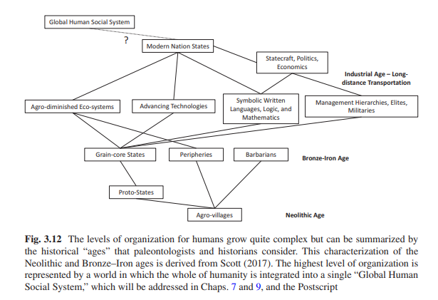

This forms from a lower level of ontogenesis:

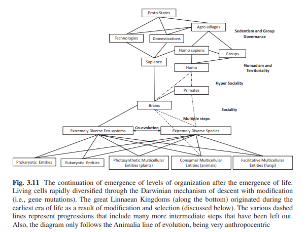

The process upwards through these levels of organization are the product of auto-organization, emergence, and selection. 

### The Ontological Framework

What follows is an **ontological framework for systems analysis**: a way to identify the *elements that must be present* when we describe any **system of interest (SOI)**—whether the system is physical, biological, social, or an abstract model instantiated in some medium. The framework is not a taxonomy of “things in the world” so much as a disciplined set of **commitments** about what we have to specify to talk coherently about *systemness* across domains. 

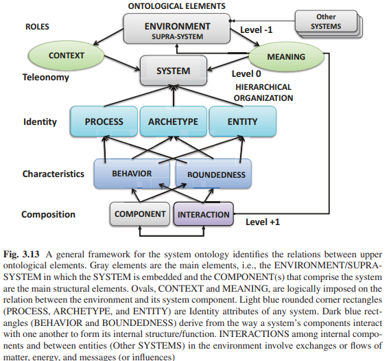

Mobus organizes the framework as a **three-level structure**. The SOI sits at **Level 0**, its enclosing **environment** is **Level −1**, and the SOI’s **components** are at **Level +1**. The point of the level structure is practical: it forces us to state what we are treating as “inside,” what we are treating as “outside,” and how we will move up and down the hierarchy during analysis and deconstruction. 

#### Level −1: Environment (the teleonomy frame)

At the top of the framework is the **environment**, understood as the **suprasystem that encloses** the SOI. Because the environment contains the SOI *and* other systems that interact with it, it is (by definition) **more complex** than the SOI. The environment is what supplies the SOI with **context and meaning**, and you cannot characterize system purpose (teleonomy) without specifying the SOI–environment relationship. 

Mobus then expands environment into two key sub-elements:

* **Context**: the set of conditions at a given time that are relevant to the SOI’s dynamics. In practice, the “fundamental context” includes the other systems the SOI is coupled to through **sources of inputs** and **sinks for outputs** across the boundary; it also includes disturbances that affect the SOI even if they are not cleanly identifiable as a single source or sink. Context changes through nonstationarity—sources/sinks changing behavior, or appearing/disappearing—so uncertainty is built into the system’s operating conditions. 
* **Meaning**: a subset of contextual conditions that carry **valence** for the SOI—positive, negative, or neutral—where valence indicates whether the SOI must respond (and with what urgency) to remain viable. Meaning is not treated as a purely human philosophical add-on; it is operationalized as the environment’s “evaluation” of the SOI’s interaction with it. Mobus explicitly closes the loop: interactions feed back into the environment, and if the SOI’s interactions are inappropriate for the context, the system incurs negative valence; if appropriate, positive; if irrelevant, neutral. 

This is how “purpose” enters without metaphysics: **teleonomy** is grounded in the SOI’s role in the supra-system—systems persist insofar as their outputs are net-beneficial to the larger system and are therefore supported by continued resource flows. 

#### Level 0: System (identity + characteristics)

At Level 0, Mobus treats the SOI as the core ontological element and insists we clarify *what kind of system we mean* and *how it presents itself*.

**Identity (three views of the SOI):**

* **Process**: every system is a process in the sense that it transforms input flows (material, energy, or messages) into outputs; the collective effect of that process is the system’s function. 
* **Type**: the SOI belongs to a category/archetype within an evolutionary/ontogenic history of variation on common themes (e.g., “lake,” “mountain,” “species,” and later, engineered or social archetypes). Type is the classificatory frame that helps us connect an SOI to families of systems and to the ontogenic cycle that generates diversity. 
* **Entity**: the SOI is a concrete, particular system that produces causal effects in the world. Even a “model” can be treated as an entity when it is instantiated (e.g., running in a particular computer memory). 

**Characteristics (how the SOI shows up):**

* **Behavior**: all systems display activity on some time scale, and they interact with other systems through properties of boundaries and components. 
* **Boundedness**: the SOI is delineated from its environment by an **effective boundary** grounded in the coherence of components. Some boundaries are physical (cell membranes), some are field-like (gravity binding an atmosphere), and many are **fuzzy and porous** (especially social systems). Mobus treats the boundary as a real explanatory element: it emerges where internal interaction strengths/densities are sufficiently greater than external interactions, even when no “wall” is visible; fuzzy boundary ideas can be formalized via membership functions over space and time. 

Importantly, Mobus notes that disputes about whether boundaries are “real” or “observer-defined” are often worldview disputes; for analysis, what matters is having methods that let us *operationally locate* effective boundaries well enough to model and intervene. 

#### Level +1: Components and interactions (composition)

At Level +1, the framework shifts to the internal constitution of the SOI:

* **Components**: systems contain components that operate internally to produce the system’s process; components may themselves be systems (subsystems) or irreducible primitives. This is what makes recursive deconstruction possible. 
* **Interactions**: no systems are isolated. Interactions (relations in a dynamic sense) arise from boundary properties and internal processes, mediated ultimately by physical forces and by message transmission. Mobus emphasizes that “relation” can be too static; interaction should be treated as time-dependent and condition-dependent as part of functional description. 

So the “bottom” of the ontology is not merely “parts and links,” but **parts whose coordinated behaviors generate a process**, bounded into an entity that persists via ongoing interaction with a supra-system that supplies context and meaning. 

Mobus’s framework doesn’t stop at naming **environment**, **system**, **components**, and **interactions**. It also specifies the **roles** these elements play in conferring “systemness,” and it clarifies why concepts like **teleonomy**, **qualities**, and **attributes** matter when you move from casual description to analysis and modeling. 

#### Interactions and relations

Mobus treats **interaction** as universal: *there are no isolated systems*. Interactions arise from the properties of boundaries and internal processes, and—at root—are mediated by physical forces (electromagnetic and gravitational) and by the many forms these forces take at higher levels of organization (chemical reactions, radiative coupling, mechanical contact, convective cycles, signaling, and message transmission). 

He also makes a careful distinction between **interaction** and the more general term **relation**. A relation can be static (“in front of,” “before,” “dominant”), whereas an interaction should be treated as part of a **functional description**: time-dependent, condition-dependent, and tied to causal influence. Even when a relation is useful (like positional order in a train), it only “exists” under the relevant functional conditions (the engine is “in front of” while pulling, not after decoupling). 

A subtle but important implication follows: when we model a system, we don’t just list components; we specify **what interactions are possible**, **how they are transmitted**, and **under what conditions** they occur, because this is where dynamics and causality live. 

#### Roles: why “teleonomy” matters

Mobus groups key ideas under “roles,” and the first is **teleonomy**—his way of talking about “purpose” without assuming metaphysical intention. He’s explicit that “purpose” is philosophically fraught (because it often implies intention), but he still thinks systems analysis needs an operational notion of why a system persists in a larger environment. 

Teleonomy, in this framework, is grounded in **system–environment interaction**:

* Systems persist in their environments by performing a **function** whose outputs are (on net) **beneficial to the supra-system**. This is his generalization of “fitness.” If the system’s outputs are useful to other entities in the environment, the system tends to keep receiving the resource flows it needs to sustain itself. 
* The environment (as supra-system) “channels” resources—directly or indirectly—toward subsystems whose outputs contribute to the supra-system’s longer-term dynamic stability. Subsystems that do not fit this mutual-support pattern are selected against in the long run. 

This is the point where **context** and **meaning** become more than descriptive labels. “Context” is the current state of the environment with respect to the SOI’s ongoing couplings (sources/sinks and disturbances), and “meaning” is the **valenced evaluation** of whether the SOI’s interactions are appropriate under that context. If interactions mismatch context, the SOI incurs negative valence; if aligned, positive; if irrelevant, neutral. 

Teleonomy, then, is not “the system’s inner intention.” It is the system’s **role** in the supra-system as expressed through **mutual dependence, feedback loops, and selection pressures** over time. 

#### Qualities: what makes something a system “as such”

Mobus uses “qualities” to refer to the aspects that confer systemness on a “thing.” In his framing, every concrete system is simultaneously:

* a **process** (internal transformations that manage inputs and produce outputs),
* an **object** (a unified whole that can be identified), and
* an **entity** (a particular, causally effective instance in the world). 

This threefold view matters because it prevents a common analytic mistake: treating a system as if it were *only* an object (a static thing with parts) or *only* a process (a flow with no stable identity). Mobus’s point is that objecthood and identity are stabilized by ongoing process—systems “stay themselves” by continually doing what they do. 

#### Attributes: why boundaries and behavior are the basis of system attribution

Under “attributes,” Mobus explains how we actually *attribute* systemness in practice. We perceive systems as **bounded objects with behavior**. Even when we cannot directly observe internal workings, we infer internal activity by observing:

* what crosses the boundary as **inputs**,
* what crosses as **outputs**, and
* how the whole responds to forces or generates forces toward other entities. 

Two points are central here:

1. The behavior of the whole is a function of combined component behaviors and **cannot be predicted solely from individual components in isolation**. 
2. The behavior “belongs” to the SOI because an **effective boundary** demarcates the system from its environment. 

So “attributes” connects epistemology to ontology: what we can know (inputs/outputs across a boundary) is exactly what motivates formal system modeling later in the book.

#### System boundaries and the boundary “problem”

Boundaries do a lot of work in this ontology. Mobus defines boundedness as a consequence of **coherence among components**, yielding an “effective boundary” that delineates inside from outside. Boundaries can be:

* **physical** (e.g., a cell membrane),
* **field-like** (e.g., gravity binding an atmosphere),
* **chemical/structural** (bond saturation making a molecule “complete”), or
* **social/psychological** (e.g., “bonds of love,” shared beliefs), often fuzzy and porous. 

Crucially, boundaries need not be visually explicit. Mobus argues that a boundary can be inferred from the **relative density and strength of internal interactions** compared with external interactions. In network terms, the system looks like a “clique” of strongly connected components with comparatively weaker, sparser links outward—making the boundary an emergent feature of interaction structure, not necessarily a container wall. 

He also addresses the longstanding dispute about whether boundaries are “real” or “observer-defined.” Engineers often treat boundaries as chosen (because they design systems for functions), and some formalists generalize that into “systemness is a mental construct.” Many natural scientists, by contrast, treat boundaries as real even when they are fuzzy or interaction-based rather than physical. Mobus’s stance is pragmatic: the disagreement is largely worldview; the practical challenge is developing methods to **identify and represent boundary conditions** well enough to analyze and model real systems. 

To deal with ambiguous cases, he introduces **fuzzy boundaries** (via fuzzy set membership functions) where a component can be “inside” to some degree at certain places/times and “outside” at others—especially relevant in social systems where membership varies by season, time of day, or role. 

#### Composition: why recursion matters for analysis

Finally, Mobus uses “composition” to tie the framework back to analysis practice. A system is composed of components with interactions, and a component at Level 0 may itself be a **system**—which means it can be “remapped” into the same Level −1/0/+1 framework (with the original SOI now acting as its environment). This recursion is the basis for the method he later calls **functional/structural deconstruction**. 

This is the key bridge from ontology to method: once you commit to systems being recursively decomposable into subsystems with their own environments, boundaries, behaviors, and interactions, you have a principled way to move between levels without losing the logic of systemness.

Read together with Mobus’s ontogenic cycle, the framework supports two complementary questions:

* **Ontology (what to specify when you deconstruct):** environment → context/meaning; SOI identity as process/type/entity; SOI characteristics as behavior/boundedness; composition as components/interactions. 
* **Ontogenesis (what story to test when you explain emergence):** how changing contexts and feedback/valence pressures lead systems to reorganize; how new coherent boundaries and denser internal interactions stabilize new entities; how types/archetypes proliferate as the ontogenic cycle generates variation; and why increasing complexity tends to require more structured coordination (governance/regulation) to sustain viability over time. 

### The Systems Ontology

The ontological framework has significant redundancy with the general ontology provided by Mobus. You can think of what we have covered so far as the top level/upper ontology. Now we cover more specific ontological aspects that can be applied to domain ontologies. Below is the specific systems ontology from which mobus derives his definition later, which can apply to all domain specific ontologies:

- **Environment**: The suprasystem that encloses the System of Interest (SOI). It is more complex than the SOI because it contains the SOI plus other interacting systems. The environment provides the SOI with *context* and *meaning*, and contains the sources of inputs, sinks for outputs, and the channels/fields through which flows occur. Environmental entities connect directly with the SOI boundary.
  - **Entities**: Concrete systems/objects in the environment that couple to the SOI by providing inputs, receiving outputs, or otherwise affecting the SOI. The “fundamental context” includes ongoing interacting systems (sources/sinks) plus influences that affect the SOI without being easily attributable to a single identifiable source or sink (disturbances).
    - **Source**: An environmental entity/subsystem that provides inputs to the SOI across its boundary (material, energy, or messages). Sources are part of the SOI’s context; changes in source behavior (rate/quality) or appearance/disappearance shift the context (nonstationarity).
    - **Sink**: An environmental entity/subsystem that receives outputs from the SOI across its boundary (material, energy, or messages). Sinks are part of the SOI’s context; changes in sink receiving behavior/capacity or appearance/disappearance shift the context (nonstationarity).
    - **Disturbance**: An influence that affects the SOI but is not necessarily recognized as an identifiable source or sink entity; still part of the SOI’s context and uncertainty.
  - **Flows (MOVES-FROM-TO)**: Directed movements of “substance” across boundaries and through channels/fields. “Substance” can mean material, energy, or messages. Sustained flows among multiple systems over time and distance imply a supra-system (system of systems) whose extent includes the subsystems and the distances between them.
    - **Input**: Substance that enters the SOI across its boundary from sources (and via channels/fields). All real systems import at least one of material, energy, or messages; internal processes do work on these inputs.
      - **Material**: Material inputs transformed by work processes, typically from higher-entropy “raw” forms into lower-entropy, more usable forms; often producing waste substances that are exported. Transport (moving material) is frequently part of the work.
      - **Energy**: Energy inputs that drive work in real time (operations energy), plus energy invested in constructing and maintaining the work processes (equipment). Work inevitably degrades some energy into low-potential waste heat.
      - **Message**: Specialized, low-energy flows whose modulation encodes symbols recognized by a receiver. Messages are often amplified at the receiving end to have effect (do work). They can be ambient (reflected light, sounds, chemical traces) or intentionally transmitted to influence/control receiver behavior.
    - **Output**: Substance that exits the SOI across its boundary to sinks (or into the wider environment). Outputs include products, wastes, and messages produced by internal processes; outputs are central to system function and environmental feedback.
      - **Material**: Products usable by downstream entities and waste substances created by transformations; exporting products/wastes is a major form of transport across the boundary.
      - **Energy**: Delivered energy products (higher potential/quality energy usable downstream) and unavoidable low-potential energy (waste heat).
      - **Message**: Encoded signals for retransmission and influence; messages can trigger work in receivers and modify receiver structure (e.g., by being converted into stored knowledge).

- **System**: The System of Interest (SOI) treated as the root category for analysis. It can be represented as the root of an inverted tree with subsystems as child nodes (Level +1), while the environment can be represented at Level −1 (sources/sinks). Systems are simultaneously process, object, and entity, and are understood through boundaries, behaviors, internal components, and interactions with environments.
  - **Boundary**: The demarcation between inside (components that coherently interact to produce the system) and outside (environment). A boundary exists whenever components are restrained in time and space so they remain together and can consistently interact; materials, energies, and messages may penetrate, but components remain bound. Boundaries may be explicit physical structures, field/gradient effects, or implied by strong/dense internal interactions relative to external ones. Boundaries can be porous and fuzzy, especially in social systems where membership varies over time/role/degree.
    - **Type (e.g., porosity, fuzziness)**: Boundary characteristics describing how inside/outside separation behaves. Porosity concerns what flows can cross and how; fuzziness concerns degree-of-membership varying across space and time. Boundaries may be inferred from interaction strength/density rather than visible enclosures.
    - **Interfaces**: Boundary-associated coupling structures where flows between environmental entities and internal components are mediated. Interfaces are counted as components (alongside channels, stocks, sensors, regulators).
      - **Receiver (of inputs)**: Interface function coupling incoming material/energy/messages into internal processes. For messages, receiving includes work such as transducing and interpreting for information content, potentially triggering structural change (knowledge storage) or action.
      - **Exporter (of outputs)**: Interface function coupling products, wastes, and messages outward to sinks/other entities; exporting is treated as a major transport function and part of the system process.

- **Subsystem**: A component of the SOI that is itself a system (a “whole” in its own right) and can be treated as a new SOI under recursive deconstruction. The SOI’s hierarchical organization is naturally represented as a tree: subsystems at Level +1 may have their own child subsystems and/or atomic components; the tree may be unbalanced.
  - **Component**: Any object element within the boundary that participates in producing the system’s process, including interfaces, channels, stocks, sensors, and regulators. Components may be complex subsystems requiring further deconstruction (“white box” analysis), or atomic components treated as opaque work-process boxes when sufficiently understood.
    - **Sub-subsystem**: A subsystem within a subsystem—deeper nodes in the deconstruction tree; subsystems can themselves be roots of subtrees.
  - **Object**: The system viewed as space-time extended: it occupies space (relative to a chosen reference frame) and has duration. Systems can appear to overlap when boundaries are fuzzy or morph over time (e.g., people moving among family, workplace, and consumer roles), which should be treated as time-dependent membership and flows of agent-components.
  - **Entity**: The system viewed as causally effective: through its behaviors it affects other entities at its level of organization; entities affect one another via interactions and via output/input flows that alter each other’s behaviors. All entities are actors in this broad sense.
  - **Agent**: A special actor pattern: an information-processing decision maker that receives information from the environment, processes it via a decision model, outputs a decision, and couples that output to an effector subsystem to cause behavior.
  - **Interactions**: Dynamic couplings among internal components and between components and external entities. Interactions are typically flows of substance, either channelized through channels or broadcast via fields; they occur because the receiver is affected. Complex systems depend on one component’s output being a resource input to another component enabling work.
  - **Relations**: Broader associations that may be static/situational (“in front of,” “before,” “dominant/submissive”). Interactions can be understood as relations treated functionally: time-dependent and conditional.

- **Behavior**: The changes in space and/or composition a system undergoes over time in response to interactions. Behavior applies across levels of organization—from inert-appearing objects reacting to forces, to geophysical systems driven by internal energy flows, to living systems whose behavior is highly constrained and often goal-directed due to internal energy flows and information processing.

- **Hierarchy**: The layered organization of systems into subsystems and sub-subsystems (holarchies). Systems can be represented as trees rooted at the SOI, with depth indicating levels of organization; environments can be represented at Level −1 as sources/sinks. Hierarchy is treated as ubiquitous: even “flat” organizations exhibit implicit hierarchies (e.g., power/work-process constraints).

- **Complexity**: A fundamental property of systemness tied to (1) the multiplicity of components/subsystems at a given level of organization and (2) the number of levels (depth) in the system’s hierarchical tree. Complexity is treated as central to systemness even if it is “better characterized as a property rather than a thing.”

## System Definition

A **system** is a **bounded, unified whole** made up of **organized, diverse parts**. Its internal organization matters: a system is not merely a collection of things, but a structured network of components, relations, flows, boundaries, transformations, memory, and time-indexed behavior. Some components may themselves be nested subsystems, so systems can be understood recursively as hierarchies of systems within systems.

A system is also distinguished by a boundary that separates it from an environment while still allowing structured interaction with that environment. Inputs enter from environmental sources, outputs leave through environmental sinks, and the boundary regulates these exchanges through interfaces and protocols.

This matches Mobus’s description of *systemness* as the idea that:

> “bounded networks of relations among parts constitute a holistic unit”

### Formal Definition for Modeling: System as an 8-Tuple

In *Systems Science*, Mobus presents a formal definition meant to support a language of systems and computer-based modeling.

A system, indexed by subsystem `i` and level of organization `l`, is written as:

$$
S_{i,l} =
\left\langle
C_{i,l},
N_{i,l},
Src_{i,l},
Snk_{i,l},
G_{i,l},
B_{i,l},
K_{i,l},
H_{i,l},
\Delta t_{i,l}
\right\rangle
$$

Mobus labels this an **8-tuple**, even though `Δt` also appears in the expression. The important point is that the definition packages the major structural and behavioral ingredients of a system into one formal object.

### Elements of the Tuple

#### 1. Components / Structural Skeleton

**Symbol:** `Cᵢ,ₗ`

`Cᵢ,ₗ` is the set of components that make up the system at level `l`. The index `i` identifies the component from the level above, when such a higher-level component exists. Thus, `Cᵢ,ₗ` represents the component structure of a particular system or subsystem within a larger hierarchy.

Mobus treats components not merely as a list of parts, but as structured entries that may include the component itself, its type or equivalence class, and, when relevant, a membership function. In simplified form, each component may be represented as:

$$
(c_{i.k,l}, e_{i.k,l}, m_{i.k,l})
$$

Here, `cᵢ.ₖ,ₗ` is the `k`th component belonging to component `i` at the level above. The dotted index `i.k` preserves the lineage of the component within the system hierarchy. For example, component `3.2.4` would mean the fourth component of the second component of the third component descending from the original system of interest.

The term `eᵢ.ₖ,ₗ` indicates the component’s **equivalence class**, when such a classification is useful. An equivalence class groups components that share relevant features, even if they are not identical in every respect. For example, a living cell contains many ribosomes. Individual ribosomes may occupy different locations in the cytoplasm, but they share enough common structure and function to be treated as members of the same component type.

The term `mᵢ.ₖ,ₗ` is a **membership function**. It is used when component membership is fuzzy rather than crisp. In a crisp set, every component either belongs to the system or does not, so each membership value is equal to `1`. In a fuzzy set, however, a component may belong only partially, conditionally, or only part of the time.

Mobus’s formulation differs from standard fuzzy set theory. In standard fuzzy set theory, a fuzzy set is usually represented as a set together with one membership function:

$$
(C, m)
$$

where the function maps possible members of `C` to a value between `0` and `1`. Mobus instead allows each component to have its own membership function. This gives components **member autonomy**: each component’s degree of membership can be evaluated according to its own characteristics.

For example, in a biological cell, large proteins and organelles may be unable to cross the cell membrane and therefore remain full members of the cell system. Their membership function would always return `1`. By contrast, water molecules, ions, and small molecules may move across the membrane depending on their properties and the membrane’s transport mechanisms. Their membership in the system may therefore vary over time or circumstance.

This introduces an important distinction between **fuzziness** and **probability**. Probability concerns whether an event occurs or does not occur. Fuzziness concerns the degree to which something occurs or belongs. A component’s membership in a system may sometimes be uncertain in a probabilistic sense, but in other cases the issue is not uncertainty about an either-or event. Instead, the component may genuinely belong to multiple systems, partially or intermittently.

Mobus also allows **multisets** within `C`. A multiset represents many instances of the same type of component. For example, rather than representing every individual water molecule in a cell, the model may represent them collectively as a multiset. This allows the system model to include large populations of similar components without listing every instance separately.

Components may also be **subsystems**. If a component has enough internal complexity to justify further decomposition, it can be treated as a system in its own right:

$$
c_{i.j,l} =
\begin{cases}
S_{i.j,l+1}, & \text{if the component is complex} \\
c_a, & \text{if the component is atomic}
\end{cases}
$$

This recursive structure produces a system hierarchy. The original system of interest sits at level `0`; its components appear at level `1`; their components appear at level `2`; and so on. The dotted index records the path through this hierarchy, while the level index `l` makes the level of organization explicit.

The recursive decomposition cannot continue indefinitely. Eventually, the analysis reaches components that are treated as **atomic** for the purposes of the model. Mobus gives several stopping conditions for this decomposition. One semi-formal stopping condition is the **simplest process rule**. A component may be treated as atomic when it performs a simple work process that does not require further internal decomposition. These atomic processes include combining two inputs into one output, splitting one input into two outputs, impeding a flow, propelling a flow, or acting as a passive buffer or stock.

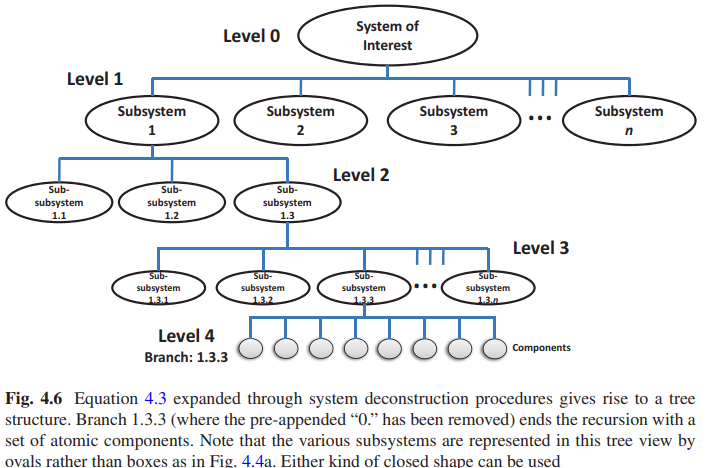

Other stopping conditions are more pragmatic. A modeler may stop decomposing a component when its internal workings are already well understood or specified outside the current system model. For example, a transistor in an electronic system, an ATP molecule in a biochemical system, or an organic molecule in a biophysical model may be treated as atomic if its internal structure is not relevant to the system being modeled.

In this sense, `Cᵢ,ₗ` defines the **structural skeleton** of the system. It identifies what the system is made of, how those components are typed, how strongly or conditionally they belong, and whether each component should be treated as an atomic part or as a subsystem requiring further analysis. This component structure is the basis for the system’s hierarchical organization.

#### 2. Interactions

The component set `Cᵢ,ₗ` gives the system its structural skeleton, but a system is not defined by its parts alone. It is also defined by the **relations and flows** among those parts, and by the interactions between the system and its environment.

Mobus distinguishes two kinds of interaction structures: internal interactions among components within the system, and external interactions between components of the system and entities in the environment. Together, these interaction structures show how the system is connected, how flows move through it, and how it remains coupled to its environment.

##### 2.1 Internal Relations

**Symbol:** `Nᵢ,ₗ`

`Nᵢ,ₗ` is a graph representing the internal relations among the components in `Cᵢ,ₗ`.

$$
N_{i,l} = \langle C_{i,l}, L_{i,l} \rangle
$$

In this graph, the vertices are the system components, and the directed edges are the links or relations between those components.

Each vertex corresponds to a component in `Cᵢ,ₗ`, along with its membership function where applicable. Each directed edge represents a relation from one component to another. An edge may be written as a pair of components:

$$
(c_{i.k,l}, c_{i.o,l})
$$

where `k ≠ o`. The direction is from component `k` to component `o`.

Mobus treats `Nᵢ,ₗ` primarily as a **flow network**. This means the edges are not merely abstract associations. They usually represent the movement of something from one component to another, together with causal influence. What flows may be matter, energy, information, signals, messages, forces, or other generalized interactions.

Each edge may also have a capacity function:

$$
cap_{i.k,l}: C_{i,l} \times C_{i,l} \rightarrow \mathbb{R}_{\infty}
$$

This function describes the possible flow rate between components. In some contexts, the capacity function may specify the maximum possible rate of flow. In other contexts, it may describe a more complex rate function that depends on several changing conditions.

The exact meaning of the capacity function depends on the system being modeled. For example, a pipe may have a physical maximum flow rate; a membrane may allow diffusion at a rate determined by concentration gradients; a communication channel may have a bandwidth; and a mechanical coupling may transmit force rather than material.

Mobus therefore uses a generalized concept of **flow**. Actual movement through channels, such as matter moving through pipes or messages moving through communication links, counts as flow. But so do field-like interactions such as force, diffusion, or other causal influences. The appropriate mathematical or computational model determines how each type of flow is represented.

In this sense, `Nᵢ,ₗ` captures the system’s **internal organization in action**. It shows not only which components exist, but how they are connected and how influence or throughput moves among them.

##### 2.2 Environmental Interactions

**Symbols:** `Srcᵢ,ₗ`, `Snkᵢ,ₗ`, and `Gᵢ,ₗ`

A system also interacts with entities outside itself. These external entities make up the system’s environment, understood in terms of **sources** and **sinks**.

`Srcᵢ,ₗ` is the set of environmental sources from which the system receives inputs. `Snkᵢ,ₗ` is the set of environmental sinks to which the system sends outputs. Together, these may be treated as the environment of the system or subsystem:

$$
E_{i,l} = \langle Src_{i,l}, Snk_{i,l} \rangle
$$

Sources and sinks are external to the system of interest. They are not modeled internally in the same way as system components. Instead, they are encountered only through their input and output relations with the system. A source may supply energy, matter, information, pressure, or some other input. A sink may receive products, waste, heat, signals, or other outputs.

Mobus represents these environmental interactions using the graph `Gᵢ,ₗ`.

$$
G_{i,l} =
\left\langle
C'_{i,l},
Src_{i,l},
C''_{i,l},
Snk_{i,l},
F_{i,l}
\right\rangle
$$

`Gᵢ,ₗ` is a flow graph connecting the system to its environment. It identifies which internal components receive inputs from environmental sources and which internal components send outputs to environmental sinks.

The set `C'ᵢ,ₗ` is the subset of components in `Cᵢ,ₗ` that receive inputs from sources. These are the components responsible for obtaining or accepting inputs from the environment.

The set `C''ᵢ,ₗ` is the subset of components in `Cᵢ,ₗ` that send outputs to sinks. These are the components responsible for exporting products, waste, heat, information, or other outputs to the environment.

The set `Fᵢ,ₗ` contains the directed flow edges between the system and its environment. These edges may run from a source to an internal receiving component:

$$
(e_{i.k,l}, c_{i.o,l})
$$

where `eᵢ.ₖ,ₗ ∈ Srcᵢ,ₗ` and `cᵢ.ₒ,ₗ ∈ C'ᵢ,ₗ`.

They may also run from an internal sending component to a sink:

$$
(c_{i.o,l}, e_{i.k,l})
$$

where `cᵢ.ₒ,ₗ ∈ C''ᵢ,ₗ` and `eᵢ.ₖ,ₗ ∈ Snkᵢ,ₗ`.

As with internal relations, these external flow edges may include capacity functions that describe possible or actual flow rates. The same generalized notion of flow applies: what crosses the boundary may be material, energy, information, force, heat, waste, product, or some other causally relevant transfer.

##### 2.3 Internal and External Flow Together

The two interaction graphs, `Nᵢ,ₗ` and `Gᵢ,ₗ`, play complementary roles.

`Nᵢ,ₗ` describes the **internal network** of relations among components inside the system boundary. It shows how components affect one another and how flows move through the system.

`Gᵢ,ₗ` describes the **boundary-crossing network** of relations between the system and its environment. It shows where inputs enter the system and where outputs leave it.

Together, they extend the component skeleton into a dynamic system structure. The system is not just a hierarchy of parts. It is a hierarchy of parts connected by internal flows and coupled to an environment through sources and sinks.

In Mobus’s formal definition, this means that a system must be understood as both an internally organized network of interacting components and an environmentally embedded network of input and output relations. This interaction structure is what allows the system to receive resources, process them internally, produce effects, export products or wastes, and maintain its identity as a bounded but open whole.

#### 3. Boundary

**Symbol:** `Bᵢ,ₗ`

The boundary is the element that distinguishes the system from its environment. Up to this point, the system has been defined in terms of components, internal interactions, and exchanges with sources and sinks. The boundary adds an explicit account of how the system is held together, how inside and outside are distinguished, and how flows cross between the system and its environment.

Mobus treats boundedness as a real feature of systems, not merely as a modeling convenience. This differs from some approaches to system modeling, where the boundary is often treated as something chosen by the analyst in order to make the model tractable. In simulation modeling, this may be a reasonable move: the modeler may draw a boundary around only the part of a larger system that is relevant to the question being studied. But Mobus’s point is stronger. He argues that systems themselves exhibit forms of boundedness, even when those boundaries are not sharp physical walls.

Some systems have obvious physical boundaries. A cell membrane, skin, a plant cell wall, or the wall of a building clearly separates an inside from an outside. Other systems have boundaries that are more diffuse. An ecosystem, for example, may not have a hard edge, but it still has boundary conditions that help maintain an internal milieu suitable for the organisms that live there. Such a boundary may be porous, fuzzy, and difficult to locate precisely, but it still helps distinguish the system from its surroundings.

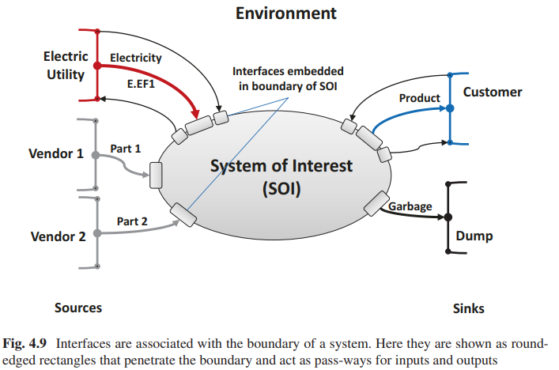

Mobus therefore treats the boundary as an explicit part of the formal system definition:

$$
B_{i,l} = \langle P_{i,l}, I_{i,l} \rangle
$$

Here, `Bᵢ,ₗ` is the boundary of system `i` at level `l`. It consists of two parts: `Pᵢ,ₗ`, the set of boundary properties, and `Iᵢ,ₗ`, the set of interfaces embedded in the boundary.

The set `Pᵢ,ₗ` describes properties of the boundary itself. Mobus notes that the exact formal structure of these properties remains an area of research, but examples include **porosity** and **perceptive fuzziness**.

**Porosity** refers to the degree to which the boundary allows flows to pass through it. A completely non-porous boundary would have a porosity of `0`. A highly porous boundary allows more passage between inside and outside.

**Perceptive fuzziness** refers to how clearly the boundary can be identified or located. A perceptive fuzziness of `0` would mean the boundary can be clearly located in space. Values greater than `0` indicate increasing difficulty in perceiving or locating the separator between inside and outside.

These properties allow the model to represent different kinds of boundaries. A cell wall may be relatively clear and physically defined. A phospholipid bilayer membrane may arise from chemical and physical forces internal to the cell. An ecosystem boundary may be both highly porous and perceptually fuzzy, with organisms, materials, and energy moving across it at different times and through particular pathways.

The second part of the boundary is the set of interfaces, `Iᵢ,ₗ`. Interfaces are special boundary components that regulate flows across the system boundary. They are not merely openings. They are structured mechanisms through which the system exchanges matter, energy, information, products, wastes, or other flows with the environment.

Mobus treats each interface as a kind of subsystem with an associated **protocol**:

$$
r_{i,l} = S_{i,l+1}(\varphi)
$$

Here, `rᵢ,ₗ` is an interface in the boundary, `Sᵢ,ₗ₊₁` indicates that the interface can itself be treated as a subsystem at the next level of organization, and `φ` is the protocol object.

The protocol `φ` is what governs how passage across the boundary occurs. It is an algorithm, rule, procedure, or control mechanism that allows a flow to cross the boundary in an ordered way. Interfaces usually do not transform the substance of the flow in the way internal process components do. Instead, they regulate whether, when, and how a flow is allowed to pass.

For example, a receiving dock in a manufacturing company functions as an interface. It receives packages, checks the manifest, verifies the material, and passes the accepted material into the inventory subsystem. The dock does not normally transform the material into a new product; it regulates the conditions under which the material may enter the system.

Information can pass through the system boundary as well, with the help of special subsystems called encoders/decoders. Mobus has a chapter dedicated to information flow between and within systems. The generalized information exchange process can be seen below. Notice how information must flow through the system boundary and interact with the system inferface:

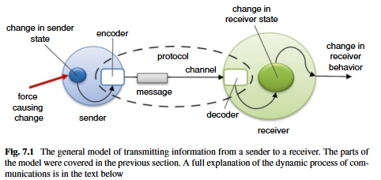

A biological example is a neuron’s postsynaptic membrane. It allows ions to pass into or out of the cell through specialized pores, but only under the right conditions, such as the presence of a neurotransmitter. In this case, the interface involves both a physical passage mechanism and a message-processing or control mechanism.

Some interfaces may include filter protocols. A filter allows desirable flows to pass while impeding undesirable ones. In such cases, the interface may alter the composition of what crosses the boundary, not by transforming inputs into products in the ordinary process sense, but by selectively permitting or blocking passage.

Interfaces are therefore special kinds of regulators. They usually control flow in one direction, under particular conditions, and according to a protocol. More complex systems tend to have more complex interfaces. A simple hut may have an opening that functions as a door, allowing nearly anything to pass. A modern building has a hinged door, knobs, locks, keys, and social or security rules governing entry and exit. An airport gate has even more elaborate protocols, with separate pathways, identity checks, ticket validation, security screening, and controlled boarding procedures.

For Mobus, interfaces and protocols are essential to understanding system behavior. Many errors in system analysis occur when interfaces are ignored or treated as trivial. A system’s behavior depends not only on its internal components and flows, but also on how its boundary admits, blocks, filters, times, or regulates exchanges with the environment.

In this sense, `Bᵢ,ₗ` does more than mark the edge of the system. It represents the system’s **boundedness as an active organizing feature**. The boundary helps keep the system intact, distinguishes inside from outside, and structures the system’s relations with its environment through specific interfaces and protocols.

#### 4. Transformation Rules

**Symbol:** `Kᵢ,ₗ` or `Tᵢ,ₗ`

Transformation rules describe how the system’s components convert inputs into outputs. In Mobus’s discussion, this element is labeled `T`, while the formal tuple uses `K`. In either case, the role is the same: this part of the system definition captures the transfer functions, process rules, or algorithms that govern what components do with the flows they receive.

For each component `cᵢ,ₗ ∈ Cᵢ,ₗ`, there is a corresponding transformation rule `tᵢ,ₗ`:

$$
T_{i,l} = \{ t_{i,l} \mid c_{i,l} \in C_{i,l} \}
$$

Each `tᵢ,ₗ` describes how a component transforms its inputs into outputs. These rules may be expressed in whatever form is appropriate for the system being modeled. They may be ordinary differential equations, logical rules, algorithms, simulations, computer code, production functions, or other mathematical or procedural descriptions.

The inputs and outputs governed by these transformation rules are the same flows represented in the interaction graphs. Internally, they correspond to flows among components in `Nᵢ,ₗ`. Externally, they correspond to boundary-crossing flows represented in `Gᵢ,ₗ`. Thus, transformations are not isolated descriptions of component behavior. They specify what happens to the matter, energy, information, force, or other generalized flows that move through the system.

For complex systems, specifying the transformation rule for the whole system of interest at level `0` may be extremely difficult. A high-level system may have many inputs and outputs, many internal components, and many interacting processes. Mobus therefore does not require a complete transformation specification at the beginning of analysis.

Instead, the initial transformation rule may be only a rough approximation or placeholder. It gives an abstract description of what the system appears to do, even before its internal mechanisms are fully understood. As the system is decomposed into subsystems, and as the transformation rules of those subsystems are discovered, the higher-level transformation can be refined.

This creates a recursive process of improvement. Analysis begins with a top-level approximation of the system’s transformation. The analyst then decomposes the system into lower-level components and identifies their own transformation rules. As these lower-level rules become clearer, they help explain and refine the higher-level transformation. The process continues down the system hierarchy until the analysis reaches atomic components or leaf nodes.

This approach differs from some traditional systems engineering methods. In many engineering practices, analysts try to specify the desired system output in detail at the beginning, often through requirements gathering. This can work for relatively well-bounded devices whose functions can be specified in advance. But for complex systems, final outputs are often too interdependent, context-sensitive, or emergent to be fully specified upfront.

Mobus’s approach allows the model of transformation to become more rigorous over time. Rather than assuming that the system’s function can be perfectly stated at the start, it treats transformation as something clarified through deep analysis. The system is analyzed top-down by decomposing its transformations into subsystem transformations, and then refined bottom-up as the effects of those lower-level transformations are recomposed into a better understanding of the whole.

In this sense, `Kᵢ,ₗ` or `Tᵢ,ₗ` captures the **functional and dynamic logic** of the system. It explains how components act on flows, how inputs become outputs, and how the behavior of the whole system can be progressively understood through the transformation rules of its parts.

#### 5. Memory / History

**Symbol:** `Hᵢ,ₗ`

`Hᵢ,ₗ` represents the system’s memory or history. It records traces of the system’s state changes over time and can influence how the system behaves in the future.

In simple systems, `Hᵢ,ₗ` may be empty or effectively `NULL`. For example, an atom may have no meaningful memory of prior states in the sense intended here. Its future state depends only on its current state and current inputs. In such cases, the transformation rules can operate without reference to a stored history.

In very complex systems, however, memory can be a major part of the system’s organization. Biological systems, and especially brains, change as a result of experience. Their internal structures are modified over time, and those modifications affect later behavior. A brain does not merely transform current inputs into outputs according to a fixed rule. Its current transformations depend on traces of previous transformations, previous inputs, previous outputs, and previous internal states.

In this sense, `Hᵢ,ₗ` augments the transformation rules `Tᵢ,ₗ` or `Kᵢ,ₗ`. It also augments the variables associated with the internal graph `Nᵢ,ₗ` and the environmental flow graph `Gᵢ,ₗ`. It records how those variables have changed across time, so that the system’s present behavior can be understood in relation to its past.

A simple formal version of `Hᵢ,ₗ` is a time-indexed record of the system’s state variables:

$$
H_t = [v_1, v_2, v_3, \ldots, v_i, \ldots, v_n]_t
$$

Here, each `v` is a measured variable of the system at time `t`. At each time instance, the relevant variables are measured and recorded. The result is a sequence of snapshots of the system’s state over time.

In the simplest case, a new record is made every `Δt` time unit. This produces a data stream:

$$
H = \{H_t, H_{t+\Delta t}, H_{t+2\Delta t}, \ldots\}
$$

Each entry records the state of the system at a given time step. For example, a corporation’s annual profit and loss statement can be treated as a periodic snapshot of some of the corporation’s most important state variables. It does not capture the entire organization, but it records selected measures that reveal something about the organization’s condition over time.

However, Mobus emphasizes that a raw record of data is not sufficient by itself. Memory becomes useful when patterns can be extracted from the recorded states. Just as a profit and loss statement becomes meaningful only when interpreted, compared, and analyzed, the system’s history becomes useful when it helps reveal trends, regularities, changes, feedback effects, or learned modifications in the system’s behavior.

For adaptive and learning systems, `Hᵢ,ₗ` is especially important. The current state of the transformation rules may depend on previous states. The system’s history can alter the way it processes future inputs. This is what allows learning, development, adaptation, and evolution to be represented within the system model.

In this sense, `Hᵢ,ₗ` captures the **temporal depth** of the system. It represents not just what the system is doing now, but how its present organization and behavior carry traces of what has happened before. For simple systems, history may be negligible. For complex adaptive systems, memory may be central to understanding how the system maintains itself, changes, learns, and evolves.

#### 6. Time

**Symbol:** `Δtᵢ,ₗ`

`Δtᵢ,ₗ` represents the time interval relevant to system `i` at level `l`. It identifies the temporal scale at which the system or subsystem is being modeled.

In a hierarchical system, different levels of organization usually operate at different time scales. Lower-level components often change more rapidly, while higher-level systems tend to change over longer intervals. For example, molecular interactions in a cell may occur much faster than cellular development, and individual transactions in an organization may occur much faster than changes in organizational strategy.

In discrete-time simulations, `Δtᵢ,ₗ` is the time step over which the model at that level is computed. Each update of the model advances the system by one interval of `Δt`. In general, the time interval used at a higher level of organization is an integer multiple of the lowest-level time constant considered relevant to the system.

This allows the model to coordinate multiple temporal scales. A lower-level subsystem may undergo many state changes during a single higher-level time interval. Conversely, a higher-level system may appear stable when observed at the time scale of its faster-moving components.

Mobus also introduces the idea of **time indexing**. For any system at any level in the structural hierarchy, a time-step index `t` may be used to count elapsed time in units of `Δt` for that level. In simple cases, the model records or computes the state of the system at each time step:

$$
t = 0, 1, 2, 3, \ldots
$$

where each increment corresponds to one interval of `Δtᵢ,ₗ`.

In some cases, `Δt` may be expanded into a tuple:

$$
\langle \Delta t, x \rangle
$$

Here, `Δt` is the duration of a single time step, and `x` is an integer count within a larger cycle or period. This is useful when the system’s behavior is embedded in larger temporal patterns.

Real systems are often situated within supra-systems that exhibit cyclic behavior. The Earth rotates through a day-night cycle. Seasons recur annually. Tides rise and fall. Biological, ecological, social, and organizational systems often depend on these larger cycles.

Some cycles are **periodic**, meaning they recur at regular intervals. Others are **quasiperiodic**, meaning they repeat but with variation in the length or timing of the cycle. Tides, for example, are recurrent but not perfectly regular in a simple fixed-interval sense.

For systems with periodic or quasiperiodic behavior, `Δt` may be replaced or supplemented by a **clock** or **quasi-clock** function. A clock function counts `Δt` units until a specified limit is reached, then resets to `0`. A quasi-clock works similarly, but the reset limit is not constant. Instead, it is generated by another function that reflects the phenomenon producing the irregular cycle.

For example, a model of tides may require a quasi-clock whose cycle length depends on factors such as the relative positions of the Earth, moon, and sun. In other cases, cycle length may vary within constrained bounds, possibly modeled through a bounded random or Monte Carlo method.

In this sense, `Δtᵢ,ₗ` captures the **temporal resolution** of the system model. It specifies the time scale at which state changes, transformations, memory updates, and flows are observed or computed. Together with `Hᵢ,ₗ`, it allows the system to be represented not only as a structure of components and relations, but as a process unfolding through time.

## Summary

Mobus’s formalization captures a system as a bounded, hierarchical, interacting, transforming, remembering, and time-indexed whole.

The definition includes:

- **Structure:** components, equivalence classes, membership functions, multisets, and subsystem hierarchies.
- **Internal organization:** relations and flows among components represented by `Nᵢ,ₗ`.
- **Environmental coupling:** sources, sinks, and boundary-crossing flows represented by `Srcᵢ,ₗ`, `Snkᵢ,ₗ`, and `Gᵢ,ₗ`.
- **Boundedness:** boundary properties, interfaces, and protocols represented by `Bᵢ,ₗ`.
- **Transformation:** component-level rules, equations, or algorithms represented by `Kᵢ,ₗ` or `Tᵢ,ₗ`.
- **Memory:** time-indexed traces of state change represented by `Hᵢ,ₗ`.
- **Time scale:** the relevant interval or clock structure represented by `Δtᵢ,ₗ`.

Informally, a system is a **bounded, unified, internally organized whole** made of **heterogeneous parts** that may nest into subsystems and remain coupled to an environment through structured flows.

Formally, a system can be represented as a package of **components, relations, environmental sources and sinks, flow graphs, boundaries, interfaces, transformation dynamics, memory, and time scales**, situated within a recursive hierarchy of systems and subsystems.