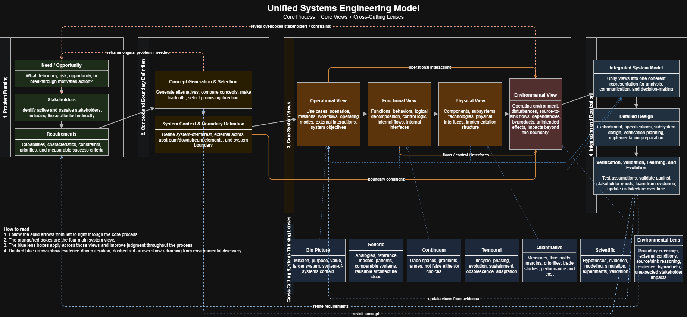

What I'll try to do here is merge concepts from a systems architecture course I'm currently taking, and a video titled ["Systems thinking as it applies to systems engineering"](https://youtu.be/3CkS4qdjicA?si=wXwCcQfkw9k-ucKC) by systems engineer [Joseph Kassner](https://therightrequirement.com/); who was describing some of the shortcomings of systems engineering pedagogy. 

Kassner's main thesis is that systems engineering can be taught incomplete. He argues that it is frequently shown as a strict process: identify needs, derive requirements, generate concepts, define the system, and move toward design. While this is the core process, he argues it's often only tangentially presented as a way of thinking: the big picture, thinking in terms of functions and structures, considering time, possible options, tradeoffs, and evidence, and avoiding narrow reductionist thinking. He argues that a strict process like this without systems thinking becomes rigid, shallow, and mechanical. Teams march through boxes on a chart without noticing that they may be solving the wrong problem, missing key stakeholders, ignoring unintended consequences, or prematurely locking into a design. But at the same time, very high level systems thinking without a process can become broad but vague. It may produce interesting reflections without giving a team a disciplined way to move from insight to architecture and from architecture to implementation.

Personally, my experience with systems engineering is not what he describes. But I do think the content he covers is very useful to integrate into a generalized systems engineering thinking framework. 

What's presented here is a unified systems engineering model that combines elements from design thinking and Kassners recommendations. It treats systems engineering as a **need-driven, stakeholder-centered, and environment-aware process** that moves from problem framing to system realization, while continuously applying broader systems-thinking lenses; motivated by the prior article where we described systems science more broadly. It is both a **way of proceeding** and a **way of seeing** engineered systems in real life. This section is designed to teach that model. It explains the core process, the core architectural views (not exhuastive), the cross-cutting thinking lenses, and the iteration logic that makes the whole thing dynamic and recursive rather than linear. Throughout the section, one example will run through the discussion:

> Imagine a university wants to improve mobility on campus. Students struggle with long walks between dorms, lecture halls, libraries, labs, parking lots, and transit stations. Campus buses are limited. Accessibility is uneven. Parking is congested. The university is considering a fleet of small autonomous electric shuttles. At first glance, the “problem” may seem to be: build an autonomous shuttle. A systems engineer should resist that conclusion. The deeper question is: what mobility problem are we actually trying to solve, for whom, under what constraints, in what environment, and with what long-term consequences? That instinct—to hold off on premature solution fixation and instead structure inquiry—is at the heart of systems engineering.

We will repeatedly return to the shuttle example, but the method is not limited to technical projects. Many of the same questions can be used by an ordinary person planning a family move, starting a business, redesigning a workplace process, choosing a home energy system, or even organizing a community program. Systems engineering is a professional discipline, but its habits of thought are widely useful, especially when combined with broader systems thinking patterns from systems science.

## Core architectural views

The unified model uses four main views of the system: operational, functional, physical, and environmental. These are held together by context and boundary definition. The views are not competing descriptions; they are complementary perspectives on the same system of interest (SOI).

A systems engineer should move deliberately among them. The operational view prevents technical abstraction from losing touch with real use. The functional view prevents premature commitment to hardware or implementation. The physical view grounds the system in realizable structure. The environmental view ensures that surrounding conditions, dependencies, and consequences are treated as central rather than peripheral. An ordinary person can also use these views. Any meaningful plan has these dimensions: how it is used in life, what it must accomplish, what concrete elements make it possible, and how it interacts with the world around it.

The operational view is the story of the system in use. It explains the system from the perspective of missions, users, workflows, and observable behaviors. A systems engineer should use the operational view to ground the entire architecture in actual activity. It is often the best bridge between stakeholders and technical teams because it speaks in situations rather than abstract structures.

The functional view describes the logical work that must be done. It strips away specific hardware and focuses on transformations, decisions, control, and behavior. A systems engineer uses the functional view to reason clearly about what the system must achieve internally before locking into implementation. It focuses on input/output behavior, the flows of material and information, and the necessary transformations.

The physical view is the implemented architecture: components, technologies, connections, layout, and real interfaces between the system and its environment or subsystem components. A systems engineer uses this view to allocate functions into buildable form while managing cost, complexity, maintainability, and physical constraints.

The environmental view is the system’s relationship with everything around it. It includes both the environment acting on the system and the system acting on the environment. A systems engineer uses this view to uncover hidden dependencies, byproducts, boundary crossings, and overlooked stakeholder effects. This is often where the most important “surprises” live.

All four views depend on clear context and boundaries. A systems engineer should revisit boundary definition whenever confusion emerges about scope, responsibility, interfaces, or environmental effects. Technically, we could introduce a fifth core view: the lifecycle view. I exclude that here basically because im not sure how to diagram it. So I will have a dedicated article for that later.

## Core Process

The core process is the disciplined progression by which a vague concern becomes a clear system architecture and then a realizable design: 

**Need / Opportunity → Stakeholder Identification → Requirements Elicitation → Concept Selection → Context & Boundary Definition → Operational View → Functional View → Physical View → Environmental View → Integrated System Model → Detailed Design → Verification, Validation, Learning, and Evolution**

This is not a rigid waterfall. It is a structured path with loops, feedback, reframing, and revision. This core process gives the systems engineer a disciplined way to ask: where are we in the work, what kind of understanding is needed now, and what kind of output should we be producing? It's important to note that this is not a checklist. Its intended to be used as an organizing backbone for inquiry, communication, and decision-making.

It is also useful to understand that several kinds of analysis are nested inside this broader flow. Early on, the engineer is often doing **capability analysis** and **gap analysis**, even if those labels are not used explicitly. Capability analysis asks what the current system, organization, or mission can actually do today, and what it needs to be able to do in the future. Gap analysis then asks what is missing between those two states. As the work moves forward, that diagnosis expands into what might be called a **possibility space**, narrows into a **design space**, becomes a more concrete **option space**, and is eventually compared through a **trade space** or a more formal **analysis of alternatives**. A possibility space is the broadest set of imaginable ways to address the need. A design space is the bounded set of feasible design patterns and variables left after constraints are taken seriously. An option space is the smaller set of concrete candidates the team is genuinely willing to compare. A trade space is the field of tradeoffs across evaluation criteria such as cost, safety, complexity, performance, and maintainability. Feasibility studies often sit in the middle of this progression, screening possibilities before the team invests heavily in comparing them.

A simple way to see that relationship is this:

**Need / Opportunity → Capability Analysis → Gap Analysis → Stakeholder Identification → Requirements Elicitation → Concept Selection → Feasibility Screening → Tradeoffs and Analysis of Alternatives → Architecture and Design Definition**

That sequence is not separate from the core process above. It is one way of understanding what kinds of thinking are happening inside it. Capability analysis and gap analysis sharpen the problem. Possibility space, design space, and option space help keep the search open long enough to avoid premature convergence. Trade space and analysis of alternatives help justify why one concept is chosen over another. An **analysis of alternatives** is simply the more formal comparative study in which viable options are evaluated against agreed criteria. The point is not terminology for its own sake. The point is to avoid mistaking one kind of question for another.

In everyday life, the same idea applies. People often jump from discomfort to solution: “I need a new car,” “I need to quit my job,” “I need to move.” A systems-oriented person pauses and asks: what exactly is the need, who is affected, what constraints matter, what alternatives exist, what environment am I operating in, and how will I know whether the result is actually better?

What follows next is a detailed explanation of the visualizaton (see below). In each section, we will pose questons that should cross the system thinkers mind at each stage of inquiry.

## Visualizing this Process

Below is a diagram representing these steps:

### Need / Opportunity

The first step is to identify the need or opportunity that motivates action. This may be a deficiency, a risk, a disruption, a new possibility, a changing mission, or an unmet demand. The systems engineer’s job here is not to accept the first stated need at face value, but to probe it, refine it, and distinguish symptoms from root causes.

This is also where capability analysis and gap analysis often begin. Before it makes sense to talk seriously about concepts or architectures, we need to understand what the present system can do, what stakeholders need it to do, and what gap separates those two conditions. In other words, this stage is not only about naming a need. It is about characterizing an operational shortfall or opportunity in a way that can later support requirements and design decisions. For beginners, it helps to think of **capability** as an ability to produce an effect under stated conditions. If the campus needs to move people safely and accessibly during rush periods, that is a capability statement. A **gap** is the difference between that desired ability and current performance.

In the campus shuttle example, the initial statement might be: “We need autonomous shuttles.” A better systems-engineering approach would ask whether the real need is mobility, accessibility, emissions reduction, parking relief, safety improvement, prestige, or some combination. Autonomous shuttles may or may not be the best answer. A systems engineer at this stage should think diagnostically. They should ask what condition is unsatisfactory, what change is desired, what opportunity has emerged, and why action is being considered now rather than earlier or later. They should also be careful not to treat a preferred technology as the need itself.

A capability-oriented reading of the same problem might sound like this: the campus currently cannot move people safely, accessibly, and efficiently during peak demand without congestion, parking strain, or emissions impacts. That framing is already better, because it begins to define the needed capability rather than the presumed solution. A gap analysis would then ask what is missing. Is the gap in routing, accessibility coverage, operating hours, reliability, staffing, safety, sustainability, or campus circulation policy? That distinction matters because systems engineering works best when it treats “autonomous shuttles” as one possible response to a gap, not as the gap itself.

An ordinary person can use the same discipline. Suppose someone says, “I need a bigger apartment.” Perhaps the real issue is commute time, storage, noise, remote work needs, family planning, or neighborhood safety. Better problem framing improves later decisions. This can be done by asking questions such as:

* What problem, deficiency, or opportunity is motivating action?
* What evidence suggests this is a real issue rather than a passing complaint?
* Is the stated need actually a need, or is it already a presumed solution?
* Why is this issue important now?
* What has changed in the environment, mission, technology, or stakeholder expectations?
* What happens if nothing is done?
* What harms are currently occurring?
* What opportunities might be lost if no action is taken?
* Is the problem stable, growing, seasonal, or episodic?
* Is the need operational, functional, economic, social, environmental, or political?
* Is this a root problem or a symptom of a deeper problem?
* What would success look like at the highest level?
* What undesirable condition are we trying to reduce?
* What desirable condition are we trying to create?
* Are there hidden assumptions in how the need is currently framed?
* What capability is currently missing?
* What can the current system do well, and where does it fall short?
* Is the gap one of performance, coverage, reliability, scale, safety, or coordination?

For the campus shuttle case, the systems engineer might discover that the real need is not “autonomous transport” but “safe, accessible, low-emission movement across campus during high-demand periods.” That reframing opens many possible concepts, including autonomous shuttles, improved transit routing, e-bike integration, better scheduling, or mixed solutions. That is good systems engineering: widening the search space before narrowing it.

### Stakeholders

Once the need is framed, the systems engineer identifies stakeholders. A stakeholder is anyone who uses, operates, maintains, funds, regulates, depends on, is influenced by, or is affected by the system. This includes direct and indirect stakeholders, active and passive ones, and even those who may not yet have been recognized.

This step matters because systems fail when they are optimized for one visible group while ignoring others. A system designed only for primary users may burden maintainers, violate regulatory expectations, endanger nearby communities, or create inequitable outcomes for less visible groups.

Stakeholder identification also deepens the earlier capability and gap analysis. A capability is never abstract for very long; it is always a capability for someone, under some conditions, with some consequences if it is absent. Different stakeholders will describe the problem differently, and that is precisely why they matter. A shortfall seen by operators may be invisible to leadership. A burden experienced by maintainers may be completely absent from a user-facing concept pitch. Stakeholders help transform a vaguely stated need into a multi-perspective understanding of what the system must accomplish and what kinds of gaps actually matter.

In the shuttle example, obvious stakeholders include students and campus transportation administrators. Less obvious ones include pedestrians, maintenance staff, disability services, emergency responders, insurers, campus police, nearby residents, facilities planners, parents, and city transit authorities. A systems engineer should think broadly here. They should ask not only “who will use this?” but “who will be affected if it fails, changes behavior, or imposes costs?”

In ordinary life, stakeholder thinking helps in family decisions, work decisions, and community planning. A person deciding to change jobs should not only ask what they want, but also how the change affects family, coworkers, clients, health, finances, and future options. This includes questions such as:

* Who will use the system directly?
* Who will operate it?
* Who will maintain, repair, or support it?
* Who will pay for it or allocate resources to it?
* Who will regulate or govern it?
* Who may be harmed if it malfunctions?
* Who benefits if it succeeds?
* Who bears cost if it succeeds?
* Who bears cost if it fails?
* Which stakeholders are visible and which are easy to overlook?
* Are there passive stakeholders who do not interact directly but are still affected?
* Are there vulnerable or underserved stakeholders?
* Are there stakeholders with conflicting goals?
* Which stakeholders have decision power?
* Which stakeholders have operational knowledge?
* Which stakeholders experience the system at its edges or failure points?
* Are there downstream stakeholders affected by outputs or byproducts?
* Are there upstream stakeholders affecting inputs, policy, or infrastructure?
* What does each stakeholder care about most?
* What does “success” mean from each stakeholder’s perspective?

In the shuttle example:

* students want convenience, safety, and short wait times
* disability services want reliable accessibility
* facilities managers care about maintenance and charging infrastructure
* pedestrians care about safety and predictability
* university leadership may care about cost, reputation, and sustainability
* insurers care about risk exposure
* emergency responders care about route clearance and override capability

The systems engineer’s job is to make those perspectives explicit before design hardens. There can be a significant cost of getting locked into irreversible decisions. 

### Requirements

Requirements translate needs and stakeholder concerns into actionable criteria. They define what the system must achieve and under what constraints. They are not merely a wish list. Good requirements create traceability between the original need and later design decisions.

A systems engineer should treat requirements as disciplined statements of necessary capability, performance, constraint, interface, and quality attributes. Some requirements are quantitative; others are qualitative but still structured. The key is that requirements should guide design rather than merely document hopes.

This is the point where the earlier capability analysis and gap analysis start becoming concrete. If a capability is missing, the requirement should say what the system must be able to do. If a gap is too much wait time, inadequate accessibility, or unreliable operation under weather conditions, then the requirement must capture the needed threshold or condition. Requirements are the bridge between diagnosis and design. They turn vague ambition into criteria that can later constrain the design space and support verification. This is also why requirements feel more precise than needs: a need says what matters; a requirement states what the system shall do, under what conditions, and often to what measurable threshold.

In the shuttle example, requirements might include accessibility, maximum wait time, operating hours, safe obstacle detection, battery endurance, emergency stop capability, performance under certain weather conditions, and maintainability targets.

An ordinary person can use requirement thinking too. If choosing a home, instead of vaguely saying “I want something nicer,” they can define non-negotiables, preferred qualities, constraints, and measurable thresholds: commute under 35 minutes, within budget, two bedrooms, low-noise area, good school district, near transit. Requirements are typically divided into two categories: functional and non-functional. You might also see "capabilities" and "characteristics". There are also acceptance criteria, the requirements that must be established in order for the system to be designated as "fulfilled". You can identify these by asking questions such as:

* What capabilities must the system provide?
* What characteristics must it have?
* What constraints must it obey?
* What performance thresholds matter?
* What safety requirements apply?
* What reliability or availability is needed?
* What maintainability expectations exist?
* What interface requirements exist?
* Which requirements are mandatory and which are desirable?
* Which requirements are derived from stakeholder needs?
* Which are derived from regulation, policy, or standards?
* Which requirements are measurable?
* Which requirements need refinement before they can guide design?
* Are any requirements ambiguous, contradictory, or solution-biased?
* Which requirements reflect mission success?
* Which requirements protect against failure?
* Which requirements reflect lifecycle concerns?
* Which requirements address environmental interaction?
* Are there requirements for scale, adaptability, upgradeability, or resilience?
* Which requirements may need to change as we learn more?

Requirements have a strict form defined by INCOSE in their "writing good requirements" document. In most documents you'll see: "The system of interest shall do such-and-such". That's the general form. But the main idea is that requirements should be verifiable, atomic, feasible, unambiguous, and able to be validated; you need to be able to show that they have been satisfied. For the shuttle system, some questions could be:

* The system shall provide wheelchair-accessible boarding.
* The system shall operate on defined campus routes and stops.
* Average passenger wait time during peak periods shall remain below a chosen threshold.
* The system shall detect pedestrians and stop within a defined safe distance.
* The system shall continue safe operation under specified lighting and weather conditions.
* The system shall report faults to fleet operations in real time.

A systems engineer also checks whether these requirements are testable, prioritized, and traceable back to stakeholders and needs. These also constrain possible design choices at later stages so it's important to have these specified. They also begin to bound the design space. Once the system must satisfy explicit thresholds for accessibility, safety, wait time, weather performance, maintainability, and operational oversight, some concepts become less plausible, some become more attractive, and some may be ruled out entirely.

### Concept Selection

Concept selection is where alternative ways of solving the problem are generated, compared, and evaluated. The systems engineer should avoid converging too early. This stage is not about picking a favorite idea immediately; it is about exploring the design space responsibly.

This is where several related ideas become useful. The **possibility space** is the broadest set of things that might solve the problem at all, including ideas that change policy, operations, or scope rather than just hardware or software. The **design space** is narrower: it is the set of feasible architectural patterns, variables, and structural choices that remain once real constraints are taken seriously. The **option space** is narrower still: it is the set of concrete alternatives the team is seriously willing to compare. The **trade space** is not just another list of concepts. It is the comparison landscape across the relevant criteria, such as cost, safety, accessibility, complexity, maintainability, scalability, and mission fit. Put simply: first ask what is imaginable, then what is feasible, then what is worth comparing, and finally what the tradeoffs look like.

Feasibility studies often sit right in the middle of this stage. They help filter the possibility space before a team spends energy comparing options that are not realistically viable. In a shuttle project, for example, a feasibility study might examine whether the campus has the right infrastructure, operating environment, regulatory pathway, staffing model, weather tolerance, or maintenance support for autonomous operation. That is different from an analysis of alternatives. **Feasibility** asks whether a concept is credibly doable with the available technology, resources, schedule, and operating conditions. **Analysis of alternatives** asks which of the doable concepts is better overall.

In the shuttle example, the alternatives might include fixed-route autonomous shuttles, on-demand autonomous pods, low-autonomy shuttles with attendants, hybrid transit systems, or non-vehicle alternatives like improved micro-mobility and pedestrian infrastructure.

A systems engineer at this stage should think in terms of alternatives, tradeoffs, feasibility, scalability, and fit to mission. They should seek variety, not just versions of the same idea. They should also recognize that different concepts may imply different system boundaries, stakeholders, and environmental impacts. A useful progression is to widen first, then bound, then compare: expand the possibility space, use requirements and feasibility constraints to shape the design space, identify a credible option space, and then explore the trade space through a formal or informal analysis of alternatives. For a beginner, this progression is especially helpful because it separates idea generation from evaluation. Too many early design discussions fail because teams start arguing about tradeoffs before they have even generated genuine alternatives.

In everyday life, concept selection shows up whenever someone explores multiple ways to reach a goal rather than locking into one habit. For instance, solving “I need more time” might involve delegating, changing schedule structure, reducing commitments, changing work style, or relocating, not just “work harder.” Some of the questions you should apply:

* What fundamentally different concepts could address the need?
* Are we generating true alternatives or superficial variants of one idea?
* What assumptions make each concept attractive?
* What assumptions make each concept risky?
* What does each concept optimize for?
* What does each concept sacrifice?
* Which concepts fit stakeholder priorities best?
* Which concepts fit environmental conditions best?
* Which concepts are easiest to phase or pilot?
* Which concepts are technically feasible now?
* Which concepts depend on uncertain future technologies?
* Which concepts are easiest to maintain and sustain?
* Which concepts scale best?
* Which concepts are robust under uncertainty?
* Which concepts create the fewest unintended consequences?
* Which concepts are easiest to explain, operate, and govern?
* Which concepts fail gracefully?
* What evidence would help distinguish between alternatives?
* What prototype, simulation, or analysis would reduce uncertainty?
* Could the right answer be a hybrid concept?
* Which ideas belong to the broad possibility space, and which are serious options?
* What feasibility questions must be answered before comparing concepts in depth?
* What criteria define the trade space for this decision?

For the shuttle case, a systems engineer might compare:

* fixed-route shuttles: simpler operations, predictable demand, lower complexity
* on-demand pods: flexible service, but harder dispatch and more uncertain interactions
* supervised low-autonomy shuttles: safer near-term deployment, but more labor cost
* hybrid shuttle plus e-bike network: broader mobility coverage, distributed risk

A more explicit trade-space comparison might ask how each concept performs against accessibility, average wait time, campus safety, regulatory burden, fleet complexity, maintainability, sustainability goals, and expandability over time. A more formal analysis of alternatives would then use those criteria to justify selection rather than relying on intuition or enthusiasm. The point is not just to choose, but to understand what each concept means for the rest of the system.

### Context & Boundary Definition

Here the systems engineer defines the system-of-interest and the boundary around it. This is one of the most important but often underappreciated steps in systems work. A system boundary determines what is considered part of the system, what lies outside it, what is controlled, what is assumed, and what interfaces must be managed.

In the shuttle example, is the mobile app part of the system? Are charging stations? Is the mapping infrastructure? Are campus road modifications? Is coordination with city transit external or internal? Boundary choices shape design responsibility, integration complexity, and stakeholder expectations. This allows you to understand where to offload responsibilities onto other systems.

A good systems engineer uses boundaries deliberately, not casually. Boundaries should clarify, not obscure. They should be explicit about what lies inside design authority and what remains external but influential.

Everyday decisions also rely on boundary discipline. If a person is trying to “improve health,” is the system just diet, or also sleep, work stress, exercise environment, social habits, and commute? Boundary decisions affect whether the solution is realistic.

* What is the system-of-interest?
* What lies inside the system boundary?
* What lies outside but interacts with the system?
* What inputs cross into the system?
* What outputs leave the system?
* Who are the external actors?
* What upstream systems influence it?
* What downstream systems receive its effects?
* Which interfaces are under our control?
* Which interfaces are external dependencies?
* What assumptions are being made about the environment?
* What infrastructure is assumed to exist?
* Are we defining the boundary too narrowly?
* Are we defining it so broadly that analysis becomes unmanageable?
* What would happen if the boundary were drawn differently?
* Which responsibilities belong to this system versus adjacent systems?
* What are the key context diagrams or system maps needed?
* Which stakeholders sit at or outside the boundary?
* What failures are caused by poor boundary definition?
* How does the boundary affect scope, cost, risk, and accountability?

For the shuttle system, the systems engineer might define the system-of-interest as vehicles, dispatch software, user app, charging coordination, or fleet operations interface, But not include campus road paving, city transit network, or personal student smartphones as managed assets.

Even then, those external systems still matter. Boundary definition never makes outside systems irrelevant; it only clarifies responsibility.

### Operational View

The operational view describes the system in use. It is about missions, scenarios, workflows, user interactions, and real-world operation. This is where the systems engineer asks how the system behaves in its operational context.

In the shuttle case, scenarios include boarding, traveling between stops, handling peak class changes, yielding to emergency vehicles, rerouting around construction, loading wheelchairs, stopping for pedestrians, handling low battery, and responding to faults. How will this system work in operation, and how can we identify the failure cases, edge cases, average behavior, or standard operation?

A systems engineer should think narratively and behaviorally here. They should imagine actual sequences of use. They should consider normal operation, edge cases, peak cases, degraded cases, and emergency cases. They should ask how the system appears from the perspective of operators, users, and surrounding actors.

Ordinary people use operational thinking when they ask how something will actually work in lived experience. A person planning a new home office setup should not only think about furniture, but about daily workflow: where does the light come from, what happens during calls, how do breaks work, what if children interrupt, where do materials go? Systems engineering just makes this kind of reasoning explicit. Typical questions include:

* What missions or purposes does the system serve in use?
* What are the main use cases?
* Who interacts with the system and when?
* What are the operational scenarios?
* What are normal operating modes?
* What are degraded or emergency modes?
* What happens at peak demand?
* What happens when something goes wrong?
* What external interactions occur during operation?
* What operational objectives define success?
* How does a user begin interaction with the system?
* How does a user complete interaction with the system?
* What information does the user receive?
* What does the operator monitor?
* What tasks must humans still perform?
* What assumptions are made about user behavior?
* What assumptions are made about the environment during operation?
* What exceptional cases must be supported?
* What operational rhythms or cycles exist?
* What operational failures would be most harmful?
* What is happening in the field, in the street, in the home, in the institution, or in the mission?
* Who is doing what, when, where, and why?
* What sequence of interactions defines success?
* What interruptions, exceptions, or delays occur?
* What pressures occur under real operation?
* What are the most critical scenarios?
* Which scenarios are routine and which are rare but high consequence?
* How do users interpret what the system is doing?
* What information must be visible to them?
* What human behaviors are idealized versus realistic?

A shuttle scenario might look like this: A student opens the campus app after class, requests a shuttle from the library to the engineering building, sees a three-minute estimated arrival, boards with a wheelchair user already inside, the shuttle pauses for a dense pedestrian crossing, reroutes around a temporary road closure, and alerts operations when one of its sensors begins reporting degraded confidence.

That scenario helps the systems engineer derive functions, interfaces, safety logic, and environmental dependencies. You can imagine that if the system concept makes it incredibly difficult for the student to use the system, the system might not be operationally successful. 

### Functional View

The functional view describes what the system must do logically, independent of the final physical implementation. It focuses on behaviors, transformations, logical decomposition, and internal relationships between functions.

In the shuttle example, the system must accept trip requests, localize itself, perceive obstacles, plan routes, control motion, manage charging, report faults, authenticate riders if necessary, and communicate with fleet operations. These are functions, not yet components.

A systems engineer at this stage should avoid prematurely binding functions to hardware or software choices. The question is not yet “what box does this?” but “what must be done?” This preserves flexibility in design and reveals where complexity truly lies. If you have any familiarity with database design, it's a similar idea; distinguish the conceptual and logical model from the physical hardware implementation.

In ordinary life, functional thinking helps separate what must happen from how it currently happens. If someone wants to improve family scheduling, the functions might be communicating plans, resolving conflicts, tracking obligations, reminding participants, and adjusting in real time. These functions can later be implemented in many ways. The space of possible physical or real implementations mapped onto the functional requirements is many to one (in most cases). Here are some questions you can ask:

* What functions must the system perform?
* What transformations must occur?
* What decisions must the system make?
* What internal flows of information, energy, or material are required?
* What control logic is needed?
* What sequence or coordination among functions is required?
* Which functions are core and which are supporting?
* Which functions are safety-critical?
* Which functions are time-sensitive?
* Which functions depend on external inputs?
* Which functions produce outputs that trigger other functions?
* Can functions be decomposed into subfunctions?
* Which functions must happen continuously, periodically, or on demand?
* Which functions should remain separate?
* Which functions can be grouped?
* What functions handle faults, exceptions, or degraded modes?
* What functions manage interfaces?
* What functions manage state, memory, or history?
* What functions are required across the lifecycle, not just in operation?
* Are there functions we are assuming rather than explicitly defining?
* What actions or transformations are necessary?
* What triggers each function?
* What flows between functions?
* What state or memory must be maintained?
* What control logic governs transitions?
* Which functions are sequential, concurrent, or conditional?
* What must happen in degraded modes?
* Which functions are critical to safety, reliability, or mission success?

For the shuttle, the functions might include be something like: receive ride request, determine rider eligibility or identity if needed, assign vehicle, localize position, perceive pedestrians and obstacles, plan trajectory, control steering and braking, monitor battery level, communicate with fleet manager, initiate safe stop when necessary, log system health, and schedule charging.

These functions may later map to software modules, human roles, cloud services, sensors, and actuators.

### Physical View

The physical view describes how the system is embodied. It includes components, technologies, subsystems, physical interfaces, and implementation structure. This is where functions become physically realized.

In the shuttle example, the physical view may include the vehicle chassis, battery system, sensor suite, onboard compute, communications hardware, user display, wheelchair ramp, charging stations, and operations server infrastructure.

A systems engineer should think concretely here, but still architecturally. The goal is not merely to list parts; it is to define a coherent physical structure that realizes required functions, supports maintenance, manages interfaces, and fits the operational and environmental context.

In everyday life, physical-view thinking appears when implementing a plan. Once a family decides what they need in a kitchen, they must think about actual appliances, layout, storage units, electrical capacity, and spatial constraints. Logical needs become embodied structure. You'll end up asking questions like: 

* What components and subsystems will make up the system?
* How will functions be allocated to physical elements?
* What technologies are candidate implementations?
* What interfaces exist between components?
* Which components are modular?
* Which components are tightly coupled?
* What physical constraints shape the architecture?
* What materials, energy sources, or platforms are involved?
* What redundancy is needed?
* What single points of failure exist?
* What elements are easiest to maintain or replace?
* What elements drive cost, size, weight, power, or complexity?
* What packaging or layout constraints exist?
* What dependencies exist on external infrastructure?
* How will physical integration occur?
* How will upgrades be supported?
* How does embodiment affect safety?
* How does embodiment affect manufacturability or deployability?
* What parts are mature versus experimental?
* How well does the physical architecture support future evolution?

For the shuttle, the systems engineer may compare lidar-heavy versus camera-heavy perception packages, centralized versus distributed onboard compute, depot charging versus on-route charging, or commercial vehicle platform versus custom-built shuttle chassis. This is physical architecture, not just parts listing.

### Environmental View

The environmental view describes how the system interacts with its surroundings. It includes external conditions, disturbances, dependencies, source-to-sink flows, byproducts, unintended effects, and impacts beyond the boundary. This view is especially important because many system failures arise not from internal defects alone, but from poor understanding of the system–environment relationship.

In the shuttle example, the environment includes pedestrians, weather, lighting, campus road surfaces, construction zones, snow or rain, communications dead zones, campus security procedures, charging infrastructure limits, and even social behavior such as students stepping unpredictably into roads.

The environmental view also includes the system’s outputs into the environment: noise, congestion effects, charging loads, altered pedestrian flow, safety risks, and policy implications.

A systems engineer should think of the environment not as background scenery but as an active participant in system performance. They should ask what crosses the boundary, what the system depends on, what it disturbs, what disturbs it, and who experiences those effects.

Ordinary people use environmental thinking when they recognize that plans do not occur in isolation. A new habit, a home renovation, or a career change will interact with family routines, finances, neighborhood, regulations, noise, social expectations, and infrastructure. Environment shapes outcomes.

* What operating conditions surround the system?
* What external disturbances can affect performance?
* What environmental assumptions are being made?
* What inputs cross into the system boundary?
* What outputs cross out of the system boundary?
* What information flows from source to sink through or around the system?
* What energy flows matter?
* What material flows matter?
* What byproducts are created?
* What emissions, waste, heat, noise, or congestion result?
* What dependencies exist on infrastructure or institutions?
* What happens if those dependencies fail?
* Which environmental factors vary over time?
* Which environmental factors are uncertain or adversarial?
* Which stakeholders are affected indirectly through environmental interaction?
* Does the system shift burdens onto others?
* What hidden interfaces exist at the boundary?
* What resilience is required under environmental stress?
* What environmental consequences are unintended but plausible?
* What would the environment “say back” to this design?
* What conditions stress the system?
* What assumptions about the environment may fail?
* What dependencies on infrastructure or institutions are hidden?
* What byproducts or external consequences will exist?
* What source-to-sink flows matter?
* Who is affected even though they do not use the system?
* What environmental changes can render the design inadequate?
* What resilience mechanisms are needed?

For the shuttle system; heavy rain may reduce sensor performance, snow may obscure lane markings, dense class-change pedestrian surges may create stop-and-go traffic, charging stations may overload local electrical infrastructure, shuttle routes may alter pedestrian behavior in ways that create new hazards, nearby dorm residents may experience noise at night, or students may overtrust automation and behave less cautiously.

This is why the environmental view deserves to stand beside the operational, functional, and physical views.

## Integrated System Model

The integrated system model brings the views together into one coherent representation. It is where traceability, consistency, and architecture-level reasoning happen. Without integration, teams end up with disconnected artifacts: scenarios that do not match requirements, functions that do not map cleanly to physical elements, environmental constraints that are noticed too late, and designs that satisfy no one well.

A systems engineer should think of the integrated model as a shared understanding structure. It may be formal or semi-formal, but it should connect needs, stakeholders, requirements, views, interfaces, assumptions, and design decisions.

In ordinary life, integration means ensuring that plans are coherent rather than fragmented. Someone may have budget spreadsheets, schedules, goals, and household preferences, but unless they fit together, they do not form a working system.

* Do the operational, functional, physical, and environmental views align?
* Are requirements traceable to stakeholders and needs?
* Are functions traceable to operational scenarios?
* Are physical elements traceable to functions?
* Are environmental constraints reflected in the design?
* Are there contradictions across views?
* What assumptions are shared across the model?
* What decisions are still unresolved?
* Where are the most sensitive couplings?
* What parts of the model are evidence-backed and what parts are speculative?
* Can the model support trade studies?
* Can the model support communication across disciplines?
* Can the model support change management?
* Are interfaces consistently defined?
* Are failure modes represented?
* Are lifecycle concerns integrated or isolated?
* Does the model help decision-makers understand consequences?
* Can the model be updated as learning occurs?
* What is missing from the current model?
* Is the model understandable to the people who need to use it?

For the shuttle project, the integrated model would connect student mobility needs, stakeholder priorities, operational scenarios like peak travel and emergency interruption, functions like route planning and safe stop, physical components like sensors and batteries, environmental factors like weather and pedestrian density, and verification plans for testing safety and accessibility. That coherence is the difference between a pile of diagrams and a system architecture.

## Detailed Design

Detailed design translates the architecture into specific realizable elements. This includes subsystem specifications, software design, hardware selection, interface control details, implementation preparation, and verification planning.

A systems engineer at this stage still keeps the larger system in view. Detailed design is not permission to forget why the system exists. Instead, it is the stage at which architecture becomes actionable without losing traceability back to need and context.

In the shuttle example, detailed design includes braking system specifications, obstacle detection thresholds, charging hardware configuration, route management software, user interface details, maintenance workflows, and verification procedures.

In daily life, detailed design corresponds to turning a plan into actionable specifics: choosing vendors, setting schedules, buying materials, drafting contracts, defining exact steps. You might ask:

* What detailed subsystem designs are required?
* What specifications define acceptable implementation?
* Which interfaces need precise control documentation?
* What tolerances, thresholds, or limits matter?
* What testability features should be designed in?
* What maintainability considerations should be embodied now?
* What human factors details matter?
* What implementation sequencing is needed?
* What dependencies must be coordinated?
* What risks are introduced by detailed embodiment choices?
* What design decisions reduce flexibility unnecessarily?
* What details must remain configurable?
* Which assumptions need confirmation before committing fully?
* How will detailed design preserve safety and resilience?
* How will verification be supported?
* What documentation must exist for operators and maintainers?
* What parts of the architecture are still unstable?
* How will change requests be managed?
* What lifecycle support needs should be built in now?
* Does the detail still reflect the architecture’s intent?

For the shuttle system, detailed design may determine exact sensor placement, alert timing for operator monitoring, app interface for wheelchair-accessible requests, charger connector specifications, service intervals and access panels, and fallback logic when localization confidence drops. The systems engineer helps ensure that these choices remain consistent with stakeholder needs and system context.

## Verification, Validation, Learning, and Evolution

This final process step closes the loop. Verification asks whether the system was built right. Validation asks whether the right system was built. Learning and evolution recognize that real systems live in changing environments and must be refined over time. A systems engineer should never see this phase as a mere final test gate. It is a source of learning that can send the team back to requirements, concepts, views, or even the original need framing.

In the shuttle example, testing may reveal that students do not use the system as expected, that weather disrupts sensor reliability, that maintenance costs are higher than anticipated, or that accessibility features need redesign. Those findings are not annoyances; they are essential knowledge.

In ordinary life, learning and evolution are what separate rigid plans from adaptive ones. People who treat plans as fixed often fail when reality changes. Systems thinking expects iteration. Some questions for Verification, Validation, Learning, and Evolution are:

* Did the implementation satisfy the specified requirements?
* Did the system actually meet stakeholder needs?
* What assumptions were validated?
* What assumptions failed?
* What did testing reveal about performance under real conditions?
* What did operation reveal about user behavior?
* What environmental interactions were underestimated?
* What maintenance realities emerged?
* What unexpected side effects occurred?
* Which requirements need refinement?
* Which concepts should be revisited?
* Which views need correction?
* What should be changed immediately?
* What should be changed in the next lifecycle phase?
* What evidence supports current confidence?
* Where does uncertainty remain?
* How does the system need to evolve over time?
* What can be generalized for future projects?
* What should be retired or replaced?
* What did the team learn about the original problem itself?

Perhaps pilot testing shows that students value predictability more than flexibility. The team may shift from on-demand pods to fixed routes. Or perhaps the university discovers that the shuttle works well physically but creates crowding near certain dorms. The environmental and operational views would need revision. That is not failure. That is systems engineering doing its job.

## Cross-cutting systems thinking lenses

The views describe what the system is from different architectural angles. The lenses describe how the systems engineer thinks while moving through the process and views. These lenses are cross-cutting because they apply everywhere. A systems engineer should not use these once and move on. They should repeatedly ask them across needs, stakeholders, requirements, concepts, views, design, and learning. Ordinary people also benefit from these lenses. They improve decision quality by forcing more complete thinking.

### Big Picture

Big-picture thinking keeps the system connected to its larger mission, value, and broader context. It prevents local optimization from undermining system purpose.

* What larger purpose does this system serve?
* What system-of-systems is it part of?
* What wider context shapes its meaning?
* What broader mission must not be lost?
* Are we optimizing a subsystem at the expense of the whole?
* What would success look like from the highest level?
* What higher-level values are at stake?

The shuttle is not just a vehicle system. It is part of campus mobility, accessibility, sustainability, and student experience.

### Generic

The generic lens looks for analogies, comparable systems, patterns, and reusable architecture ideas. It prevents reinventing everything from scratch.

* What similar systems exist?
* What analogous architectures are relevant?
* What reference models can we borrow from?
* What patterns are proven?
* What failure modes are already known from related systems?
* What categories does this system belong to?

Airport people-movers, warehouse AGVs, public microtransit systems, theme-park autonomous vehicles, and fleet logistics platforms all offer lessons for the shuttle example. 

### Continuum

The continuum lens resists false binaries. Many system choices are not either/or but ranges, gradients, option space, and trade spaces.

* What decisions are being framed too simplistically?
* What trade spaces exist?
* What variables can vary gradually rather than absolutely?
* What partial or hybrid solutions are possible?
* Where can the system operate at different maturity levels?
* What dimensions should be optimized jointly rather than separately?

In the shuttle example, Autonomy is not just manual or fully autonomous. Routes can be fixed, semi-flexible, or on-demand. Human supervision can vary by deployment phase.

### Temporal

The temporal lens emphasizes lifecycle, phasing, evolution, sustainment, and obsolescence. Systems live through time; they are not frozen objects.

* How does the system enter service?
* How will it scale?
* What degrades over time?
* What changes in stakeholder needs are likely?
* What technological obsolescence risks exist?
* What phases of operation matter?
* How will maintenance and upgrades occur?
* What does retirement or replacement look like?

A pilot fleet may later expand campus-wide. Batteries age. Campus routes change. Student demand shifts. Regulatory expectations may tighten.

### Quantitative

The quantitative lens asks what can be measured, bounded, compared, and prioritized. It brings rigor to trade studies and performance reasoning.

* What measures of effectiveness matter?
* What thresholds define acceptable performance?
* What margins are needed?
* What trade metrics matter most?
* What uncertainties must be quantified?
* Which claims are still vague and need numbers?
* What data would support better decisions?

In the shuttle example, relevant measures and metrics might be average wait time, uptime, safety incidents, cost per passenger-mile, utilization rate, charging turnaround time, accessibility fulfillment rate.

### Scientific

The scientific lens emphasizes hypotheses, evidence, modeling, experiment, and validation. It reminds the systems engineer that uncertain claims require testing.

* What assumptions are we making?
* Which assumptions are uncertain?
* What evidence currently supports them?
* What simulations or experiments would reduce uncertainty?
* What should be prototyped?
* What model is needed to test feasibility?
* How will we know whether the concept really works?

In the shuttle example, you can ask: Do students actually prefer on-demand service? Can the perception stack handle dense campus crossings? Does weather significantly degrade performance? These are empirical questions.

### Environmental Lens

The environmental lens keeps the engineer alert to boundary crossings, external conditions, resilience needs, and unintended consequences.

* What is entering the system from outside?
* What is leaving the system?
* What dependencies are fragile?
* What external side effects may occur?
* Which overlooked stakeholders may be affected?
* How does the environment reshape feasibility?
* What disturbances demand resilience?

The shuttle depends on power infrastructure, road quality, weather tolerance, and social norms. It may also alter pedestrian behavior and campus energy use.

## Iteration and feedback logic

The unified model is not linear. Systems engineering becomes powerful when it accepts that learning changes understanding. Verification may reveal flawed requirements. Environmental analysis may reveal overlooked stakeholders. Concept exploration may reveal that the original problem was wrongly framed. A systems engineer should therefore cultivate disciplined flexibility. The point is not to avoid iteration but to make iteration informed and constructive.

### Evidence-driven iteration

When testing or analysis reveals mismatch, the engineer revisits earlier steps. That is not backtracking in a negative sense; it is refinement.

* What did evidence confirm?
* What did it disconfirm?
* Which requirement needs revision?
* Which scenario was unrealistic?
* Which function is missing or misdefined?
* Which physical choice is not viable?
* What environmental assumption was wrong?
* What should be changed now versus later?

For the shuttle, testing reveals that average wait time targets cannot be met with the chosen fleet size. The team must revisit requirements, operational assumptions, and possibly concept selection.

### Environment-driven reframing

Sometimes environmental discovery is so important that it changes the problem itself.

* Did environmental analysis reveal overlooked stakeholders?
* Did it reveal unacceptable byproducts?
* Did it reveal dependency on unavailable infrastructure?
* Did it reveal environmental conditions that invalidate the concept?
* Did it reveal shifted burdens or inequities?
* Does the original problem need to be redefined?

Suppose the campus power infrastructure cannot support charging without major upgrades. The system may need a different deployment concept, vehicle type, or mission scope.

### Concept-driven reframing

Exploring alternatives can reveal that the original framing was too narrow or too broad.

* Did concept exploration show that the stated need was misleading?
* Did alternative solutions expose a deeper objective?
* Does a hybrid solution better match the real problem?
* Has the system boundary changed because of the concept?
* Should we restate the mission?

The team may realize that the university does not primarily need autonomous transport. It needs coordinated campus mobility, of which shuttles are only one piece.

## Conclusion

Systems engineering is best understood not as a rigid design procedure and not as a loose style of broad thinking, but as a disciplined combination of both. It is a structured progression from need to architecture to design, continuously strengthened by systems-thinking lenses that prevent narrowness, oversimplification, and blindness to context. Its core process ensures forward movement. Its core views ensure architectural completeness. Its cross-cutting lenses ensure intellectual depth. Its feedback logic ensures learning.

For a systems engineer, this model provides both a map and a method. It tells them what to examine, how to question it, how to connect it, and when to revisit it. For an ordinary person, it offers a better way to think through any complex decision: define the real need, identify who matters, clarify constraints, compare alternatives, understand how the system works in life, examine its parts, account for the environment, and stay open to learning.

A good system is not merely one that works internally. It is one that solves the right problem, for the right people, in the right context, across time, under real environmental conditions, with consequences that are understood rather than ignored.