## Table of Contents

1. [The Core Idea: Operational Effectiveness Is a Lifecycle Property](#the-core-idea-operational-effectiveness-is-a-lifecycle-property)
2. [Design Cause and Operational Effect](#design-cause-and-operational-effect)
3. [The Operational Effectiveness Model](#the-operational-effectiveness-model)
4. [The Operational Concept Drives the Maintenance Concept](#the-operational-concept-drives-the-maintenance-concept)
5. [Systems and Supportability Engineering Process](#systems-and-supportability-engineering-process)
6. [FMECA: Failure Modes, Effects, and Criticality Analysis](#fmeca-failure-modes-effects-and-criticality-analysis)
7. [Fault Tree Analysis](#fault-tree-analysis)
8. [Maintenance Task Analysis](#maintenance-task-analysis)
9. [Lifecycle Cost, Total Cost of Ownership, and Profitability](#lifecycle-cost-total-cost-of-ownership-and-profitability)
10. [Lifecycle Monitoring](#lifecycle-monitoring)
11. [Putting It All Together](#putting-it-all-together)

What I want to do here is share some notes from a course on systems lifecycle engineering. This should be treated as a learning guide to reliability, maintainability, supportability, durability, availability, FMECA, fault trees, maintenance task analysis, and lifecycle support planning.

## The Core Idea: Operational Effectiveness Is a Lifecycle Property

A system is not successful simply because it performs well in a controlled test or meets a narrow set of technical specifications. A system is successful when it can perform its required function **in the real operating environment**, over its intended life, with acceptable downtime, support burden, maintenance effort, logistics complexity, and total cost. That is the central theme of operational effectiveness.

Operational effectiveness includes far more than technical performance. It includes:

- whether the system performs the required function;
- whether it is available when needed;
- whether it is reliable enough for the mission or business process;
- whether it can be restored after failure;
- whether it can be supported by real people, tools, parts, facilities, data, and logistics systems;
- whether it remains durable over time;
- whether it can be upgraded, refreshed, and sustained through its lifecycle;
- whether its total cost of ownership is justified by the value it delivers.

**Operational effectiveness is not a one-time performance metric. It is the lifecycle ability of a system to deliver required value under real operating and support conditions.** Reliability, maintainability, supportability, durability, availability, FMECA, fault tree analysis, maintenance task analysis, logistics planning, lifecycle cost, and technology refreshment are not separate topics. They are connected parts of one lifecycle engineering discipline.

## Design Cause and Operational Effect

One of the most important ideas: **Design “cause” creates operational “effect.”** Design decisions made early create consequences later during operation and sustainment. This ideas is also echoed by the idea that "Structure determines function".

For example:

- A component placed deep inside a system may make the product compact, but it can increase repair time.
- A custom part may improve performance, but it can create long-term supply risk.
- A sealed assembly may improve environmental protection, but it may prevent field repair.
- A software dependency may accelerate development, but later become unsupported or vulnerable.
- A design without built-in diagnostics may pass functional tests, but later make troubleshooting slow and expensive.

These are not just engineering details. They affect uptime, maintenance labor, support cost, spare parts, training, field readiness, and profitability. The point is that operational problems often begin as design decisions. Therefore, supportability must be designed in early, not added as an afterthought.

## The Operational Effectiveness Model

The first major diagram we discussed showed that operational effectiveness covers the entire system lifecycle. It connected uptime, reliability, supportability, maintainability, availability, performance, process efficiency, lifecycle cost, and profitability.

A simplified representation looks like this:

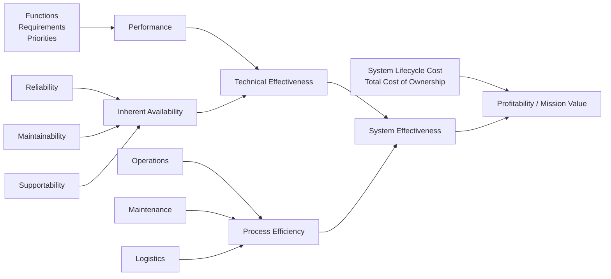

This diagram should be interpreted as a hierarchy of operational value.

Performance means how well the system performs its intended function. Depending on the system, performance may include speed, range, accuracy, throughput, power, safety, capacity, endurance, or mission capability. Performance is necessary, but it is not sufficient. A high-performance system that is often down is not operationally effective. Reliability determines how long the system can operate before failure. It is related to **time to failure**, often abbreviated **TTF**. A reliable system fails less often, which reduces maintenance demand and improves uptime. Maintainability determines how quickly and successfully the system can be restored after failure or degradation. It is related to **time to maintain**, often abbreviated **TTM**. A maintainable system can be diagnosed, accessed, repaired, replaced, tested, and returned to service efficiently. Supportability determines whether the required support resources are available. It is related to **time to support**, often abbreviated **TTS**. Supportability includes spare parts, tools, test equipment, trained personnel, technical data, facilities, logistics, software support, and supplier support. Availability is the outcome of reliability, maintainability, and supportability. It asks whether the system is available for use when needed. Availability is where design and support meet operational reality. A system can be unavailable because:

- it fails too often;
- it is hard to repair;
- parts or people are not available;
- support equipment is missing;
- documentation is poor;
- logistics delays are long.

Technical effectiveness combines performance and availability. A technically effective system does the required job and is available enough to be useful. Process efficiency comes from operations, maintenance, and logistics. It asks how efficiently the organization can operate and sustain the system. A technically capable system can still be inefficient if it requires too many people, too much downtime, too much special equipment, or too much supply chain effort. System effectiveness combines technical effectiveness and process efficiency. It answers the practical question: Does the system deliver the required operational value in the real world?

System effectiveness must be evaluated against lifecycle cost or total cost of ownership. A system may perform well but still be a poor choice if it is too expensive to operate, maintain, support, upgrade, or replace.

So we can see, these terms are related, but they are not interchangeable. A simple comparison is:

| Concept | Main Question |
|---|---|
| **Reliability** | How long can the system perform without failure? |
| **Maintainability** | Can the system be restored after failure or degradation? |
| **Supportability** | Can the organization provide the resources needed to keep it operating? |
| **Durability** | Can the system continue performing over time without major overhaul? |
| **Availability** | Is the system ready and able to perform when needed? |

Below is a more detailed account of each concept.

### Availability

Availability is the probability that an item will be available for the completion of a required function, under stated conditions, for a stated period of time. In plain language:

> **Availability means the system is ready to do its job when needed.**

A system may be high-performing, but if it is not available when required, it has poor operational value. For example:

- A truck that is frequently in the shop has low availability.
- A server that frequently goes offline has low availability.
- A manufacturing machine that is down during production hours has low availability.
- A radar that works well only when it is not awaiting parts has low availability.

A simple availability formula is:

```text
Availability = Uptime / (Uptime + Downtime)
```

For repairable systems, a simplified approximation is:

```text
Availability ≈ MTBF / (MTBF + MTTR)
```

Where:

- **MTBF** means mean time between failures;
- **MTTR** means mean time to repair.

However, real operational availability also includes logistics delay, administrative delay, waiting for parts, waiting for people, waiting for tools, and waiting for approval. That is why supportability matters. Availability is incomplete unless the following are defined:

1. **Item** — the system, subsystem, configuration item, component, service, or fleet being measured.
2. **Required function** — the function the item must perform.
3. **Stated conditions** — the operating and support context.
4. **Period of time** — the time interval over which availability is evaluated.

For example, “the system shall be available” is vague. A stronger requirement would be: "The system shall achieve 98% operational availability while operating 16 hours per day in warehouse conditions over a 12-month period, assuming field-level maintenance and local spare parts." That requirement defines the item, function, conditions, time, and support assumptions.

### Maintainability

Maintainability is the ability of an item to be restored so that it can perform a required function, under stated conditions, for a stated period of time. It can also be expressed as the probability of successful restoration for the completion of a required function, under stated conditions, for a stated period of time. The key word is: **Restored**. Reliability is about avoiding failure. Maintainability is about recovering from failure. Maintainability asks:

- Can the fault be detected?
- Can the fault be isolated?
- Can the failed item be accessed?
- Can it be removed safely?
- Can it be repaired or replaced?
- Can the system be tested after repair?
- Can the system be returned to service quickly?
- Can maintainers do the task with available tools and training?
- Can the task be performed under actual field conditions?

Design features that improve maintainability include:

- modular components;
- easy access panels;
- built-in test equipment;
- clear fault codes;
- standard fasteners;
- line-replaceable units;
- safe isolation points;
- clear technical manuals;
- minimal special tools;
- software rollback capability;
- maintenance logs and diagnostic data.

Maintainability is often measured using:

- mean time to repair;
- fault detection time;
- fault isolation time;
- removal and replacement time;
- calibration time;
- verification time;
- maintenance labor hours;
- probability of restoration within a stated time.

### Supportability

Supportability is the ability of an item to be supported so that it can perform a required function, under stated conditions, for a stated period of time. It can also be expressed as the probability of successful support for the completion of a required function, under stated conditions, for a stated period of time. The key word is: **Supported**. Supportability is about the support ecosystem around the system. It asks:

- Are spare parts available?
- Are repair parts available?
- Are trained people available?
- Are the right tools available?
- Is test equipment available?
- Is documentation available?
- Are facilities available?
- Are transportation and logistics processes working?
- Are suppliers available?
- Are software updates available?
- Is technical assistance available?
- Are maintenance data systems available?

A system can be maintainable but not supportable. For example, a failed module may take only 10 minutes to replace. That is good maintainability. But if the spare module takes six weeks to arrive, supportability is poor, and availability suffers. Supportability is measured through factors such as:

- logistics delay time;
- spare parts fill rate;
- supply response time;
- technician availability;
- support equipment availability;
- repair turnaround time;
- documentation accuracy;
- training readiness;
- support cost per operating hour;
- operational availability.

### Durability

Durability is the ability of an item to continue the performance of a required function, under stated conditions, for a stated period of time without a major overhaul. The key phrase is: **Continue the performance**. Durability is about resistance to wear, aging, fatigue, corrosion, erosion, degradation, and accumulated stress. A system may be reliable over a short mission but not durable over years of heavy use. For example:

- A tire may not fail suddenly, but it wears out.
- A battery may still work, but its capacity degrades.
- A structure may not break, but fatigue accumulates.
- A pump may keep running, but output declines.
- Software may still run, but unsupported dependencies and technical debt reduce long-term sustainability.

Durability differs from maintainability and supportability. Durability asks how long the item can continue before major overhaul. Maintainability asks how easily it can be restored. Supportability asks whether the support resources exist. Durability uniquely introduces the idea of major overhaul. A major overhaul is a significant restoration activity that returns an item to acceptable condition after extended use or degradation. This includes:

- engine rebuild;
- depot-level aircraft overhaul;
- turbine refurbishment;
- battery pack replacement;
- vehicle transmission rebuild;
- structural renewal;
- major electronics refresh;
- software platform migration.

### How the concepts relate

The concepts form a lifecycle chain:

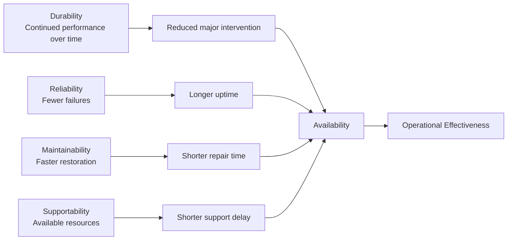

A durable and reliable system needs fewer interventions. A maintainable system reduces restoration time. A supportable system reduces support delays. Together, they improve availability and operational effectiveness.

It is important to address R, M, and S at the first opportunity. This means reliability, maintainability, and supportability should be considered at the beginning of system development, not after the design is nearly complete. Operational characteristics are directly related to support consequences:

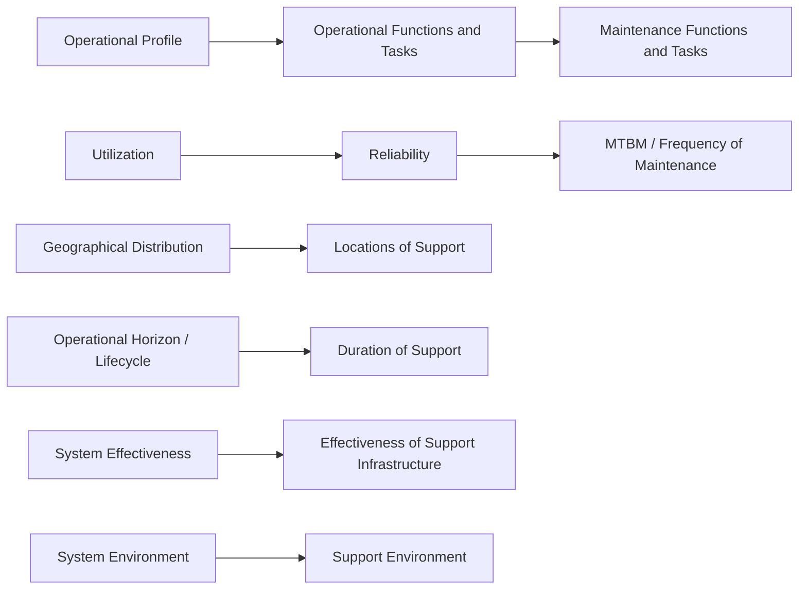

1. Operational profile drives maintenance functions and tasks: The operational profile describes how the system will actually be used. It includes operating hours, duty cycles, mission types, load levels, environments, users, and required readiness. From the operational profile, engineers identify operational functions and tasks. From those, they derive maintenance functions and tasks. Maintenance should not be invented separately. It should be derived from real use.

2. Utilization drives maintenance frequency: Utilization is how heavily and how often the system is used. A component that fails on average every 10,000 operating hours may fail once every five years if used 2,000 hours per year, but roughly once every 14 months if used 8,000 hours per year. The same reliability can create different maintenance workload depending on utilization. This is why utilization affects reliability planning, MTBM, staffing, spares, and maintenance scheduling. **MTBM**, or mean time between maintenance, is the average operating time between maintenance actions. It may include corrective maintenance, preventive maintenance, inspections, calibration, servicing, and software updates.

3. Geography drives support locations: Where the system is deployed determines where support must be located. A system used at one site can rely on centralized support. A system deployed across many remote sites may require regional spares, mobile support teams, local trained technicians, remote diagnostics, and distributed maintenance facilities. Geographical distribution directly affects time to support.

4. Lifecycle drives support duration: A system expected to operate for 30 years needs a different support strategy than a system expected to operate for three years. Long-lived systems require:
    - obsolescence management;
    - technology refreshment;
    - supplier monitoring;
    - documentation updates;
    - training refresh;
    - spare parts strategy;
    - configuration management;
    - software patching;
    - cybersecurity updates.

5. System effectiveness drives support infrastructure: If the required system effectiveness is high, the support infrastructure must be strong enough to deliver it. For example, a high-readiness system may need local spares, fast repair capability, field diagnostics, trained maintainers, technical support, and strong logistics processes.

6. System environment drives support environment: The environment where the system operates affects the environment where support must occur. A repair that is simple in a clean lab may be difficult in cold weather, darkness, dust, vibration, limited space, or a remote location. Supportability engineering must account for the actual support environment.

---

## The Operational Concept Drives the Maintenance Concept

This is one of the most important principles in lifecycle systems engineering.

The operational concept describes how the system will be used. The maintenance concept describes how the system will be sustained. The maintenance concept should be derived from the operational concept.

```mermaid
flowchart LR
    A[Operational Concept] --> B[Maintenance Concept]

    subgraph OC[Operational Concept Inputs]
        C[Mission / Business Process Definition]
        D[Performance and Physical Parameters]
        E[Operational Deployment and Distribution]
        F[Operational Lifecycle]
        G[Effectiveness Factors]
    end

    subgraph MC[Maintenance Concept Outputs]
        H[Levels of Maintenance]
        I[Basic Repair Policies]
        J[Logistic Support Requirements]
        K[Effectiveness Requirements]
        L[Maintenance Responsibilities]
        M[Environmental Factors]
    end

    C --> H
    D --> I
    E --> J
    F --> L
    G --> K
    D --> M
````

### Operational concept

The operational concept, often similar to a concept of operations or CONOPS, defines how the system will be used in real life. It includes the following.

1. **Mission or business process definition:** Mission or business process definition explains what the system is supposed to accomplish, what mission or business process it supports, what mission profiles it must operate within, what tasks must be performed, and what happens if the system fails. This matters because a system supporting emergency response has very different support needs from a system used only occasionally for convenience.

2. **Performance and physical parameters:** Performance and physical parameters include characteristics such as size, weight, shape, range, capacity, power, speed, thermal output, accessibility, modularity, packaging, and transportability. These design characteristics directly affect maintenance because a heavy component may require lifting equipment, a compact design may make access difficult, and a sealed unit may be rugged but not field-repairable.

3. **Operational deployment and distribution:** Operational deployment and distribution describe what equipment, personnel, and facilities are distributed; where systems are deployed; when the system becomes operational; and whether deployment is local, regional, national, global, fixed, or mobile. These deployment decisions drive support locations, spares strategy, transportation planning, and maintenance staffing.

4. **Operational lifecycle:** Operational lifecycle explains who will operate the system, how long it will operate, whether the operators will be experts or general users, who will perform maintenance, and how long support must remain viable. Long lifecycle systems require technology refreshment, obsolescence planning, documentation control, and long-term supplier management.

5. **Effectiveness factors:** Effectiveness factors define how operational success will be measured. These factors may include cost or system effectiveness, operational availability, readiness rate, mean time between maintenance, and dependability. Together, these measures determine whether the system is successful from an operational perspective.

### Maintenance concept

The maintenance concept defines how the system will be sustained. It includes the following.

1. **Levels of maintenance:** Levels of maintenance define where and by whom maintenance is performed. Common levels include operator or organizational maintenance for basic inspection, cleaning, resets, and simple replacement; field or intermediate maintenance for troubleshooting, line-replaceable unit replacement, calibration, and minor repair; depot-level maintenance for complex repair, overhaul, precision calibration, and refurbishment; and supplier or OEM-level maintenance for proprietary repair, warranty repair, factory refurbishment, and firmware-level fixes. The chosen maintenance level affects downtime, tools, training, spares, cost, and repair policy.

2. **Basic repair policies:** Basic repair policies define what happens when something fails. These policies may include repairing in place, removing and replacing an item, discarding and replacing an item, sending equipment to a depot, sending equipment to a supplier, using condition-based replacement, using scheduled replacement, deferring repair through redundancy, or cannibalizing parts in emergencies. A high-readiness system often favors fast field replacement, while a lower-criticality system may tolerate slower depot or supplier repair.

3. **Logistic support requirements:** Logistic support requirements define the resources needed to make the maintenance concept work in practice. These requirements may include spare parts, repair parts, consumables, packaging, transportation, storage, supply chain lead times, support equipment, test equipment, calibration equipment, technical manuals, data systems, facilities, manpower, and training. A maintenance policy is not real unless the logistics exist to support it.

4. **Effectiveness requirements:** Effectiveness requirements make the maintenance concept measurable. These requirements may include maximum repair time, maximum response time, minimum operational availability, minimum readiness rate, maximum maintenance labor hours, fault isolation accuracy, spare parts fill rate, maximum scheduled maintenance burden, and maximum logistics delay.

5. **Maintenance responsibilities:** Maintenance responsibilities define who does what in sustaining the system. These responsibilities may include operators, local maintainers, field service technicians, depot personnel, suppliers, contractors, engineering support teams, logistics teams, cybersecurity teams, and help desk personnel. Clear responsibility reduces downtime and confusion.

6. **Environmental factors:** Environmental factors describe the actual conditions in which maintenance will be performed. Maintenance may occur in a depot, hangar, ship, hospital, data center, remote site, customer facility, roadside location, or field environment. These conditions affect tools, training, packaging, safety procedures, task time, documentation, and repair feasibility.


---

## Systems and Supportability Engineering Process

The systems and supportability engineering process shows how supportability is engineered throughout the system lifecycle.

The diagram we discussed can be represented as follows:

### Systems and supportability engineering process: analysis and design

```mermaid
flowchart TB
    A[Concept of Operations]

    subgraph REQ[Requirements and Architecture Definition]
        B[Technical System Requirements<br/>and Maintenance Concept]
        C[Functional Analysis<br/>Functional Flow<br/>Data Flow]
        D[System Requirements Allocation]
        E[System Architecture<br/>Selection of COTS Elements]
    end

    subgraph REL[Reliability Engineering]
        F[System Reliability Analysis,<br/>Modeling, and Allocation]
        G[Reliability Prediction]
        H[FMECA]
        I[Fault Tree Analysis]
    end

    subgraph MAIN[Maintainability and Maintenance Planning]
        J[Maintainability Analysis]
        K[Level of Repair Analysis]
        L[Maintainability Prediction]
        M[Reliability Centered Maintenance]
        N[Maintenance Task Analysis]
    end

    subgraph DECISION[Design Review Decision]
        O[Design Reviews and Evaluation]
        P{Have Requirements<br/>Been Met?}
    end

    A --> B
    B --> C
    C --> D
    D --> E

    E --> F
    F --> G
    G --> H
    H --> I

    E --> J
    J --> K
    K --> L
    L --> M
    M --> N

    H --> N
    I --> N

    N --> O
    O --> P

    P -- No --> Q[Redesign / Improve<br/>then return to architecture]
    Q --> E

    P -- Yes --> R[Continue to<br/>Support Product Development]
```

### Systems and supportability engineering process: support, test, and sustainment

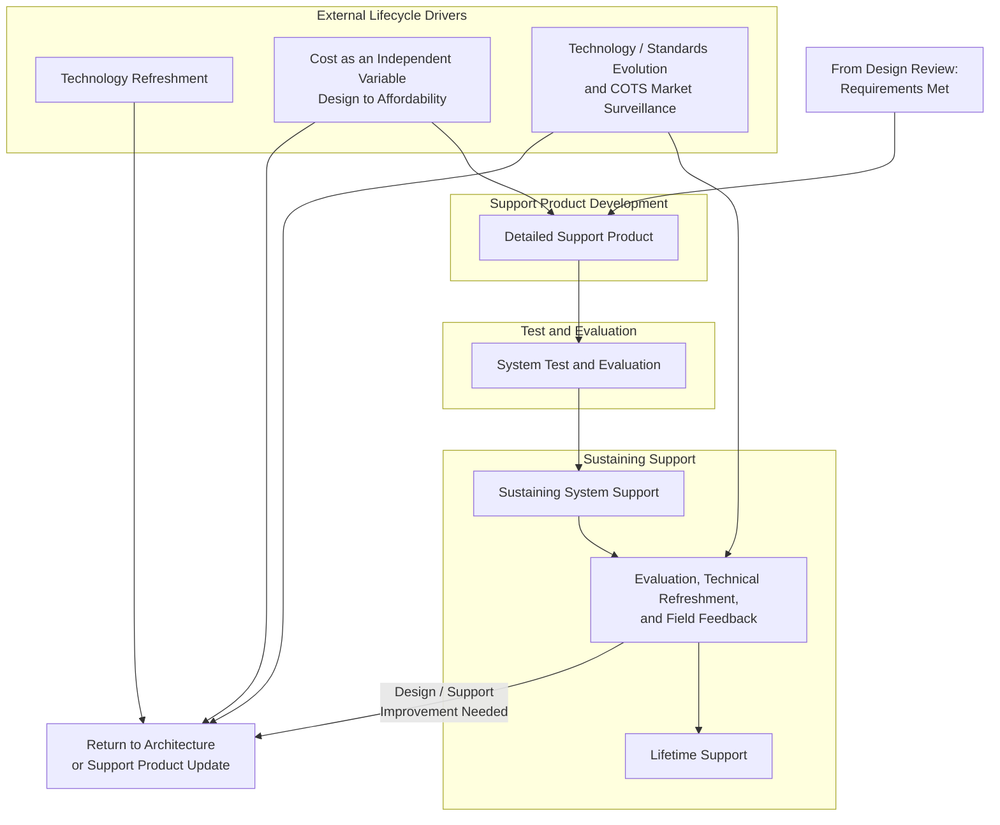

This process says that supportability is not a downstream logistics activity. It is a design discipline.

1. **Concept of operations:** The process begins with the Concept of Operations, or CONOPS, which describes how the system will actually be used. CONOPS defines the operating environment, mission, users, operational tempo, failure consequences, support assumptions, and required readiness, making it the starting point for determining what the system must do and how it must be supported.

2. **Technical system requirements and maintenance concept:** Technical system requirements define what the system must do, while the maintenance concept defines how the system will be kept operational after it is deployed. The maintenance concept identifies whether maintenance will be performed by users, field technicians, depot repair organizations, contractors, suppliers, or some combination of these groups, and it connects support planning directly to the system’s technical and operational requirements.

3. **Functional analysis and data flow:** Functional analysis identifies what the system must do, functional flow identifies the sequence or logic of those functions, and data flow identifies what information moves through the system. This matters because failures are not only physical; bad data, missing data, delayed data, corrupted data, or incorrect software logic can also cause the system to fail or perform incorrectly.

4. **Requirements allocation:** Requirements allocation assigns system requirements to subsystems, components, software modules, people, or processes. This allows reliability, maintainability, and supportability requirements to be traced to real design elements so that each requirement has an owner, an implementation path, and a way to be verified later in the lifecycle.

5. **System architecture and COTS selection:** System architecture defines the structure of the system, while COTS, or commercial off-the-shelf, selection identifies existing commercial items that may be used in the design. COTS items can reduce development cost and schedule, but they also introduce lifecycle risks such as vendor discontinuation, software end-of-support, compatibility changes, cybersecurity vulnerabilities, licensing changes, limited repairability, and supplier dependence, which means COTS choices must be monitored throughout the lifecycle.

6. **Reliability analysis, modeling, allocation, and prediction:** Reliability analysis identifies potential failure behavior, reliability allocation distributes reliability requirements across subsystems, and reliability prediction estimates expected failure rates. These activities help improve time to failure, reduce maintenance demand, and ensure that reliability is engineered into the system rather than discovered after deployment.

7. **FMECA and fault tree analysis:** Failure Modes, Effects, and Criticality Analysis, or FMECA, identifies failure modes, causes, effects, detection means, severity, frequency, and criticality. Fault Tree Analysis starts with a top-level undesired event and works backward to identify combinations of causes. Together, these methods help engineers understand how failures occur, how serious they are, and which failures require design changes, maintenance tasks, or other controls.

8. **Maintainability analysis:** Maintainability analysis evaluates whether the system can be restored effectively after failure or degradation. It considers accessibility, modularity, diagnostics, fault isolation, repair time, testability, safety, skill requirements, and restoration success so that the design can support practical maintenance instead of making repair difficult, slow, unsafe, or overly dependent on specialized resources.

9. **Level of repair analysis:** Level of Repair Analysis, often called LORA, determines where maintenance should happen and whether an item should be repaired, replaced, discarded, sent to a depot, or sent to a supplier. Typical maintenance levels include operator, field, depot, and supplier, and the analysis helps balance cost, downtime, skill requirements, spare parts needs, transportation, and repair feasibility.

10. **Reliability centered maintenance:** Reliability Centered Maintenance, or RCM, determines the right maintenance strategy for each failure mode. It considers what functions the system must perform, how those functions can fail, what causes the failures, what happens when failures occur, which failures matter most, what maintenance task can prevent or detect the failure, whether the task is technically effective, and whether the task is worth the cost. RCM may recommend corrective maintenance, preventive maintenance, predictive maintenance, failure-finding tasks, or redesign.

11. **Maintenance task analysis:** Maintenance Task Analysis, or MTA, identifies the actual maintenance tasks and resources required to support the system. It translates the maintenance concept into specific actions by defining what maintainers must do, what tools and support equipment are needed, what parts and materials are required, what skills are necessary, how long tasks should take, and what procedures or technical data must be available.

12. **Design reviews and support test/evaluation:** Supportability requirements must be evaluated rather than assumed. Testable supportability requirements may state that the system shall be repairable within 30 minutes by one technician, fault isolation shall identify the failed line-replaceable unit 95 percent of the time, no field task shall require special tools, spare parts shall be available within 24 hours, or maintenance procedures shall be executable using provided technical data. If these requirements are not met, the design should loop back for redesign or improvement.

13. **Detailed support product:** The detailed support product includes the logistics support elements needed to operate and sustain the system. These elements may include supply support, spare and repair parts, maintenance planning, test and support equipment, technical documentation, interactive electronic technical manuals, manpower and personnel, training and computer-based training, facilities, packaging, handling, storage, transportation, design interface, and computing support.

14. **System test and evaluation:** System test and evaluation should validate not only system performance, but also maintainability and supportability. Support testing may include fault insertion, maintenance demonstrations, troubleshooting exercises, repair time validation, documentation validation, spare parts validation, technician task validation, logistics process testing, and built-in test validation to confirm that the support concept works under realistic conditions.

15. **Sustaining support and field feedback:** After deployment, field data should feed back into design and support planning. Field feedback may show that actual failure rates differ from predictions, certain parts fail more often than expected, repair times are longer than estimated, technicians struggle with specific tasks, documentation is unclear, COTS parts are becoming obsolete, training gaps exist, or support equipment is inadequate. Sustaining support therefore requires continuous evaluation, technical refreshment, and lifecycle improvement.

16. **Cost as an independent variable:** Cost as an Independent Variable, or CAIV, means cost is treated as a design requirement. The goal is not to design the best possible system and then discover that it is unaffordable; the goal is to design the best system that meets mission needs within lifecycle cost constraints. CAIV forces tradeoffs among performance, reliability, maintainability, supportability, schedule, technical risk, acquisition cost, operating cost, maintenance cost, and logistics cost.

---

## FMECA: Failure Modes, Effects, and Criticality Analysis

FMECA stands for **Failure Modes, Effects, and Criticality Analysis**.

It is a structured method for identifying how a system can fail, why it can fail, what happens when it fails, and which failures are most important.

A useful way to remember it: **FMECA tells you what can fail, why it fails, what the consequences are, and which failures deserve priority.**

FMECA is usually a bottom-up analysis. It starts with functions, components, or configuration items and asks: What happens if this item or function fails in this way?

### FMECA process flow

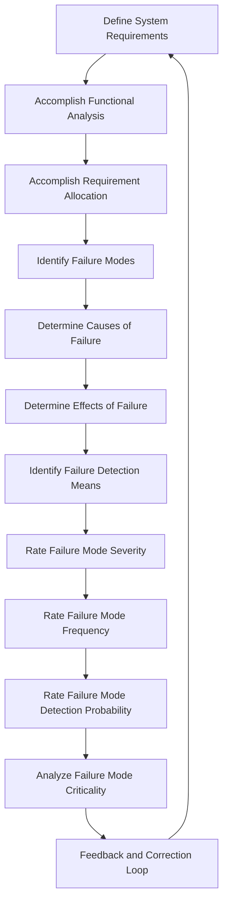

### FMECA process steps

1. **Define system requirements:** FMECA begins with requirements because you must understand what the system is supposed to do before you can determine what failure means. Requirements define the system’s functions, performance targets, availability targets, maintainability requirements, supportability requirements, environmental conditions, mission duration, and lifecycle expectations.

2. **Accomplish functional analysis:** Functional analysis identifies what the system must do and helps ensure that the FMECA evaluates failures of functions, not only failures of physical parts. For example, a backup power system may need to detect utility power loss, start the generator, regulate voltage, transfer load, monitor fuel, cool the engine, alert operators, and shut down safely.

3. **Accomplish requirement allocation:** Requirement allocation assigns system requirements to subsystems, components, software modules, people, or support processes. This allows the FMECA to analyze failures at the appropriate level and connect each potential failure to the specific part of the system responsible for meeting the requirement.

4. **Identify failure modes:** A failure mode is the specific way an item or function can fail. For a pump, failure modes may include failing to start, stopping during operation, leaking, producing low flow, producing low pressure, overheating, or vibrating excessively. For software, failure modes may include a service crash, incorrect output, delayed response, memory leak, data corruption, failed recovery, or missed alert. For a sensor, failure modes may include being stuck high, stuck low, drifting output, producing a noisy signal, operating intermittently, responding late, or losing calibration. The more specific the failure mode is, the more useful the analysis becomes.

5. **Determine causes of failure:** A cause is the mechanism or condition that produces the failure mode. For example, the failure mode “low pump flow” may be caused by a clogged inlet filter, worn impeller, motor speed problem, air ingestion, blocked outlet, or installation error. Identifying causes supports design improvement, maintenance planning, diagnostics, and reliability growth.

6. **Determine effects of failure:** Failure effects should be considered at multiple levels, including the local effect, next higher-level effect, system effect, and mission or business effect. For example, if the failure mode is that a cooling fan stops, the local effect is that the fan no longer moves air, the subsystem effect is that the electronics bay overheats, the system effect is that the controller shuts down, the operational effect is that the production line stops, and the business effect is lost revenue and recovery cost. This shows the relationship between a design-level cause and an operational-level consequence.

7. **Identify failure detection means:** Failure detection means explain how the failure will be discovered. Detection methods may include built-in test, health monitoring, fault codes, alarms, operator observation, inspection, periodic tests, diagnostic software, maintenance logs, vibration monitoring, or temperature monitoring. Detection is important because hidden failures can be dangerous, especially when a backup system fails silently and is not discovered until it is needed.

8. **Rate severity:** Severity measures how serious the failure effect is. Typical severity categories may include catastrophic, critical, major, minor, and negligible, and the rating may reflect safety consequences, mission loss, system damage, downtime, repair cost, environmental harm, customer impact, or regulatory impact.

9. **Rate frequency:** Frequency measures how often the failure mode is expected to occur. It may be based on historical data, reliability prediction, testing, supplier data, field data, operating hours, operating cycles, environmental stress, or engineering judgment.

10. **Rate detection probability:** Detection probability asks how likely it is that the failure will be detected before it produces the harmful effect. A severe, frequent, hard-to-detect failure is usually a high-priority concern because it combines serious consequences with a higher chance of occurrence and a lower chance of early discovery.

11. **Analyze criticality:** Criticality prioritizes failure modes using factors such as severity, frequency, detection probability, mission impact, safety impact, availability impact, maintainability burden, support burden, and cost. A common related FMEA concept is the Risk Priority Number, calculated as Severity × Occurrence × Detection, although different organizations use different methods. The intent is the same: rank failure modes so resources are spent on the most important risks.

12. **Feedback and correction:** FMECA should drive action rather than simply produce a table. Possible corrective actions include redesigning the system, adding redundancy, improving diagnostics, adding monitoring, changing materials, improving maintenance tasks, changing inspection intervals, stocking spares, improving training, revising documentation, changing the repair level, improving supplier selection, or revising requirements. FMECA is therefore a design and supportability improvement loop, not merely an analysis document.

---

## Fault Tree Analysis

Fault Tree Analysis, or FTA, is a top-down method for analyzing how a specific undesired event can occur. Where FMECA asks, “What happens if this item fails?”, FTA asks: **What combinations of failures can cause this top-level bad event?** FTA is useful because many serious failures are not caused by one isolated fault. They often result from combinations of equipment failures, software faults, human errors, environmental conditions, maintenance mistakes, or support failures. A fault tree helps show how those events combine logically to produce the undesired outcome.

### FTA process flow

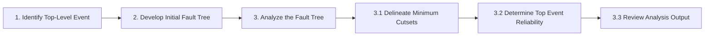

### FTA process steps

1. **Identify the top-level event:** The top-level event is the specific undesired outcome being analyzed. Examples include system unavailable, loss of braking, emergency power unavailable, database unavailable, loss of cooling, incorrect dose delivered, uncontrolled pressure release, or mission failure. The top event must be specific enough to analyze clearly. “System failure” is too broad, while “system fails to provide emergency power within 10 seconds after utility power loss” is stronger because it defines the failure condition, timing, and operating context.

2. **Develop the initial fault tree:** After the top-level event is defined, the analyst works backward to identify the lower-level events that could cause it. These events are connected using logic gates, and the lowest level of the tree contains basic events such as component failures, human errors, software faults, environmental events, maintenance errors, or support failures. The purpose of this step is to build a logical model showing how individual faults or conditions can combine to produce the top event.

3. **Analyze the fault tree:** Fault tree analysis includes identifying minimum cutsets, calculating the probability or reliability of the top event when data are available, and reviewing the dominant contributors to the undesired event. This step turns the diagram into an engineering decision tool by showing which failure combinations matter most and where design changes, maintenance improvements, diagnostics, redundancy, or procedural controls may be needed.

### How to interpret a fault tree

A fault tree is a logic diagram that can be read from top down or bottom up. Reading from the top down asks, “What must happen to cause this event?” Reading from the bottom up asks, “If these basic events occur, do they propagate upward to the top event?” This makes the fault tree useful both for understanding the causes of a failure and for testing whether specific lower-level events can realistically produce the undesired outcome.

### Common fault tree gates

1. **OR gate:** An OR gate means the output event occurs if any one of the input events occurs. For example, a system loses cooling if the pump fails, the fan fails, or coolant leaks. For two independent events, the probability is calculated as `P(A OR B) = P(A) + P(B) - P(A)P(B)`. For small probabilities, analysts often approximate this as `P(A OR B) ≈ P(A) + P(B)`.

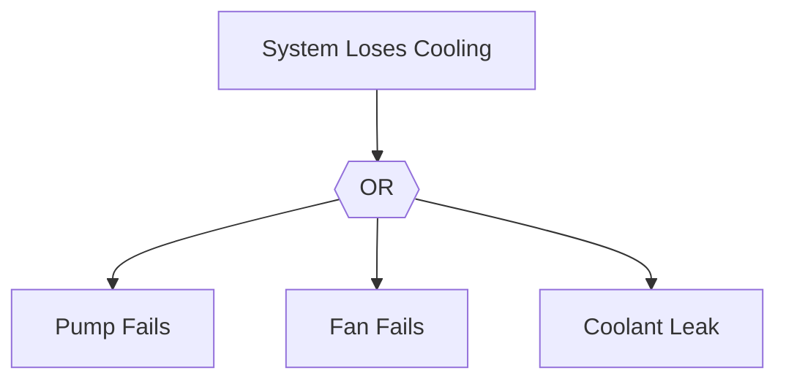

2. **AND gate:** An AND gate means the output event occurs only if all input events occur. For example, total power loss may occur only if primary power fails and backup power also fails. For independent events, the probability is calculated as `P(A AND B) = P(A) × P(B)`, which is why redundancy can reduce failure probability when failures are truly independent.

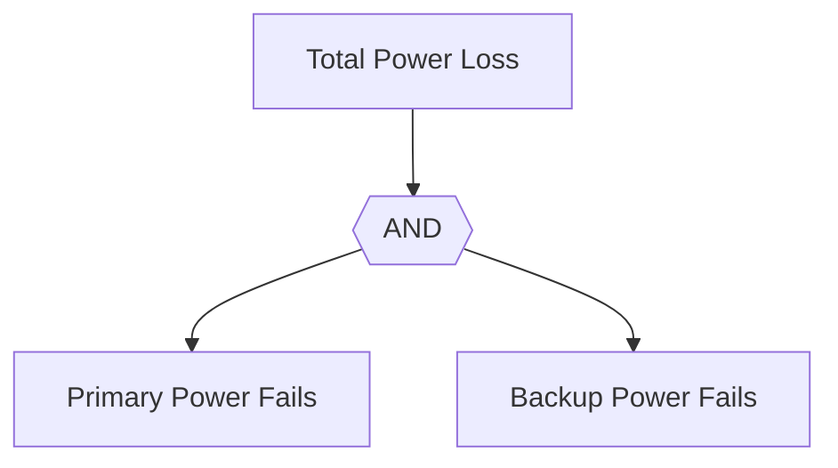

3. **Voting gate:** A voting gate, also called a k-out-of-n gate, means the output occurs if at least a specified number of inputs occur. For example, a 2-out-of-3 gate means the output occurs if any two of three inputs occur. This type of gate is common in redundant sensor systems, voting logic, and safety systems where the system is designed to tolerate one failure but not multiple failures.

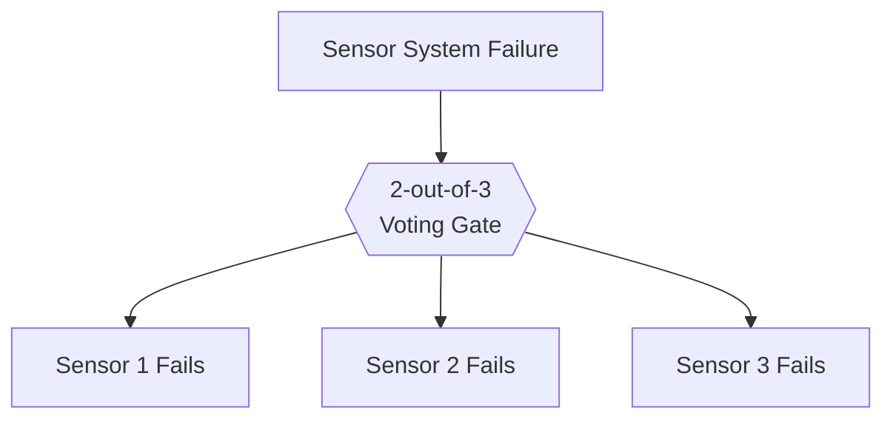

4. **Inhibit gate:** An inhibit gate means an event causes the output only under a specific condition. For example, battery failure may cause mission failure only if the system is operating in backup mode. This gate is useful when a failure matters only during a particular state, mode, environment, or operational condition.

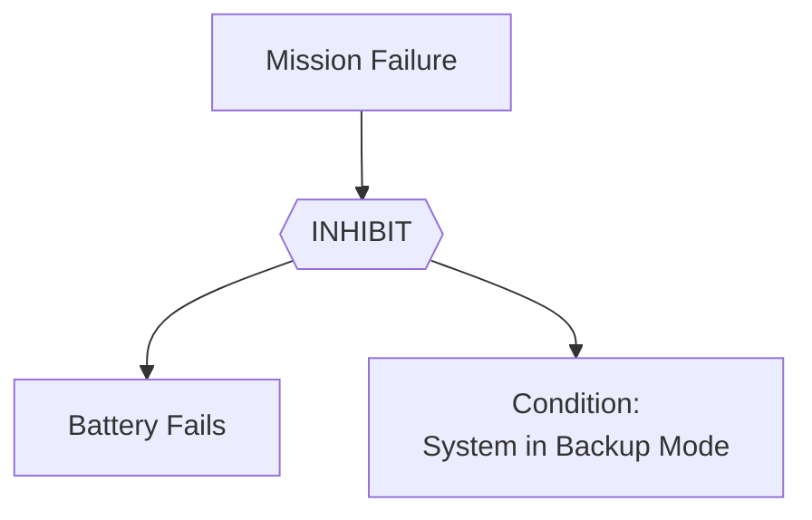

5. **Priority AND gate:** A priority AND gate means events must occur in a specific order for the output event to occur. For example, a protective relay may have to fail first, followed by an overload. This gate is useful when timing or sequence matters, rather than just the occurrence of the events themselves.

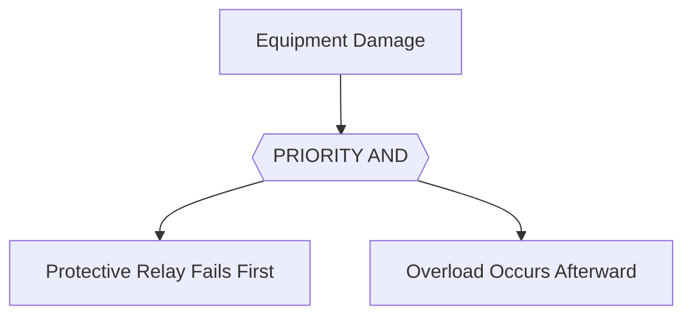

### Event types used in fault trees

1. **Basic event:** A basic event is a lowest-level event that is not decomposed further in the analysis. It usually represents a component failure, human error, software fault, environmental condition, or other cause that is treated as an input to the fault tree.

2. **Undeveloped event:** An undeveloped event is an event that is not decomposed because it is outside the analysis scope, considered unimportant, or lacks enough data to break down further. It may still appear in the tree, but the analyst does not expand it into more detailed causes.

3. **House event:** A house event is a condition set as true or false for the analysis, such as maintenance mode, cold weather operation, or whether a backup generator is installed. House events are useful for modeling assumptions, operating modes, or configurations that affect whether certain branches of the fault tree apply.

### Qualitative and quantitative analysis

FTA may be qualitative, quantitative, or both. Qualitative FTA identifies the logical combinations of events that can cause the top event, while quantitative FTA assigns probabilities or failure rates to basic events and calculates the probability of the top event. If the top event is failure, reliability can be expressed as `Reliability = 1 - Probability of Failure`. For example, if the probability of mission failure is 0.02, then mission reliability is 0.98, or 98%.

### Minimum cutsets

A cutset is a combination of basic events that can cause the top event. A minimum cutset is the smallest combination of basic events that can cause the top event; if any event is removed from the set, that path no longer causes the top event. For example, total power loss may occur if primary power fails and backup power fails. If primary power can fail because utility power fails or the main converter fails, and backup power can fail because the battery is depleted or the backup inverter fails, then the minimum cutsets are utility power fails plus battery depleted, utility power fails plus backup inverter fails, main converter fails plus battery depleted, and main converter fails plus backup inverter fails. Minimum cutsets reveal the most important combinations that lead to failure, and a one-event cutset is a single point of failure that often represents a serious design concern.

### Common-cause failures

Fault tree probabilities often assume independence, but real systems may have common-cause failures that affect multiple parts of the tree at the same time. Examples include a fire damaging primary and backup systems, a software defect affecting redundant channels, a maintenance error disabling multiple safeguards, contaminated fuel affecting multiple engines, a flood disabling main and backup power, or a cyberattack affecting multiple servers. Common-cause failures can defeat redundancy and must be modeled when they are credible.

### Example fault tree interpretation

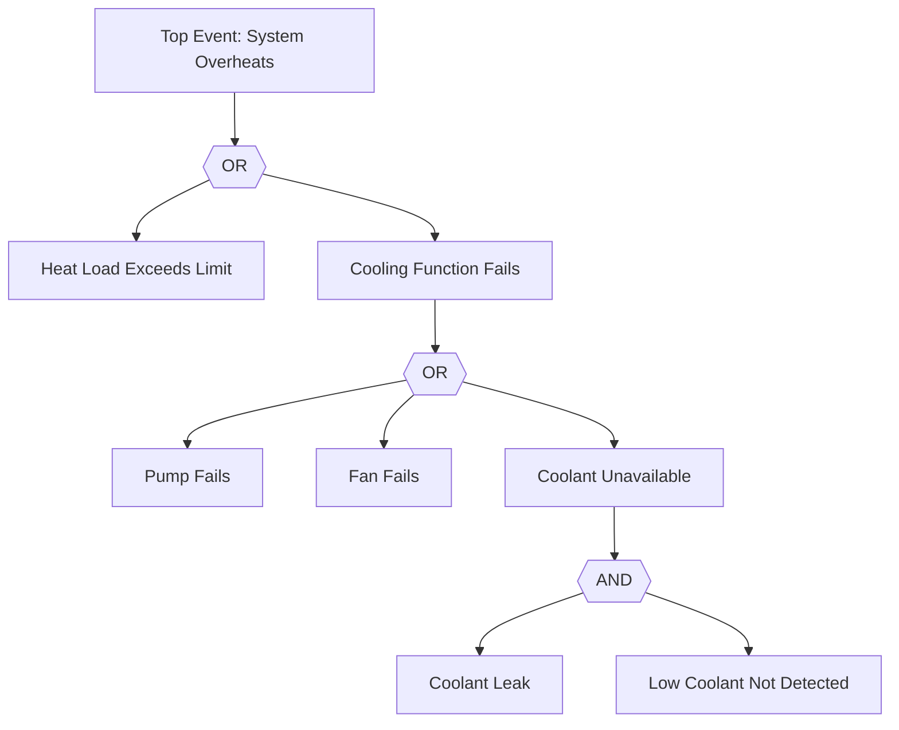

The system overheats if the heat load exceeds the limit or the cooling function fails. Cooling fails if the pump fails, the fan fails, or coolant is unavailable. Coolant is unavailable if there is a coolant leak and the low-coolant condition is not detected. The resulting minimum cutsets are heat load exceeds limit, pump fails, fan fails, and coolant leak plus low coolant not detected. The single-event cutsets are especially important because each one can cause the top event by itself.

---

## FMECA versus Fault Tree Analysis

FMECA and FTA are complementary.

| Dimension | FMECA | Fault Tree Analysis |
|---|---|---|
| Direction | Bottom-up | Top-down |
| Starts with | Functions, items, failure modes | Specific undesired top event |
| Main question | What happens if this fails? | What can cause this top event? |
| Scope | Broad review of many failure modes | Deep analysis of one top event |
| Combinations | Limited | Strong, uses logic gates |
| Output | Failure modes, causes, effects, severity, frequency, detection, criticality | Fault tree, minimum cutsets, top event probability/reliability |
| Best for | Comprehensive failure review and maintenance inputs | Causal logic, redundancy analysis, single points of failure |
| Supports | Reliability, maintainability, supportability, spares, diagnostics, maintenance tasks | Reliability, safety, availability, redundancy, critical event prevention |

FMECA can feed FTA by identifying basic failure modes used in a fault tree. FTA can feed FMECA by identifying critical combinations that deserve more detailed failure mode review. Together, **FMECA tells you what can fail and why it matters. FTA tells you how failures combine to produce a specific undesired event.**

---

## Maintenance Task Analysis

Maintenance Task Analysis, or MTA, evaluates a system or product design configuration to identify the maintenance tasks and support resources required throughout the planned lifecycle. MTA asks: **What maintenance tasks will be required, and what resources will be needed to perform those tasks throughout the system’s planned life cycle?**

MTA turns design information, failure analysis, and supportability analysis into practical maintenance planning. It identifies the tasks that must be performed, the people and skills required, the tools and equipment needed, the parts and consumables that must be available, and the facilities, transportation, handling, technical data, training, and computer resources required to sustain the system.

### MTA process flow

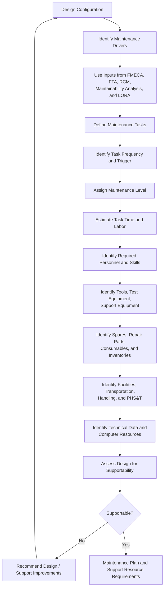

### What MTA defines

For each maintenance task, MTA defines the task name, trigger, frequency, maintenance level, duration, required personnel, skill level, tools, test equipment, support equipment, spare parts, consumables, safety precautions, access requirements, procedure steps, technical data, facility needs, transportation and handling needs, post-maintenance test requirements, training implications, labor-hour estimates, and lifecycle cost implications.

These outputs make the maintenance concept executable. Instead of saying that a system will be “maintained in the field,” MTA defines exactly what field maintenance involves, who performs it, how long it takes, what resources are required, and what must be available for the task to succeed.

### Example MTA output

For the task **replace power supply module**, the trigger may be a built-in test fault code or no output voltage. The task may be assigned to field maintenance and performed by one electrical technician using a standard screwdriver, torque driver, ESD strap, portable diagnostic terminal, and one replacement power supply module. The estimated task time may be 25 minutes, with safety precautions including lockout/tagout and capacitor discharge. After replacement, the technician performs a power-on self-test and load verification using the maintenance manual procedure, and the required training is field technician module replacement training.

This is the kind of practical support detail that MTA produces.

### MTA as design-for-supportability assessment

MTA also evaluates whether the design can realistically be supported in the intended maintenance environment. It examines whether the item is accessible, diagnostics are sufficient, special tools are reasonable, task time is acceptable, staffing requirements are realistic, skill levels are available, spare parts can be stocked, facilities exist, technical data is adequate, and transportation or handling requirements are practical.

When MTA is performed early, it can identify design improvement opportunities before the design is locked. Potential improvements include moving components for easier access, adding access panels, using standard fasteners, making components modular, adding built-in diagnostics, reducing special tools, adding lifting points, reducing calibration steps, improving fault isolation, revising the spare strategy, improving documentation, adding software health monitoring, or changing the level of repair.

### MTA outcome

The final MTA outcome is a maintenance plan and a defined set of support resource requirements. These requirements connect the system design to the real-world resources needed to operate and sustain it, including personnel, training, tools, test equipment, support equipment, spares, repair parts, inventories, transportation, handling, facilities, technical data, and computer resources.

### Maintainability Analysis versus Maintenance Task Analysis

Maintainability analysis and MTA are closely related, but they are not the same. Maintainability analysis evaluates the design’s ability to be restored to required function. Its central question is: **Can the system be maintained or restored effectively?** It focuses on accessibility, modularity, diagnostics, ease of removal and replacement, fault isolation, repair time, calibration time, maintenance error risk, required skill level, testability, safety during maintenance, ergonomic factors, and restoration probability. Outputs may include mean time to repair, maximum corrective maintenance time, fault isolation time, maintenance labor hours or probability of repair within a specified time.

MTA identifies the actual maintenance tasks and the resources required to perform them. Its central question is: **What exactly must be done, by whom, with what resources, at what level, and how often?** It focuses on task definition, task triggers, task frequency, personnel, training, tools, support equipment, spares, facilities, transportation, handling, technical data, computer resources and lifecycle support burden.

| Area | Maintainability Analysis | Maintenance Task Analysis |
|---|---|---|
| Main focus | Ease and speed of restoration | Tasks and resources needed for support |
| Core question | Can it be restored efficiently? | What must be done, by whom, with what? |
| Primary output | Maintainability metrics and design assessment | Maintenance task list and resource requirements |
| Typical metric | MTTR, repair time, fault isolation time | Labor hours, tools, parts, personnel, training, facilities |
| Design concern | Accessibility, modularity, diagnostics, repairability | Practical execution of maintenance tasks |
| Lifecycle concern | Restoration performance | Sustaining support planning |
| Availability impact | Reduces time to maintain | Reduces time to maintain and time to support |
| Supportability impact | Contributes to supportability | Directly defines supportability resources |


**Maintainability analysis asks whether the system can be restored efficiently. MTA asks what specific maintenance work and support resources are required to restore and sustain it.**

---

## Lifecycle Cost, Total Cost of Ownership, and Profitability

System success must be evaluated over the full lifecycle, not just at the time of purchase or deployment. A system may look affordable upfront but become expensive to operate, maintain, support, upgrade, or replace. Likewise, a system with a higher acquisition cost may be more economical over time if it is reliable, maintainable, supportable, durable, and efficient.

### Lifecycle cost

Lifecycle cost includes every major cost associated with the system from concept through retirement. This includes design, acquisition, operations, maintenance, spare parts, repair parts, training, facilities, logistics, support equipment, software support, technology refresh, obsolescence management, downtime, and disposal or replacement. The purpose of lifecycle cost analysis is to avoid optimizing only the purchase price while ignoring the long-term cost of owning and sustaining the system.

### Total cost of ownership

Total Cost of Ownership, or TCO, is the full cost of owning, operating, maintaining, supporting, and retiring the system. TCO expands the cost discussion beyond procurement and forces decision-makers to consider whether the system can deliver the required capability at an acceptable long-term cost. Operational effectiveness must therefore be balanced against the total cost of ownership, because a technically capable system may still be a poor choice if it is too expensive to sustain.

### Profitability or mission value

In business systems, profitability comes from delivering value while controlling total cost. In mission systems, the equivalent is mission value: the system delivers the required capability at acceptable lifecycle cost and risk. The goal is not simply to maximize performance, reliability, maintainability, or supportability in isolation, but to make design and support decisions that produce the best overall balance of effectiveness, cost, risk, and value.

### Relationship among design, effectiveness, cost, and value

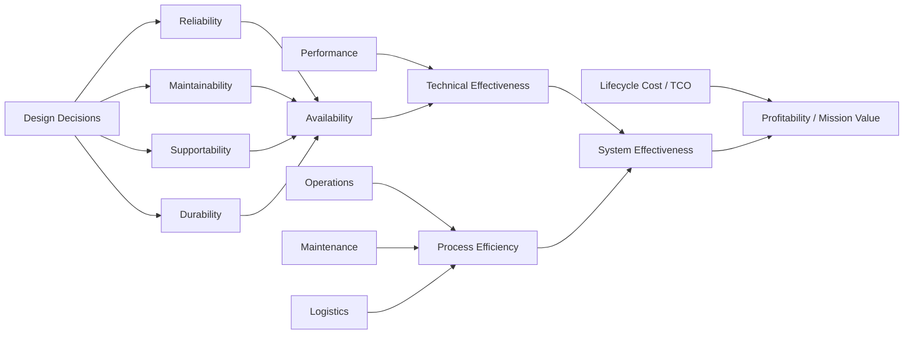

Design decisions influence reliability, maintainability, supportability, and durability, which together affect availability. Availability and performance combine to create technical effectiveness, while operations, maintenance, and logistics determine process efficiency. Technical effectiveness and process efficiency combine into overall system effectiveness. Profitability or mission value is then determined by how much system effectiveness is delivered relative to lifecycle cost and total cost of ownership.

---

## Lifecycle Monitoring

**Between transition/validation and retirement**, there is a major in-service phase often called **operations, sustainment, support, or utilization & support**. In systems engineering, this phase explicitly includes **operating the system, monitoring service performance, analyzing operational problems, maintaining the system, and feeding evidence back into engineering and management decisions** and is directly connected to everything we have been talking about so far. ([SEBoK][1]) **Monitoring and surveillance = the continuous sensing, measurement, assessment, and response loop during the system’s useful life.**

That loop is not just maintenance. It covers mission/service performance, technical health, safety/security, reliability and degradation, logistics and support burden, user behavior and workload, compliance, and triggers for repair, upgrade, redesign, or replacement. ([SEBoK][1]) A mature system usually runs a repeating loop:

1. **Sense**: Collect telemetry, inspections, logs, operator observations, maintenance records, incident reports.
2. **Detect**: Detect thresholds exceeded, anomalies, degradation, trends, failures, demand shifts.
3. **Diagnose**: Determine root cause, affected functions, safety impact, likely propagation.
4. **Prognose**: Estimate remaining life, expected failure window, consequence if no action is taken.
5. **Decide**: Continue, inspect, repair, patch, replace, derate, reconfigure, redesign, retrain, or restrict use.
6. **Act**: Execute maintenance, operational workaround, software update, stock change, process change, or engineering change.
7. **Learn**: Update models, thresholds, maintenance plans, risk registers, and lifecycle decisions.

That is the real “monitoring and surveillance” backbone of in-service systems engineering. The most common models used during this phase will be something like:

* reliability growth / decay models
* Weibull and survival models
* Markov availability models
* degradation and RUL models
* control charts and SPC models
* queueing models for maintenance / support operations
* inventory and spare parts models
* workload and staffing models
* anomaly detection models
* fault trees / event trees (updated with field data)
* digital twin / digital shadow models
* forecasting models for demand, failures, and consumables
* queueing theory
* forecasting
* inventory optimization
* maintenance optimization
* scheduling and dispatch optimization
* reliability / survival analysis
* control charts / SPC
* root-cause and Pareto analysis
* resource utilization and bottleneck analysis
* replacement analysis
* Monte Carlo for availability / sustainment risk
* simulation of repair pipelines, fleets, support centers, or service operations

Key surveillance metrics typically tracked often include measures such as:

| Technical Health           | Operational           | Support                             | Safety / Security             | Economic                |
| -------------------------- | --------------------- | ----------------------------------- | ----------------------------- | ----------------------- |
| Failure rate               | Uptime / availability | Maintenance backlog                 | Incident rate                 | Cost per operating hour |
| Mean time between failures | Throughput            | Planned/unplanned maintenance ratio | Near misses                   | Cost per transaction    |
| Mean time to repair        | Response time         | Spare fill rate                     | Unresolved vulnerabilities    | Cost per mission        |
| Condition indicator trends | Backlog               | Logistics delay                     | Patch age                     | Sustainment cost trend  |
| Alarm rate                 | Service level         | Technician utilization              | Mean time to detect / respond | Cost of downtime        |
| Fault recurrence           | Mission success rate  |                                     |                               |                         |

In-service monitoring should not be treated as passive reporting or as a simple exercise in collecting status updates after a system has been fielded. Its real value is that it provides the evidence needed to make concrete operational, technical, sustainment, safety, security, and economic decisions throughout the system’s life. When monitoring is done well, it helps leaders and engineers decide whether to adjust operating limits, change inspection intervals, transition from preventive maintenance to condition-based maintenance, increase or reduce spare parts holdings, retrain operators, patch or harden software, reallocate resources, redesign chronic weak points, issue field modifications, extend the system’s service life, constrain how the system is used, or replace the system earlier than originally planned.

Before a system reaches retirement, it should enter an active **in-service surveillance regime**. This regime continuously evaluates whether the system remains viable in the environment where it is actually being used. It asks whether the system is still performing as expected, whether it remains healthy, whether it is still safe and secure, whether it can still be supported, whether it remains affordable, and whether it is still fit for purpose. These questions are not abstract. They determine whether the system can continue operating as intended, whether risk is increasing, and whether the organization should intervene before performance, safety, security, or cost problems become unacceptable.

A mature in-service surveillance regime is usually built from several complementary monitoring and analysis activities. These include **operational performance monitoring**, which tracks whether the system is delivering the required output or mission results; **condition monitoring**, which examines the physical or digital health of the system; **RAM analysis**, which evaluates reliability, availability, and maintainability; and **maintenance and sustainment analysis**, which looks at the burden of keeping the system operational. It also includes **safety and security surveillance** to detect emerging hazards, incidents, vulnerabilities, or threat exposure; **logistics monitoring** to understand spares, supply chains, delays, and support constraints; **cost surveillance** to track the economic burden of continued operation; and **configuration and obsolescence monitoring** to ensure that the system’s actual fielded state is understood and that aging parts, outdated software, or unsupported technologies do not quietly increase risk.

## From Lifecycle Evidence to Reliability Decisions

Lifecycle monitoring produces data about how a system is performing, failing, degrading, being maintained, and being supported. However, collecting data is not the same as making a reliability decision. Failure counts, maintenance records, condition indicators, reliability predictions, fault trees, and availability measures only become useful when they are evaluated against the function the system must perform and the conditions under which it must perform that function.

Reliability assessment is therefore not a single calculation. It is a structured process for combining requirements, architecture, failure analysis, test results, maintenance information, support conditions, field evidence, uncertainty, lifecycle cost, and operational consequences into a defensible engineering judgment.

A useful way to remember it is:

> **Reliability assessment determines whether a system can continue performing its required function, under stated operational and support conditions, for the required period of time, with acceptable failure risk, downtime, support burden, and lifecycle cost.**

This definition is broader than simply calculating mean time between failures or assigning a reliability percentage. A system may fail infrequently but still have poor operational reliability if its failures produce severe consequences, if restoration takes too long, if parts are unavailable, if failures are difficult to detect, or if the system degrades in ways that are not captured by a simple failure count.

Reliability assessment connects the analytical methods discussed earlier. Functional analysis defines what the system must do. Reliability models estimate how often it may fail. FMECA identifies failure modes, causes, effects, detection means, and criticality. Fault tree analysis explains how failures can combine to produce an undesired event. Maintainability analysis evaluates restoration performance. Maintenance Task Analysis defines the tasks and resources required to sustain the system. Lifecycle monitoring supplies evidence from actual operation. Lifecycle cost analysis identifies the economic consequences of keeping the system in service.

The purpose of the assessment is to bring those elements together at the point where a decision must be made.

### Reliability assessment process flow

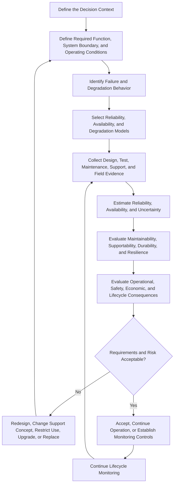

This process is iterative. An assessment may support an initial design decision, entry into service, continued operation, a maintenance policy change, a life-extension decision, an upgrade, or retirement. As new evidence becomes available, the assessment should be updated rather than treated as permanently complete.

### Reliability assessment steps

1. **Define the decision context:** The first step is to identify what decision the assessment must support. A reliability assessment performed during concept development will use different evidence from an assessment performed after ten years of operation. The decision may involve selecting an architecture, approving a design, determining whether reliability requirements have been met, authorizing deployment, extending service life, changing a maintenance policy, restricting system use, upgrading a subsystem, or replacing the system. The assessment should be designed around the decision rather than collecting metrics without a clear purpose.

2. **Define the required function, system boundary, and operating conditions:** Reliability has meaning only in relation to a required function. The assessment must define what item is being evaluated, what function it must perform, what counts as success or failure, the period of time being considered, and the conditions under which the system operates. Relevant conditions may include mission profile, utilization, duty cycle, environment, user population, load, configuration, deployment pattern, maintenance concept, support locations, staffing, spare parts, tools, software dependencies, and supplier support. A system may be reliable under light laboratory use but unreliable under continuous field operation. It may be reliable at one location but difficult to sustain across many remote sites. Without a common operating and support context, reliability results can be misleading.

3. **Identify failure and degradation behavior:** The assessment should describe how the system can fail, how performance can degrade, and how those conditions affect the required function. Inputs may come from functional analysis, FMECA, fault tree analysis, hazard analysis, reliability block diagrams, maintenance records, incident reports, supplier information, software defect records, condition-monitoring data, and operator observations. Failure behavior should include sudden failures, intermittent failures, hidden failures, common-cause failures, wear-out, aging, corrosion, fatigue, capacity loss, software obsolescence, cybersecurity degradation, and support-system failures. The goal is not merely to count failed parts. It is to understand the paths by which the system can lose or degrade its required function.

4. **Select the appropriate measures and models:** No single model is appropriate for every system. Reliability block diagrams may be useful for series and redundant architectures. Fault trees may be used to evaluate specific undesired events and combinations of failures. Weibull or survival models may be used to evaluate time-to-failure behavior and wear-out. Markov models may be used for repairable systems with multiple operating, degraded, failed, and repair states. Degradation and remaining-useful-life models may be used when condition changes gradually. Monte Carlo simulation may be used when the system contains complex uncertainty, dependencies, variable missions, repair pipelines, or logistics delays. The model should match the system architecture, available evidence, operating conditions, and decision being supported.

5. **Collect and organize the evidence:** Reliability assessments normally use several types of evidence. Engineering predictions estimate how the design is expected to behave. Laboratory and qualification tests evaluate performance under controlled conditions. Demonstration and validation activities show whether requirements can be met in realistic scenarios. Maintenance and logistics records reveal restoration time, parts usage, support delays, and maintenance burden. Field data show how the system behaves in actual operation. Supplier data and expert judgment may be used when direct evidence is limited. These sources should not be treated as equally strong. Predictions describe expected behavior, while operational evidence describes observed behavior. A mature assessment uses both and explains why they agree or disagree.

6. **Estimate reliability, availability, and uncertainty:** Reliability may be expressed using measures such as probability of mission success, survival probability over time, failure rate, mean time between failures, mean time to failure, probability of failure on demand, or probability of completing a required number of cycles. Availability may be evaluated as inherent, achieved, or operational availability depending on whether maintenance and logistics delays are included. The assessment should also describe uncertainty. A reliability estimate based on ten operating hours is not as mature as an estimate based on several years of representative field data. Sample size, confidence intervals, censored observations, changing configurations, mixed operating conditions, incomplete failure reporting, and uncertain failure dependence can materially affect the conclusion.

7. **Evaluate maintainability, supportability, durability, and resilience:** Reliability should not be evaluated independently from the rest of the lifecycle system. Maintainability determines how quickly and successfully the system can be restored. Supportability determines whether the required people, parts, tools, facilities, data, and logistics resources will be available. Durability determines whether the system can continue performing over time without major overhaul. Resilience determines whether the system can tolerate faults, continue in a degraded state, recover, reconfigure, or fail safely. These characteristics influence how a failure affects operational availability and mission value. A system that fails somewhat more often may still provide better operational results if it detects failures early, isolates them correctly, restores service quickly, and has strong support resources.

8. **Evaluate operational and lifecycle consequences:** The assessment should connect technical failure behavior to operational effect. It should determine what happens when the system fails, how long the required function is lost, whether the system can continue in a degraded mode, what safety or security consequences arise, what maintenance and logistics actions are required, how many people are affected, what backlog or mission delay occurs, and what the financial or mission cost of failure will be. This step reinforces the principle that design cause creates operational effect. A low-cost component failure may create a high-cost operational interruption if it disables a critical system and requires a long logistics delay.

9. **Determine whether requirements and risk are acceptable:** Reliability should be evaluated against defined requirements, thresholds, risk tolerances, and lifecycle objectives. The result may show that the system meets requirements, that it meets requirements only under certain operating or support assumptions, or that the available evidence is not sufficient to make a confident decision. The assessment should distinguish between a system that is demonstrably acceptable and one that merely lacks evidence of failure. Absence of observed failure does not automatically prove high reliability, especially when operating exposure is limited.

10. **Make and document the lifecycle decision:** The final output should state what action is justified by the evidence. Possible outcomes include accepting the design, continuing operation, continuing operation with enhanced monitoring, imposing operating restrictions, changing inspection intervals, revising preventive maintenance, transitioning to condition-based maintenance, increasing spare parts holdings, improving training or documentation, redesigning a weak component, adding redundancy or diagnostics, upgrading obsolete technology, extending service life, or replacing the system. The assessment should identify the assumptions, evidence, uncertainty, risks, and tradeoffs that support the decision.

### Reliability assessment dimensions

A complete assessment normally considers several related dimensions.

<div class="table-wrap wide-table">
<table>
<thead>
<tr>
<th>Assessment Dimension</th>
<th>Main Question</th>
<th>Example Measures or Evidence</th>
</tr>
</thead>
<tbody>
<tr>
<td><strong>Functional performance</strong></td>
<td>Does the system perform the required function?</td>
<td>Accuracy, throughput, capacity, response time, mission success</td>
</tr>
<tr>
<td><strong>Reliability</strong></td>
<td>How long or how often can the system perform without failure?</td>
<td>Failure rate, MTBF, MTTF, survival probability, mission reliability</td>
</tr>
<tr>
<td><strong>Maintainability</strong></td>
<td>Can the system be restored within the required time?</td>
<td>MTTR, fault isolation time, restoration probability, maintenance labor hours</td>
</tr>
<tr>
<td><strong>Supportability</strong></td>
<td>Are the resources needed for restoration available?</td>
<td>Logistics delay, spare fill rate, technician availability, repair turnaround time</td>
</tr>
<tr>
<td><strong>Availability</strong></td>
<td>Is the system ready and able to perform when needed?</td>
<td>Inherent, achieved, and operational availability</td>
</tr>
<tr>
<td><strong>Durability</strong></td>
<td>Can the system continue performing over its intended life?</td>
<td>Wear rate, degradation trend, overhaul interval, remaining useful life</td>
</tr>
<tr>
<td><strong>Resilience</strong></td>
<td>Can the system tolerate, contain, or recover from failure?</td>
<td>Redundancy, graceful degradation, recovery time, fault containment</td>
</tr>
<tr>
<td><strong>Safety and security</strong></td>
<td>What harmful consequences can result from failure or compromise?</td>
<td>Hazard severity, incident rate, vulnerability exposure, risk controls</td>
</tr>
<tr>
<td><strong>Operational effectiveness</strong></td>
<td>Does the system continue delivering useful mission or business value?</td>
<td>Readiness, service level, backlog, process efficiency, mission completion</td>
</tr>
<tr>
<td><strong>Lifecycle burden</strong></td>
<td>What does it cost to operate, maintain, support, and replace the system?</td>
<td>Cost per operating hour, downtime cost, sustainment cost, lifecycle cost</td>
</tr>
</tbody>
</table>
</div>

These dimensions should not be reduced too quickly to one number. A composite score may be useful as a summary, but it can hide important differences in failure consequences, support burden, uncertainty, and lifecycle risk. The assessment should preserve those tradeoffs so that decision-makers can understand why one system may be preferable under one operating concept but not another.

## Comparing the Reliability of Two Systems

Reliability comparison extends the assessment process to two or more alternatives. The purpose is not simply to place two MTBF values beside each other. The purpose is to determine which system provides the stronger lifecycle outcome for the required function and operating context.

The central comparison question is:

> **Under the same mission, environment, utilization, maintenance, and support assumptions, which system provides the more reliable, available, supportable, resilient, and affordable operational outcome?**

The phrase **under the same assumptions** is critical. Two systems cannot be compared fairly when one is evaluated under a light workload and the other under continuous operation, when one includes logistics delays and the other does not, or when their definitions of failure are different.

### Comparative reliability assessment process flow

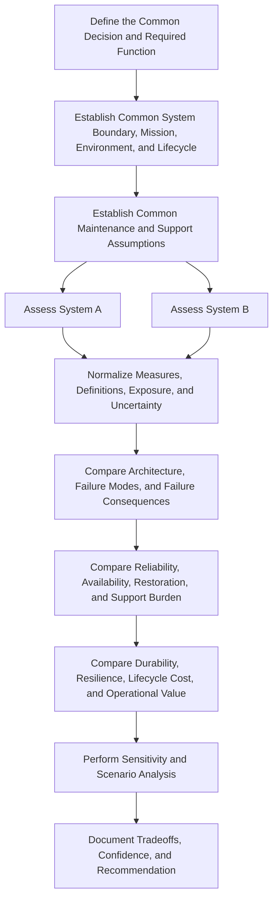

### Comparative reliability assessment steps

1. **Define the common decision:** The comparison should begin with a clearly defined decision. The organization may be choosing between two proposed designs, comparing an existing system with a replacement, selecting between suppliers, deciding whether to upgrade or replace, or evaluating two maintenance and support concepts. The decision determines which measures and consequences are most important.

2. **Establish a common functional baseline:** Both systems must be evaluated against the same required function. If the alternatives provide different levels of capability, the assessment should make those differences explicit. A system should not appear more reliable simply because it performs a smaller or less demanding function. The success criteria, failure definition, mission duration, operating cycles, and performance thresholds should be consistent.

3. **Establish common operating and support conditions:** The comparison should use the same environment, utilization, load, duty cycle, geographical distribution, lifecycle horizon, staffing assumptions, maintenance levels, repair policies, logistics conditions, and spare parts assumptions. When the systems require different support concepts, those differences should be treated as part of the comparison rather than normalized away.

4. **Use consistent reliability definitions and measures:** MTBF, mission reliability, operational availability, failure rate, restoration time, and other measures must be defined consistently. For example, one system’s MTBF should not include only hardware failures while the other includes software, operator-induced, and support-related failures. One system’s availability should not exclude logistics delay while the other includes it. Definitions, exclusions, and data-treatment rules should be documented.

5. **Normalize operating exposure and evidence maturity:** Raw failure counts are not directly comparable unless exposure is considered. Ten failures over one million operating hours represent a different result from ten failures over ten thousand hours. Evidence maturity should also be compared. A predicted reliability value should not be treated as equivalent to a value supported by years of representative field data. The comparison should describe the amount, quality, and representativeness of the evidence supporting each system.

6. **Compare architecture and failure behavior:** The assessment should compare redundancy, fault tolerance, single points of failure, common-cause vulnerabilities, failure detection, fault isolation, degraded operating modes, repair architecture, software dependencies, and supplier dependencies. A system with more components may have more possible failure modes but also greater redundancy. A simpler system may have fewer parts but a greater concentration of risk in one critical component. Architecture must therefore be interpreted, not merely counted.

7. **Compare reliability and failure consequences:** The systems should be compared in terms of how often failures occur and what happens when they occur. A slightly higher failure rate may be acceptable if failures are minor, quickly detected, isolated, and corrected. A lower failure rate may still be unacceptable if a single failure causes total mission loss, creates a safety hazard, requires a long repair, or disables multiple dependent functions. Failure frequency and consequence should be considered together.

8. **Compare maintainability and supportability:** Reliability comparison should include restoration time, diagnostic accuracy, access, modularity, skill requirements, special tools, maintenance labor, spare parts demand, logistics delay, repair turnaround time, technical data, software support, and supplier availability. A system that fails less often may still produce more downtime if each failure takes longer to diagnose, repair, or support.

9. **Compare durability and lifecycle behavior:** The assessment should determine whether the systems age, wear, degrade, or become obsolete differently. One system may have strong early-life reliability but poor long-term durability. Another may have higher initial maintenance demand but a more stable wear-out profile. Lifecycle comparisons should consider overhaul requirements, technology refreshment, software support duration, obsolescence risk, supplier continuity, and remaining useful life.

10. **Compare operational value and lifecycle cost:** The final comparison should connect reliability results to uptime, mission success, service level, process efficiency, downtime cost, maintenance cost, support cost, upgrade cost, and total cost of ownership. The least expensive system to purchase may create the highest sustainment burden. The system with the highest technical reliability may not provide the greatest value if its support infrastructure is too costly or difficult to maintain.

11. **Perform sensitivity and scenario analysis:** A comparison may depend heavily on uncertain assumptions. Sensitivity analysis determines whether the preferred system changes when those assumptions change. The assessment may vary utilization, mission duration, failure rate, repair time, spare parts lead time, staffing, environmental severity, common-cause failure probability, supplier availability, lifecycle duration, or cost. If a small change in one assumption reverses the recommendation, the decision is fragile and should be presented that way.

12. **Document tradeoffs and recommendation:** The comparison should not simply announce a winner. It should explain where each system is stronger, where each is weaker, how confident the evidence is, which assumptions drive the result, and what risks remain. The preferred alternative should be the one that provides the best balance of required performance, reliability, availability, maintainability, supportability, durability, resilience, lifecycle cost, and operational value for the stated decision context.

### Example comparative reliability assessment

<div class="table-wrap wide-table">
<table>
<thead>
<tr>
<th>Dimension</th>
<th>System A</th>
<th>System B</th>
<th>Interpretation</th>
</tr>
</thead>
<tbody>
<tr>
<td><strong>Mission reliability</strong></td>
<td>0.97</td>
<td>0.95</td>
<td>System A is less likely to fail during the defined mission.</td>
</tr>
<tr>
<td><strong>Operational availability</strong></td>
<td>0.94</td>
<td>0.98</td>
<td>System B is available more often when maintenance and support delays are included.</td>
</tr>
<tr>
<td><strong>Mean restoration time</strong></td>
<td>8 hours</td>
<td>2 hours</td>
<td>System B can be restored more quickly after failure.</td>
</tr>
<tr>
<td><strong>Logistics delay</strong></td>
<td>36 hours</td>
<td>8 hours</td>
<td>System B has the stronger spare parts and support response system.</td>
</tr>
<tr>
<td><strong>Single points of failure</strong></td>
<td>2</td>
<td>0</td>
<td>System B has the more fault-tolerant architecture.</td>
</tr>
<tr>
<td><strong>Degraded operation</strong></td>
<td>Limited</td>
<td>Available</td>
<td>System B can preserve partial function after some failures.</td>
</tr>
<tr>
<td><strong>Evidence maturity</strong></td>
<td>Primarily predicted</td>
<td>Three years of field data</td>
<td>System B’s estimate is supported by more mature operational evidence.</td>
</tr>
<tr>
<td><strong>Acquisition cost</strong></td>
<td>Lower</td>
<td>Higher</td>
<td>System A requires less initial investment.</td>
</tr>
<tr>
<td><strong>Sustainment cost</strong></td>
<td>Higher</td>
<td>Lower</td>
<td>System B may provide lower cost over a sufficiently long lifecycle.</td>
</tr>
</tbody>
</table>
</div>

This example shows why reliability comparison should not be reduced to one measure. System A has the higher mission reliability, but System B has better operational availability, faster restoration, lower logistics delay, stronger fault tolerance, more mature evidence, and lower sustainment burden. The preferred system depends on the mission, the consequence of failure, the required readiness, the support environment, and the expected lifecycle.

### Sensitivity and scenario analysis

Sensitivity analysis asks whether the conclusion remains valid when important assumptions change. Useful questions include:

* Does the preferred system change when utilization increases?
* What happens when mission duration becomes longer?
* What happens when the operating environment becomes more severe?
* What happens if spare parts lead time doubles?
* What happens if trained maintenance staffing is reduced?
* What happens if field repair is no longer available?
* What happens when common-cause failures are included?
* What happens when predicted failure rates are replaced by observed field rates?
* At what lifecycle duration does a higher acquisition cost become offset by lower sustainment cost?
* What happens if a supplier discontinues a critical component or software dependency?

Scenario analysis may also compare distinct operating concepts. A system that is preferable for centralized operation may not be preferable for remote deployment. A system designed for rapid field replacement may outperform a more repairable system when technicians and facilities are limited. The comparison should therefore identify not only which system is preferred, but under what conditions that preference remains valid.

### Reliability assessment outcome

The final product of reliability assessment is not merely a calculation, model, dashboard, or score. It is a documented lifecycle decision supported by traceable evidence.

A useful reliability assessment should state:

* the required function and decision being evaluated;
* the system boundary and configuration;
* the mission, environment, utilization, and lifecycle assumptions;
* the maintenance and support concept;
* the failure definitions and models used;
* the sources and maturity of the evidence;
* the reliability, availability, maintainability, supportability, durability, and resilience results;
* the operational, safety, security, economic, and lifecycle consequences;
* the uncertainty and limitations of the analysis;
* the assumptions that most strongly affect the conclusion;
* the recommended action and the conditions under which it remains valid;
* the monitoring indicators that should trigger reassessment.

Reliability assessment brings the lifecycle analyses together at the point of decision. Requirements define what the system must accomplish. Architecture and design determine how it can fail. FMECA and fault tree analysis describe failure behavior. Maintainability analysis and Maintenance Task Analysis explain how it can be restored and what resources are required. Supportability determines whether those resources will actually be available. Lifecycle monitoring provides evidence from actual use. Lifecycle cost analysis identifies the burden of sustaining the system.

The purpose is not simply to calculate whether the system is reliable. The purpose is to determine whether the complete system, including its operators, maintainers, logistics network, suppliers, software dependencies, support equipment, and lifecycle support infrastructure, can continue delivering acceptable operational value under real conditions.


## Putting It All Together

The entire learning guide can be summarized as a lifecycle logic chain.

1. The **operational concept** defines how the system will be used.
2. The operational concept drives the **maintenance concept**.
3. The maintenance concept defines levels of maintenance, repair policies, logistics needs, effectiveness requirements, responsibilities, and environmental constraints.
4. Reliability, maintainability, supportability, and durability must be addressed early.
5. System architecture and design decisions create future operational consequences.
6. FMECA identifies failure modes, causes, effects, detection methods, severity, frequency, and criticality.
7. Fault tree analysis identifies combinations of failures that can cause a specific top-level undesired event.
8. Maintainability analysis evaluates whether the system can be restored efficiently.
9. Level of repair analysis determines where repair should happen and whether items should be repaired, replaced, discarded, sent to depot, or sent to supplier.
10. Reliability centered maintenance determines which maintenance strategy is appropriate for each failure mode.
11. Maintenance task analysis defines the actual tasks and resources needed for sustaining support.
12. Detailed support products translate analysis into spares, tools, training, documentation, facilities, support equipment, and computing resources.
13. Test and evaluation verify that supportability assumptions are true.
14. Field feedback and technical refreshment sustain the system over its life.
15. Availability, performance, process efficiency, and lifecycle cost determine system effectiveness and profitability.

The central lesson is this: **Do not design the system first and then ask how to support it. Design the system, maintenance concept, and support infrastructure together from the beginning.**

A system is not truly successful because it works once, in ideal conditions, during a test. It is successful when it can continue delivering required performance in real operation, with acceptable reliability, maintainability, supportability, durability, availability, process efficiency, lifecycle cost, and mission or business value.

---

[1]: https://sebokwiki.org/wiki/System_Operation? "System Operation"
[2]: https://ntrs.nasa.gov/api/citations/20110011337/downloads/20110011337.pdf? "Condition Based Maintenance"
[3]: https://sebokwiki.org/wiki/System_Reliability%2C_Availability%2C_and_Maintainability? "System Reliability, Availability, and Maintainability"
[4]: https://sebokwiki.org/wiki/System_Maintenance? "System Maintenance"
[5]: https://www.nasa.gov/wp-content/uploads/2018/09/nasa_systems_engineering_handbook_0.pdf? "NASA Systems Engineering Handbook"
