# Systems Engineering Lifecycle, Operational Effectiveness, and Maintenance

*A learning guide to reliability, maintainability, supportability, durability, availability, FMECA, fault trees, maintenance task analysis, and lifecycle support planning.*

---

## Table of Contents

1. [The Core Idea: Operational Effectiveness Is a Lifecycle Property](#the-core-idea-operational-effectiveness-is-a-lifecycle-property)
2. [Design Cause and Operational Effect](#design-cause-and-operational-effect)
3. [The Operational Effectiveness Model](#the-operational-effectiveness-model)
4. [Reliability, Maintainability, Supportability, Durability, and Availability](#reliability-maintainability-supportability-durability-and-availability)
5. [Address R, M, and S at the First Opportunity](#address-r-m-and-s-at-the-first-opportunity)
6. [The Operational Concept Drives the Maintenance Concept](#the-operational-concept-drives-the-maintenance-concept)
7. [Systems and Supportability Engineering Process](#systems-and-supportability-engineering-process)
8. [FMECA: Failure Modes, Effects, and Criticality Analysis](#fmeca-failure-modes-effects-and-criticality-analysis)
9. [Fault Tree Analysis](#fault-tree-analysis)
10. [Maintenance Task Analysis](#maintenance-task-analysis)
11. [Maintainability Analysis versus Maintenance Task Analysis](#maintainability-analysis-versus-maintenance-task-analysis)
12. [Lifecycle Cost, Total Cost of Ownership, and Profitability](#lifecycle-cost-total-cost-of-ownership-and-profitability)
13. [Putting It All Together](#putting-it-all-together)

---

## The Core Idea: Operational Effectiveness Is a Lifecycle Property

A system is not successful simply because it performs well in a controlled test or meets a narrow set of technical specifications. A system is successful when it can perform its required function **in the real operating environment**, over its intended life, with acceptable downtime, support burden, maintenance effort, logistics complexity, and total cost.

That is the central theme of operational effectiveness.

Operational effectiveness includes far more than technical performance. It includes:

- whether the system performs the required function;
- whether it is available when needed;
- whether it is reliable enough for the mission or business process;
- whether it can be restored after failure;
- whether it can be supported by real people, tools, parts, facilities, data, and logistics systems;
- whether it remains durable over time;
- whether it can be upgraded, refreshed, and sustained through its lifecycle;
- whether its total cost of ownership is justified by the value it delivers.

A useful summary is:

> **Operational effectiveness is not a one-time performance metric. It is the lifecycle ability of a system to deliver required value under real operating and support conditions.**

The earlier concepts we discussed all support this one idea. Reliability, maintainability, supportability, durability, availability, FMECA, fault tree analysis, maintenance task analysis, logistics planning, lifecycle cost, and technology refreshment are not separate topics. They are connected parts of one lifecycle engineering discipline.

---

## Design Cause and Operational Effect

One of the most important ideas from the earlier diagrams is:

> **Design “cause” creates operational “effect.”**

Design decisions made early create consequences later during operation and sustainment.

For example:

- A component placed deep inside a system may make the product compact, but it can increase repair time.
- A custom part may improve performance, but it can create long-term supply risk.
- A sealed assembly may improve environmental protection, but it may prevent field repair.
- A software dependency may accelerate development, but later become unsupported or vulnerable.
- A design without built-in diagnostics may pass functional tests, but later make troubleshooting slow and expensive.

These are not just engineering details. They affect uptime, maintenance labor, support cost, spare parts, training, field readiness, and profitability.

The point is that operational problems often begin as design decisions. Therefore, supportability must be designed in early, not added as an afterthought.

---

## The Operational Effectiveness Model

The first major diagram we discussed showed that operational effectiveness covers the entire system lifecycle. It connected uptime, reliability, supportability, maintainability, availability, performance, process efficiency, lifecycle cost, and profitability.

A simplified representation looks like this:

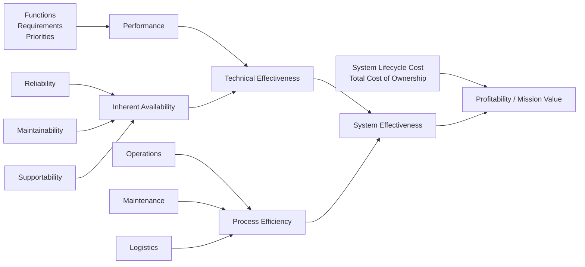

This diagram should be interpreted as a hierarchy of operational value.

### Performance

Performance means how well the system performs its intended function. Depending on the system, performance may include speed, range, accuracy, throughput, power, safety, capacity, endurance, or mission capability.

Performance is necessary, but it is not sufficient. A high-performance system that is often down is not operationally effective.

### Reliability

Reliability determines how long the system can operate before failure. It is related to **time to failure**, often abbreviated **TTF**.

A reliable system fails less often, which reduces maintenance demand and improves uptime.

### Maintainability

Maintainability determines how quickly and successfully the system can be restored after failure or degradation. It is related to **time to maintain**, often abbreviated **TTM**.

A maintainable system can be diagnosed, accessed, repaired, replaced, tested, and returned to service efficiently.

### Supportability

Supportability determines whether the required support resources are available. It is related to **time to support**, often abbreviated **TTS**.

Supportability includes spare parts, tools, test equipment, trained personnel, technical data, facilities, logistics, software support, and supplier support.

### Availability

Availability is the outcome of reliability, maintainability, and supportability. It asks whether the system is available for use when needed.

A system can be unavailable because:

- it fails too often;
- it is hard to repair;
- parts or people are not available;
- support equipment is missing;
- documentation is poor;
- logistics delays are long.

Availability is where design and support meet operational reality.

### Technical effectiveness

Technical effectiveness combines performance and availability.

A technically effective system does the required job and is available enough to be useful.

### Process efficiency

Process efficiency comes from operations, maintenance, and logistics. It asks how efficiently the organization can operate and sustain the system.

A technically capable system can still be inefficient if it requires too many people, too much downtime, too much special equipment, or too much supply chain effort.

### System effectiveness

System effectiveness combines technical effectiveness and process efficiency.

It answers the practical question:

> Does the system deliver the required operational value in the real world?

### Lifecycle cost and profitability

Finally, system effectiveness must be evaluated against lifecycle cost or total cost of ownership. A system may perform well but still be a poor choice if it is too expensive to operate, maintain, support, upgrade, or replace.

---

## Reliability, Maintainability, Supportability, Durability, and Availability

The slides defined several core “-ilities.” These terms are related, but they are not interchangeable.

A simple comparison is:

| Concept | Main Question |
|---|---|
| **Reliability** | How long can the system perform without failure? |
| **Maintainability** | Can the system be restored after failure or degradation? |
| **Supportability** | Can the organization provide the resources needed to keep it operating? |
| **Durability** | Can the system continue performing over time without major overhaul? |
| **Availability** | Is the system ready and able to perform when needed? |

### Availability

Availability is the probability that an item will be available for the completion of a required function, under stated conditions, for a stated period of time.

In plain language:

> **Availability means the system is ready to do its job when needed.**

A system may be high-performing, but if it is not available when required, it has poor operational value.

Examples:

- A truck that is frequently in the shop has low availability.
- A server that frequently goes offline has low availability.
- A manufacturing machine that is down during production hours has low availability.
- A radar that works well only when it is not awaiting parts has low availability.

A simple availability formula is:

```text
Availability = Uptime / (Uptime + Downtime)
```

For repairable systems, a simplified approximation is:

```text
Availability ≈ MTBF / (MTBF + MTTR)
```

Where:

- **MTBF** means mean time between failures;
- **MTTR** means mean time to repair.

However, real operational availability also includes logistics delay, administrative delay, waiting for parts, waiting for people, waiting for tools, and waiting for approval. That is why supportability matters.

#### Key concepts that must be defined for availability

Availability is incomplete unless the following are defined:

1. **Item** — the system, subsystem, configuration item, component, service, or fleet being measured.
2. **Required function** — the function the item must perform.
3. **Stated conditions** — the operating and support context.
4. **Period of time** — the time interval over which availability is evaluated.

For example, “the system shall be available” is vague. A stronger requirement would be:

> The system shall achieve 98% operational availability while operating 16 hours per day in warehouse conditions over a 12-month period, assuming field-level maintenance and local spare parts.

That requirement defines the item, function, conditions, time, and support assumptions.

### Maintainability

Maintainability is the ability of an item to be restored so that it can perform a required function, under stated conditions, for a stated period of time.

It can also be expressed as the probability of successful restoration for the completion of a required function, under stated conditions, for a stated period of time.

The key word is:

> **Restored**

Reliability is about avoiding failure. Maintainability is about recovering from failure.

Maintainability asks:

- Can the fault be detected?
- Can the fault be isolated?
- Can the failed item be accessed?
- Can it be removed safely?
- Can it be repaired or replaced?
- Can the system be tested after repair?
- Can the system be returned to service quickly?
- Can maintainers do the task with available tools and training?
- Can the task be performed under actual field conditions?

Design features that improve maintainability include:

- modular components;
- easy access panels;
- built-in test equipment;
- clear fault codes;
- standard fasteners;
- line-replaceable units;
- safe isolation points;
- clear technical manuals;
- minimal special tools;
- software rollback capability;
- maintenance logs and diagnostic data.

Maintainability is often measured using:

- mean time to repair;
- fault detection time;
- fault isolation time;
- removal and replacement time;
- calibration time;
- verification time;
- maintenance labor hours;
- probability of restoration within a stated time.

### Supportability

Supportability is the ability of an item to be supported so that it can perform a required function, under stated conditions, for a stated period of time.

It can also be expressed as the probability of successful support for the completion of a required function, under stated conditions, for a stated period of time.

The key word is:

> **Supported**

Supportability is about the support ecosystem around the system.

It asks:

- Are spare parts available?
- Are repair parts available?
- Are trained people available?
- Are the right tools available?
- Is test equipment available?
- Is documentation available?
- Are facilities available?
- Are transportation and logistics processes working?
- Are suppliers available?
- Are software updates available?
- Is technical assistance available?
- Are maintenance data systems available?

A system can be maintainable but not supportable.

For example, a failed module may take only 10 minutes to replace. That is good maintainability. But if the spare module takes six weeks to arrive, supportability is poor, and availability suffers.

Supportability is measured through factors such as:

- logistics delay time;
- spare parts fill rate;
- supply response time;
- technician availability;
- support equipment availability;
- repair turnaround time;
- documentation accuracy;
- training readiness;
- support cost per operating hour;
- operational availability.

### Durability

Durability is the ability of an item to continue the performance of a required function, under stated conditions, for a stated period of time without a major overhaul.

The key phrase is:

> **Continue the performance**

Durability is about resistance to wear, aging, fatigue, corrosion, erosion, degradation, and accumulated stress.

A system may be reliable over a short mission but not durable over years of heavy use.

Examples:

- A tire may not fail suddenly, but it wears out.
- A battery may still work, but its capacity degrades.
- A structure may not break, but fatigue accumulates.
- A pump may keep running, but output declines.
- Software may still run, but unsupported dependencies and technical debt reduce long-term sustainability.

Durability differs from maintainability and supportability:

- **Durability** asks how long the item can continue before major overhaul.
- **Maintainability** asks how easily it can be restored.
- **Supportability** asks whether the support resources exist.

#### Major overhaul

Durability uniquely introduces the idea of major overhaul. A major overhaul is a significant restoration activity that returns an item to acceptable condition after extended use or degradation.

Examples include:

- engine rebuild;
- depot-level aircraft overhaul;
- turbine refurbishment;
- battery pack replacement;
- vehicle transmission rebuild;
- structural renewal;
- major electronics refresh;
- software platform migration.

### How the concepts relate

The concepts form a lifecycle chain:

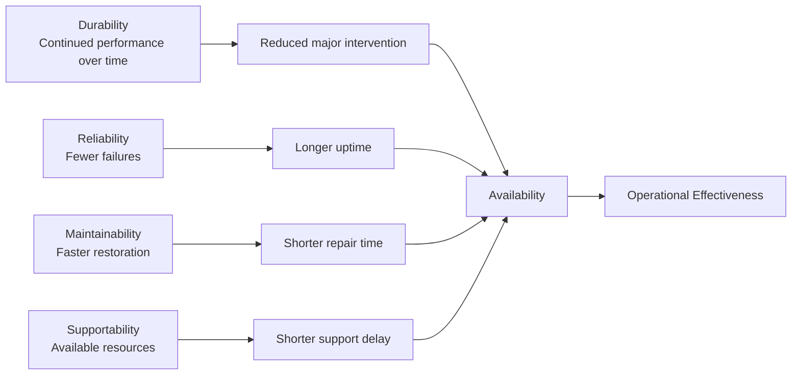

A durable and reliable system needs fewer interventions. A maintainable system reduces restoration time. A supportable system reduces support delays. Together, they improve availability and operational effectiveness.

---

## Address R, M, and S at the First Opportunity

One slide emphasized:

> **Address R, M, and S at the first opportunity.**

Where:

- **R = Reliability**
- **M = Maintainability**
- **S = Supportability**

This means reliability, maintainability, and supportability should be considered at the beginning of system development, not after the design is nearly complete.

The slide connected operational characteristics to support consequences:

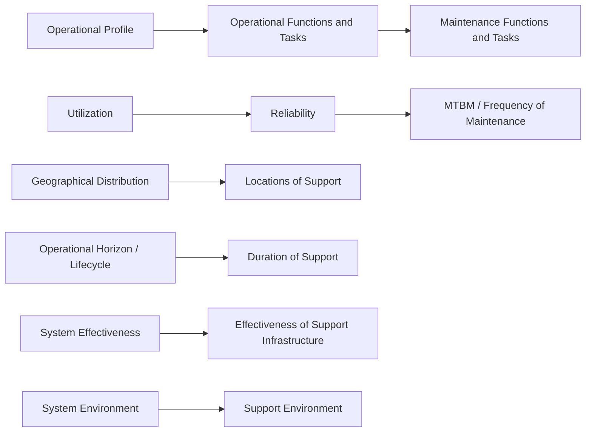

### Operational profile drives maintenance functions and tasks

The operational profile describes how the system will actually be used. It includes operating hours, duty cycles, mission types, load levels, environments, users, and required readiness.

From the operational profile, engineers identify operational functions and tasks. From those, they derive maintenance functions and tasks.

Maintenance should not be invented separately. It should be derived from real use.

### Utilization drives maintenance frequency

Utilization is how heavily and how often the system is used.

A component that fails on average every 10,000 operating hours may fail once every five years if used 2,000 hours per year, but roughly once every 14 months if used 8,000 hours per year.

The same reliability can create different maintenance workload depending on utilization.

This is why utilization affects reliability planning, MTBM, staffing, spares, and maintenance scheduling.

**MTBM**, or mean time between maintenance, is the average operating time between maintenance actions. It may include corrective maintenance, preventive maintenance, inspections, calibration, servicing, and software updates.

### Geography drives support locations

Where the system is deployed determines where support must be located.

A system used at one site can rely on centralized support. A system deployed across many remote sites may require regional spares, mobile support teams, local trained technicians, remote diagnostics, and distributed maintenance facilities.

Geographical distribution directly affects time to support.

### Lifecycle drives support duration

A system expected to operate for 30 years needs a different support strategy than a system expected to operate for three years.

Long-lived systems require:

- obsolescence management;
- technology refreshment;
- supplier monitoring;
- documentation updates;
- training refresh;
- spare parts strategy;
- configuration management;
- software patching;
- cybersecurity updates.

### System effectiveness drives support infrastructure

If the required system effectiveness is high, the support infrastructure must be strong enough to deliver it.

For example, a high-readiness system may need local spares, fast repair capability, field diagnostics, trained maintainers, technical support, and strong logistics processes.

### System environment drives support environment

The environment where the system operates affects the environment where support must occur.

A repair that is simple in a clean lab may be difficult in cold weather, darkness, dust, vibration, limited space, or a remote location.

Supportability engineering must account for the actual support environment.

---

## The Operational Concept Drives the Maintenance Concept

Another slide stated:

> **The operational concept drives the maintenance concept.**

This is one of the most important principles in lifecycle systems engineering.

The operational concept describes how the system will be used. The maintenance concept describes how the system will be sustained. The maintenance concept should be derived from the operational concept.

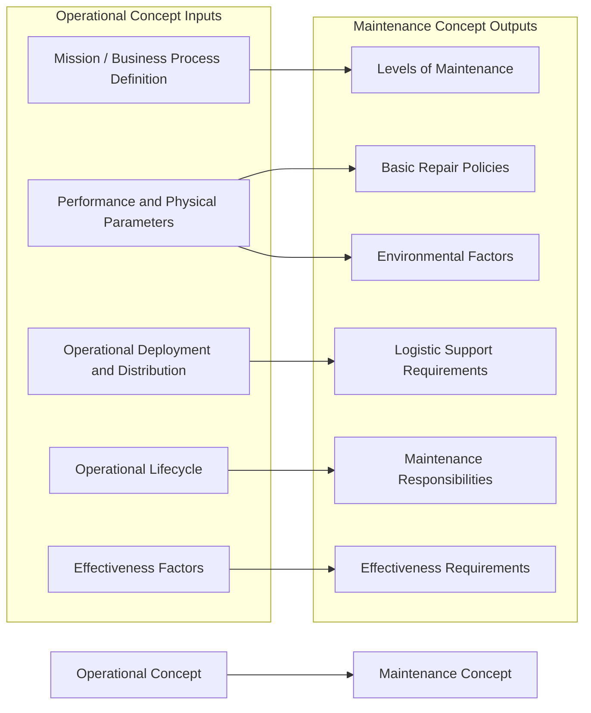

### Operational concept

The operational concept, often similar to a concept of operations or CONOPS, defines how the system will be used in real life.

It includes the following.

#### Mission or business process definition

This asks:

- What is the system supposed to accomplish?
- What mission or business process does it support?
- What are the mission profiles?
- What tasks must be performed?
- What happens if the system fails?

A system supporting emergency response has very different support needs from a system used occasionally for convenience.

#### Performance and physical parameters

These include size, weight, shape, range, capacity, power, speed, thermal output, accessibility, modularity, packaging, and transportability.

Physical design affects maintenance. A heavy component may require lifting equipment. A compact design may make access difficult. A sealed unit may be rugged but not field-repairable.

#### Operational deployment and distribution

This asks:

- What equipment is distributed?
- What personnel are distributed?
- What facilities are distributed?
- Where are systems deployed?
- When does the system become operational?
- Is the deployment local, regional, national, global, fixed, or mobile?

Deployment drives support locations, spares strategy, transportation planning, and maintenance staffing.

#### Operational lifecycle

This asks:

- Who will operate the system?
- How long will it operate?
- Will the operators be experts or general users?
- Will maintenance be performed by operators, field technicians, depot personnel, contractors, or suppliers?
- How long must support remain viable?

Long lifecycle systems require technology refreshment, obsolescence planning, documentation control, and long-term supplier management.

#### Effectiveness factors

These include:

- cost/system effectiveness;
- operational availability;
- readiness rate;
- MTBM;
- dependability.

These measures define whether the system is operationally successful.

### Maintenance concept

The maintenance concept defines how the system will be sustained.

It includes the following.

#### Levels of maintenance

Levels of maintenance define where and by whom maintenance is performed.

Common levels include:

1. **Operator or organizational level** — basic inspection, cleaning, reset, simple replacement.
2. **Field or intermediate level** — troubleshooting, line-replaceable unit replacement, calibration, minor repair.
3. **Depot level** — complex repair, overhaul, precision calibration, refurbishment.
4. **Supplier or OEM level** — proprietary repair, warranty repair, factory refurbishment, firmware-level fixes.

The chosen level affects downtime, tools, training, spares, cost, and repair policy.

#### Basic repair policies

Repair policies define what happens when something fails.

Examples:

- repair in place;
- remove and replace;
- discard and replace;
- send to depot;
- send to supplier;
- use condition-based replacement;
- use scheduled replacement;
- defer repair using redundancy;
- cannibalize parts in emergencies.

A high-readiness system often favors fast field replacement. A lower-criticality system may tolerate slower depot or supplier repair.

#### Logistic support requirements

Logistic support requirements include:

- spare parts;
- repair parts;
- consumables;
- packaging;
- transportation;
- storage;
- supply chain lead times;
- support equipment;
- test equipment;
- calibration equipment;
- technical manuals;
- data systems;
- facilities;
- manpower;
- training.

A maintenance policy is not real unless the logistics exist to support it.

#### Effectiveness requirements

Maintenance effectiveness requirements make the maintenance concept measurable.

Examples:

- maximum repair time;
- maximum response time;
- minimum operational availability;
- minimum readiness rate;
- maximum maintenance labor hours;
- fault isolation accuracy;
- spare parts fill rate;
- maximum scheduled maintenance burden;
- maximum logistics delay.

#### Maintenance responsibilities

Responsibilities define who does what.

They may include operators, local maintainers, field service technicians, depot personnel, suppliers, contractors, engineering support teams, logistics teams, cybersecurity teams, and help desk personnel.

Clear responsibility reduces downtime and confusion.

#### Environmental factors

The maintenance concept must consider the actual support environment.

Maintenance may occur in a depot, hangar, ship, hospital, data center, remote site, customer facility, roadside location, or field environment.

Environmental factors affect tools, training, packaging, safety procedures, task time, documentation, and repair feasibility.

---

## Systems and Supportability Engineering Process

The systems and supportability engineering process shows how supportability is engineered throughout the system lifecycle.

The diagram we discussed can be represented as follows:

```mermaid
flowchart LR
    A[Concept of Operations] --> B[Technical System Requirements<br/>and Maintenance Concept]
    B --> C[Functional Analysis / Functional Flow / Data Flow]
    C --> D[System Requirements Allocation]
    D --> E[System Architecture<br/>Selection of COTS Elements]

    E --> F[System Reliability Analysis,<br/>Modeling, and Allocation]
    F --> G[Reliability Prediction]
    G --> H[FMECA]
    H --> I[Fault Tree Analysis]

    E --> J[Maintainability Analysis]
    J --> K[Level of Repair Analysis]
    K --> L[Maintainability Prediction]
    L --> M[Reliability Centered Maintenance]
    M --> N[Maintenance Task Analysis]

    I --> N
    H --> N
    N --> O[Design Reviews and Evaluation]
    O --> P{Have Requirements<br/>Been Met?}
    P -- No --> Q[System Redesign / Improvement]
    Q --> E
    P -- Yes --> R[Detailed Support Product]

    R --> S[System Test and Evaluation]
    S --> T[Sustaining System Support]
    T --> U[Evaluation, Technical Refreshment,<br/>Field Feedback]
    U --> V[Lifetime Support]
    U --> Q

    W[Technology Refreshment] --> E
    X[Cost as an Independent Variable<br/>Design to Affordability] --> E
    X --> R
    Y[Technology / Standards Evolution<br/>and COTS Market Surveillance] --> E
    Y --> U
```

This process says that supportability is not a downstream logistics activity. It is a design discipline.

### Concept of operations

The process begins with CONOPS, which describes how the system will actually be used.

CONOPS defines the operating environment, mission, users, operational tempo, failure consequences, support assumptions, and required readiness.

### Technical system requirements and maintenance concept

System requirements define what the system must do. The maintenance concept defines how the system will be kept operational.

This includes whether maintenance will be performed by users, field technicians, depot repair, contractors, or suppliers.

### Functional analysis and data flow

Functional analysis identifies what the system must do. Functional flow identifies the sequence or logic of those functions. Data flow identifies what information moves through the system.

This is important because failures are not only physical. Bad data, missing data, delayed data, corrupted data, or wrong software logic can also cause system failure.

### Requirements allocation

Requirement allocation assigns system requirements to subsystems, components, software modules, people, or processes.

This allows reliability, maintainability, and supportability requirements to be traced to real design elements.

### System architecture and COTS selection

System architecture defines the structure of the system. COTS means commercial off-the-shelf.

COTS items can reduce development cost and schedule, but they introduce lifecycle risks:

- vendor discontinuation;
- software end-of-support;
- compatibility changes;
- cybersecurity vulnerabilities;
- licensing changes;
- limited repairability;
- supplier dependence.

COTS choices must be monitored throughout the lifecycle.

### Reliability analysis, modeling, allocation, and prediction

Reliability analysis identifies potential failure behavior. Reliability allocation distributes reliability requirements across subsystems. Reliability prediction estimates expected failure rates.

These activities improve time to failure and reduce maintenance demand.

### FMECA and fault tree analysis

FMECA identifies failure modes, causes, effects, detection means, severity, frequency, and criticality.

Fault tree analysis starts with a top-level undesired event and works backward to identify combinations of causes.

Both are explained in detail later.

### Maintainability analysis

Maintainability analysis evaluates whether the system can be restored effectively after failure or degradation.

It looks at accessibility, modularity, diagnostics, fault isolation, repair time, testability, safety, skill requirements, and restoration success.

### Level of repair analysis

Level of Repair Analysis, often called LORA, determines where maintenance should happen and whether an item should be repaired, replaced, discarded, sent to depot, or sent to supplier.

Typical levels include operator, field, depot, and supplier.

### Reliability centered maintenance

Reliability Centered Maintenance, or RCM, determines the right maintenance strategy for each failure mode.

It asks:

- What functions must the system perform?
- How can those functions fail?
- What causes those failures?
- What happens when failures occur?
- Which failures matter most?
- What maintenance task can prevent or detect the failure?
- Is the task technically effective?
- Is the task worth the cost?

RCM may recommend corrective maintenance, preventive maintenance, predictive maintenance, failure-finding tasks, or redesign.

### Maintenance task analysis

Maintenance Task Analysis, or MTA, identifies the actual maintenance tasks and resources required to support the system.

It is covered in detail later.

### Design reviews and support test/evaluation

Supportability requirements must be evaluated, not assumed.

Examples of testable supportability requirements:

- The system shall be repairable within 30 minutes by one technician.
- Fault isolation shall identify the failed line-replaceable unit 95% of the time.
- No field task shall require special tools.
- Spare parts shall be available within 24 hours.
- Maintenance procedures shall be executable using provided technical data.

If requirements are not met, the design should loop back for redesign or improvement.

### Detailed support product

The detailed support product includes the logistics support elements needed to operate and sustain the system:

- supply support;
- spare and repair parts;
- maintenance planning;
- test and support equipment;
- technical documentation;
- interactive electronic technical manuals;
- manpower and personnel;
- training and computer-based training;
- facilities;
- packaging, handling, storage, and transportation;
- design interface;
- computing support.

### System test and evaluation

Testing should validate not only system performance, but also maintainability and supportability.

Support testing may include:

- fault insertion;
- maintenance demonstrations;
- troubleshooting exercises;
- repair time validation;
- documentation validation;
- spare parts validation;
- technician task validation;
- logistics process testing;
- built-in test validation.

### Sustaining support and field feedback

After deployment, field data should feed back into design and support planning.

Field feedback may reveal:

- actual failure rates differ from predictions;
- certain parts fail more often than expected;
- repair times are longer than estimated;
- technicians struggle with specific tasks;
- documentation is unclear;
- COTS parts are becoming obsolete;
- training gaps exist;
- support equipment is inadequate.

Sustaining support requires continuous evaluation, technical refreshment, and lifecycle improvement.

### Cost as an independent variable

Cost as an Independent Variable, or CAIV, means cost is treated as a design requirement. The goal is not to design the best possible system and then discover it is unaffordable. The goal is to design the best system that meets mission needs within lifecycle cost constraints.

CAIV forces tradeoffs among performance, reliability, maintainability, supportability, schedule, technical risk, acquisition cost, operating cost, maintenance cost, and logistics cost.

---

## FMECA: Failure Modes, Effects, and Criticality Analysis

FMECA stands for **Failure Modes, Effects, and Criticality Analysis**.

It is a structured method for identifying how a system can fail, why it can fail, what happens when it fails, and which failures are most important.

A useful way to remember it:

> **FMECA tells you what can fail, why it fails, what the consequences are, and which failures deserve priority.**

FMECA is usually a bottom-up analysis. It starts with functions, components, or configuration items and asks:

> What happens if this item or function fails in this way?

### FMECA process flow

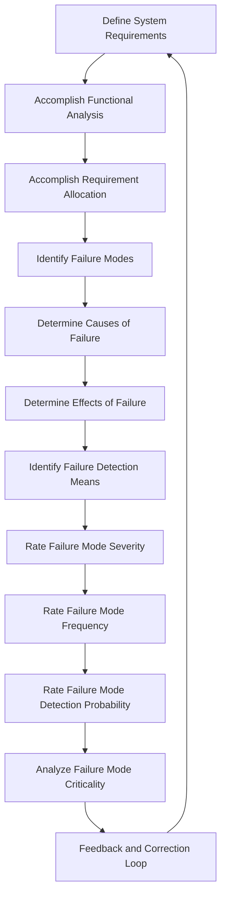

### Define system requirements

FMECA begins with requirements. You must know what the system is supposed to do before you can determine what failure means.

Requirements define functions, performance targets, availability targets, maintainability requirements, supportability requirements, environmental conditions, mission duration, and lifecycle expectations.

### Accomplish functional analysis

Functional analysis identifies what the system must do.

For example, a backup power system may need to:

- detect utility power loss;
- start generator;
- regulate voltage;
- transfer load;
- monitor fuel;
- cool the engine;
- alert operators;
- shut down safely.

FMECA analyzes failures of functions, not only failures of physical parts.

### Accomplish requirement allocation

Requirement allocation assigns system requirements to subsystems, components, software modules, people, or support processes.

This allows the FMECA to analyze failures at the appropriate level.

### Identify failure modes

A failure mode is the specific way an item or function can fail.

Examples for a pump:

- fails to start;
- stops during operation;
- leaks;
- produces low flow;
- produces low pressure;
- overheats;
- vibrates excessively.

Examples for software:

- service crash;
- incorrect output;
- delayed response;
- memory leak;
- data corruption;
- failed recovery;
- missed alert.

Examples for a sensor:

- stuck high;
- stuck low;
- output drift;
- noisy signal;
- intermittent output;
- delayed response;
- loss of calibration.

The more specific the failure mode, the more useful the analysis.

### Determine causes of failure

A cause is the mechanism or condition that produces the failure mode.

For example, the failure mode “low pump flow” may be caused by a clogged inlet filter, worn impeller, motor speed problem, air ingestion, blocked outlet, or installation error.

Cause identification supports design improvement, maintenance planning, diagnostics, and reliability growth.

### Determine effects of failure

Failure effects should be considered at multiple levels:

- local effect;
- next higher-level effect;
- system effect;
- mission or business effect.

Example:

- Failure mode: cooling fan stops.
- Local effect: fan no longer moves air.
- Subsystem effect: electronics bay overheats.
- System effect: controller shuts down.
- Operational effect: production line stops.
- Business effect: lost revenue and recovery cost.

This is the design-cause-to-operational-effect relationship.

### Identify failure detection means

Detection means explain how the failure will be discovered.

Examples:

- built-in test;
- health monitoring;
- fault codes;
- alarms;
- operator observation;
- inspection;
- periodic tests;
- diagnostic software;
- maintenance logs;
- vibration monitoring;
- temperature monitoring.

Detection is important because hidden failures can be dangerous. A backup system that fails silently may not be discovered until it is needed.

### Rate severity

Severity measures how serious the failure effect is.

Typical categories may include catastrophic, critical, major, minor, and negligible.

Severity may reflect safety, mission loss, system damage, downtime, repair cost, environmental harm, customer impact, or regulatory impact.

### Rate frequency

Frequency measures how often the failure mode is expected to occur.

It may be based on historical data, reliability prediction, testing, supplier data, field data, operating hours, cycles, environmental stress, or engineering judgment.

### Rate detection probability

Detection probability asks how likely it is that the failure will be detected before it produces the harmful effect.

A severe, frequent, hard-to-detect failure is usually a high-priority concern.

### Analyze criticality

Criticality prioritizes failure modes using severity, frequency, detection probability, mission impact, safety impact, availability impact, maintainability burden, support burden, and cost.

A common related FMEA concept is:

```text
Risk Priority Number = Severity × Occurrence × Detection
```

Different organizations use different methods, but the intent is the same: rank failure modes so resources are spent on the most important risks.

### Feedback and correction

FMECA should drive action.

Possible corrective actions include:

- redesign;
- add redundancy;
- improve diagnostics;
- add monitoring;
- change materials;
- improve maintenance tasks;
- change inspection intervals;
- stock spares;
- improve training;
- revise documentation;
- change repair level;
- improve supplier selection;
- revise requirements.

FMECA is not merely a table. It is a design and supportability improvement loop.

---

## Fault Tree Analysis

Fault Tree Analysis, or FTA, is a top-down method for analyzing how a specific undesired event can occur.

Where FMECA asks “what happens if this item fails?”, FTA asks:

> **What combinations of failures can cause this top-level bad event?**

### FTA process flow

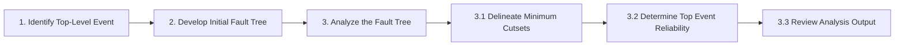

### Identify the top-level event

The top-level event is the undesired outcome being analyzed.

Examples:

- system unavailable;
- loss of braking;
- emergency power unavailable;
- database unavailable;
- loss of cooling;
- incorrect dose delivered;
- uncontrolled pressure release;
- mission failure.

The top event must be specific.

Weak top event:

> System failure.

Stronger top event:

> System fails to provide emergency power within 10 seconds after utility power loss.

### Develop the initial fault tree

The analyst works backward from the top event and identifies lower-level events that could cause it.

Events are connected by logic gates.

At the bottom are basic events such as component failures, human errors, software faults, environmental events, maintenance errors, or support failures.

### Analyze the fault tree

Analysis includes identifying minimum cutsets, calculating top event probability or reliability, and reviewing dominant contributors.

### How to interpret a fault tree

A fault tree is a logic diagram. It can be read from top down or bottom up.

- Top down: “What must happen to cause this event?”
- Bottom up: “If these basic events occur, do they propagate upward to the top event?”

### Common fault tree gates

#### OR gate

An OR gate means the output event occurs if **any one** of the input events occurs.

Example:

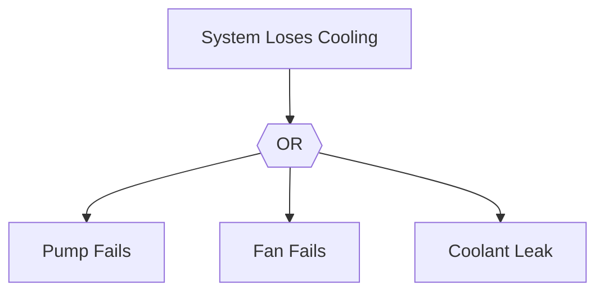

If the pump fails, or the fan fails, or coolant leaks, the system loses cooling.

For two independent events:

```text
P(A OR B) = P(A) + P(B) - P(A)P(B)
```

For small probabilities, analysts often approximate:

```text
P(A OR B) ≈ P(A) + P(B)
```

#### AND gate

An AND gate means the output event occurs only if **all** input events occur.

Example:

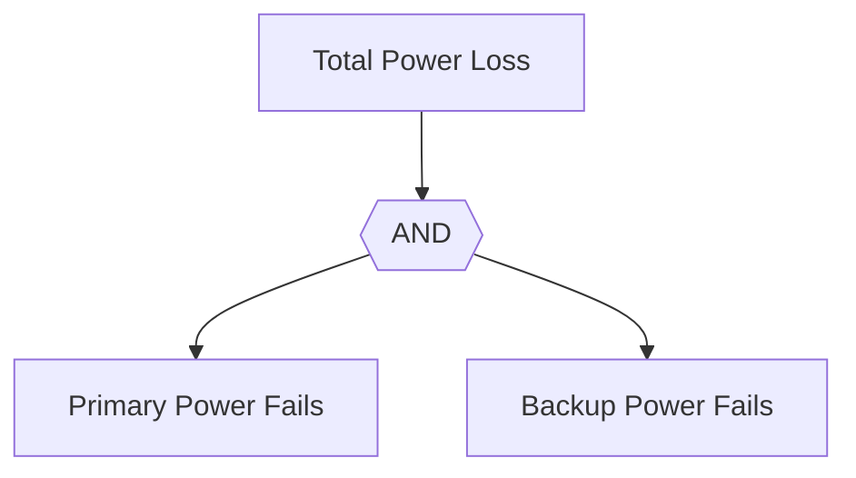

For independent events:

```text
P(A AND B) = P(A) × P(B)
```

This is why redundancy can reduce failure probability, provided failures are independent.

#### Voting gate

A voting gate, or k-out-of-n gate, means the output occurs if at least a specified number of inputs occur.

For example, a 2-out-of-3 gate means the output occurs if any two of three inputs occur.

This is common in redundant sensor systems and safety systems.

#### Inhibit gate

An inhibit gate means an event causes the output only under a specific condition.

Example:

Battery failure causes mission failure only if the system is operating in backup mode.

#### Priority AND gate

A priority AND gate means events must occur in a specific order.

Example:

A protective relay fails first, then an overload occurs.

### Basic events, undeveloped events, and house events

A **basic event** is a lowest-level event not decomposed further.

An **undeveloped event** is not decomposed because it is outside scope, unimportant, or lacks data.

A **house event** is a condition set as true or false for the analysis, such as maintenance mode, cold weather operation, or backup generator installed.

### Probabilities in fault trees

FTA may be qualitative or quantitative.

Qualitative FTA identifies logical combinations that can cause the top event.

Quantitative FTA assigns probabilities or failure rates to basic events and calculates the probability of the top event.

If the top event is failure:

```text
Reliability = 1 - Probability of Failure
```

For example, if the probability of mission failure is 0.02, mission reliability is 0.98, or 98%.

### Minimum cutsets

A cutset is a combination of basic events that can cause the top event.

A minimum cutset is the smallest combination of basic events that can cause the top event. If any event is removed from the set, that path no longer causes the top event.

Example:

Top event: total power loss.

Total power loss occurs if primary power fails and backup power fails.

Primary power fails if utility power fails or main converter fails.

Backup power fails if battery is depleted or backup inverter fails.

Minimum cutsets are:

- utility power fails + battery depleted;
- utility power fails + backup inverter fails;
- main converter fails + battery depleted;
- main converter fails + backup inverter fails.

Minimum cutsets reveal the most important combinations that lead to failure.

A one-event cutset is a single point of failure. That is often a serious design concern.

### Common-cause failures

Fault tree probabilities often assume independence, but real systems may have common-cause failures.

Examples:

- fire damages primary and backup systems;
- a software defect affects redundant channels;
- maintenance error disables multiple safeguards;
- contaminated fuel affects multiple engines;
- flood disables main and backup power;
- cyberattack affects multiple servers.

Common-cause failures can defeat redundancy and must be modeled when credible.

### Example fault tree interpretation

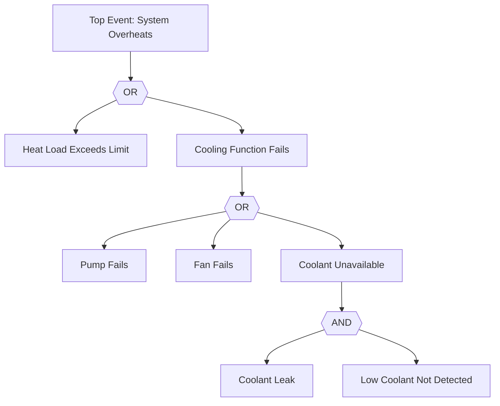

Interpretation:

- The system overheats if heat load exceeds limit or cooling function fails.
- Cooling fails if the pump fails, fan fails, or coolant is unavailable.
- Coolant is unavailable if there is a coolant leak and the low-coolant condition is not detected.

Minimum cutsets:

- heat load exceeds limit;
- pump fails;
- fan fails;
- coolant leak + low coolant not detected.

The single-event cutsets are important because one event alone can cause the top event.

---

## FMECA versus Fault Tree Analysis

FMECA and FTA are complementary.

| Dimension | FMECA | Fault Tree Analysis |
|---|---|---|
| Direction | Bottom-up | Top-down |
| Starts with | Functions, items, failure modes | Specific undesired top event |
| Main question | What happens if this fails? | What can cause this top event? |
| Scope | Broad review of many failure modes | Deep analysis of one top event |
| Combinations | Limited | Strong, uses logic gates |
| Output | Failure modes, causes, effects, severity, frequency, detection, criticality | Fault tree, minimum cutsets, top event probability/reliability |
| Best for | Comprehensive failure review and maintenance inputs | Causal logic, redundancy analysis, single points of failure |
| Supports | Reliability, maintainability, supportability, spares, diagnostics, maintenance tasks | Reliability, safety, availability, redundancy, critical event prevention |

FMECA can feed FTA by identifying basic failure modes used in a fault tree.

FTA can feed FMECA by identifying critical combinations that deserve more detailed failure mode review.

Together:

> **FMECA tells you what can fail and why it matters. FTA tells you how failures combine to produce a specific undesired event.**

---

## Maintenance Task Analysis

Maintenance Task Analysis, or MTA, evaluates a given system or product design configuration to identify the resources required for sustaining support throughout the planned lifecycle.

MTA asks:

> **What maintenance tasks will be required, and what resources will be needed to perform those tasks throughout the system’s planned life cycle?**

The slide emphasized that MTA identifies resources such as:

- anticipated maintenance tasks;
- personnel;
- training;
- test equipment;
- support equipment;
- spares;
- repair parts;
- inventories;
- transportation requirements;
- handling requirements;
- facilities;
- technical data;
- computer resources.

### MTA as a support planning tool

MTA converts design and failure analysis into executable maintenance planning.

For each task, MTA may define:

- task name;
- task trigger;
- task frequency;
- maintenance level;
- task duration;
- required personnel;
- skill level;
- tools;
- test equipment;
- support equipment;
- spare parts;
- consumables;
- safety precautions;
- access requirements;
- step-by-step procedure;
- technical data needed;
- facility requirements;
- transportation and handling requirements;
- post-maintenance test requirements;
- training implications;
- labor-hour estimates;
- lifecycle cost implications.

### MTA process flow

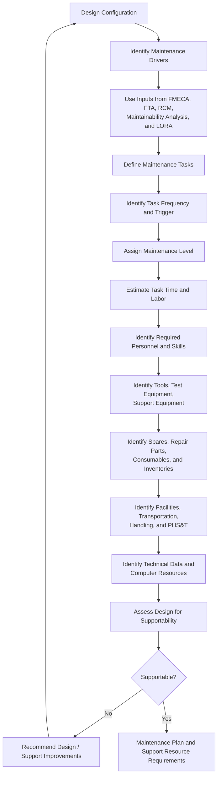

### Example MTA output

Task: Replace power supply module.

- Trigger: built-in test fault code or no output voltage.
- Level: field maintenance.
- Personnel: one electrical technician.
- Tools: standard screwdriver, torque driver, ESD strap.
- Parts: one replacement power supply module.
- Support equipment: portable diagnostic terminal.
- Time: 25 minutes.
- Safety: lockout/tagout, discharge capacitors.
- Post-task test: power-on self-test and load verification.
- Technical data: maintenance manual procedure.
- Training: field technician module replacement training.

This is the kind of practical support detail that MTA produces.

### MTA as design-for-supportability assessment

MTA also evaluates the design from a “design for supportability” perspective.

It asks:

- Is the item accessible?
- Are diagnostics sufficient?
- Are too many special tools required?
- Is the task too long?
- Does it require too many people?
- Is the required skill level realistic?
- Are spare parts reasonable to stock?
- Can the task be performed in the actual support environment?
- Are facilities available?
- Is technical data adequate?
- Is transportation or handling too difficult?

If MTA is performed early, it can identify design improvement opportunities before the design is locked.

Potential improvements include:

- move a component for easier access;
- add access panels;
- use standard fasteners;
- make a component modular;
- add built-in diagnostics;
- reduce special tools;
- add lifting points;
- reduce calibration steps;
- improve fault isolation;
- revise spare strategy;
- improve documentation;
- add software health monitoring;
- change level of repair.

---

## Maintainability Analysis versus Maintenance Task Analysis

Maintainability analysis and MTA are closely related, but they are not the same.

### Maintainability analysis

Maintainability analysis evaluates the design’s ability to be restored to required function.

Its central question is:

> **Can the system be maintained or restored effectively?**

It focuses on:

- accessibility;
- modularity;
- diagnostics;
- ease of removal and replacement;
- fault isolation;
- repair time;
- calibration time;
- maintenance error risk;
- required skill level;
- testability;
- safety during maintenance;
- ergonomic factors;
- restoration probability.

Outputs may include:

- mean time to repair;
- maximum corrective maintenance time;
- fault isolation time;
- maintenance labor hours;
- maintainability prediction;
- probability of repair within a specified time.

### Maintenance task analysis

MTA identifies the actual maintenance tasks and the resources required to perform them.

Its central question is:

> **What exactly must be done, by whom, with what resources, at what level, and how often?**

It focuses on:

- task definition;
- task triggers;
- task frequency;
- personnel;
- training;
- tools;
- support equipment;
- spares;
- facilities;
- transportation;
- handling;
- technical data;
- computer resources;
- lifecycle support burden.

### Comparison

| Area | Maintainability Analysis | Maintenance Task Analysis |
|---|---|---|
| Main focus | Ease and speed of restoration | Tasks and resources needed for support |
| Core question | Can it be restored efficiently? | What must be done, by whom, with what? |
| Primary output | Maintainability metrics and design assessment | Maintenance task list and resource requirements |
| Typical metric | MTTR, repair time, fault isolation time | Labor hours, tools, parts, personnel, training, facilities |
| Design concern | Accessibility, modularity, diagnostics, repairability | Practical execution of maintenance tasks |
| Lifecycle concern | Restoration performance | Sustaining support planning |
| Availability impact | Reduces time to maintain | Reduces time to maintain and time to support |
| Supportability impact | Contributes to supportability | Directly defines supportability resources |

A simple distinction:

> **Maintainability analysis asks whether the system can be restored efficiently. MTA asks what specific maintenance work and support resources are required to restore and sustain it.**

---

## Lifecycle Cost, Total Cost of Ownership, and Profitability

A recurring theme across the diagrams is that system success must be evaluated over the full lifecycle.

### Lifecycle cost

Lifecycle cost includes more than purchase price.

It includes:

- design cost;
- acquisition cost;
- operating cost;
- maintenance cost;
- spare parts;
- repair parts;
- training;
- facilities;
- logistics;
- support equipment;
- software support;
- technology refresh;
- obsolescence management;
- downtime cost;
- disposal or replacement cost.

A system that is cheap to buy may be expensive to own.

A system that is expensive to buy may be economical over time if it is reliable, maintainable, supportable, durable, and efficient.

### Total cost of ownership

Total cost of ownership is the full cost of owning, operating, maintaining, supporting, and retiring the system.

Operational effectiveness must be balanced against total cost of ownership.

### Profitability or mission value

In business, profitability comes from delivering value while controlling total cost.

In mission systems, the equivalent is mission value: the system delivers required capability at acceptable lifecycle cost and risk.

The final relationship is:

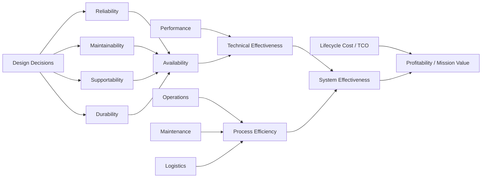

---

## Putting It All Together

The entire learning guide can be summarized as a lifecycle logic chain.

1. The **operational concept** defines how the system will be used.
2. The operational concept drives the **maintenance concept**.
3. The maintenance concept defines levels of maintenance, repair policies, logistics needs, effectiveness requirements, responsibilities, and environmental constraints.
4. Reliability, maintainability, supportability, and durability must be addressed early.
5. System architecture and design decisions create future operational consequences.
6. FMECA identifies failure modes, causes, effects, detection methods, severity, frequency, and criticality.
7. Fault tree analysis identifies combinations of failures that can cause a specific top-level undesired event.
8. Maintainability analysis evaluates whether the system can be restored efficiently.
9. Level of repair analysis determines where repair should happen and whether items should be repaired, replaced, discarded, sent to depot, or sent to supplier.
10. Reliability centered maintenance determines which maintenance strategy is appropriate for each failure mode.
11. Maintenance task analysis defines the actual tasks and resources needed for sustaining support.
12. Detailed support products translate analysis into spares, tools, training, documentation, facilities, support equipment, and computing resources.
13. Test and evaluation verify that supportability assumptions are true.
14. Field feedback and technical refreshment sustain the system over its life.
15. Availability, performance, process efficiency, and lifecycle cost determine system effectiveness and profitability.

The central lesson is this:

> **Do not design the system first and then ask how to support it. Design the system, maintenance concept, and support infrastructure together from the beginning.**

A system is not truly successful because it works once, in ideal conditions, during a test. It is successful when it can continue delivering required performance in real operation, with acceptable reliability, maintainability, supportability, durability, availability, process efficiency, lifecycle cost, and mission or business value.
